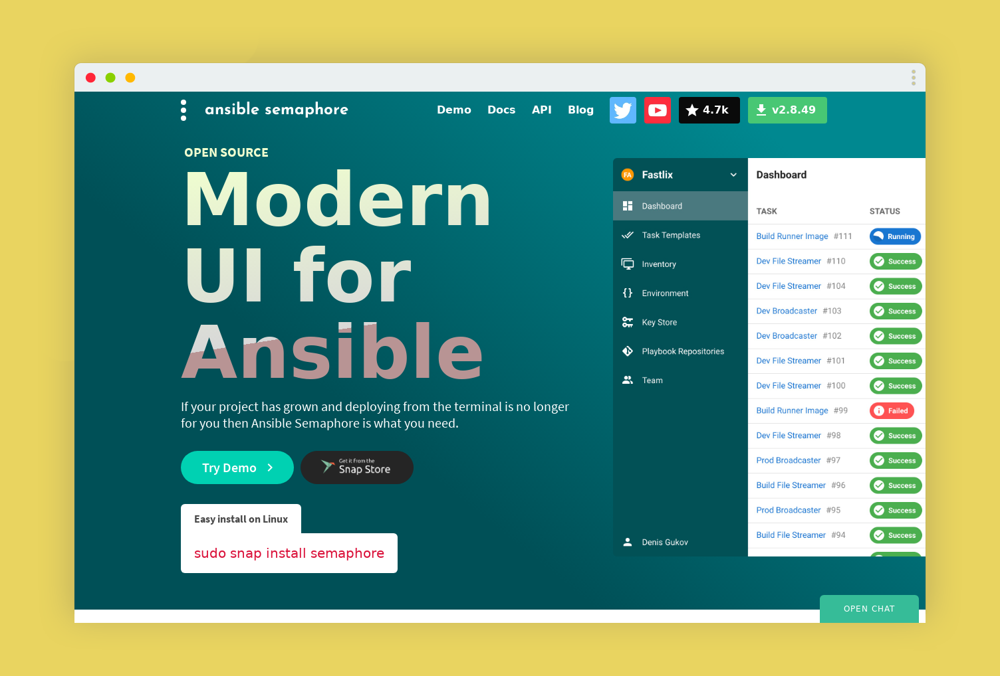

# Ansible Semaphore Deployment and Configuration Guide


## Overview
Ansible Semaphore is a web-based interface that simplifies managing and running Ansible playbooks. This guide will help you deploy Ansible Semaphore using Docker Compose and configure it for your environment.

## Prerequisites
Before starting, ensure you have the following installed on your system:

**Docker:** Install Docker
**Docker Compose:** Install Docker Compose

### Step 1: Create the Docker Compose File
Create a directory for Ansible Semaphore and navigate to it:

```bash
mkdir ansible-semaphore
cd ansible-semaphore
```
Create a docker-compose.yml file in this directory with the following content:

```yaml
volumes:
  semaphore-mysql:
    name: semaphore-mysql

networks:
  app_net:
    name: app_net
    external: true
  web_net:
    name: web_net
    external: true

services:
  mysql:
    image: mysql:8.0
    container_name: mysql-semaphore
    hostname: mysql-semaphore
    restart: unless-stopped
    volumes:
      - mysql-semaphore:/var/lib/mysql
    environment:
      MYSQL_RANDOM_ROOT_PASSWORD: 'yes'
      MYSQL_DATABASE: ${MYSQL_DB_NAME}
      MYSQL_USER: ${MYSQL_DB_USER}
      MYSQL_PASSWORD: ${MYSQL_DB_PASS}
    networks:
      - app_net

  semaphore:
    restart: unless-stopped
    container_name: semaphore
    hostname: semaphore
    image: semaphoreui/semaphore:latest
    environment:
      SEMAPHORE_DB_USER: ${MYSQL_DB_USER}
      SEMAPHORE_DB_PASS: ${MYSQL_DB_PASS}
      SEMAPHORE_DB_HOST: ${MYSQL_DB_HOST}
      SEMAPHORE_DB_PORT: 3306
      SEMAPHORE_DB_DIALECT: mysql
      SEMAPHORE_DB: ${MYSQL_DB_NAME}
      SEMAPHORE_PLAYBOOK_PATH: /home/semaphore/projects
      SEMAPHORE_ADMIN_PASSWORD: ${SEMA_ADMIN_PASS}
      SEMAPHORE_ADMIN_NAME: ${SEMA_ADMIN_USER}
      SEMAPHORE_ADMIN_EMAIL: admin@localhost
      SEMAPHORE_ADMIN: admin
      SEMAPHORE_ACCESS_KEY_ENCRYPTION: gs72mPntFATGJs9qK0pQ0rKtfidlexiMjYCH9gWKhTU=
      SEMAPHORE_LDAP_ACTIVATED: 'no'
      TZ: Asia/Tehran
    depends_on:
      - mysql
    volumes:
      - ./project:/home/semaphore/projects
    networks:
      - web_net
      - app_net
    labels:
      - traefik.enable=true
      - traefik.docker.network=web_net
      - traefik.http.routers.sema.entrypoints=http
      - traefik.http.routers.sema.rule=Host(`${SAB}.${DOMAIN_NAME}`)
      - traefik.http.routers.sema.middlewares=https-redirect
      - traefik.http.routers.sema-secure.entrypoints=https
      - traefik.http.routers.sema.service=sema-secure
      - traefik.http.routers.sema-secure.rule=Host(`${SAB}.${DOMAIN_NAME}`)
      - traefik.http.routers.sema-secure.tls=true
      - traefik.http.routers.sema-secure.tls.options=default
      - traefik.http.routers.sema-secure.service=sema-secure
      - traefik.http.routers.sema-secure.tls.certresolver=mycert
      - traefik.http.services.sema-secure.loadbalancer.server.port=3000
```
Create a `.env` file in this directory with the following content:

```bash
# domain name
DOMAIN_NAME=ansible.canme.ir
SUB=sema

# Semaphore auth
SEMA_ADMIN_PASS=zY0gVZaDLyGuhsp4sBKtwlQfdbj14Y
SEMA_ADMIN_USER=admin

# Semaphore database informations
MYSQL_DB_USER=semaphore
MYSQL_DB_PASS=AasOFYnJxs4Fq3GJSGFJskFhoCOHsj
MYSQL_DB_HOST=mysql
MYSQL_DB_NAME=semaphore
```

```bash
docker-compose up -d
```
This command will download the necessary Docker images and start the Ansible Semaphore and MySQL containers.

### Step 2: Access Ansible Semaphore
Once the containers are up and running, you can access the Ansible Semaphore web interface:

Open your web browser and navigate to: https://DOMAIN_NAME
Log in using the admin credentials you set in the docker-compose.yml file.

### Step 3: Configure Ansible Semaphore
**Projects:** Create a new project to manage your Ansible playbooks.
**Inventory:** Add inventory files or define inventory directly in Semaphore.
**Playbooks:** Upload or link your Ansible playbooks to Semaphore.
**Templates:** Create templates to define how playbooks should be executed.
**Users:** Manage users and access control.
