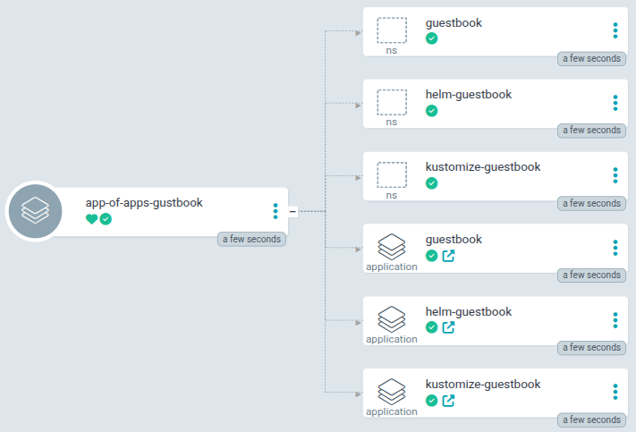
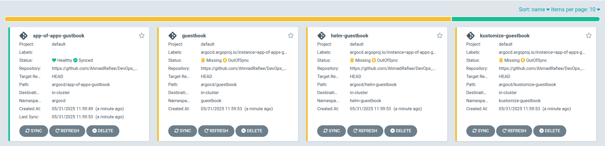
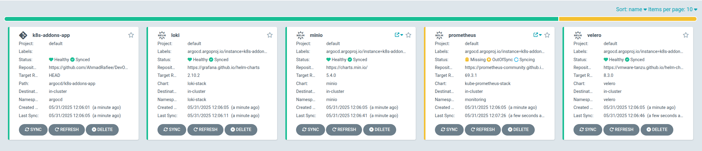
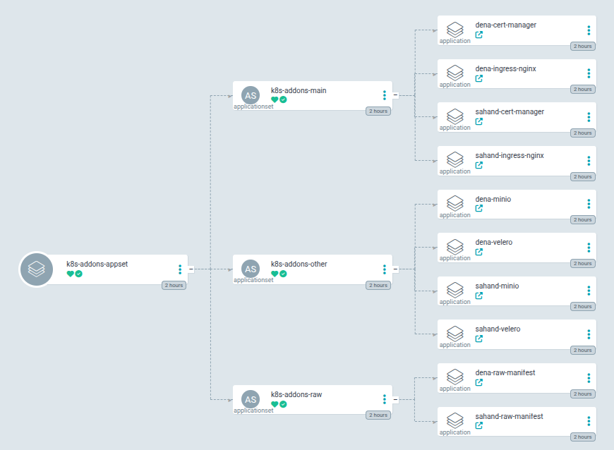

# Argocd Total Scenario


## Table of Contents
<!-- TOC -->- [Argocd Total Scenario](#argocd-total-scenario)
- [Argocd Total Scenario](#argocd-total-scenario)
  - [Table of Contents](#table-of-contents)
  - [Cluster High Level Design (HLD)](#cluster-high-level-design-hld)
  - [Install and config Ingress-nginx, Cert-manager and Argocd on `damavand` cluster](#install-and-config-ingress-nginx-cert-manager-and-argocd-on-damavand-cluster)
      - [Set a Argocd Custom Password: Generate a hashed password](#set-a-argocd-custom-password-generate-a-hashed-password)
      - [Add the required Helm repositories and update them as needed](#add-the-required-helm-repositories-and-update-them-as-needed)
      - [deploy Ingress-nginx with helm](#deploy-ingress-nginx-with-helm)
      - [deploy Cert-manager with helm](#deploy-cert-manager-with-helm)
      - [deploy Argocd with helm](#deploy-argocd-with-helm)
  - [Install argocd commands | Add other clusters to argocd central](#install-argocd-commands--add-other-clusters-to-argocd-central)
      - [Install argocd command-line](#install-argocd-command-line)
      - [login to main cluster and add other clusters](#login-to-main-cluster-and-add-other-clusters)
  - [Add a sample application to the all cluster using a Kubernetes manifest with `argocd` commands.](#add-a-sample-application-to-the-all-cluster-using-a-kubernetes-manifest-with-argocd-commands)
  - [Deploy a sample application to the Damavand cluster using a Helm chart with argocd commands](#deploy-a-sample-application-to-the-damavand-cluster-using-a-helm-chart-with-argocd-commands)
  - [Add a sample application to the damavand cluster using a kustomize with `argocd` commands](#add-a-sample-application-to-the-damavand-cluster-using-a-kustomize-with-argocd-commands)
  - [Add a sample application of application to the damavand cluster using helm chart with `argocd` commands.](#add-a-sample-application-of-application-to-the-damavand-cluster-using-helm-chart-with-argocd-commands)
  - [Add a sample application to the `damavand` cluster using a helm chart with `argocd` commands](#add-a-sample-application-to-the-damavand-cluster-using-a-helm-chart-with-argocd-commands)
  - [Here’s how you can create an ApplicationSet in ArgoCD to deploy MinIO, Ingress, and multiple applications using a Helm chart across two specific clusters (Sahand \& Dena).](#heres-how-you-can-create-an-applicationset-in-argocd-to-deploy-minio-ingress-and-multiple-applications-using-a-helm-chart-across-two-specific-clusters-sahand--dena)
      - [deploy Minio with ApplicationSet across two specific clusters (Sahand \& Dena).](#deploy-minio-with-applicationset-across-two-specific-clusters-sahand--dena)
      - [deploy Ingress Nginx with ApplicationSet across two specific clusters (Sahand \& Dena).](#deploy-ingress-nginx-with-applicationset-across-two-specific-clusters-sahand--dena)
      - [Deploy multiple apps with ApplicationSet across two specific clusters (Sahand \& Dena).](#deploy-multiple-apps-with-applicationset-across-two-specific-clusters-sahand--dena)
      - [Deploy voting-app with ApplicationSet across two specific clusters (Sahand \& Dena \& damavand)](#deploy-voting-app-with-applicationset-across-two-specific-clusters-sahand--dena--damavand)
  - [Add a voting application to the damavand cluster using a helm chart with `argocd` commands.](#add-a-voting-application-to-the-damavand-cluster-using-a-helm-chart-with-argocd-commands)
  - [Add the Git Repository to ArgoCD](#add-the-git-repository-to-argocd)
  - [Useful commands](#useful-commands)
  - [Good Link](#good-link)
  - [🔗 Stay connected with DockerMe! 🚀](#-stay-connected-with-dockerme-)


## Cluster High Level Design (HLD)


[🔝 Back to Top](#table-of-contents)

## Install and config Ingress-nginx, Cert-manager and Argocd on `damavand` cluster

#### Set a Argocd Custom Password: Generate a hashed password
```bash
htpasswd -nbBC 10 "" 'E6ybATayZ0MjWMGf3S5TRmNiH2b' | tr -d ':\n'
```

#### Add the required Helm repositories and update them as needed
```bash
# add helm repository
helm repo add ingress-nginx https://kubernetes.github.io/ingress-nginx
helm repo add jetstack https://charts.jetstack.io
helm repo add argo https://argoproj.github.io/argo-helm

# Update helm repos
helm repo update ingress-nginx
helm repo update jetstack
helm repo update argo
```

#### deploy Ingress-nginx with helm
```bash
# Change variables file on helm-values/ingress.values.yaml

# deploy ingress-nginx
helm upgrade --install ingress-nginx ingress-nginx/ingress-nginx \
--namespace ingress-nginx \
-f helm-values/ingress.values.yaml \
--create-namespace

# Check resources on ingress nginx namespace
kubectl get all -n ingress-nginx
```

#### deploy Cert-manager with helm
```bash
# Change variables file on helm-values/cert-manager.values.yaml

# deploy cert-manager
helm upgrade --install cert-manager jetstack/cert-manager \
--namespace cert-manager \
-f helm-values/cert-manager.values.yaml \
--create-namespace

# Check resources on cert-manager namespace
kubectl get all -n cert-manager

# Check cluster issuer manifest
cat helm-values/clusterIssuer.yaml

# deploy cluster issuer
kubectl apply -f helm-values/clusterIssuer.yaml

# check clusterIssuer
kubectl get clusterIssuer
```

#### deploy Argocd with helm
```bash
# Change variables file on helm-values/argo.values.yaml

# deploy argocd
helm upgrade --install argo argo/argo-cd --namespace argocd -f helm-values/argo.values.yaml --create-namespace

# check resources on argocd namespace
kubectl get all -n argocd
```

[🔝 Back to Top](#table-of-contents)

## Install argocd commands | Add other clusters to argocd central

#### Install argocd command-line
```bash
wget https://github.com/argoproj/argo-cd/releases/download/v2.7.5/argocd-linux-amd64
mv argocd-linux-amd64 argocd
chmod +x argocd
sudo mv argocd /usr/bin/local/

# check argocd command
argocd version
```

#### login to main cluster and add other clusters
```bash
# login argocd command to cluster damavand
argocd login argocd.kube.mecan.ir

# after logged in successfully add other clusters
argocd cluster add sahand
argocd cluster add dena

# get list of clusters
argocd cluster list
```

[🔝 Back to Top](#table-of-contents)

## Add a sample application to the all cluster using a Kubernetes manifest with `argocd` commands.
```bash
# login argocd command to cluster damavand
argocd login argocd.kube.mecan.ir

# add sample app with commands on damavand cluster
argocd app create guestbook-damavand \
--repo https://github.com/AhmadRafiee/DevOps_Certification.git \
--path argocd/guestbook \
--dest-server https://kubernetes.default.svc \
--dest-namespace default

# Sync an app
argocd app sync guestbook-damavand

# chcek argocd apps
argocd app list

# add sample app with commands on dena cluster
argocd app create guestbook-dena \
--repo https://github.com/AhmadRafiee/DevOps_Certification.git \
--path argocd/guestbook \
--dest-server https://vip.dena.mecan.ir:6443 \
--dest-namespace default

# Sync an app
argocd app sync guestbook-dena

# add sample app with commands on sahand cluster
argocd app create guestbook-sahand \
--repo https://github.com/AhmadRafiee/DevOps_Certification.git \
--path argocd/guestbook \
--dest-server https://vip.sahand.mecan.ir:6443 \
--dest-namespace default \
--sync-policy auto

# chcek argocd apps
argocd app list

# Delete an app
argocd app delete my-app
```

**Explanation of the Flags:**
  - Creates a new application named `guestbook-dena` in ArgoCD.
  - Uses the repository `DevOps_Certification`.
  - Deploys the manifests from the `argocd/guestbook` path.
  - Targets the Dena cluster at `https://vip.dena.mecan.ir:6443`.
  - Deploys the application into the `default` namespace.
  - Automatically syncs the application with `--sync-policy` auto

[🔝 Back to Top](#table-of-contents)

## Deploy a sample application to the Damavand cluster using a Helm chart with argocd commands

```bash
# login argocd command to cluster damavand
argocd login argocd.kube.mecan.ir

# add sample app with commands on damavand cluster
argocd app create helm-app-damavand \
--repo https://github.com/AhmadRafiee/DevOps_Certification.git \
--path argocd/helm-guestbook \
--dest-server https://kubernetes.default.svc \
--dest-namespace default \
--helm-set ingress.hosts=test.kube.mecan.ir \
--sync-policy automated

# chcek argocd apps
argocd app list
```

**Explanation of the Flags:**
  - `my-helm-app` → The name of the ArgoCD application.
  - `--repo` → The Git repository containing the Helm chart.
  - `--path` → The path inside the repository where the Helm chart is located.
  - `--dest-server` → The Kubernetes API server address (cluster where the app will be deployed).
  - `--dest-namespace` → The namespace where the app will be deployed.
  - `--helm-set` → Overrides Helm values (optional).
  - `--sync-policy` automated → Automatically syncs the application.

[🔝 Back to Top](#table-of-contents)

## Add a sample application to the damavand cluster using a kustomize with `argocd` commands

```bash
# login argocd command to cluster damavand
argocd login argocd.kube.mecan.ir

# add sample app with commands on damavand cluster
argocd app create kustomize-app-damavand \
--repo https://github.com/AhmadRafiee/DevOps_Certification.git \
--path argocd/kustomize-guestbook \
--dest-server https://kubernetes.default.svc \
--dest-namespace default \
--sync-policy automated

# chcek argocd apps
argocd app list
```

**Explanation of the Flags:**
  - `my-kustomize-app` → Name of the ArgoCD application.
  - `--repo` → The Git repository containing the Kustomize manifests.
  - `--path` → The path inside the repo where kustomization.yaml is located.
  - `--dest-server` → The Kubernetes API server address (destination cluster).
  - `--dest-namespace` → The namespace where the app will be deployed.
  - `--sync-policy` automated → Enables automatic synchronization.

[🔝 Back to Top](#table-of-contents)

## Add a sample application of application to the damavand cluster using helm chart with `argocd` commands.
There's no one particular pattern to solve this problem, e.g. you could write a script to create your apps, or you could even manually create them. However, users of Argo CD tend to use the app of apps pattern.




A typical layout of your Git repository for this might be:


before setup app-of-apps change varibles file:
```bash
cat argocd/app-of-apps-gustbook/values.yaml
spec:
  destination:
    server: https://kubernetes.default.svc
  source:
    repoURL: https://github.com/AhmadRafiee/DevOps_Certification
    targetRevision: HEAD
```

after change varible file setup app-of-apps on argocd
```bash
# login argocd command to cluster damavand
argocd login argocd.kube.mecan.ir

# create app of apps from DevOps Certification repo
argocd app create app-of-apps-gustbook \
--dest-namespace argocd \
--dest-server https://kubernetes.default.svc \
--repo https://github.com/AhmadRafiee/DevOps_Certification.git \
--path argocd/app-of-apps-gustbook \
--sync-policy auto

# Check argocd app list
argocd app list
```

The parent app will appear as in-sync but the child apps will be out of sync:



```bash
# sync app-of-apps-gustbook
argocd app sync -l argocd.argoproj.io/instance=app-of-apps-gustbook
```

[Good Link](https://argo-cd.readthedocs.io/en/stable/operator-manual/cluster-bootstrapping/#app-of-apps-pattern) and [Good Repo](https://github.com/argoproj/argocd-example-apps/tree/master/apps)

[🔝 Back to Top](#table-of-contents)

## Add a sample application to the `damavand` cluster using a helm chart with `argocd` commands


A typical layout of your Git repository for this might be:


before setup app-of-apps change varibles file:
```bash
cat argocd/k8s-addons-app/values.yaml
spec:
  destination:
    server: https://kubernetes.default.svc
  minio:
    repoURL: https://charts.min.io/
    targetRevision: "5.4.0"
    chart: minio
    releaseName: minio
    valueFiles: https://raw.githubusercontent.com/AhmadRafiee/DevOps_Certification/refs/heads/main/kubernetes/add-ons/minio/helm.values.yaml
    namespace: minio
  velero:
    repoURL: https://vmware-tanzu.github.io/helm-charts/
    targetRevision: "8.3.0"
    chart: velero
    releaseName: velero
    valueFiles: https://raw.githubusercontent.com/AhmadRafiee/DevOps_Certification/refs/heads/main/kubernetes/add-ons/velero/helm.values.yaml
    namespace: velero
  loki:
    repoURL: https://grafana.github.io/helm-charts
    targetRevision: "2.10.2"
    chart: loki-stack
    releaseName: loki
    valueFiles: https://raw.githubusercontent.com/AhmadRafiee/DevOps_Certification/refs/heads/main/kubernetes/add-ons/loki-stack/helm.values.yaml
    namespace: loki-stack
  prometheus:
    repoURL: https://prometheus-community.github.io/helm-charts
    targetRevision: "69.3.1"
    chart: kube-prometheus-stack
    releaseName: prometheus-stack
    valueFiles: https://raw.githubusercontent.com/AhmadRafiee/DevOps_Certification/refs/heads/main/kubernetes/add-ons/kube-prometheus-stack/helm.values.yaml
    namespace: monitoring
```

after change varible file setup app-of-apps on argocd
```bash
# login argocd command to cluster damavand
argocd login argocd.kube.mecan.ir

# create app of apps from DevOps Certification repo
argocd app create k8s-addons-app \
--dest-namespace argocd \
--dest-server https://kubernetes.default.svc \
--repo https://github.com/AhmadRafiee/DevOps_Certification.git \
--path argocd/k8s-addons-app \
--sync-policy auto

# Check argocd app list
argocd app list

# sync k8s-addons-app apllication
argocd app sync k8s-addons-app

# and for sync all applications
argocd app sync -l argocd.argoproj.io/instance=k8s-addons-app
```




[🔝 Back to Top](#table-of-contents)

## Here’s how you can create an ApplicationSet in ArgoCD to deploy MinIO, Ingress, and multiple applications using a Helm chart across two specific clusters (Sahand & Dena).

#### deploy Minio with ApplicationSet across two specific clusters (Sahand & Dena).

```bash
# minio applicationset path
cat argocd/applicationset/minio/minio-appset.yaml

# login argocd command to cluster damavand
argocd login argocd.kube.mecan.ir

# create application set
kubectl apply -f https://raw.githubusercontent.com/AhmadRafiee/DevOps_Certification/refs/heads/main/argocd/applicationset/minio/minio-appset.yaml

# Check argocd app and appset list
argocd appset list
argocd app list
```

#### deploy Ingress Nginx with ApplicationSet across two specific clusters (Sahand & Dena).

```bash
# ingress applicationset path
cat argocd/applicationset/ingress/ingress-appset.yaml

# login argocd command to cluster damavand
argocd login argocd.kube.mecan.ir

# create application set
kubectl apply -f https://raw.githubusercontent.com/AhmadRafiee/DevOps_Certification/refs/heads/main/argocd/applicationset/ingress/ingress-appset.yaml

# Check argocd app and appset list
argocd appset list
argocd app list
```

#### Deploy multiple apps with ApplicationSet across two specific clusters (Sahand & Dena).



**file and directory structure**
```bash
argocd/applicationset/multiple-apps
├── main-apps.yaml
├── manifests
│   └── clusterIssuer.yaml
├── others-apps.yaml
├── raw-manifests.yml
└── values
    ├── dena
    │   ├── cert-manager-values.yaml
    │   ├── ingress-nginx-values.yaml
    │   ├── minio-values.yaml
    │   └── velero-values.yaml
    └── sahand
        ├── cert-manager-values.yaml
        ├── ingress-nginx-values.yaml
        ├── minio-values.yaml
        └── velero-values.yaml
```

**login to central argocd and deploy multiple apps with ApplicationSet**

```bash
# multiple-app applicationset path
cat argocd/applicationset/multiple-apps/multiple-apps.yaml

# login argocd command to cluster damavand
argocd login argocd.kube.mecan.ir

# create applicationset from DevOps Certification repo for applicationset
argocd app create k8s-addons-appset \
--dest-namespace argocd \
--dest-server https://kubernetes.default.svc \
--repo https://github.com/AhmadRafiee/DevOps_Certification.git \
--path argocd/applicationset/multiple-apps \
--sync-policy auto

# Check argocd app and appset list
argocd appset list
argocd app list
```

[🔝 Back to Top](#table-of-contents)

#### Deploy voting-app with ApplicationSet across two specific clusters (Sahand & Dena & damavand)

```bash
# multiple-app applicationset path
cat argocd/applicationset/voting-appset/voting-appset.yaml

# login argocd command to cluster damavand
argocd login argocd.kube.mecan.ir

# create app of apps from DevOps Certification repo

argocd app create voting-appset \
--dest-namespace argocd \
--dest-server https://kubernetes.default.svc \
--repo https://github.com/AhmadRafiee/DevOps_Certification.git \
--path argocd/applicationset/voting-appset \
--sync-policy auto

# Check argocd app and appset list
argocd appset list
argocd app list

```

[🔝 Back to Top](#table-of-contents)

## Add a voting application to the damavand cluster using a helm chart with `argocd` commands.
```bash
# login argocd command to cluster damavand
argocd login argocd.kube.mecan.ir

# add sample app with commands on damavand cluster
argocd app create voting-app \
--repo https://github.com/AhmadRafiee/DevOps_Certification.git \
--path argocd/voting-app \
--dest-server https://kubernetes.default.svc \
--helm-set ingress.hosts=test.kube.mecan.ir \
--sync-policy automated

# chcek argocd apps
argocd app list
```

[🔝 Back to Top](#table-of-contents)

## Add the Git Repository to ArgoCD

**Log into ArgoCD:** Ensure you have access to your ArgoCD instance.

```bash
# login to argocd with command
argocd login argocd.kube.mecan.ir
```

**Add the Git Repository to ArgoCD:**

To connect a Git repository to ArgoCD, you'll use the argocd repo add command. You need to provide the following information:
  - Repository URL (e.g., HTTPS or SSH URL)
  - Authentication details (e.g., token, username/password, or SSH private key)

**Example:** Add Repository via HTTPS
If you're using HTTPS for your Git repository, you can add it as follows:
```bash
argocd repo add https://github.com/yourusername/your-repository.git --username your-username --password your-password
```

**Example:** Add Repository via SSH
If you're using SSH for your Git repository, you can add it as follows:
```bash
argocd repo add git@github.com:yourusername/your-repository.git --ssh-private-key-path /path/to/your/private-key
```

**Example:** Add a Private Git Repository Using a Personal Access Token (PAT)
If your Git repository requires a Personal Access Token (PAT) instead of a password, you can use the following:

```bash
argocd repo add https://github.com/yourusername/your-repository.git --username your-username --password your-personal-access-token
```

**Check If the Git Repository Is Added**
You can verify that the repository has been added successfully by running:

```bash
argocd repo list
```
This will list all the repositories connected to ArgoCD.

[🔝 Back to Top](#table-of-contents)

## Useful commands

```bash
# delete app with commands
argocd app delete voting-app

# patch finalizers if exist
kubectl -n argocd patch app k8s-addons-app --type merge -p '{"metadata": {"finalizers": null}}'
```

[🔝 Back to Top](#table-of-contents)

## Good Link
  - [applicationset](https://argo-cd.readthedocs.io/en/stable/operator-manual/applicationset/)
  - [multiple_sources](https://argo-cd.readthedocs.io/en/stable/user-guide/multiple_sources/)
  - [Generating Applications with ApplicationSet](https://argo-cd.readthedocs.io/en/stable/user-guide/application-set/)
  - [app of app and appset](https://codefresh.io/blog/how-to-structure-your-argo-cd-repositories-using-application-sets/)
  - [many-appsets-demo](https://github.com/kostis-codefresh/many-appsets-demo)
  - [ApplicationSet repository](https://github.com/argoproj/applicationset/tree/master)
  - [argoproj](https://github.com/argoproj/argoproj/tree/main)
  - [argocd example apps](https://github.com/argoproj/argocd-example-apps)
  - [Getting Started](https://argo-cd.readthedocs.io/en/stable/getting_started/#getting-started)
  - [installation](https://argo-cd.readthedocs.io/en/stable/operator-manual/installation/​)
  - [declarative-setup](https://argo-cd.readthedocs.io/en/stable/operator-manual/declarative-setup/​)

[🔝 Back to Top](#table-of-contents)

## 🔗 Stay connected with DockerMe! 🚀

**Subscribe to our channels, leave a comment, and drop a like to support our content. Your engagement helps us create more valuable DevOps and cloud content!** 🙌

[](https://dockerme.ir/) [](https://www.linkedin.com/in/ahmad-rafiee/) [](https://t.me/dockerme) [](https://youtube.com/@dockerme) [](https://instagram.com/dockerme)

[🔝 Back to Top](#table-of-contents)