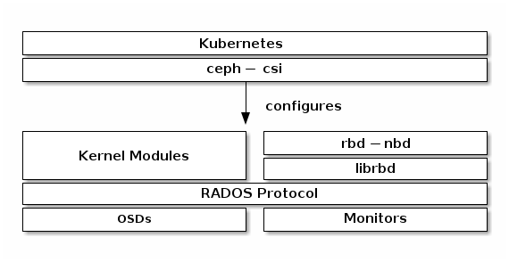

# Block devices and kubernetes

You may use Ceph Block Device images with Kubernetes v1.13 and later through ceph-csi, which dynamically provisions RBD images to back Kubernetes volumes and maps these RBD images as block devices (optionally mounting a file system contained within the image) on worker nodes running pods that reference an RBD-backed volume. Ceph stripes block device images as objects across the cluster, which means that large Ceph Block Device images have better performance than a standalone server!

To use Ceph Block Devices with Kubernetes v1.13 and higher, you must install and configure ceph-csi within your Kubernetes environment. The following diagram depicts the Kubernetes/Ceph technology stack.

### [Create ceph-csi with manifest](../../../../kubernetes/scenario/ceph-csi/ceph-csi-rbd-with-manifest/ReadMe.md)

### [Create ceph-csi with helm](../../../../kubernetes/scenario/ceph-csi/ceph-csi-rbd-with-helm/ReadMe.md)