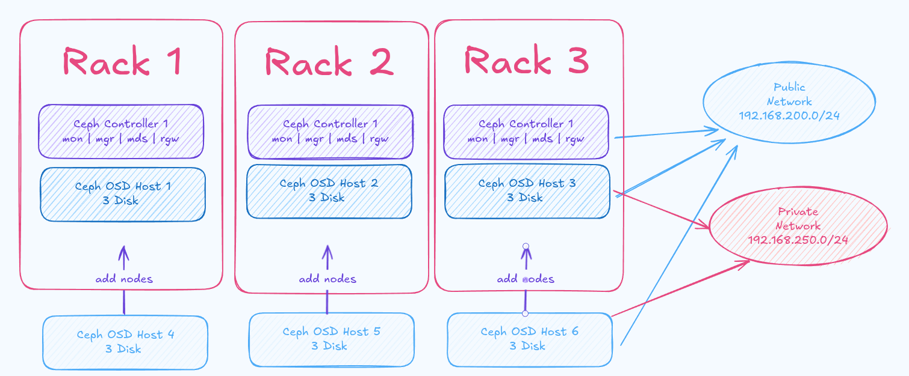

# Create a Ceph cluster on a Multi node with `cephadm`


- [Create a Ceph cluster on a Multi node with `cephadm`](#create-a-ceph-cluster-on-a-multi-node-with-cephadm)
  - [Step1: preparing and hardening OS with ansible](#step1-preparing-and-hardening-os-with-ansible)
  - [Step2: Install and config docker service with ansible](#step2-install-and-config-docker-service-with-ansible)
  - [Step3: Add ceph repository and install requirement tools](#step3-add-ceph-repository-and-install-requirement-tools)
  - [Step4: Pull all docker image](#step4-pull-all-docker-image)
  - [Step5: bootstraping cluster with cephadm commands on mon1](#step5-bootstraping-cluster-with-cephadm-commands-on-mon1)
  - [Step6: Create ssh-key and create ssh config](#step6-create-ssh-key-and-create-ssh-config)
  - [Step7: Configuration grafana and set admin password](#step7-configuration-grafana-and-set-admin-password)
  - [Step8: Add others node](#step8-add-others-node)
  - [Step9: ceph and grafana dashboard access](#step9-ceph-and-grafana-dashboard-access)
    - [To set up Nginx as a reverse proxy for the Ceph dashboard and panels:](#to-set-up-nginx-as-a-reverse-proxy-for-the-ceph-dashboard-and-panels)
  - [Step9: Test the cluster](#step9-test-the-cluster)
    - [To expose an external Ceph dashboard using an NGINX Ingress controller on Kubernetes.](#to-expose-an-external-ceph-dashboard-using-an-nginx-ingress-controller-on-kubernetes)


## Step1: preparing and hardening OS with ansible

To access the Ceph dashboard, you can configure iptables rules to allow access to ports 8443 and 3000. Alternatively, you can set up a reverse proxy using a tool like Nginx to provide access to the dashboards using custom names or URLs.

Sample iptables rules

```bash
# Allow incoming traffic on network 192.168.200.0/24 on all nodes
iptables -A INPUT -s 192.168.200.0/24 -j ACCEPT

# Allow incoming traffic on network 192.168.250.0/24 on osd nodes
iptables -A INPUT -s 192.168.250.0/24 -j ACCEPT
```



## Step2: Install and config docker service with ansible

## Step3: Add ceph repository and install requirement tools

To install the release.asc key, execute the following:
```bash
# download from ceph site
wget -q -O- 'https://download.ceph.com/keys/release.asc' | sudo gpg --dearmor -o /usr/share/keyrings/ceph-archive-keyring.gpg

# download from DockerMe site and use gpg commands
wget -q -O- 'https://store.dockerme.ir/Software/release.asc' | sudo gpg --dearmor -o /usr/share/keyrings/ceph-archive-keyring.gpg
```

You may find releases for Debian/Ubuntu (installed with APT) at:
```
https://download.ceph.com/debian-{release-name}
```
For Octopus and later releases, you can also configure a repository for a specific version x.y.z. For Debian/Ubuntu packages:
```
https://download.ceph.com/debian-{version}
```

Add ceph repository on debian 12

```bash
# add ceph repo [19.2.1]
cat << ROS > /etc/apt/sources.list.d/ceph.list
deb  [arch=amd64 signed-by=/usr/share/keyrings/ceph-archive-keyring.gpg] https://download.ceph.com/debian-19.2.1 bookworm main
ROS

# add ceph repo [18.2.1]
cat << ROS > /etc/apt/sources.list.d/ceph.list
deb  [arch=amd64 signed-by=/usr/share/keyrings/ceph-archive-keyring.gpg] https://download.ceph.com/debian-18.2.1 bookworm main
ROS

# add ceph repo [17.2.7]
cat << ROS > /etc/apt/sources.list.d/ceph.list
deb  [arch=amd64 signed-by=/usr/share/keyrings/ceph-archive-keyring.gpg] https://download.ceph.com/debian-17.2.7 bullseye main
ROS

# OR add MeCan repo [19.2.1]
cat << ROS > /etc/apt/sources.list.d/ceph.list
deb  [arch=amd64 signed-by=/usr/share/keyrings/ceph-archive-keyring.gpg] https://repo.mecan.ir/repository/debian-ceph-19.2.1 bookworm main
ROS

# OR add MeCan repo [18.2.1]
cat << ROS > /etc/apt/sources.list.d/ceph.list
deb  [arch=amd64 signed-by=/usr/share/keyrings/ceph-archive-keyring.gpg] https://repo.mecan.ir/repository/debian-ceph-18.2.1 bookworm main
ROS

# OR add MeCan repo [17.2.7]
cat << ROS > /etc/apt/sources.list.d/ceph.list
deb  [arch=amd64 signed-by=/usr/share/keyrings/ceph-archive-keyring.gpg] https://repo.mecan.ir/repository/debian-ceph-17.2.7 bullseye main
ROS

# check repo file
cat /etc/apt/sources.list.d/ceph.list
```

Update repository and install requirement packages

```bash
apt update
apt-cache policy cephadm
apt install -y cephadm ceph-common ceph-base

# check cephadm version
ceph --version
```

## Step4: Pull all docker image
Pull from MeCan registry for version 18:

```bash
docker pull registry.mecan.ir/devops_certification/ceph/v18/cephadm/ceph:v18
docker pull registry.mecan.ir/devops_certification/ceph/v18/cephadm/ceph-grafana:9.4.7
docker pull registry.mecan.ir/devops_certification/ceph/v18/cephadm/prometheus:v2.43.0
docker pull registry.mecan.ir/devops_certification/ceph/v18/cephadm/alertmanager:v0.25.0
docker pull registry.mecan.ir/devops_certification/ceph/v18/cephadm/node-exporter:v1.5.0
docker pull registry.mecan.ir/devops_certification/ceph/v18/cephadm/loki:2.4.0
docker pull registry.mecan.ir/devops_certification/ceph/v18/cephadm/promtail:2.4.0
```

Tag all image to orginal image tag

```bash
docker tag registry.mecan.ir/devops_certification/ceph/v18/cephadm/ceph:v18  quay.io/ceph/ceph:v18
docker tag registry.mecan.ir/devops_certification/ceph/v18/cephadm/ceph-grafana:9.4.7  quay.io/ceph/ceph-grafana:9.4.7
docker tag registry.mecan.ir/devops_certification/ceph/v18/cephadm/prometheus:v2.43.0  quay.io/prometheus/prometheus:v2.43.0
docker tag registry.mecan.ir/devops_certification/ceph/v18/cephadm/alertmanager:v0.25.0  quay.io/prometheus/alertmanager:v0.25.0
docker tag registry.mecan.ir/devops_certification/ceph/v18/cephadm/node-exporter:v1.5.0  quay.io/prometheus/node-exporter:v1.5.0
docker tag registry.mecan.ir/devops_certification/ceph/v18/cephadm/loki:2.4.0  grafana/loki:2.4.0
docker tag registry.mecan.ir/devops_certification/ceph/v18/cephadm/promtail:2.4.0  grafana/promtail:2.4.0
```

Pull from public registry

```bash
docker pull quay.io/ceph/ceph:v18
docker pull quay.io/ceph/ceph-grafana:9.4.7
docker pull quay.io/prometheus/prometheus:v2.43.0
docker pull quay.io/prometheus/alertmanager:v0.25.0
docker pull quay.io/prometheus/node-exporter:v1.5.0
docker pull grafana/loki:2.4.0
docker pull grafana/promtail:2.4.0
```

## Step5: bootstraping cluster with cephadm commands on mon1

```bash
# Bootstraping cluster with this command
cephadm bootstrap --mon-ip 192.168.200.21 \
--allow-fqdn-hostname \
--initial-dashboard-user admin \
--initial-dashboard-password ZR1zSzATvA3Wv7jsdddeesdfshcsWsdfsfdBe6nZJAS8it \
--dashboard-password-noupdate \
--skip-firewalld \
--cluster-network 192.168.250.0/24 \
--with-centralized-logging
```

after a few minute export this output:
```
Ceph Dashboard is now available at:

	     URL: https://mon1:8443/
	    User: admin
	Password: ZR1zSzATvA3Wv7jsdddeesdfshcsWsdfsfdBe6nZJAS8it

Enabling client.admin keyring and conf on hosts with "admin" label
Saving cluster configuration to /var/lib/ceph/4489d864-b135-11ee-b057-fa163eee05b9/config directory
Enabling autotune for osd_memory_target
You can access the Ceph CLI as following in case of multi-cluster or non-default config:

	sudo /usr/sbin/cephadm shell --fsid 4489d864-b135-11ee-b057-fa163eee05b9 -c /etc/ceph/ceph.conf -k /etc/ceph/ceph.client.admin.keyring

Or, if you are only running a single cluster on this host:

	sudo /usr/sbin/cephadm shell

Please consider enabling telemetry to help improve Ceph:

	ceph telemetry on

For more information see:

	https://docs.ceph.com/en/latest/mgr/telemetry/

Bootstrap complete.
```

## Step6: Create ssh-key and create ssh config

add ssh port 22 for cephadm on all ceph nodes

```bash
cat /etc/ssh/sshd_config | grep Port
sudo sed -i '/^Port/ a Port 22' /etc/ssh/sshd_config
cat /etc/ssh/sshd_config | grep Port

# Test your changes: After modifying the SSH config file, remember to test the configuration with:
sudo sshd -t

# If there are no errors, you can restart the SSH service to apply the changes:
sudo systemctl restart sshd
sudo systemctl status sshd
```

Create ssh-key for cephadm with this command:

```bash
# generate ssh key
ceph cephadm generate-key

# get ssh key
ceph cephadm get-pub-key
```

Create ssh config file:
```bash
cat << CTO > ~/.ssh/config
StrictHostKeyChecking no
Host mon1
    hostname 192.168.200.21
    port 22
    user root

Host mon2
    hostname 192.168.200.22
    port 22
    user root

Host mon3
    hostname 192.168.200.23
    port 22
    user root

Host osd1
    hostname 192.168.200.24
    port 22
    user root

Host osd2
    hostname 192.168.200.25
    port 22
    user root

Host osd3
    hostname 192.168.200.26
    port 22
    user root
CTO
```

Add ssh-key to all hosts:
```
# add cephadm ssh keys to all hosts
ssh-copy-id -f -i /etc/ceph/ceph.pub mon1
ssh-copy-id -f -i /etc/ceph/ceph.pub mon2
ssh-copy-id -f -i /etc/ceph/ceph.pub mon3
ssh-copy-id -f -i /etc/ceph/ceph.pub osd1
ssh-copy-id -f -i /etc/ceph/ceph.pub osd2
ssh-copy-id -f -i /etc/ceph/ceph.pub osd3
```


## Step7: Configuration grafana and set admin password

grafana config file path on your host:

    /var/lib/ceph/ca436820-6838-11ef-a5a2-fa163e1a2cb8/grafana.mon1/etc/grafana/grafana.ini

Grafana set admin password:

```bash
# create a file with these configuration
cat <<EOF > grafana.yml
service_type: grafana
spec:
  initial_admin_password: sdfwefweddfdfdljldddkwmqwoqiwjklsgrw
EOF

# after create file apply to cluster with this commands
ceph orch apply -i grafana.yml

# then redeploy grafana service
ceph orch redeploy grafana
```

## Step8: Add others node
```bash
# add mon servers
ceph orch host add mon2 192.168.200.22
ceph orch host add mon3 192.168.200.23

# mon service
ceph orch apply mon --placement="3 mon1 mon2 mon3"
ceph orch ps --daemon-type mon
ceph -s

# To print a list of devices discovered by cephadm, run this command:
ceph orch device ls --wide

# Add OSD servers
ceph orch host add osd1 192.168.200.24
ceph orch host add osd2 192.168.200.25
ceph orch host add osd3 192.168.200.26

# add all devices on osd nodes
ceph orch apply osd --all-available-devices

# list of nodes
ceph orch host ls
ceph orch host ls --detail
ceph osd tree
ceph orch device ls --wide

# view the current placement of the MGR daemon
ceph orch ps --daemon-type mgr
ceph orch ps --daemon-type rgw
ceph orch ps --daemon-type mds
ceph orch ps --daemon-type mon
ceph orch ps --daemon-type osd

# MGR services
ceph orch apply mgr --placement="3 mon1 mon2 mon3"
ceph orch ps --daemon-type mgr
ceph -s

# MDS service
ceph fs volume create MeCan_Volumes --placement="3 mon1 mon2 mon3"
ceph fs ls
ceph fs status
ceph orch ps --daemon-type mds
ceph -s

# RGW service
# Create a realm
radosgw-admin realm create --rgw-realm=MeCan_realm --default
# Create a zone group
radosgw-admin zonegroup create --rgw-zonegroup=default  --master --default
# Create a zone
radosgw-admin zone create --rgw-zonegroup=default --rgw-zone=test_zone --master --default
# Commit the changes
radosgw-admin period update --rgw-realm=MeCan_realm --commit
# Apply the changes by using the ceph orch apply command.
ceph orch apply rgw MeCan --realm=MeCan_realm --zone=test_zone --zonegroup=default --placement="3 mon1 mon2 mon3"

ceph orch ps --daemon-type rgw

# view the current placement of the all daemon
ceph orch ps --daemon-type mgr
ceph orch ps --daemon-type rgw
ceph orch ps --daemon-type mds
ceph orch ps --daemon-type mon
ceph orch ps --daemon-type osd
```

## Step9: ceph and grafana dashboard access

To access the Ceph dashboard, you can configure iptables rules to allow access to ports 8443 and 3000. Alternatively, you can set up a reverse proxy using a tool like Nginx to provide access to the dashboards using custom names or URLs.

Sample iptables rules
```
# Allow incoming traffic on port 8443 (Ceph Dashboard)
iptables -A INPUT -p tcp --dport 8443 -j ACCEPT

# Allow incoming traffic on port 3000 (Grafana Dashboard - if applicable)
iptables -A INPUT -p tcp --dport 3000 -j ACCEPT
```

the other way install and config haproxy and certbot for access to all panels:
deploy on load balancer server
```
apt update
apt install -y nginx certbot python3-certbot-nginx
```

After installation set dns record and get certificate:
Get certificate non interactive with single commands.
```
sudo certbot certonly --nginx --non-interactive --agree-tos -m ahmad@MeCan.ir -d panel.ceph.mecan.ir
sudo certbot certonly --nginx --non-interactive --agree-tos -m ahmad@MeCan.ir -d grafana.ceph.mecan.ir
sudo certbot certonly --nginx --non-interactive --agree-tos -m ahmad@MeCan.ir -d metrics.ceph.mecan.ir
sudo certbot certonly --nginx --non-interactive --agree-tos -m ahmad@MeCan.ir -d alerts.ceph.mecan.ir
```

To create the password file, run the following command:
```
sudo htpasswd -c /etc/nginx/conf.d/.htpasswd MeCan
```

### To set up Nginx as a reverse proxy for the Ceph dashboard and panels:

[Setting up an Nginx configuration to serve a Ceph dashboard ](nginx-config-for-ceph/panel.conf)

[Setting up an Nginx configuration to serve a Grafana service ](nginx-config-for-ceph/grafana.conf)

[Setting up an Nginx configuration to serve a Prometheus service ](nginx-config-for-ceph/metrics.conf)

[Setting up an Nginx configuration to serve a AlertManager service ](nginx-config-for-ceph/alerts.conf)


After configuring all virtual hosts, it is generally safe to remove the default configuration file for Nginx. However, before doing so, it is important to ensure that your Nginx configuration is error-free and valid. You can use the following command to check the Nginx configuration:

```bash
# delete default config
rm /etc/nginx/sites-enabled/default

# check nginx configuration
nginx -t

# restart nginx service
systemctl restart nginx

# enable nginx service
systemctl enable nginx

# check nginx service
systemctl status nginx
```

## Step9: Test the cluster
The block storage provided by Ceph is named RBD, which stands for RADOS block device.

To create disks, you need a pool enabled to work with RBD. The commands below create a pool called rbd and then activate this pool for RBD:

    sudo ceph osd pool create rbd

    sudo ceph osd pool application enable rbd rbd

After that, you can use the rbd command line to create and list available disks:

    sudo rbd create mysql --size 1G
    sudo rbd create mongodb --size 2G

Check rbd images:

    sudo rbd list

The output will be:

    mongodb
    mysql


Useful commands:

    ceph osd ls
    ceph osd tree
    ceph orch ls
    ceph mgr module ls
    ceph orch ps
    ceph orch apply osd --all-available-devices

Delete and purge osd with id:

    ceph osd out ID
    ceph osd safe-to-destroy osd.ID
    ceph osd destroy ID --yes-i-really-mean-it
    ceph osd purge ID --yes-i-really-mean-it


Check and zap device with this command:

    ceph orch device ls
    ceph orch device zap ceph /dev/vdc --force

Image list:

    quay.io/ceph/ceph:v18
    quay.io/ceph/ceph-grafana:9.4.7
    quay.io/prometheus/prometheus:v2.43.0
    quay.io/prometheus/alertmanager:v0.25.0
    quay.io/prometheus/node-exporter:v1.5.0
    grafana/loki:2.4.0
    grafana/promtail:2.4.0

You can stop, start, or restart a daemon with:

    ceph orch daemon stop <name>
    ceph orch daemon start <name>
    ceph orch daemon restart <name>

The container for a daemon can be stopped, recreated, and restarted with the redeploy command:

    ceph orch daemon redeploy <name> [--image <image>]


### To expose an external Ceph dashboard using an NGINX Ingress controller on Kubernetes.
To create a manifest for an external Ceph dashboard using Kubernetes, you need to set up an Ingress, Service, and Endpoint that expose the Ceph dashboard externally. This assumes that the Ceph dashboard is running outside of the Kubernetes cluster, and you want to access it through Kubernetes' Ingress and Service resources.

[ceph panel manifest](kubernetes-ingress-for-ceph/panel-service-endpoint-ingress.yml)

[prometheus dashboard manifest](kubernetes-ingress-for-ceph/prometheus-service-endpoint-ingress.yml)

[alert dashboard manifest](kubernetes-ingress-for-ceph/alerts-service-endpoint-ingress.yml)

[grafana panel manifest](kubernetes-ingress-for-ceph/grafana-service-endpoint-ingress.yml)


**Good link:**
  - https://www.redhat.com/sysadmin/ceph-cluster-single-machine
  - https://docs.ceph.com/en/latest/cephadm/services/monitoring/
  - https://www.ibm.com/docs/en/storage-ceph/5?topic=access-setting-admin-user-password-grafana
