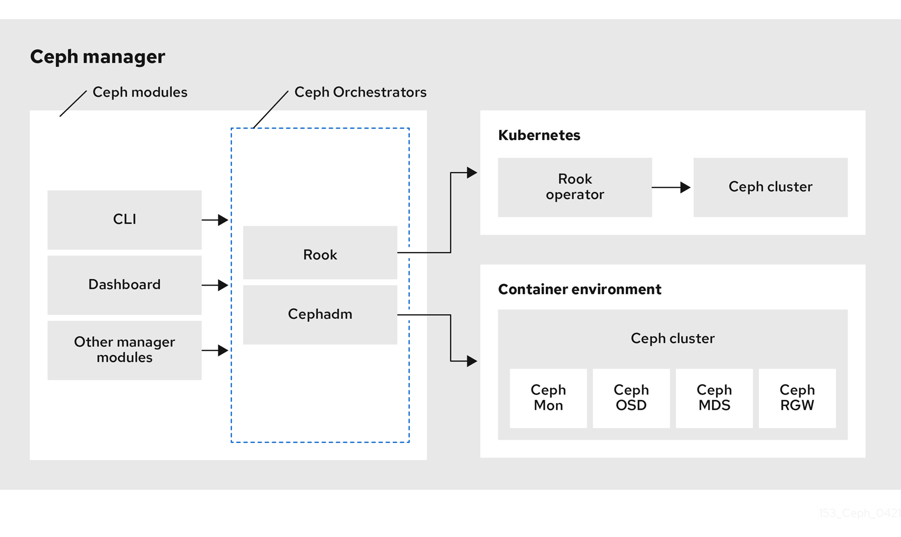

# Install rook-ceph with helm

## What is Rook?
Rook is an open source cloud-native storage orchestrator for Kubernetes, providing the platform, framework, and support for Ceph storage to natively integrate with Kubernetes.

Ceph is a distributed storage system that provides file, block and object storage and is deployed in large scale production clusters.

Rook automates deployment and management of Ceph to provide self-managing, self-scaling, and self-healing storage services. The Rook operator does this by building on Kubernetes resources to deploy, configure, provision, scale, upgrade, and monitor Ceph.

The status of the Ceph storage provider is Stable. Features and improvements will be planned for many future versions. Upgrades between versions are provided to ensure backward compatibility between releases.

Rook is hosted by the Cloud Native Computing Foundation (CNCF) as a graduated level project. If you are a company that wants to help shape the evolution of technologies that are container-packaged, dynamically-scheduled and microservices-oriented, consider joining the CNCF. For details about who's involved and how Rook plays a role, read the CNCF announcement.



## Helm Charts Overview
Rook has published the following Helm charts for the Ceph storage provider:

  - **Rook Ceph Operator:** Starts the Ceph Operator, which will watch for Ceph CRs (custom resources)
  - **Rook Ceph Cluster:** Creates Ceph CRs that the operator will use to configure the cluster

The Helm charts are intended to simplify deployment and upgrades. Configuring the Rook resources without Helm is also fully supported by creating the manifests directly.


## Ceph Operator Helm Chart

Installs rook to create, configure, and manage Ceph clusters on Kubernetes.
This chart bootstraps a rook-ceph-operator deployment on a Kubernetes cluster using the Helm package manager.


The helm install command deploys rook on the Kubernetes cluster in the default configuration. The configuration section lists the parameters that can be configured during installation. It is recommended that the rook operator be installed into the rook-ceph namespace (you will install your clusters into separate namespaces).


#### [rook operator helm values](https://github.com/rook/rook/blob/master/deploy/charts/rook-ceph/values.yaml)

before apply rook-ceph helm chart change values on `rook-operator-values.yml` file

```bash
# add rook-release repo
helm repo add rook-release https://charts.rook.io/release

# add node label
kubectl label nodes disktype=ssd master1
kubectl label nodes disktype=ssd master2
kubectl label nodes disktype=ssd master3

# install ceph operator chart
helm upgrade --install --create-namespace \
--namespace rook-ceph \
rook-ceph rook-release/rook-ceph \
-f rook-operator-values.yml
```

## Ceph Cluster Helm Chart
Creates Rook resources to configure a Ceph cluster using the Helm package manager. This chart is a simple packaging of templates that will optionally create Rook resources such as:

  - CephCluster, CephFilesystem, and CephObjectStore CRs
  - Storage classes to expose Ceph RBD volumes, CephFS volumes, and RGW buckets
  - Ingress for external access to the dashboard
  - Toolbox

#### [rook ceph cluster helm values](https://github.com/rook/rook/blob/master/deploy/charts/rook-ceph-cluster/values.yaml)

Before installing, review the `rook-ceph-cluster-values.yml` to confirm if the default settings need to be updated.

```bash
# add rook-release repo
helm repo add rook-release https://charts.rook.io/release

# install ceph cluster
helm upgrade --install --create-namespace --namespace rook-ceph \
rook-ceph-cluster \
--set operatorNamespace=rook-ceph \
rook-release/rook-ceph-cluster \
-f rook-ceph-cluster-values.yml
```

### Change rgw service count:
```bash
# get rgw informations
kubectl -n rook-ceph exec -it deploy/rook-ceph-tools -- radosgw-admin realm list
kubectl -n rook-ceph exec -it deploy/rook-ceph-tools -- radosgw-admin zonegroup list
kubectl -n rook-ceph exec -it deploy/rook-ceph-tools -- radosgw-admin zone list

# check rgw service
kubectl -n rook-ceph exec -it deploy/rook-ceph-tools -- ceph orch ps --daemon-type rgw

# change rgw service count
kubectl -n rook-ceph exec -it deploy/rook-ceph-tools -- ceph orch apply rgw ceph-objectstore --realm=ceph-objectstore --zone=ceph-objectstore --zonegroup=ceph-objectstore --placement="3 master1 master2 master3"

# check rgw service
kubectl -n rook-ceph exec -it deploy/rook-ceph-tools -- ceph orch ps --daemon-type rgw
```

### Configure the Ceph Dashboard
The following dashboard configuration settings are supported:
```bash
spec:
  dashboard:
    urlPrefix: /ceph-dashboard
    port: 8443
    ssl: true
```
  - **urlPrefix** If you are accessing the dashboard via a reverse proxy, you may wish to serve it under a URL prefix. To get the dashboard to use hyperlinks that include your prefix, you can set the urlPrefix setting.
  - **port** The port that the dashboard is served on may be changed from the default using the port setting. The corresponding K8s service exposing the port will automatically be updated.
  - **ssl** The dashboard may be served without SSL (useful for when you deploy the dashboard behind a proxy already served using SSL) by setting the ssl option to be false.


**Ceph Panel Login Credentials**
After you connect to the dashboard you will need to login for secure access. Rook creates a default user named admin and generates a secret called rook-ceph-dashboard-password in the namespace where the Rook Ceph cluster is running. To retrieve the generated password, you can run the following:
```bash
kubectl -n rook-ceph get secret rook-ceph-dashboard-password -o jsonpath="{['data']['password']}" | base64 --decode && echo
```

**Visualization of 'Physical Disks' section in the dashboard**
Information about physical disks is available only in Rook host clusters.

The Rook manager module is required by the dashboard to obtain the information about physical disks, but it is disabled by default. Before it is enabled, the dashboard 'Physical Disks' section will show an error message.

To prepare the Rook manager module to be used in the dashboard, modify your Ceph Cluster CRD:
```bash
  mgr:
    modules:
      - name: rook
        enabled: true
```
And apply the changes:
```bash
kubectl apply -f cluster.yaml
```
Once the Rook manager module is enabled as the orchestrator backend, there are two settings required for showing disk information:

  - **ROOK_ENABLE_DISCOVERY_DAEMON:** Set to true to provide the dashboard the information about physical disks. The default is false.
  - **ROOK_DISCOVER_DEVICES_INTERVAL:** The interval for changes to be refreshed in the set of physical disks in the cluster. The default is 60 minutes.
Modify the operator.yaml, and apply the changes:
```bash
kubectl apply -f operator.yaml
```

## Smoke test
Here are some tests to check the status and functionality of Rook-Ceph after deployment:

Ensure that all Rook-Ceph pods in the rook-ceph namespace are running:
```bash
kubectl -n rook-ceph get pods
```

Check the health status of the Ceph cluster:
```bash
kubectl -n rook-ceph exec -it deploy/rook-ceph-tools -- ceph status
```

Verify that all OSDs are active and functioning:
```bash
kubectl -n rook-ceph exec -it deploy/rook-ceph-tools -- ceph osd status
```

Check if the Ceph monitors (MONs) are healthy and communicating with each other:
```bash
kubectl -n rook-ceph exec -it deploy/rook-ceph-tools -- ceph mon stat
```

Create a test pool to verify Rook-Ceph's storage functionality:
```bash
kubectl -n rook-ceph exec -it deploy/rook-ceph-tools -- ceph osd pool create test-pool 64

# Verify the pool creation:
kubectl -n rook-ceph exec -it deploy/rook-ceph-tools -- ceph osd pool ls
```

Perform a read/write test on the Ceph storage to confirm functionality. Use a simple file system client, such as CephFS, or an Object Storage client, like RADOS Gateway (RGW):
```bash
kubectl -n rook-ceph exec -it deploy/rook-ceph-tools -- rados bench -p test-pool 10 write
kubectl -n rook-ceph exec -it deploy/rook-ceph-tools -- rados bench -p test-pool 10 seq
```

If you're using CephFS, create a test volume and mount it to verify functionality.
Create the file system:
```bash
kubectl -n rook-ceph exec -it deploy/rook-ceph-tools -- ceph fs volume create myfs
```

Verify the file system:
```bash
kubectl -n rook-ceph exec -it deploy/rook-ceph-tools -- ceph fs ls
```

Check the usage of pools and set quotas to test resource management:
```bash
kubectl -n rook-ceph exec -it deploy/rook-ceph-tools -- ceph df
```

Set a quota for a pool (e.g., 1GB):
```bash
kubectl -n rook-ceph exec -it deploy/rook-ceph-tools -- ceph osd pool set test-pool size 3
```