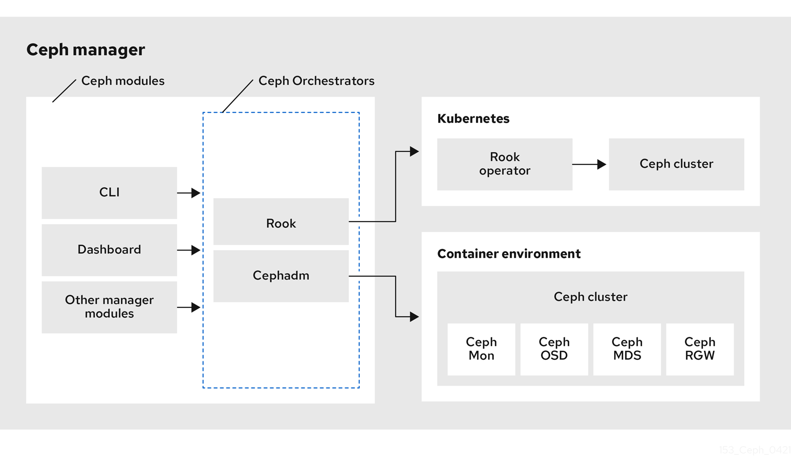
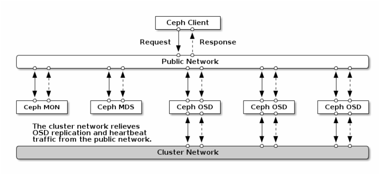

# Create a Ceph cluster on a single node with `cephadm`



#### Step1: preparing and hardening OS with ansible

#### Step2: Install and config docker service with ansible

#### Step3: Add ceph repository and install requirement tools

To install the release.asc key, execute the following:
```bash
# download from ceph site
wget -q -O- 'https://download.ceph.com/keys/release.asc' | sudo apt-key add -

# download from DockerMe site and use gpg commands
wget -q -O- 'https://store.dockerme.ir/Software/release.asc' | sudo gpg --dearmor -o /usr/share/keyrings/ceph-archive-keyring.gpg
```


You may find releases for Debian/Ubuntu (installed with APT) at:
```
https://download.ceph.com/debian-{release-name}
```
For Octopus and later releases, you can also configure a repository for a specific version x.y.z. For Debian/Ubuntu packages:
```
https://download.ceph.com/debian-{version}
```

Add ceph repository on debian 12
```bash
# add ceph repo [18.2.1]
cat << ROS > /etc/apt/sources.list.d/ceph.list
deb  [arch=amd64 signed-by=/usr/share/keyrings/ceph-archive-keyring.gpg] https://download.ceph.com/debian-18.2.1 bookworm main
ROS

# add ceph repo [17.2.7]
cat << ROS > /etc/apt/sources.list.d/ceph.list
deb  [arch=amd64 signed-by=/usr/share/keyrings/ceph-archive-keyring.gpg] https://download.ceph.com/debian-17.2.7 bookworm main
ROS

# add ceph repo [17.2.1]
cat << ROS > /etc/apt/sources.list.d/ceph.list
deb  [arch=amd64 signed-by=/usr/share/keyrings/ceph-archive-keyring.gpg] https://download.ceph.com/debian-17.2.1 bookworm main
ROS


# OR add MeCan repo [18.2.1]
cat << ROS > /etc/apt/sources.list.d/ceph.list
deb  [arch=amd64 signed-by=/usr/share/keyrings/ceph-archive-keyring.gpg] https://repo.mecan.ir/repository/debian-ceph-18.2.1 bookworm main
ROS

# OR add MeCan repo [17.2.7]
cat << ROS > /etc/apt/sources.list.d/ceph.list
deb  [arch=amd64 signed-by=/usr/share/keyrings/ceph-archive-keyring.gpg] https://repo.mecan.ir/repository/debian-ceph-17.2.7 bookworm main
ROS

# OR add MeCan repo [17.2.1]
cat << ROS > /etc/apt/sources.list.d/ceph.list
deb  [arch=amd64 signed-by=/usr/share/keyrings/ceph-archive-keyring.gpg] https://repo.mecan.ir/repository/debian-ceph-17.2.1 bookworm main
ROS

# check repo file
cat /etc/apt/sources.list.d/ceph.list
```

Update repository and install requirement packages
```
apt update
apt install -y cephadm ceph-common ceph-base

# check cephadm version
ceph --version
```

#### Step4: Pull all docker image
Pull from MeCan registry:
```
docker pull registry.mecan.ir/cephadm/ceph:v18
docker pull registry.mecan.ir/cephadm/ceph-grafana:9.4.7
docker pull registry.mecan.ir/cephadm/prometheus:v2.43.0
docker pull registry.mecan.ir/cephadm/alertmanager:v0.25.0
docker pull registry.mecan.ir/cephadm/node-exporter:v1.5.0
docker pull registry.mecan.ir/cephadm/loki:2.4.0
docker pull registry.mecan.ir/cephadm/promtail:2.4.0
```

Tag all image to orginal image tag
```
docker tag registry.mecan.ir/cephadm/ceph:v18  quay.io/ceph/ceph:v18
docker tag registry.mecan.ir/cephadm/ceph-grafana:9.4.7  quay.io/ceph/ceph-grafana:9.4.7
docker tag registry.mecan.ir/cephadm/prometheus:v2.43.0  quay.io/prometheus/prometheus:v2.43.0
docker tag registry.mecan.ir/cephadm/alertmanager:v0.25.0  quay.io/prometheus/alertmanager:v0.25.0
docker tag registry.mecan.ir/cephadm/node-exporter:v1.5.0  quay.io/prometheus/node-exporter:v1.5.0
docker tag registry.mecan.ir/cephadm/loki:2.4.0  grafana/loki:2.4.0
docker tag registry.mecan.ir/cephadm/promtail:2.4.0  grafana/promtail:2.4.0
```

Pull from public registry
```
docker pull quay.io/ceph/ceph:v18
docker pull quay.io/ceph/ceph-grafana:9.4.7
docker pull quay.io/prometheus/prometheus:v2.43.0
docker pull quay.io/prometheus/alertmanager:v0.25.0
docker pull quay.io/prometheus/node-exporter:v1.5.0
docker pull grafana/loki:2.4.0
docker pull grafana/promtail:2.4.0
```

#### Step5: Create ssh-key and create ssh config

Create ssh-key with this commands:
```
ssh-keygen

# check ssh-key
ls ~/.ssh/
```

Create ssh config file:
```
cat << CTO > ~/.ssh/config
StrictHostKeyChecking no
Host ceph-aio
  Hostname 192.168.100.171
  Port 8090
  User root
CTO
```

Add ssh-key to host:
```
cat ~/.ssh/id_rsa.pub >> ~/.ssh/authorized_keys
```

Check ssh to ceph-aio:
```
ssh ceph-aio
```




#### Step6: Bootstraping cluster with cephadm commands


```bash
cephadm bootstrap --cluster-network 192.168.100.0/24 \
                  --mon-ip 192.168.100.171 \
                  --dashboard-password-noupdate \
                  --initial-dashboard-user admin \
                  --initial-dashboard-password sdwefeoiuijkmwqdcerwaeedwexqwxkqwjnwefe \
                  --allow-fqdn-hostname \
                  --single-host-defaults \
                  --cleanup-on-failure \
                  --skip-pull \
                  --skip-firewalld \
                  --ssh-config /root/.ssh/config \
                  --ssh-private-key ~/.ssh/id_rsa \
                  --ssh-public-key ~/.ssh/id_rsa.pub \
                  --with-centralized-logging
```

after a few minute export this output:
```
Ceph Dashboard is now available at:

	     URL: https://ceph-aio:8443/
	    User: admin
	Password: sdwefeoiuijkmwqdcerwaeedwexqwxkqwjnwefe

Enabling client.admin keyring and conf on hosts with "admin" label
Saving cluster configuration to /var/lib/ceph/4489d864-b135-11ee-b057-fa163eee05b9/config directory
Enabling autotune for osd_memory_target
You can access the Ceph CLI as following in case of multi-cluster or non-default config:

	sudo /usr/sbin/cephadm shell --fsid 4489d864-b135-11ee-b057-fa163eee05b9 -c /etc/ceph/ceph.conf -k /etc/ceph/ceph.client.admin.keyring

Or, if you are only running a single cluster on this host:

	sudo /usr/sbin/cephadm shell

Please consider enabling telemetry to help improve Ceph:

	ceph telemetry on

For more information see:

	https://docs.ceph.com/en/latest/mgr/telemetry/

Bootstrap complete.
```

#### Step7: Configuration grafana and set admin password

grafana config file path on your host:

    /var/lib/ceph/CLUSTER_ID/grafana.ceph-aio/etc/grafana/grafana.ini

Grafana set admin password:

```bash
# create a file with these configuration
cat <<EOF > grafana.yml
service_type: grafana
spec:
  initial_admin_password: sdfwefweddljlkwmqwoqiwjklsgrw
EOF

# after create file apply to cluster with this commands
ceph orch apply -i grafana.yml

# then redeploy grafana service
ceph orch redeploy grafana
```


#### Step8: ceph and grafana dashboard access

To access the Ceph dashboard, you can configure iptables rules to allow access to ports 8443 and 3000. Alternatively, you can set up a reverse proxy using a tool like Nginx to provide access to the dashboards using custom names or URLs.

Sample iptables rules
```
# Allow incoming traffic on port 8443 (Ceph Dashboard)
iptables -A INPUT -p tcp --dport 8443 -j ACCEPT

# Allow incoming traffic on port 3000 (Grafana Dashboard - if applicable)
iptables -A INPUT -p tcp --dport 3000 -j ACCEPT
```

the other way install and config nginx and certbot for access to all panels:
```
apt update
apt install -y nginx certbot python3-certbot-nginx
```

After installation set dns record and get certificate:
Get certificate non interactive with single commands.
```
sudo certbot certonly --nginx --non-interactive --agree-tos -m ahmad@MeCan.ir -d panel.ceph-aio.mecan.ir
sudo certbot certonly --nginx --non-interactive --agree-tos -m ahmad@MeCan.ir -d grafana.ceph-aio.mecan.ir
sudo certbot certonly --nginx --non-interactive --agree-tos -m ahmad@MeCan.ir -d metrics.ceph-aio.mecan.ir
sudo certbot certonly --nginx --non-interactive --agree-tos -m ahmad@MeCan.ir -d alerts.ceph-aio.mecan.ir
```

To create the password file, run the following command:
```
sudo htpasswd -c /etc/nginx/conf.d/.htpasswd MeCan
```

Set nginx config for ceph panel:
```bash
cat > /etc/nginx/conf.d/panel.conf << 'CEO'
server {
    listen 443 ssl;
    server_name panel.ceph-aio.mecan.ir;

    ssl_certificate /etc/letsencrypt/live/panel.ceph-aio.mecan.ir/fullchain.pem;
    ssl_certificate_key /etc/letsencrypt/live/panel.ceph-aio.mecan.ir/privkey.pem;

    # Enable HSTS
    add_header Strict-Transport-Security "max-age=31536000; includeSubDomains" always;

    # Enable other security headers
    add_header X-Content-Type-Options nosniff;
    add_header X-Frame-Options SAMEORIGIN;
    add_header X-XSS-Protection "1; mode=block";

    # Set nginx ssl protocol support
    proxy_ssl_protocols TLSv1.2 TLSv1.3;
    proxy_ssl_ciphers DEFAULT;

    location / {
        proxy_pass https://localhost:8443;
        proxy_set_header Host $host;
        proxy_set_header X-Real-IP $remote_addr;
        proxy_set_header X-Forwarded-For $proxy_add_x_forwarded_for;
    }

    location /api {
        proxy_pass https://localhost:8443/api;
        proxy_set_header Host $host;
        proxy_set_header X-Real-IP $remote_addr;
        proxy_set_header X-Forwarded-For $proxy_add_x_forwarded_for;
    }
}

server {
    listen 80;
    server_name panel.ceph-aio.mecan.ir;
    # Redirect HTTP to HTTPS
    return 301 https://$host$request_uri;
}
CEO
```

Set nginx config for grafana panel:
```bash
cat > /etc/nginx/conf.d/grafana.conf << 'CEO'
server {
    listen 443 ssl;
    server_name grafana.ceph-aio.mecan.ir;

    ssl_certificate /etc/letsencrypt/live/grafana.ceph-aio.mecan.ir/fullchain.pem;
    ssl_certificate_key /etc/letsencrypt/live/grafana.ceph-aio.mecan.ir/privkey.pem;

    # Enable HSTS
    add_header Strict-Transport-Security "max-age=31536000; includeSubDomains" always;

    # Enable other security headers
    add_header X-Content-Type-Options nosniff;
    add_header X-Frame-Options SAMEORIGIN;
    add_header X-XSS-Protection "1; mode=block";

    # Set nginx ssl protocol support
    proxy_ssl_protocols TLSv1.2 TLSv1.3;
    proxy_ssl_ciphers DEFAULT;

    location / {
        proxy_pass https://localhost:3000;
        proxy_set_header Host $host;
        proxy_set_header X-Real-IP $remote_addr;
        proxy_set_header X-Forwarded-For $proxy_add_x_forwarded_for;
    }
}

server {
    listen 80;
    server_name grafana.ceph-aio.mecan.ir;
    # Redirect HTTP to HTTPS
    return 301 https://$host$request_uri;
}
CEO
```

Set nginx config for prometheus panel:
```bash
cat > /etc/nginx/conf.d/metrics.conf << 'CEO'
server {
    listen 443 ssl;
    server_name metrics.ceph-aio.mecan.ir;

    ssl_certificate /etc/letsencrypt/live/metrics.ceph-aio.mecan.ir/fullchain.pem;
    ssl_certificate_key /etc/letsencrypt/live/metrics.ceph-aio.mecan.ir/privkey.pem;

    # Enable HSTS
    add_header Strict-Transport-Security "max-age=31536000; includeSubDomains" always;

    # Enable other security headers
    add_header X-Content-Type-Options nosniff;
    add_header X-Frame-Options SAMEORIGIN;
    add_header X-XSS-Protection "1; mode=block";

    # Set nginx ssl protocol support
    proxy_ssl_protocols TLSv1.2 TLSv1.3;
    proxy_ssl_ciphers DEFAULT;

    location / {
        auth_basic "Restricted Content";
        auth_basic_user_file /etc/nginx/conf.d/.htpasswd;
        proxy_pass http://localhost:9095;
        proxy_set_header Host $host;
        proxy_set_header X-Real-IP $remote_addr;
        proxy_set_header X-Forwarded-For $proxy_add_x_forwarded_for;
    }
}

server {
    listen 80;
    server_name metrics.ceph-aio.mecan.ir;
    # Redirect HTTP to HTTPS
    return 301 https://$host$request_uri;
}
CEO
```


Set nginx config for alertmanager panel:
```bash
cat > /etc/nginx/conf.d/alerts.conf << 'CEO'
server {
    listen 443 ssl;
    server_name alerts.ceph-aio.mecan.ir;

    ssl_certificate /etc/letsencrypt/live/alerts.ceph-aio.mecan.ir/fullchain.pem;
    ssl_certificate_key /etc/letsencrypt/live/alerts.ceph-aio.mecan.ir/privkey.pem;

    # Enable HSTS
    add_header Strict-Transport-Security "max-age=31536000; includeSubDomains" always;

    # Enable other security headers
    add_header X-Content-Type-Options nosniff;
    add_header X-Frame-Options SAMEORIGIN;
    add_header X-XSS-Protection "1; mode=block";

    # Set nginx ssl protocol support
    proxy_ssl_protocols TLSv1.2 TLSv1.3;
    proxy_ssl_ciphers DEFAULT;

    location / {
        auth_basic "Restricted Content";
        auth_basic_user_file /etc/nginx/conf.d/.htpasswd;
        proxy_pass http://localhost:9093;
        proxy_set_header Host $host;
        proxy_set_header X-Real-IP $remote_addr;
        proxy_set_header X-Forwarded-For $proxy_add_x_forwarded_for;
    }
}

server {
    listen 80;
    server_name alerts.ceph-aio.mecan.ir;
    # Redirect HTTP to HTTPS
    return 301 https://$host$request_uri;
}
CEO
```

After configuring all virtual hosts, it is generally safe to remove the default configuration file for Nginx. However, before doing so, it is important to ensure that your Nginx configuration is error-free and valid. You can use the following command to check the Nginx configuration:

```bash
# delete default config
rm /etc/nginx/sites-enabled/default

# check nginx configuration
nginx -t

# restart nginx service
systemctl restart nginx

# enable nginx service
systemctl enable nginx
```

#### Step9: Test the cluster
The block storage provided by Ceph is named RBD, which stands for RADOS block device.

To create disks, you need a pool enabled to work with RBD. The commands below create a pool called rbd and then activate this pool for RBD:

    sudo ceph osd pool create rbd

    sudo ceph osd pool application enable rbd rbd

After that, you can use the rbd command line to create and list available disks:

    sudo rbd create mysql --size 1G
    sudo rbd create mongodb --size 2G

Check rbd images:

    sudo rbd list

The output will be:

    mongodb
    mysql

#
Useful commands:

    ceph osd ls
    ceph osd tree
    ceph orch ls
    ceph mgr module ls
    ceph orch ps
    ceph orch apply osd --all-available-devices

Delete and purge osd with id:

    ceph osd out ID
    ceph osd safe-to-destroy osd.ID
    ceph osd destroy ID --yes-i-really-mean-it
    ceph osd purge ID --yes-i-really-mean-it


Check and zap device with this command:

    ceph orch device ls
    ceph orch device zap ceph-aio /dev/vdc --force

Image list:

    quay.io/ceph/ceph:v18
    quay.io/ceph/ceph-grafana:9.4.7
    quay.io/prometheus/prometheus:v2.43.0
    quay.io/prometheus/alertmanager:v0.25.0
    quay.io/prometheus/node-exporter:v1.5.0
    grafana/loki:2.4.0
    grafana/promtail:2.4.0

You can stop, start, or restart a daemon with:

    ceph orch daemon stop <name>
    ceph orch daemon start <name>
    ceph orch daemon restart <name>

The container for a daemon can be stopped, recreated, and restarted with the redeploy command:

    ceph orch daemon redeploy <name> [--image <image>]


Good link:
  - https://www.redhat.com/sysadmin/ceph-cluster-single-machine
  - https://docs.ceph.com/en/latest/cephadm/services/monitoring/
  - https://www.ibm.com/docs/en/storage-ceph/5?topic=access-setting-admin-user-password-grafana
