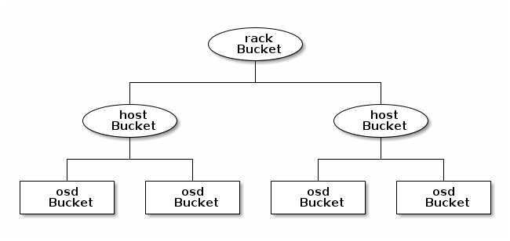
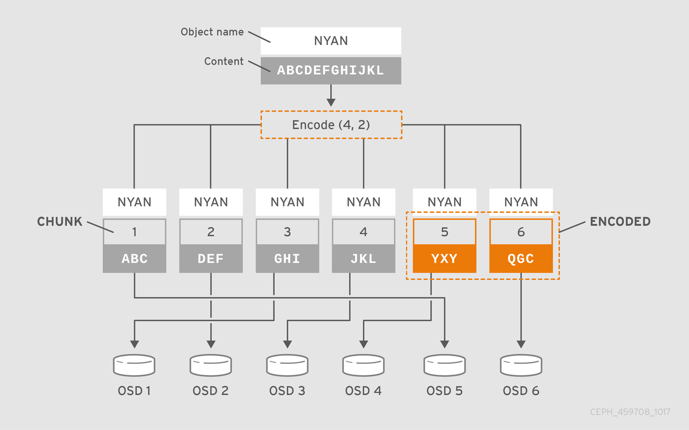

# Changing the CRUSH map in Ceph
Changing the CRUSH (Controlled Replication Under Scalable Hashing) map in Ceph involves modifying its structure or rules to control data placement and replication within the cluster.




- [Changing the CRUSH map in Ceph](#changing-the-crush-map-in-ceph)
    - [Backup or Get the Existing CRUSH Map](#backup-or-get-the-existing-crush-map)
    - [Decompile the CRUSH Map](#decompile-the-crush-map)
    - [Recompile the CRUSH Map](#recompile-the-crush-map)
    - [Set the CRUSH Map](#set-the-crush-map)
    - [Crush map sections:](#crush-map-sections)
    - [Creating CRUSH rules for replicated pools](#creating-crush-rules-for-replicated-pools)
    - [Erasure code profiles](#erasure-code-profiles)
    - [Creating CRUSH rules for erasure coded pools](#creating-crush-rules-for-erasure-coded-pools)

Here's a step-by-step guide to safely modify the CRUSH map:

### Backup or Get the Existing CRUSH Map
Before making any changes, export the current CRUSH map for backup.
```bash
ceph osd getcrushmap -o {compiled-crushmap-filename}
# Sample
ceph osd getcrushmap -o crushmap-backup.bin
```
This ensures you can revert to the original CRUSH map if needed.
Ceph outputs (-o) a compiled CRUSH map to the filename that you have specified. Because the CRUSH map is in a compiled form, you must first decompile it before you can edit it.


### Decompile the CRUSH Map
The CRUSH map is stored in a binary format. To edit it, decompile it into a human-readable text format:

```bash
crushtool -d {compiled-crushmap-filename} -o {decompiled-crushmap-filename}
# Sample
crushtool -d crushmap-backup.bin -o crushmap.txt
```

### Recompile the CRUSH Map
To compile the CRUSH map, run a command of the following form:
```bash
crushtool -c {decompiled-crushmap-filename} -o {compiled-crushmap-filename}
# Sample
crushtool -c crushmap.txt -o new-crushmap.bin

# Check the map for errors:
crushtool -i new-crushmap.bin --test
```

### Set the CRUSH Map
To set the CRUSH map for your cluster, run a command of the following form:
```bash
ceph osd setcrushmap -i {compiled-crushmap-filename}
# Sample
ceph osd setcrushmap -i new-crushmap.bin
```

Ceph loads (-i) a compiled CRUSH map from the filename that you have specified.

### Crush map sections:
A CRUSH map has six main sections:
  **1. tunables:** The preamble at the top of the map describes any tunables that are not a part of legacy CRUSH behavior. These tunables correct for old bugs, optimizations, or other changes that have been made over the years to improve CRUSH’s behavior.
  **2. devices:** Devices are individual OSDs that store data.
  **3. types:** Bucket types define the types of buckets that are used in your CRUSH hierarchy.
  **4. buckets:** Buckets consist of a hierarchical aggregation of storage locations (for example, rows, racks, chassis, hosts) and their assigned weights. After the bucket types have been defined, the CRUSH map defines each node in the hierarchy, its type, and which devices or other nodes it contains.
  **5. rules:** Rules define policy about how data is distributed across devices in the hierarchy.
  **6. choose_args:** choose_args are alternative weights associated with the hierarchy that have been adjusted in order to optimize data placement. A single choose_args map can be used for the entire cluster, or a number of choose_args maps can be created such that each map is crafted for a particular pool.

### Creating CRUSH rules for replicated pools
Use this information to create a CRUSH rule for a replicated pool from the command-line.

To create a CRUSH rule for a replicated pool, run the following:

Syntax:
```bash
ceph osd crush rule create-replicated NAME ROOT FAILURE_DOMAIN CLASS
```

Where:

  - **<name>:** The name of the rule.
  - **<root>:** The root of the CRUSH hierarchy.
  - **<failure-domain>:** The failure domain. For example: host or rack.
  - **<class>:** The storage device class. For example: hdd or ssd.

Example
```bash
ceph osd crush rule create-replicated fast default host ssd
```

### Erasure code profiles

Ceph defines an erasure-coded pool with a profile. Ceph uses a profile when creating an erasure-coded pool and the associated CRUSH rule.

Ceph creates a default erasure code profile when initializing a cluster and it provides the same level of redundancy as two copies in a replicated pool. This default profile defines k=2 and m=2, meaning Ceph spreads the object data over four OSDs (k+m=4) and Ceph can lose one of those OSDs without losing data. EC 2+2 requires a minimum deployment footprint of 4 nodes (5 nodes recommended) and can cope with the temporary loss of 1 OSD node.

To display the default profile use the following command:
```bash
# Get ec profile
ceph osd erasure-code-profile ls

# Get default ec
ceph osd erasure-code-profile get default
# Sample output
k=2
m=2
plugin=jerasure
technique=reed_sol_van
```
You can create a new profile to improve redundancy without increasing raw storage requirements. For instance, a profile with k=8 and m=4 can sustain the loss of four (m=4) OSDs by distributing an object on 12 (k+m=12) OSDs. Ceph divides the object into 8 chunks and computes 4 coding chunks for recovery. For example, if the object size is 8 MB, each data chunk is 1 MB and each coding chunk has the same size as the data chunk, that is also 1 MB. The object is not lost even if four OSDs fail simultaneously.

The most important parameters of the profile are k, m and crush-failure-domain, because they define the storage overhead and the data durability.

For instance, if the desired architecture must sustain the loss of two racks with a storage overhead of 40% overhead, the following profile can be defined:
```bash
# Create ec profile
ceph osd erasure-code-profile set myprofile \
   k=4 \
   m=2 \
   crush-failure-domain=osd

# create pool with myprofile ec
ceph osd pool create ecpool 12 12 erasure myprofile

# check pool
ceph osd pool ls

# put data on ec pool
echo ABCDEFGHIJKL | rados --pool ecpool put NYAN -

# get data from ec pool
rados --pool ecpool get NYAN -
```


### Creating CRUSH rules for erasure coded pools
To add a CRUSH rule for use with an erasure-coded pool, you might specify a rule name and an erasure coded profile.

Procedure
Specify the rule name and an erasure-coded profile.
```bash
ceph osd crush rule create-erasure RULE_NAME PROFILE_NAME
```
For example
```bash
ceph osd crush rule create-erasure default default
```
