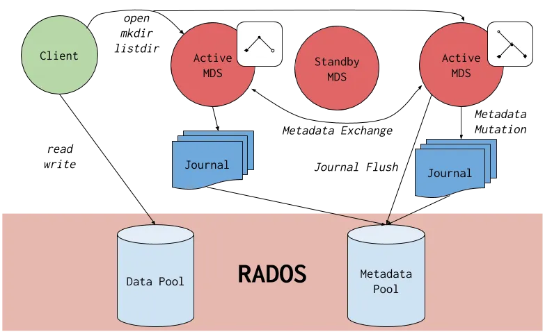

# MDS client and usage


- [MDS client and usage](#mds-client-and-usage)
    - [Install Ceph Client Packages:](#install-ceph-client-packages)
    - [Retrieve Ceph Configuration:](#retrieve-ceph-configuration)
    - [Create the MDS User:](#create-the-mds-user)
    - [Mount CephFS:](#mount-cephfs)
    - [Interact with CephFS:](#interact-with-cephfs)
    - [Unmount CephFS:](#unmount-cephfs)
  - [Mounting the Ceph File System as a kernel client](#mounting-the-ceph-file-system-as-a-kernel-client)
    - [About this task](#about-this-task)
    - [Before you begin](#before-you-begin)
    - [Procedure](#procedure)
    - [Mounting manually](#mounting-manually)




**Metadata Server client**
To configure and use an MDS (Metadata Server) client in Linux for the Ceph distributed storage system, you can follow these steps:

### Install Ceph Client Packages:
Ensure that the Ceph client packages are installed on the Linux system. The package names may vary depending on the Linux distribution. For example, on Ubuntu, you can use the following command to install the packages:
```bash
sudo apt-get install ceph-fuse
```

### Retrieve Ceph Configuration:
Obtain the Ceph configuration file (ceph.conf) from the Ceph cluster or the cluster administrator. Place the configuration file in a suitable location on the Linux system (e.g., /etc/ceph/ceph.conf).

Get minimal config from ceph:
```bash
ceph config generate-minimal-conf
```

### Create the MDS User:
Run the following command to create a new Ceph user for the MDS service. This user needs to have the proper capabilities (i.e., access to the monitor, metadata server, and OSDs):

```bash
ceph auth get-or-create client.<mds_name> mon 'allow profile mds' osd 'allow rwx pool=cephfs_data' mds 'allow'
```

### Mount CephFS:
Create a mount point directory on the Linux system where you want to access the CephFS.
Use the ceph-fuse command to mount the CephFS on the specified mount point. The command should include the path to the Ceph configuration file and the mount point directory. For example:
```bash
sudo ceph-fuse -m <MONITOR_IP>:6789 /path/to/mount/point -c /etc/ceph/ceph.conf
```
Replace `<MONITOR_IP>` with the IP address of one of the Ceph monitors.

  - --keyring=/etc/ceph/ceph.client.admin.keyring
  - --id=client_name
  - --no-mon-config

### Interact with CephFS:
Once the CephFS is mounted, you can use standard file system commands to interact with the file system.
Navigate to the mount point directory and use commands like ls, cd, mkdir, touch, rm, etc., to manage files and directories.
The MDS client will handle the necessary communication with the MDS servers in the Ceph cluster for metadata operations.

### Unmount CephFS:
To unmount the CephFS, use the umount command followed by the mount point directory. For example:
```bash
sudo umount /path/to/mount/point
```

## Mounting the Ceph File System as a kernel client
The Ceph File System (CephFS) can be mounted as a kernel client, either manually or automatically on system start.

### About this task

  - See the mount(8) manual page.
  - For more information about creating a Ceph user, see Ceph user management.
  - For more information about creating Ceph File Systems, see Creating Ceph File Systems.

### Before you begin
Before mounting a Ceph File System as a kernel client, be sure that you have:
  - Root-level access to a Linux-based client node.
  - Root-level access to a Ceph Monitor node.
  - An existing Ceph File System.

### Procedure
Configure the client node to use the Ceph storage cluster.

Enable the Ceph Tools repository.
```bash
# download from DockerMe site and use gpg commands
wget -q -O- 'https://store.dockerme.ir/Software/release.asc' | sudo gpg --dearmor -o /usr/share/keyrings/ceph-archive-keyring.gpg

# OR add MeCan repo [18.2.1]
cat << ROS > /etc/apt/sources.list.d/ceph.list
deb  [arch=amd64 signed-by=/usr/share/keyrings/ceph-archive-keyring.gpg] https://repo.mecan.ir/repository/debian-ceph-18.2.1 bookworm main
ROS
```

Repeat this step on all nodes of the IBM Storage Ceph storage cluster.

Install the ceph-common package.
```bash
apt install ceph-common
```
Log in to the Cephadm shell on the monitor node.
```bash
cephadm shell
```

Copy the Ceph client keyring from the Ceph Monitor node to the client node.
```bash
scp /ceph.client.CLIENT_ID.keyring root@CLIENT_NODE_NAME:/etc/ceph/ceph.client.CLIENT_ID.keyring
```

Replace CLIENT_NODE_NAME with the Ceph client host name or IP address.
For example:
```bash
scp /ceph.client.1.keyring root@client01:/etc/ceph/ceph.client.1.keyring
```

Copy the Ceph configuration file from a Ceph Monitor node to the client node.
```bash
scp /etc/ceph/ceph.conf root@CLIENT_NODE_NAME:/etc/ceph/ceph.conf
```

Replace CLIENT_NODE_NAME with the Ceph client host name or IP address.
For example:
```bash
scp /etc/ceph/ceph.conf root@client01:/etc/ceph/ceph.conf
```

Configure the client node to use the Ceph storage cluster.
```bash
chmod 644 /etc/ceph/ceph.conf
```

Choose either automatically or manually.
  - For automatic mounting, continue to Mounting automatically.
  - For manual mounting, continue to Mounting manually .


### Mounting manually
Procedure
Create a mount directory on the client node.
```bash
mkdir -p MOUNT_POINT

# For example:
mkdir -p /mnt/cephfs
```

Mount the Ceph File System.
To specify multiple Ceph Monitor addresses, in the mount command:
  - Separate them with commas.
  - Specify the mount point.
  - Set the client name.
```bash
mount -t ceph MONITOR-1_NAME:6789,MONITOR-2_NAME:6789,MONITOR-3_NAME:6789:/ MOUNT_POINT -o name=CLIENT_ID,fs=FILE_SYSTEM_NAME

# For example:
mount -t ceph 192.168.200.50:6789:/ /opt/testfs -c /etc/ceph/ceph.conf -o name=amirgan,fs=MeCan_Volumes
```

Verify that the file system is successfully mounted.
```bash
stat -f MOUNT_POINT

# For example:
stat -f /mnt/cephfs
```
