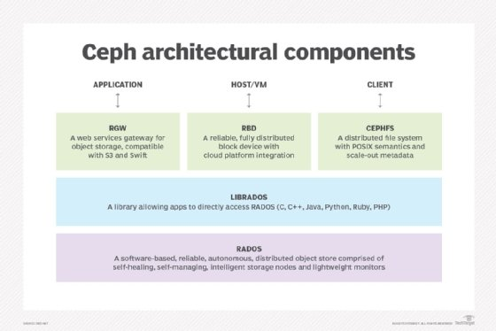

# rbd client


- [rbd client](#rbd-client)
    - [Create the RBD Pool](#create-the-rbd-pool)
    - [Create a Ceph User with RBD Permissions](#create-a-ceph-user-with-rbd-permissions)
    - [Create an RBD Image](#create-an-rbd-image)
    - [Mount the RBD Image on Another Linux Machine](#mount-the-rbd-image-on-another-linux-machine)
    - [Map the RBD Image:](#map-the-rbd-image)
    - [Unmap and Clean Up](#unmap-and-clean-up)
    - [Map the RBD Image Using rbd map](#map-the-rbd-image-using-rbd-map)
    - [Add the RBD Image to /etc/fstab for Automatic Mounting](#add-the-rbd-image-to-etcfstab-for-automatic-mounting)
    - [RADOS Block Device client the other scenario:](#rados-block-device-client-the-other-scenario)

### Create the RBD Pool
The RBD pool is where RBD images will be stored. You can create an RBD pool with the following command:

```bash
ceph osd pool create <pool_name> <pg_num> <pgp_num> replication <replication_factor>

# For example:
ceph osd pool create rbd_pool 128 128 3
```

This will create a pool named rbd_pool with 128 PGs and replication factor of 3.

enable application on pool:
```bash
ceph osd pool application enable rbd_pool rbd
```

### Create a Ceph User with RBD Permissions
Now, create a user that will have access to the RBD pool. You will assign the user with the necessary permissions to interact with the RBD pool:

```bash
ceph auth get-or-create client.<username> osd 'allow rwx pool=rbd_pool' mon 'allow r' -o /etc/ceph/<username>.keyring

# For example:
ceph auth get-or-create client.rbd_user osd 'allow rwx pool=rbd_pool' mon 'allow r' -o /etc/ceph/rbd_user.keyring
```
Replace <username> with the name of the user you want to create (e.g., rbd_user).
This command will create the keyring and save it to /etc/ceph/rbd_user.keyring.


### Create an RBD Image
Next, create an RBD image in the RBD pool that will be used as a block device. You can create an image with:

```bash
rbd create <image_name> --size <size_in_mb> --pool rbd_pool

# For example:
rbd create my_image --size 10240 --pool rbd_pool

# check image on pool
rbd ls rbd_pool
```
This will create an RBD image named my_image of size 10 GB in the rbd_pool.

### Mount the RBD Image on Another Linux Machine
Now that you've created the RBD image and given the user permissions, you can mount the RBD image on another Linux machine.

Install RBD Client on the Target Machine:

If the Ceph client tools are not installed on the target machine, you can install them (on a Debian/Ubuntu system):

```bash
sudo apt install ceph ceph-common ceph-fuse librados2 librgw-dev
```
Copy the Keyring to the Target Machine:

Copy the keyring file (rbd_user.keyring) to the target machine (you can use scp or any other method):

```bash
scp /etc/ceph/rbd_user.keyring user@target_machine:/etc/ceph/rbd_user.keyring
```

### Map the RBD Image:

On the target machine, use the rbd map command to map the RBD image as a block device:

```bash
sudo rbd map <image_name> --pool rbd_pool --name client.<username> --keyring /etc/ceph/rbd_user.keyring

# For example:

sudo rbd map my_image --pool rbd_pool --name client.rbd_user --keyring /etc/ceph/rbd_user.keyring
```
This will map the RBD image to a block device (e.g., /dev/rbd0).

Create a Filesystem on the RBD Image (if needed):

If the RBD image is not formatted, you can create a filesystem on it:

```bash
sudo mkfs.ext4 /dev/rbd0
```
Mount the RBD Image:

After mapping the RBD image, mount it to a directory:

```bash
sudo mount /dev/rbd0 /mnt
```
Now, you can access the RBD image as a mounted filesystem at /mnt.

### Unmap and Clean Up
When you're done using the RBD image, you can unmap the image:

```bash
sudo umount /mnt
sudo rbd unmap /dev/rbd0
```

### Map the RBD Image Using rbd map
rbdmap is a shell script that automates rbd map and rbd unmap operations on one or more RBD (RADOS Block Device) images. While the script can be run manually by the system administrator at any time, the principal use case is automatic mapping/mounting of RBD images at boot time (and unmounting/unmapping at shutdown), as triggered by the init system (a systemd unit file, rbdmap.service is included with the ceph-common package for this purpose).

The script takes a single argument, which can be either “map” or “unmap”. In either case, the script parses a configuration file (defaults to /etc/ceph/rbdmap, but can be overridden via an environment variable RBDMAPFILE). Each line of the configuration file corresponds to an RBD image which is to be mapped, or unmapped.

Before adding the RBD to fstab, you need to map the RBD image to a local block device. This step requires the RBD client installed on the machine where you want to map the image.

Example Command:
```bash
sudo rbd map <image_name> --pool <pool_name> --name client.<username> --keyring /etc/ceph/<username>.keyring

# For example:

sudo rbd map my_image --pool rbd_pool --name client.rbd_user --keyring /etc/ceph/rbd_user.keyring
```
This will map the RBD image named my_image from the rbd_pool to a local block device (e.g., /dev/rbd0).


Example /etc/ceph/rbdmap for three RBD images called “bar1”, “bar2” and “bar3”, which are in pool “foopool”:
```bash
#foopool/bar1    id=admin,keyring=/etc/ceph/ceph.client.admin.keyring
rbd_pool/my_image  id=rbd_user,keyring=/etc/ceph/ceph.client.admin.keyring

systemctl enable rbdmap.service
systemctl restart rbdmap.service
systemctl status rbdmap.service
```

### Add the RBD Image to /etc/fstab for Automatic Mounting

To make the RBD image mount automatically on boot, you need to add an entry to the /etc/fstab file.

Open /etc/fstab using a text editor:
```bash
sudo vim /etc/fstab
```
Add a line to the file in the following format:

```bash
rados://<pool_name>/<image_name>  <mount_point>  <filesystem_type>  _netdev,defaults  0  0

# For example:
/dev/rbd/foopool/bar1 /mnt/bar1 ext4 noauto 0 0
```

### RADOS Block Device client the other scenario:
To configure and use a Ceph RBD (RADOS Block Device) client in Linux, you can follow these steps:

**Install Ceph Client Packages:**
Ensure that the Ceph client packages are installed on the Linux system. The package names may vary depending on the Linux distribution. For example, on Ubuntu, you can use the following command to install the packages:
```bash
sudo apt-get install ceph-common
```

**Retrieve Ceph Configuration:**
Obtain the Ceph configuration file (ceph.conf) from the Ceph cluster or the cluster administrator. Place the configuration file in a suitable location on the Linux system (e.g., /etc/ceph/ceph.conf).

**Create pool and rbd image:**
the frist step create RBD pool and image:

```bash
ceph osd pool create rbd
ceph osd pool application enable rbd rbd
sudo rbd create mysql --size 10G
sudo rbd create mongodb --size 20G
```

**Mount RBD Image:**
To use an RBD image, you can mount it as a block device on the Linux system.
Create a mount point directory on the Linux system where you want to mount the RBD image.
Use the rbd command to map the RBD image to a block device. The command should include the path to the Ceph configuration file, the pool name, the image name, and the mount point directory. For example:
```bash
sudo rbd map --id <CLIENT_ID> --pool <POOL_NAME> --image <IMAGE_NAME> --cluster <CLUSTER_NAME> --conf /etc/ceph/ceph.conf
# For example
sudo rbd map --pool rbd --image mysql

sudo mount /dev/rbd/<POOL_NAME>/<IMAGE_NAME> /path/to/mount/point
# For example
sudo mount /dev/rbd/rbd/mysql /mnt/mysql
```
Replace `<CLIENT_ID>` with the ID of the Ceph client, `<POOL_NAME>` with the name of the RBD pool, `<IMAGE_NAME>` with the name of the RBD image, and `<CLUSTER_NAME> `with the name of the Ceph cluster.

Error: wrong fs type, bad option, bad superblock on /dev/rbd0, missing codepage or helper program, or other error.
```bash
mkfs.ext4 /dev/rbd0
```

**Interact with RBD Image:**
Once the RBD image is mounted, you can use standard file system commands to interact with the block device as if it were a regular disk.
Navigate to the mount point directory and use commands like ls, cd, mkdir, touch, rm, etc., to manage files and directories on the RBD image.
Any changes made to the files and directories will be reflected in the RBD image.

**Unmount RBD Image:**
To unmount the RBD image, use the umount command followed by the mount point directory. For example:
```bash
sudo umount /path/to/mount/point
sudo rbd unmap /dev/rbd/<POOL_NAME>/<IMAGE_NAME> --conf /etc/ceph/ceph.conf
```