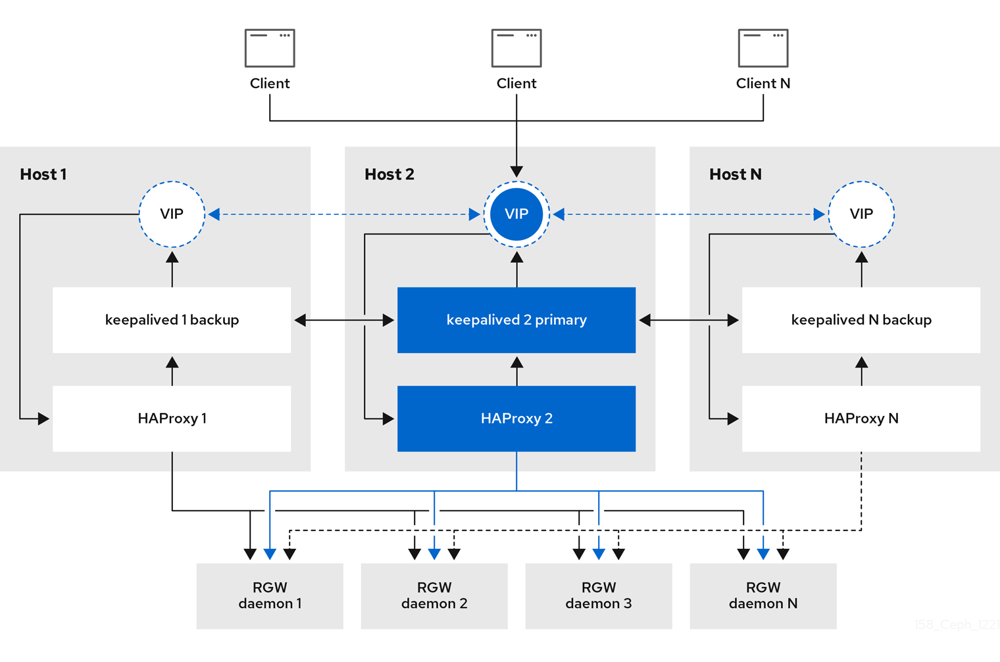

# RADOS Gateway client:
To configure and use a Ceph RGW (RADOS Gateway) client in Linux, you can follow these steps:

- [RADOS Gateway client:](#rados-gateway-client)
    - [Install Ceph Client Packages:](#install-ceph-client-packages)
    - [Retrieve Ceph Configuration:](#retrieve-ceph-configuration)
    - [Install S3 Tools:](#install-s3-tools)
    - [Configure S3 Tools:](#configure-s3-tools)
    - [Interact with Ceph RGW:](#interact-with-ceph-rgw)
    - [Steps to Create an RGW User](#steps-to-create-an-rgw-user)
    - [Create bucket and move an object to it:](#create-bucket-and-move-an-object-to-it)



### Install Ceph Client Packages:
Ensure that the Ceph client packages are installed on the Linux system. The package names may vary depending on the Linux distribution. For example, on Ubuntu, you can use the following command to install the packages:
```bash
sudo apt-get install ceph-common
```

### Retrieve Ceph Configuration:
Obtain the Ceph configuration file (ceph.conf) from the Ceph cluster or the cluster administrator. Place the configuration file in a suitable location on the Linux system (e.g., /etc/ceph/ceph.conf).

### Install S3 Tools:
To interact with the Ceph RGW, you may need S3 command-line tools. Install the s3cmd or radosgw-admin package depending on your preferences. For example, to install s3cmd on Ubuntu, use the following command:
```bash
sudo apt-get install s3cmd
```

### Configure S3 Tools:
Set up the S3 tools with the necessary configuration. For s3cmd, you can run the following command and provide the required information when prompted:
```bash
s3cmd --configure
```

For radosgw-admin, you need to specify the Ceph configuration file explicitly with the --conf option. For example:
```bash
radosgw-admin --conf /etc/ceph/ceph.conf <command>
```

### Interact with Ceph RGW:
Once the S3 tools are configured, you can use them to interact with the Ceph RGW.
For s3cmd, you can perform operations like creating buckets, uploading files, listing objects, etc. For example:
```bash
# Create a bucket
s3cmd mb s3://my-bucket

# Upload a file to a bucket
s3cmd put file.txt s3://my-bucket

# List objects in a bucket
s3cmd ls s3://my-bucket
```
For radosgw-admin, you can use various commands to manage users, buckets, and objects. For example:
```bash
# Create a user
radosgw-admin user create --uid=my-user --display-name="My User"

# Create a bucket
radosgw-admin bucket create --bucket=my-bucket --uid=my-user

# Upload an object to a bucket
radosgw-admin put-object --bucket=my-bucket --object=file.txt --file=file.txt

# List objects in a bucket
radosgw-admin list-objects --bucket=my-bucket --uid=my-user
```

### Steps to Create an RGW User
**Create an RGW User**
Use the radosgw-admin user create command.

Basic Syntax

```bash
radosgw-admin user create --uid=<username> --display-name="<display_name>"

# Example
radosgw-admin user create --uid=johndoe --display-name="John Doe"
```

Set Email Address

```bash
radosgw-admin user create --uid=johndoe --display-name="John Doe" --email="john.doe@example.com"
```

Specify Access and Secret Keys
If you want to define specific keys instead of using autogenerated ones:

```bash
radosgw-admin user create --uid=johndoe --display-name="John Doe" --access-key="myAccessKey" --secret-key="mySecretKey"
```

Set Bucket Quotas
To limit the amount of data or number of objects a user can store:

```bash
radosgw-admin quota set --uid=johndoe --quota-scope=user --max-size-kb=1048576 --max-objects=1000
```
  - **--max-size-kb:** Limits the total size (in KB) the user can store.
  - **--max-objects:** Limits the number of objects the user can store.

Create Subusers
Subusers can inherit permissions from the main user:

```bash
radosgw-admin subuser create --uid=johndoe --subuser=johndoe:swift --access=full
```

List RGW Users
To verify or list all users:

```bash
radosgw-admin user list
```

Show User Details
To see the details of a specific user:

```bash
radosgw-admin user info --uid=johndoe
```

Modify an RGW User
To update or modify an existing user (e.g., change the display name):

```bash
radosgw-admin user modify --uid=johndoe --display-name="New John Doe"
```

Delete an RGW User
To remove a user:

```bash
radosgw-admin user rm --uid=johndoe
```

### Create bucket and move an object to it:
Here's a simple bash script that uses a loop to create a bucket and move an object to it using the s3cmd command-line tool.
Before use this script make sure you have s3cmd installed and properly configured with your S3-compatible storage provider or Ceph RGW instance.

```bash
cat > sample.create.bucket.sh << 'CEO'
#!/bin/bash

# Number of iterations for the loop
read -p "Number of iterations for the loop [25]: " num_iterations
num_iterations=${num_iterations:-25}
echo ${num_iterations}

cat > file.txt << 'SOT'
In this example, the loop runs for num_iterations times and creates a unique bucket name (my-bucket-1, my-bucket-2, etc.) in each iteration. It then uses the s3cmd mb command to create the bucket and the s3cmd put command to move the file.txt object to the bucket. Adjust the num_iterations variable and the file name/path as per your requirements.
SOT

# Loop to create buckets and move objects
for ((i=1; i<=num_iterations; i++))
do
    # Create a unique bucket name
    bucket_name="my-bucket-$i"

    # Create the bucket
    s3cmd mb s3://$bucket_name

    # Move an object to the bucket
    s3cmd put file.txt s3://$bucket_name/

    sleep 1
    echo $(date)
    echo "Bucket $bucket_name created and object moved."
done
CEO
```
In this example, the loop runs for num_iterations times and creates a unique bucket name (my-bucket-1, my-bucket-2, etc.) in each iteration. It then uses the s3cmd mb command to create the bucket and the s3cmd put command to move the file.txt object to the bucket. Adjust the num_iterations variable and the file name/path as per your requirements.