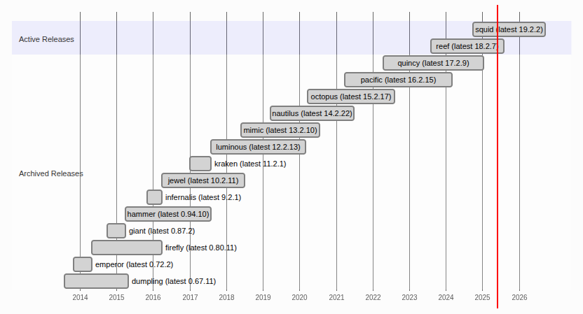
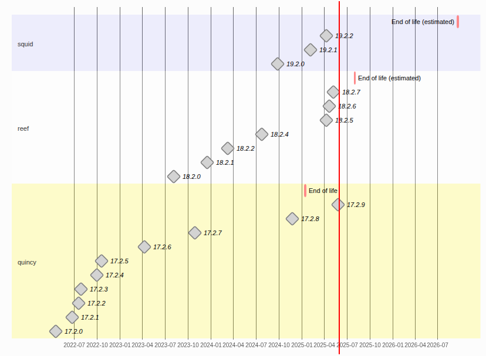

# ceph upgrade

Cephadm can safely upgrade Ceph from one point release to the next. For example, you can upgrade from v19.2.1 (the first Octopus release) to the next point release, v19.2.2.

The automated upgrade process follows Ceph best practices. For example:

  - The upgrade order starts with managers, monitors, then other daemons.
  - Each daemon is restarted only after Ceph indicates that the cluster will remain available.

**Preparation and Prerequisites:**

  - **Review Release Notes:** Carefully read the release notes for the target Ceph version. Understand the breaking changes, new features, and any specific upgrade instructions.
  - **Backup:** Although Ceph is designed for resilience, it's crucial to have a backup strategy in place for critical data before any major upgrade.
  - **Health Check:** Ensure your Ceph cluster is in a HEALTH_OK state before starting the upgrade. Use the command ceph -s or ceph status to verify.
  - **Connectivity:** Verify that all nodes in your Ceph cluster are online and reachable.
  - **Upgrade Tools:** Ensure you have the necessary tools for your deployment method (e.g., cephadm, Ansible, Rook operator) updated to the latest version.
  - **Repository Configuration:** If you're using package managers, ensure your repositories are correctly configured for the target Ceph version.

**Setting Upgrade Flags (Recommended):**

Before starting the upgrade, it's generally recommended to set the following Ceph OSD flags to prevent unnecessary rebalancing and potential data movement during the upgrade:

    ceph osd set noout
    ceph osd set noscrub
    ceph osd set nodeep-scrub

Remember to unset these flags after the upgrade is complete:

    ceph osd unset noout
    ceph osd unset noscrub
    ceph osd unset nodeep-scrub

**Performing the Upgrade (General Order):**

The typical upgrade order for Ceph daemons is:

  - **Ceph Managers (Mgrs):** Upgrade the Manager daemons first. If you have multiple Managers (recommended for high availability), upgrade them one by one, ensuring the cluster remains healthy after each upgrade.
  - **Ceph Monitors (Mons):** Upgrade the Monitor daemons next, one at a time, ensuring quorum is maintained and the cluster remains healthy.
  - **Ceph OSDs (Object Storage Daemons):** Upgrade the OSD daemons. This is usually done in a rolling fashion, upgrading a few OSDs at a time and allowing the cluster to recover before proceeding.
  - **Ceph MDS (Metadata Servers) (if using CephFS):** If you are using CephFS, upgrade the MDS daemons after the OSDs. Like other daemons, upgrade them one by one or in small groups.
  - **Ceph RGW (RADOS Gateway) (if using Object Storage):** If you are using the Ceph Object Gateway, upgrade the RGW daemons after the OSDs.

**Post-Upgrade Tasks:**

  - **Verify Cluster Health:** After the upgrade is complete, ensure the cluster returns to a HEALTH_OK state using ceph -s or ceph status.
  - **Check Ceph Versions:** Verify that all daemons are running the expected new version using the ceph versions command.
  - **Unset Upgrade Flags:** If you set the noout, noscrub, and nodeep-scrub flags, remember to unset them.
  - **Test Functionality:** Thoroughly test your Ceph cluster to ensure all services (RBD, CephFS, RGW) are functioning correctly.
  - **Consider require-osd-release:** After a successful upgrade, consider setting the require-osd-release flag to the new Ceph release name. This ensures that all OSDs are running the new version and prevents older OSDs from joining the cluster without explicit approval.

---
**ceph release** 

---
**ceph release timeline**

---

## upgrade ceph with cephadm steps

Before you use cephadm to upgrade Ceph, verify that all hosts are currently online and that your cluster is healthy by running the following command:

    ceph -s

To upgrade to a specific release, run a command of the following form:

    ceph orch upgrade start --ceph-version <version>

For example, to upgrade to v16.2.6, run a command of the following form:

    ceph orch upgrade start --ceph-version 19.2.2
    ceph orch upgrade start --image quay.io/ceph/ceph:v19.2.2

Determine (1) whether an upgrade is in progress and (2) which version the cluster is upgrading to by running the following command:

    ceph orch upgrade status

During the upgrade, a progress bar is visible in the ceph status output. It looks like this:

    ceph -s

    [...]
      progress:
        Upgrade to docker.io/ceph/ceph:v19.2.2 (00h 20m 12s)
          [=======.....................] (time remaining: 01h 43m 31s)

Watch the cephadm log by running the following command:

    ceph -W cephadm

You can stop the upgrade process at any time by running the following command:

    ceph orch upgrade stop

This alert (`UPGRADE_FAILED_PULL`) means that Ceph was unable to pull the container image for the target version. This can happen if you specify a version or container image that does not exist (e.g. “1.2.3”), or if the container registry can not be reached by one or more hosts in the cluster.

To cancel the existing upgrade and to specify a different target version, run the following commands:

    ceph orch upgrade stop
    ceph orch upgrade start --ceph-version <version>

At this point, a Manager fail over should allow us to have the active Manager be one running the new version.

    ceph mgr fail

Verify the active Manager is now one running the new version. To complete the Manager upgrading:

    ceph orch upgrade start --image <new-image-name> --daemon-types mgr

You should now have all your Manager daemons on the new version and be able to specify the limiting parameters for the rest of the upgrade.

