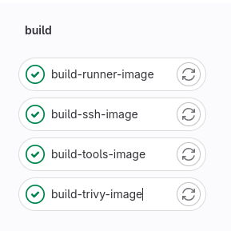
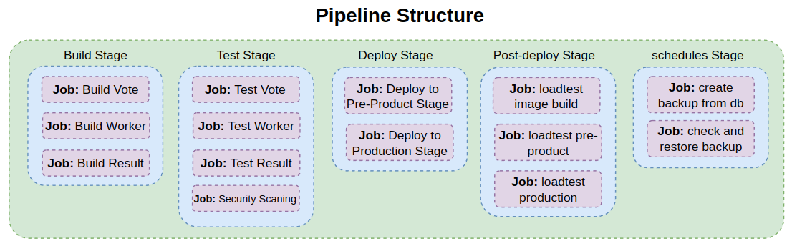

# This directory is for GitLab CI/CD learning
#
### [Step 1:](repository-server) Install and configure repository server

#
### [Step 2:](runner-server) Install, configure, and register Gitlab runner  server

#
### [Step 3:](runner-images) Create GitLab Runner specific images

#
### [Step 4:](monorepo-voting-app) Create a sample monorepo microservice app pipeline

#
### [Step 5:](multirepo-voting-app) Create a sample multi-repo microservice app pipeline

#
### [Step 6:](gitlab-ci-pipelines-exporter) Install and configuration gitlab ci pipeline exporter

