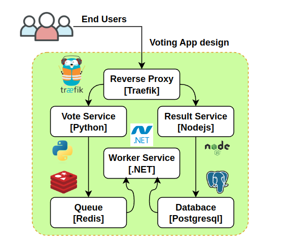
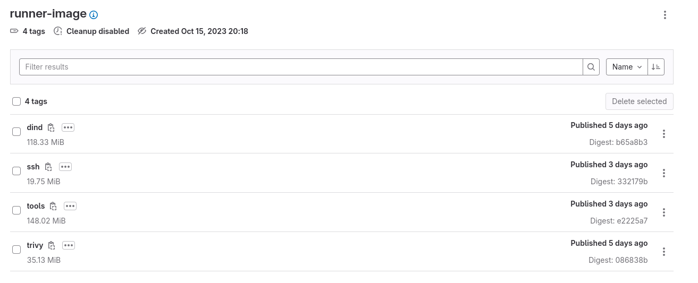
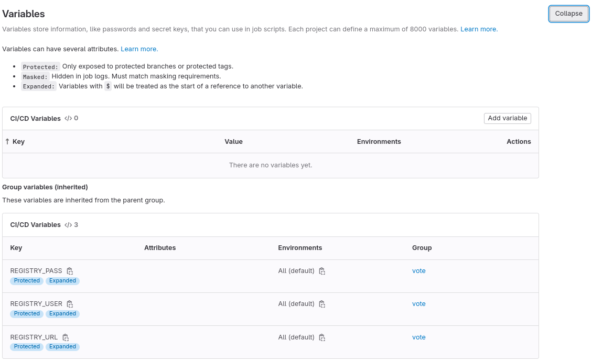
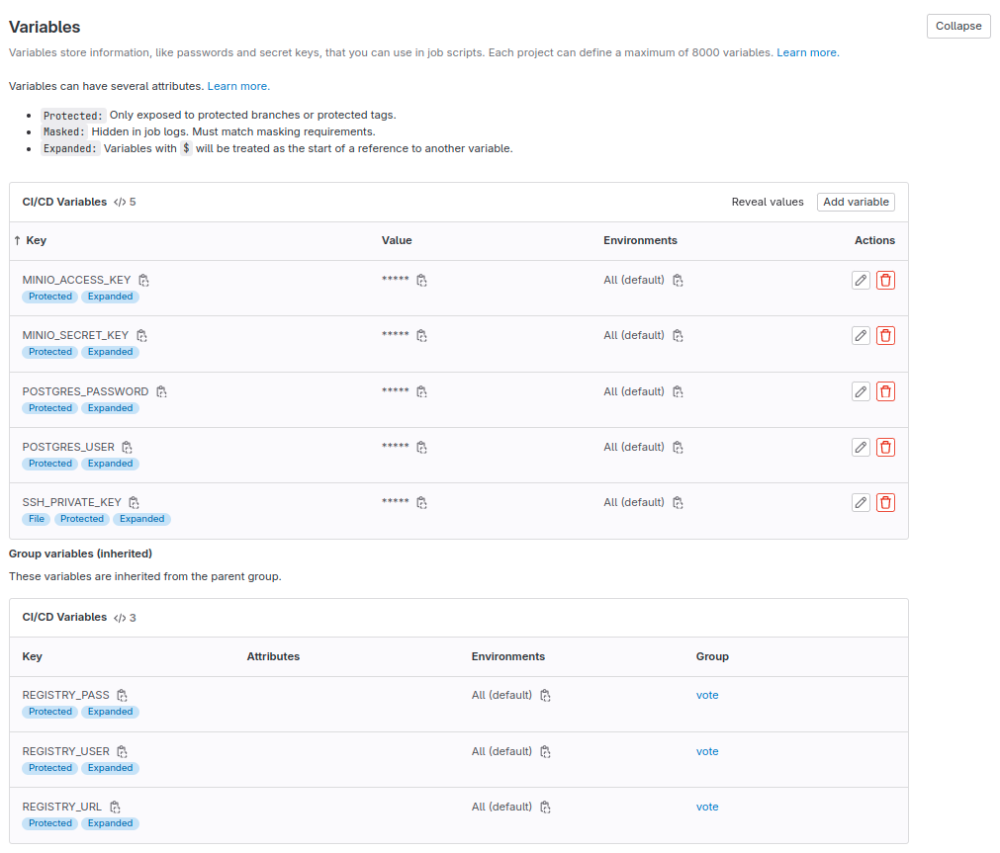
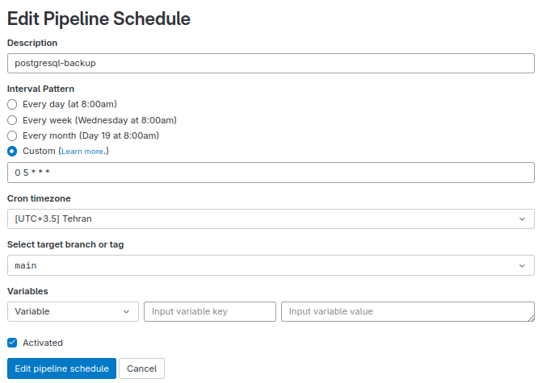
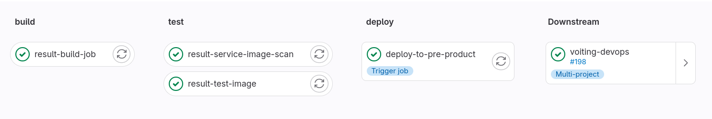
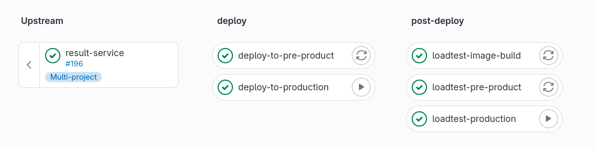
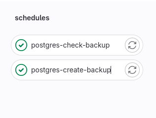

# Voting App Multi-repo Design and Detailed Configuration


This design requires a repository and Runner servers. The Runner service executes all jobs and updates results in the GitLab CI/CD section. The GitLab Runner executor uses Docker and runs the GitLab Runner process within a container.

## Voting app:
A simple distributed application running across multiple Docker containers.
The text clearly describes the project as a small and simple microservice application intended for learning GitLab CI/CD and deployment on a Docker infrastructure server.


## Monorepo and Multi-repo:


**What is a monorepo?** A monorepo is not a monolith. It’s a software development strategy in which a company's entire codebase is stored in a single repository.

**What is a multi-repo?** A multi-repo is a software development approach where different projects or components of a larger application are stored and managed as separate repositories. Each project or component has its own version control repository, allowing teams to work on them independently. This approach contrasts with a monorepo, where all code is stored in a single repository. Multi-repo setups are often used to maintain clear boundaries between projects, enabling teams to work autonomously on different parts of a system while also potentially reducing conflicts that might arise when making changes.

**Note:** This project contains the voting app multi-repo.
create vote, worker, result, and vote-devops project on gitlab instance from [voting-app](https://github.com/dockersamples/example-voting-app) repository.

## Project Structure:
```bash
.
├── images
│   ├── environment-component-detail.png
│   ├── final-pipeline-structure.png
│   ├── gitlab-microservice-protected-variables.png
│   ├── gitlab-pipeline-schedule.png
│   ├── gitlab-protected-variables.png
│   ├── monorepo-vs-multi-repo.png
│   ├── Pipeline-Structure.png
│   ├── repository-and-runner-design.png
│   ├── runner-image-pipeline.png
│   ├── runner-image-tags.png
│   ├── schedules-pipeline.png
│   └── voting-app-design.png
├── ReadMe.md
├── result-service
│   ├── docker-compose.test.yml
│   ├── Dockerfile
│   ├── package.json
│   ├── package-lock.json
│   ├── server.js
│   ├── tests
│   │   ├── Dockerfile
│   │   ├── render.js
│   │   └── tests.sh
│   └── views
│       ├── angular.min.js
│       ├── app.js
│       ├── index.html
│       ├── socket.io.js
│       └── stylesheets
│           └── style.css
├── voiting-devops
│   ├── compose.yml
│   ├── psql-test
│   │   └── psql-test.sh
│   └── seed-data
│       ├── Dockerfile
│       └── make-data.py
├── vote-service
│   ├── app.py
│   ├── Dockerfile
│   ├── requirements.txt
│   ├── static
│   │   └── stylesheets
│   │       └── style.css
│   └── templates
│       └── index.html
└── worker-service
    ├── Dockerfile
    ├── Program.cs
    └── Worker.csproj

13 directories, 38 files
```

## Gitlab cicd map and definitions:
The first step involves creating a design for the CI/CD process and pipeline structure.


#
Global keywords that configure pipeline behavior:

- **default**	Custom default values for job keywords.
- **include**	Import configuration from other YAML files.
- **stages**	The names and order of the pipeline stages.
- **variables**	Define CI/CD variables for all job in the pipeline.
- **workflow**	Control what types of pipeline run.

#
**stages:** Use stages to define stages that contain groups of jobs. Use stage in a job to configure the job to run in a specific stage.

##### For example, we need six stages to build, test, and deploy the voting app.
```bash
stages:
  - release
  - build
  - test
  - deploy
  - post-deploy
  - schedules
```
  - **release**: For creating the voting app release.
  - **build**: For building all service images.
  - **test**:  For testing services after building and scanning containers.
  - **deploy**: For deploying the application to multiple environments.
  - **post-deploy**: For conducting load tests and other tasks after deploying the app.
  - **schedules**: For running periodic jobs after deployment, such as backups.

#
**default:** You can set global defaults for some keywords. Each default keyword is copied to every job that doesn’t already have it defined. If the job already has a keyword defined, that default is not used.

***Possible inputs:*** These keywords can have custom defaults:

- after_script
- artifacts
- before_script
- cache
- hooks
- id_tokens
- image
- interruptible
- retry
- services
- tags
- timeout

### On Microservice project for example result-service:

##### For example, we always need to log-in to the registry and set the default image for all jobs. In this case, the repository is outside of the GitLab instance.
```bash
default:
  image: reg.mecan.ir/vote/runner-image:dind
  before_script:
    - docker login -u ${REGISTRY_USER} -p ${REGISTRY_PASS} ${REGISTRY_URL}
```
We can override this option per job and disable the default for each job.
In this configuration, the GitLab CI token is used to authenticate and log-in to the GitLab registry.

**Pipeline efficiency:**
It looks like you're suggesting a strategy for pipeline efficiency, recommending the creation and utilization of runner jobs images locally, using the same server for the registry and code repository, and having a runner server near the repository server.



**Gitlab predefined variables:** In GitLab CI/CD, predefined variables are environmental variables that GitLab automatically sets for every pipeline and job. These variables provide useful information about the pipeline, runner, and repository, among other things. You can use predefined variables in your GitLab CI/CD configuration without having to define them yourself.

**CI_COMMIT_SHORT_SHA:** The first eight characters of CI_COMMIT_SHA.

#
**variables**: Use variables to define CI/CD variables for jobs.
If you define variables as a global keyword, it behaves like default variables for all jobs. Each variable is copied to every job configuration when the pipeline is created. If the job already has that variable defined, the job-level variable takes precedence.

Variables defined at the global-level cannot be used as inputs for other global keywords like include. These variables can only be used at the job-level, in script, before_script, and after_script sections, as well as inputs in some job keywords like rules.

***Possible inputs:*** Variable name and value pairs:

The name can use only numbers, letters, and underscores (_). In some shells, the first character must be a letter. The value must be a string.

##### In this section, set the variables in the global config for usage in all jobs in the pipeline.
```bash
variables:
  IMAGE_PATH: ${REGISTRY_URL}/voting-service
  VERSION: v1.0.1
```

#### Protected variables:

set protected variable in **Project ⇒ Settings ⇒ CI/CD ⇒ Variables**
```bash
# Group variables (inherited)
REGISTRY_PASS
REGISTRY_USER
REGISTRY_URL
```


#
**before_script:** Use before_script to define an array of commands that should run before each job’s script commands, but after artifacts are restored.

**script:** Use script to specify commands for the runner to execute. All jobs except trigger jobs require a script keyword.

**after_script:** Use after_script to define an array of commands that run after each job, including failed jobs.

**retry:** Use retry to configure how many times a job is retried if it fails. If not defined, defaults to 0 and jobs do not retry. When a job fails, the job is processed up to two more times, until it succeeds or reaches the maximum number of retries.

**only / except:** You can use only and except to control when to add jobs to pipelines.
- Use only to define when a job runs.
- Use except to define when a job does not run.


##### You want to specify a section specifically for building the "result-service" Docker image and pushing it to the registry.
```bash
result-build-job:
  stage: build
  script:
    - docker build -t ${IMAGE_PATH}/result:$CI_COMMIT_SHORT_SHA .
    - docker push ${IMAGE_PATH}/result:$CI_COMMIT_SHORT_SHA
  retry: 2
```
In this configuration, a job is created and executed whenever code is pushed to the repository. However, if the job is triggered by a GitLab schedule, it does not run this job.

#
**needs:** Use needs to execute jobs out-of-order. Relationships between jobs that use needs can be visualized as a directed acyclic graph. You can ignore stage ordering and run some jobs without waiting for others to complete. Jobs in multiple stages can run concurrently.

##### You want to specify a section specifically for testing the "result-service" Docker image, tag image to new tag and pushing it to the registry.
```bash
result-test-image:
  stage: test
  needs: ["result-build-job"]
  script:
    - docker pull ${IMAGE_PATH}/result:$CI_COMMIT_SHORT_SHA
    - echo "result image test"
    - docker tag ${IMAGE_PATH}/result:$CI_COMMIT_SHORT_SHA ${IMAGE_PATH}/result:${VERSION}
    - docker push ${IMAGE_PATH}/result:${VERSION}
  retry: 2
```

#
**trivy:** Trivy is the most popular open source security scanner, reliable, fast, and easy to use. Use Trivy to find vulnerabilities & IaC misconfigurations, SBOM discovery, Cloud scanning, Kubernetes security risks,and more.

***Targets (what Trivy can scan):***
  - Container Image
  - Filesystem
  - Git Repository (remote)
  - Virtual Machine Image
  - Kubernetes
  - AWS

***Scanners (what Trivy can find there):***
  - OS packages and software dependencies in use (SBOM)
  - Known vulnerabilities (CVEs)
  - IaC issues and misconfigurations
  - Sensitive information and secrets
  - Software licenses


**variables:** Use variables to define CI/CD variables for jobs. If you define variables as a global keyword, it behaves like default variables for all jobs. Each variable is copied to every job configuration when the pipeline is created. If the job already has that variable defined, the job-level variable takes precedence. Variables defined at the global-level cannot be used as inputs for other global keywords like include. These variables can only be used at the job-level, in script, before_script, and after_script sections, as well as inputs in some job keywords like rules.

**cache:** Use cache to specify a list of files and directories to cache between jobs. You can only use paths that are in the local working copy.
***Caches are:***
  - Shared between pipelines and jobs.
  - By default, not shared between protected and unprotected branches.
  - Restored before artifacts.
  - Limited to a maximum of four different caches.
***You can disable caching for specific jobs, for example to override:***
  - A default cache defined with default.
  - The configuration for a job added with include.

**artifacts:** Use artifacts to specify which files to save as job artifacts. Job artifacts are a list of files and directories that are attached to the job when it succeeds, fails, or always.
The artifacts are sent to GitLab after the job finishes. They are available for download in the GitLab UI if the size is smaller than the maximum artifact size.
By default, jobs in later stages automatically download all the artifacts created by jobs in earlier stages. You can control artifact download behavior in jobs with dependencies.
When using the needs keyword, jobs can only download artifacts from the jobs defined in the needs configuration. Job artifacts are only collected for successful jobs by default, and artifacts are restored after caches.

##### In this section, scan result-service images with Trivy. If critical vulnerabilities are found, it will break the pipeline and prevent the application from being deployed to the environments.
```bash
result-service-image-scan:
  stage: test
  image: reg.mecan.ir/vote/runner-image:trivy
  needs: ["result-test-image"]
  variables:
    RESULT_IMAGE: ${IMAGE_PATH}/result:${VERSION}
  script:
    - trivy --exit-code 0 --cache-dir .trivycache/ --no-progress --format template --template "@/tmp/trivy-gitlab.tpl" -o gl-container-scanning-report.json $RESULT_IMAGE
  cache:
    paths:
      - /cache/.trivycache/
  artifacts:
    reports:
      container_scanning: gl-container-scanning-report.json
  retry: 2
```

#
##### In this section, deploy the application to the pre-production environment. Override the default configuration and use the specific image. Create the environment and deploy the job to this environment.

```bash
deploy-to-pre-product:
  stage: deploy
  needs: ["result-service-image-scan"]
  trigger:
    project: vote/voiting-devops
    branch: main
```

#
### On `voting-devops` project pipeline:

#
#### Environment Component Detail:
In the design, deploy these components per environment.


#
**variables**: Use variables to define CI/CD variables for jobs.
If you define variables as a global keyword, it behaves like default variables for all jobs. Each variable is copied to every job configuration when the pipeline is created. If the job already has that variable defined, the job-level variable takes precedence.

Variables defined at the global-level cannot be used as inputs for other global keywords like include. These variables can only be used at the job-level, in script, before_script, and after_script sections, as well as inputs in some job keywords like rules.

***Possible inputs:*** Variable name and value pairs:

The name can use only numbers, letters, and underscores (_). In some shells, the first character must be a letter. The value must be a string.

##### In this section, set the variables in the global config for usage in all jobs in the pipeline.
```bash
variables:
  SSH_PORT: 8090
  SSH_USER: root
  IMAGE_PATH: ${REGISTRY_URL}/voting-service
  SERVICE_PATH: /opt/services/vote-services
  BACKUP_PATH: /opt/services/BACKUP
  VERSION: v1.0.1
```

#### Protected variables:

set protected variable in **Project ⇒ Settings ⇒ CI/CD ⇒ Variables**
```bash
MINIO_ACCESS_KEY
MINIO_SECRET_KEY
POSTGRES_PASSWORD
POSTGRES_USER
SSH_PRIVATE_KEY

# Group variables (inherited)
REGISTRY_PASS
REGISTRY_USER
REGISTRY_URL
```


#
**environment:** Use environment to define the environment that a job deploys to.

**Split long commands:** You can split long commands into multiline commands to improve readability with | (literal) and > (folded) YAML multiline block scalar indicators.

**before_script:** Use before_script to define an array of commands that should run before each job’s script commands, but after artifacts are restored.

**script:** Use script to specify commands for the runner to execute. All jobs except trigger jobs require a script keyword.

**after_script:** Use after_script to define an array of commands that run after each job, including failed jobs.

**retry:** Use retry to configure how many times a job is retried if it fails. If not defined, defaults to 0 and jobs do not retry. When a job fails, the job is processed up to two more times, until it succeeds or reaches the maximum number of retries.

**only / except:** You can use only and except to control when to add jobs to pipelines.
- Use only to define when a job runs.
- Use except to define when a job does not run.

##### In this section, deploy the application to the pre-production environment. Override the default configuration and use the specific image. Create the environment and deploy the job to this environment. We use a single long command instead of multiple short commands.

```bash
deploy-to-pre-product:
  stage: deploy
  image: reg.mecan.ir/vote/runner-image:dind
  variables:
    DOMAIN: pre-product.mecan.ir
    SERVER_NAME: pre-product.mecan.ir
    HOSTNAME: pre-product
  before_script:
    - 'command -v ssh-agent >/dev/null || ( apk add --update openssh )'
    - eval $(ssh-agent -s)
    - chmod 400 "$SSH_PRIVATE_KEY"
    - ssh-add "$SSH_PRIVATE_KEY"
    - mkdir -p ~/.ssh
    - chmod 700 ~/.ssh
  script:
    - |
      # Create directory if not exist
      ssh -o StrictHostKeyChecking=no -p ${SSH_PORT} ${SSH_USER}@${SERVER_NAME} "
      [ -d ${SERVICE_PATH} ] || mkdir -p ${SERVICE_PATH}
      "
      # change env file
      sed -i "s/FQDN/${DOMAIN}/g" .env
      sed -i "s/SERVER_NAME/${HOSTNAME}/g" .env
      sed -i "s/PIPELINE_ID/${VERSION}/g" .env
      # move compose and env file to server
      scp -o StrictHostKeyChecking=no -P${SSH_PORT} .env ${SSH_USER}@${SERVER_NAME}:${SERVICE_PATH}/
      scp -o StrictHostKeyChecking=no -P${SSH_PORT} compose.yml ${SSH_USER}@${SERVER_NAME}:${SERVICE_PATH}/
      # deploy service on server
      ssh -o StrictHostKeyChecking=no -p ${SSH_PORT} ${SSH_USER}@${SERVER_NAME} "
      docker login -u ${REGISTRY_USER} -p ${REGISTRY_PASS} ${REGISTRY_URL}
      cd ${SERVICE_PATH}
      docker compose pull
      docker compose up -d
      "
  environment:
    name: pre-product
    url: https://vote.$DOMAIN
  except:
    - schedules
```

#
**when:** Use when to configure the conditions for when jobs run. If not defined in a job, the default value is when: on_success.

***Possible inputs:***
- on_success (default): Run the job only when no jobs in earlier stages fail or have allow_failure: true.
- on_failure: Run the job only when at least one job in an earlier stage fails. A job in an earlier stage with allow_failure: true is always considered successful.
- never: Don’t run the job regardless of the status of jobs in earlier stages. Can only be used in a rules section or workflow: rules.
- always: Run the job regardless of the status of jobs in earlier stages. Can also be used in workflow:rules.
- manual: Run the job only when triggered manually.
- delayed: Delay the execution of a job for a specified duration.

##### In this section, the job is similar to the pre-production job. The variables are different, and deployment to the production server is triggered manually. This is due to the need for state checks and specific timing requirements for production deployment.
```bash
deploy-to-production:
  stage: deploy
  image: reg.mecan.ir/vote/runner-image:ssh
  variables:
    DOMAIN: production.mecan.ir
    SERVER_NAME: production.mecan.ir
    HOSTNAME: production
  before_script:
    - 'command -v ssh-agent >/dev/null || ( apk add --update openssh )'
    - eval $(ssh-agent -s)
    - chmod 400 "$SSH_PRIVATE_KEY"
    - ssh-add "$SSH_PRIVATE_KEY"
    - mkdir -p ~/.ssh
    - chmod 700 ~/.ssh
  script:
    - |
      # Create directory if not exist
      ssh -o StrictHostKeyChecking=no -p ${SSH_PORT} ${SSH_USER}@${SERVER_NAME} "
      [ -d ${SERVICE_PATH} ] || mkdir -p ${SERVICE_PATH}
      "
      # change env file
      sed -i "s/FQDN/${DOMAIN}/g" .env
      sed -i "s/SERVER_NAME/${HOSTNAME}/g" .env
      sed -i "s/PIPELINE_ID/${VERSION}/g" .env
      # move compose and env file to server
      scp -o StrictHostKeyChecking=no -P${SSH_PORT} .env ${SSH_USER}@${SERVER_NAME}:${SERVICE_PATH}/
      scp -o StrictHostKeyChecking=no -P${SSH_PORT} compose.yml ${SSH_USER}@${SERVER_NAME}:${SERVICE_PATH}/
      # deploy service on server
      ssh -o StrictHostKeyChecking=no -p ${SSH_PORT} ${SSH_USER}@${SERVER_NAME} "
      docker login -u ${REGISTRY_USER} -p ${REGISTRY_PASS} ${REGISTRY_URL}
      cd ${SERVICE_PATH}
      docker compose pull
      docker compose up -d
      "
  environment:
    name: production
    url: https://vote.$DOMAIN
  when: manual
  except:
    - schedules
```

#
**rules:** Use rules to include or exclude jobs in pipelines.Rules are evaluated when the pipeline is created, and evaluated in order until the first match. When a match is found, the job is either included or excluded from the pipeline, depending on the configuration.

***rules accepts an array of rules defined with:***
  - if
  - changes
  - exists
  - allow_failure
  - variables
  - when

**release:** Use release to create a release.

**inherit:** Use inherit to control inheritance of default keywords and variables.

##### In this section, a release is created based on a Git tag. This job runs exclusively when a tag is created.
```bash
release_job:
  image: registry.gitlab.com/gitlab-org/release-cli:latest
  stage: release
  rules:
    - if: $CI_COMMIT_TAG
  inherit:
    default: false
  script:
    - echo "running release_job"
  release:
    tag_name: '$CI_COMMIT_TAG'
    description: '$CI_COMMIT_TAG'
```

#
##### In this section, a job is created to build the load test image. This job runs when files and directories within the `seed-data` path are modified and not triggered by a schedule.
```bash
loadtest-image-build:
  stage: post-deploy
  image: reg.mecan.ir/vote/runner-image:dind
  variables:
    DOMAIN: pre-product.mecan.ir
    SERVER_NAME: pre-product.mecan.ir
    HOSTNAME: pre-product
  script:
    - cd seed-data
    - docker build -t ${IMAGE_PATH}/seed-data:main .
    - docker push ${IMAGE_PATH}/seed-data:main
  rules:
    - if: $CI_PIPELINE_SOURCE != "schedule"
      changes:
        - seed-data/*
```

#
##### In this job, a load test service is created and load is generated on the pre-production environment.
```bash
loadtest-pre-product:
  stage: post-deploy
  image: reg.mecan.ir/vote/runner-image:dind
  variables:
    DOMAIN: pre-product.mecan.ir
    HOSTNAME: pre-product
    DOCKER_RUN: docker run -id --name loadtest-${HOSTNAME} ${IMAGE_PATH}/seed-data:main bash
    DOCKER_EXEC: docker exec -i loadtest-${HOSTNAME}
  inherit:
    default: false
  script:
    - ${DOCKER_RUN}
    - ${DOCKER_EXEC} python make-data.py
    - ${DOCKER_EXEC} ab -n 100 -c 50 -p posta -T "application/x-www-form-urlencoded" https://vote.${DOMAIN}/
    - ${DOCKER_EXEC} ab -n 1000 -c 50 -p postb -T "application/x-www-form-urlencoded" https://vote.${DOMAIN}/
  after_script:
    - docker rm -f loadtest-${HOSTNAME}
  except:
    - schedules
```

#
##### In this section, the job is similar to the loadtest-pre-production job. The variables are different, and load testing on the production server is triggered manually. This is due to the need for state checks and specific timing requirements for production deployment.
```bash
loadtest-production:
  stage: post-deploy
  image: reg.mecan.ir/vote/runner-image:dind
  variables:
    DOMAIN: production.mecan.ir
    HOSTNAME: production
    DOCKER_RUN: docker run -id --name loadtest-${HOSTNAME} ${IMAGE_PATH}/seed-data:main bash
    DOCKER_EXEC: docker exec -i loadtest-${HOSTNAME}
  inherit:
    default: false
  script:
    - ${DOCKER_RUN}
    - ${DOCKER_EXEC} python make-data.py
    - ${DOCKER_EXEC} ab -n 100 -c 50 -p posta -T "application/x-www-form-urlencoded" https://vote.${DOMAIN}/
    - ${DOCKER_EXEC} ab -n 10000 -c 50 -p postb -T "application/x-www-form-urlencoded" https://vote.${DOMAIN}/
  after_script:
    - docker rm -f loadtest-${HOSTNAME}
  when: manual
  except:
    - schedules
```

#
##### In this section, a backup is created from the production PostgreSQL database and transferred to Minio object storage. The process involves SSHing into the production server to generate the backup, moving the backup to the runner container, and subsequently pushing it to the object storage. This job is triggered only by scheduled runs.
```bash
postgres-create-backup:
  stage: schedules
  image: reg.mecan.ir/vote/runner-image:ssh
  variables:
    DOMAIN: production.mecan.ir
    SERVER_NAME: production.mecan.ir
    HOSTNAME: production
    MINIO_ENDPOINT: https://io.repository.mecan.ir
    MINIO_ALIAS_NAME: MeCan
    MINIO_API_VERSION: S3v4
    MINIO_BUCKET: voting-app-backup
  before_script:
    - 'command -v ssh-agent >/dev/null || ( apk add --update openssh )'
    - eval $(ssh-agent -s)
    - chmod 400 "$SSH_PRIVATE_KEY"
    - ssh-add "$SSH_PRIVATE_KEY"
    - mkdir -p ~/.ssh
    - chmod 700 ~/.ssh
    - mc alias set ${MINIO_ALIAS_NAME} ${MINIO_ENDPOINT} ${MINIO_ACCESS_KEY} ${MINIO_SECRET_KEY} --api ${MINIO_API_VERSION}
    - mc alias list
    - mc --version
  script:
    - |
      ssh -o StrictHostKeyChecking=no -p ${SSH_PORT} ${SSH_USER}@${SERVER_NAME} "
      # Create directory if not exist
      [ -d ${BACKUP_PATH} ] || mkdir -p ${BACKUP_PATH}
      cd ${BACKUP_PATH}

      # Create postgresql backup
      docker exec -i -e PGPASSWORD=${POSTGRES_PASSWORD} postgresql-production /usr/local/bin/pg_dumpall --host=localhost --port=5432 --username=${POSTGRES_USER} | gzip -9 > postgres_backup_${CI_PIPELINE_ID}.sql.gz
      "
      # move backup file to runner
      scp -o StrictHostKeyChecking=no -P${SSH_PORT} ${SSH_USER}@${SERVER_NAME}:${BACKUP_PATH}/postgres_backup_${CI_PIPELINE_ID}.sql.gz .
      mc cp --continue --recursive postgres_backup_${CI_PIPELINE_ID}.sql.gz ${MINIO_ALIAS_NAME}/${MINIO_BUCKET}/
  rules:
    - if: $CI_PIPELINE_SOURCE == "schedule"
```

#
**create restore script:**
```bash
cat psql-test/psql-test.sh
#!/bin/bash
PGPASSWORD=${POSTGRES_PASSWORD} psql --username=${POSTGRES_USER} -f /opt/psql-test/postgres_backup_*
PGPASSWORD=${POSTGRES_PASSWORD} psql --username=${POSTGRES_USER} -t -c "SELECT COUNT(*) FROM votes" | sed -n '1 p' | cut -d ' ' -f2 > /opt/psql-test/restore.log
```

##### In this section, a job is created to restore and validate the production PostgreSQL backup. The job involves downloading the backup from the object storage, extracting the data, creating a PostgreSQL container, restoring the backup, and executing queries on PostgreSQL to verify the restore state. This job is triggered only by scheduled runs.


```bash
postgres-check-backup:
  stage: schedules
  image: reg.mecan.ir/vote/runner-image:dind
  needs: ["postgres-create-backup"]
  variables:
    POSTGRES_USER: ${POSTGRES_USER}
    POSTGRES_PASSWORD: ${POSTGRES_PASSWORD}
    MINIO_ENDPOINT: https://io.repository.mecan.ir
    MINIO_ALIAS_NAME: MeCan
    MINIO_API_VERSION: S3v4
    MINIO_BUCKET: voting-app-backup
  before_script:
    - apk add --no-cache ca-certificates
    - wget https://dl.minio.io/client/mc/release/linux-amd64/mc
    - chmod +x mc
    - mv mc /usr/local/bin/
    - mc --version
    - mc alias set ${MINIO_ALIAS_NAME} ${MINIO_ENDPOINT} ${MINIO_ACCESS_KEY} ${MINIO_SECRET_KEY} --api ${MINIO_API_VERSION}
    - mc alias list
  script:
    - mc cp --continue --recursive ${MINIO_ALIAS_NAME}/${MINIO_BUCKET}/postgres_backup_${CI_PIPELINE_ID}.sql.gz .
    - gunzip postgres_backup_${CI_PIPELINE_ID}.sql.gz
    - cp postgres_backup_${CI_PIPELINE_ID}.sql psql-test
    - docker run -d --name psql-test -e POSTGRES_USER=${POSTGRES_USER} -e POSTGRES_PASSWORD=${POSTGRES_PASSWORD} postgres:15-alpine
    - docker cp psql-test psql-test:/opt
    - sleep 10
    - cat psql-test/psql-test.sh | docker exec -i psql-test bash
    - docker cp psql-test:/opt/psql-test/restore.log .
  artifacts:
    paths:
    - ./restore.log
    expire_in: 1 week
  after_script:
    - docker rm -f psql-test
  rules:
    - if: $CI_PIPELINE_SOURCE == "schedule"
```

#
#### Create Gitlab schedule:
Use scheduled pipelines to run GitLab CI/CD pipelines at regular intervals.

Add a pipeline schedule:
To add a pipeline schedule:
1. On the left sidebar, select Search or go to and find your project.
2. Select Build > Pipeline schedules.
3. Select New schedule and fill in the form.
  - Interval Pattern: Select one of the preconfigured intervals, or enter a custom interval in cron notation. You can use any cron value, but scheduled pipelines cannot run more frequently than the instance’s maximum scheduled pipeline frequency.
  - Target branch or tag: Select the branch or tag for the pipeline.
  - Variables: Add any number of CI/CD variables to the schedule. These variables are available only when the scheduled pipeline runs, and not in any other pipeline run.
If the project already has the maximum number of pipeline schedules, you must delete unused schedules before you can add another.

In this case, create a backup and restore it to the staging node using a scheduled GitLab pipeline.


#
#### View the final pipeline structure in this picture:


