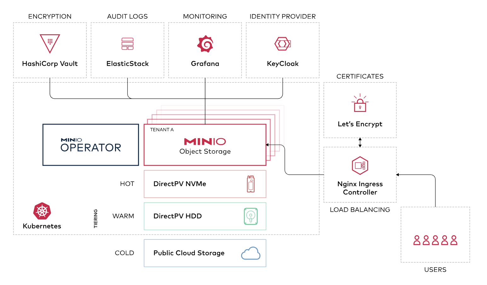

# Install and Config Repository Server

## Repository Server Design

The diagram below illustrates the relationship between these service on repository server:


### Prerequisites and resource management:

**1. Hardening OS**

**2. Install docker and docker-compose-plugin**
  To install the latest stable versions of Docker CLI, Docker Engine, and their dependencies:
```bash
#download the script
curl -fsSL https://get.docker.com -o install-docker.sh

#verify the script's content
cat install-docker.sh

#run the script either as root, or using sudo to perform the installation.
sudo sh install-docker.sh
```
**3. Create external networks:**
```bash
docker network create -o com.docker.network.bridge.name=web_net web_net
docker network create -o com.docker.network.bridge.name=app_net app_net
```

**Resource management**
Your repository server needs to have 8GB or more of available RAM and 4Core or more available CPU to run GitLab and other service.

## Traefik service setup and config:


#### Modify `.env` file before start Traefik service
```bash
cd traefik && cat .env
# Domain address
DOMAIN_ADDRESS=repository.mecan.ir
TRA_SUB=web

# ACME variables
ACME_EMAIL=cert@mecan.ir

# set restart policy
RESTART_POLICY=on-failure

#  web auth information.
#  how to generate password:
#  echo <TRAEFIK_WEB_PASSWROD> | htpasswd -s -n -i MeCan
WEB_AUTH_USER=MeCan
WEB_AUTH_PASS="<TRAEFIK_WEB_PASSWROD_ENCRIPT>"

# Hostname
HOSTNAME=repo-server
```

#### Start Traefik service with compose file
```bash
# Change directory
cd traefik

# syntax check compose file
docker compose config

# pull all images on compose service
docker compose pull

# run all services on compose file
docker compose up -d
```
check traefik dashbord:

`curl -I https://web.repository.mecan.ir`

## Minio service setup and config:



#### Modify `.env` file before start Minio service
```bash
cd minio && cat .env
# Domain address
DOMAIN_ADDRESS=repository.mecan.ir
MINIO_SUB1=object
MINIO_SUB2=io

# restart policy
RESTART_POLICY=unless-stopped

# Minio user and pass
MINIO_ROOT_USER=<MINIO_ACCESS_KEY>
MINIO_ROOT_PASSWORD=<MINIO_SECRET_KEY>

# Server Name
HOSTNAME=repo-server
```

#### Start Minio service with compose file
```bash
# Change directory
cd minio

# syntax check compose file
docker compose config

# pull all images on compose service
docker compose pull

# run all services on compose file
docker compose up -d
```
check Minio panel:

`curl -I https://object.repository.mecan.ir`

#### Create Minio Buckets from the CLI

Now, we’ll see how to do the same thing from the terminal window. Before we can do that, we must install the CLI client.
```bash
# Download the binary with:
sudo curl -o /usr/local/bin/mc https://dl.min.io/client/mc/release/linux-amd64/mc

# Give the file the proper executable permissions with:
sudo chmod +x /usr/local/bin/mc

# Verify the installation with the command:
mc --version
```

We now need to add the MinIO server with the command:
```bash
mc alias set myminio http://SERVER:9000 admin PASSWORD
```
Where SERVER is the domain or IP address of the hosting server and PASSWORD is the password you set for the admin user during the installation of MinIO.
You should see the following in the output:
```bash
Added `myminio` successfully
```

**For example:**
```bash
source minio/.env
mc alias set MeCan https://${MINIO_SUB2}.${DOMAIN_ADDRESS} ${MINIO_ROOT_USER} ${MINIO_ROOT_PASSWORD}

# You should see the following in the output:
Added `MeCan` successfully

# You can view a list of current buckets with the command:
mc ls MeCan
```

Let’s create a new bucket with the command:
```bash
mc mb MeCan/gitlab-backups
mc mb MeCan/gitlab-registries
mc mb MeCan/nexus-docker-blob
mc mb MeCan/nexus-apt-blob

# You should see the following in the output:
Bucket created successfully 'MeCan/gitlab-backups'.
Bucket created successfully 'MeCan/gitlab-registries'.
Bucket created successfully 'MeCan/nexus-docker-blob'.
Bucket created successfully 'MeCan/nexus-apt-blob'.

# You can view a list of current buckets with the command:
mc ls MeCan
```

Upload Files to the Bucket from the Command Line Let’s create a test file and upload it to our new tns-bucket2 bucket.
```bash
# First, create the test file with:
touch test

# Next, upload the file to the gitlab-backups with:
mc cp test MeCan/gitlab-backups

# The file should upload immediately. To verify it’s in the bucket, list the contents with:
mc ls MeCan/gitlab-backups

# You should see the following in the output:
0B STANDARD test

# delete test file from the gitlab-backups bucket
mc rm MeCan/gitlab-backups/test

# You should see the following in the output:
Removed `MeCan/gitlab-backups/test`.
```

## Nexus service setup and config:


#### Modify `.env` file before start Nexus service

```bash
cd nexus && cat .env
# Gitlab Domain
DOMAIN=mecan.ir
NEXUS_SUB_DOMAIN=repo
HUB_SUB_DOMAIN=hub

# Nexus image tag
NEXUS_IMAGE_TAG=3.59.0

# restart policy
RESTART_POLICY=unless-stopped

# Server Name
HOSTNAME=repo-server
```

#### Start Nexus service with compose file

```bash
# Change directory
cd nexus

# syntax check compose file
docker compose config

# pull all images on compose service
docker compose pull

# run all services on compose file
docker compose up -d
```
check Neuxs panel:

`curl -I https://repo.mecan.ir`

#### Configuration Nexus service with api and bash scripts

Modify the variable section on top of the script file:
```bash
# variable section
ADMIN_USERNAME="admin"
ADMIN_PASSWORD="<NEXUS_ADMIN_PASSWORD>"
NEXUS_URL="https://repo.mecan.ir"

REPO_USERNAME="repo"
REPO_PASSWORD="<NEXUS_REPO_PASSWORD>"
REPO_EMAIL="ahmad@MeCan.ir"


# Minio information
MINIO_ACCESS_KEY=<MINIO_ACCESS_KEY>
MINIO_SECRET_KEY=<MINIO_SECRET_KEY>
MINIO_ENDPOINT_URL=https://io.repository.mecan.ir
MINIO_BLOBSTORE_BUCKET_NAME=nexus-docker-blob

# blob store name
BLOB_STORE_NAME=docker
```

#### Bash script Nexus cofiguration steps:

1. Change bootstrap password with new admin password
2. Delete default maven repository
3. Delete default nuget repository
4. Enable anonymous access
5. Activate realms for docker login to registry
6. Create role for new user
7. Create new user for repository usage
8. Create docker blob store for docker repository on minio object storage
9. Create docker proxy repository for mirror registry
10. Create apt proxy for debian 12 main
11. Create apt proxy for debian 12 security
12. Check all settings

**Run script for nexus config with this command:**

```bash
# Change directory
cd nexus

# run bash script
bash ./nexus-setup-with-api.sh
```

#### After the Nexus setup is complete you can use for apt and docker mirror repository:

**Set mirror registry for docker service:**

```bash
# check and change docker configuration
cat /etc/docker/daemon.json
{
    "registry-mirrors": ["https://hub.mecan.ir"]
}

# restart docker service
systemctl restart docker
systemctl status docker
```

**Set apt mirror:**

```bash
# check and change apt configuration
rm -rf /etc/apt/sources.list.d/*
ls /etc/apt/sources.list.d/

# create apt repository
cat <<EOF > /etc/apt/sources.list.d/MeCan.list
deb https://repo.mecan.ir/repository/debian/ bookworm main
deb https://repo.mecan.ir/repository/debian/ bookworm-updates main
deb https://repo.mecan.ir/repository/debian/ bookworm-backports main
deb https://repo.mecan.ir/repository/debian-security/ bookworm-security main
EOF

# check repository file
cat /etc/apt/sources.list.d/MeCan.list

# update and upgrade debian 12
apt update
apt upgrade -y
```


## Gitlab service setup and config:


### Gitlab Sample Configuration:

- external urls
- initial default admin password
- configure a failed authentication
- smtp configuration
- nginx configuration
- disable unused service
- backup configuration
- gitlab registry configuration
- Configure Minio storage for the Backup Location
- Configure Minio storage for the Container Registry Backend


**block code for external urls:**
```
# Gitlab external url
external_url 'https://${GIT_DOMAIN}'
```

**block code for initial default admin password:**
```
# Change the initial default admin password
gitlab_rails['initial_root_password'] = "${GITLAB_ROOT_PASSWORD}"
gitlab_rails['display_initial_root_password'] = "false"
gitlab_rails['store_initial_root_password'] = "false"
```

**block code for Configure a failed authentication ban:**
```
# Configure a failed authentication ban
gitlab_rails['rack_attack_git_basic_auth'] = {
  'enabled' => false,
  'ip_whitelist' => ["127.0.0.1"],
  'maxretry' => 10,
  'findtime' => 60,
  'bantime' => 3600
}
```

**block code for smtp configuration:**
```
# ZOHO SMTP configuration
gitlab_rails['smtp_enable'] = true
gitlab_rails['smtp_address'] = "${SMTP_ADDRESS}"
gitlab_rails['smtp_port'] = "${SMTP_PORT}"
gitlab_rails['smtp_authentication'] = "plain"
gitlab_rails['smtp_enable_starttls_auto'] = true
gitlab_rails['smtp_user_name'] = "${SMTP_USER}"
gitlab_rails['smtp_password'] = "${SMTP_PASS}"
gitlab_rails['smtp_domain'] = "${SMTP_ADDRESS}"
gitlab_rails['gitlab_email_from'] = "${SMTP_USER}"
```

**block code for nginx configuration:**
```
# Nginx Configuration
nginx['client_max_body_size'] = '10240m'
nginx['gzip_enabled'] = true
nginx['listen_port'] = 80
nginx['listen_https'] = false
nginx['proxy_cache'] = 'gitlab'
nginx['http2_enabled'] = true
nginx['listen_port'] = 80
nginx['listen_https'] = false
nginx['http2_enabled'] = false
nginx['proxy_set_headers'] = {
  "Host" => "$$http_host",
  "X-Real-IP" => "$$remote_addr",
  "X-Forwarded-For" => "$$proxy_add_x_forwarded_for",
  "X-Forwarded-Proto" => "https",
  "X-Forwarded-Ssl" => "on"
}
```

**block code for disable unused service on gitlab instance:**
```bash
# Disable unuse services
prometheus['enable'] = false
grafana['enable'] = false
alertmanager['enable'] = false
pgbouncer_exporter['enable'] = false
puma['exporter_enabled'] = false
gitlab_exporter['enable'] = false
node_exporter['enable'] = false
sidekiq['metrics_enabled'] = false
redis_exporter['enable'] = false
postgres_exporter['enable'] = false
```

**block code for backup configuration:**
```bash
# gitlab backup config
gitlab_rails['manage_backup_path'] = true
gitlab_rails['backup_path'] = "/var/opt/gitlab/backups"
gitlab_rails['backup_archive_permissions'] = 0644
gitlab_rails['backup_keep_time'] = 604800
gitlab_rails['env'] = {"SKIP" => "registry"}
```

**block code for gitlab registry configuration:**
```bash
# Gitlab registry config
registry_external_url 'https://${RIGISTRY_SUB}.${DOMAIN_ADDRESS}'
registry_nginx['listen_port'] = 5100
registry_nginx['listen_https'] = false
registry_nginx['proxy_set_headers'] = {
  "Host" => "$$http_host",
  "X-Real-IP" => "$$remote_addr",
  "X-Forwarded-For" => "$$proxy_add_x_forwarded_for",
  "X-Forwarded-Proto" => "https",
  "X-Forwarded-Ssl" => "on"
}
```

**Configure Minio storage for the Backup Location**
```bash
gitlab_rails['backup_upload_connection'] = {
  'provider' => 'AWS',
  'region' => 'eu-west-1',
  'aws_access_key_id' => '${MINIO_ACCESS_KEY}',
  'aws_secret_access_key' => '${MINIO_SECRET_KEY}',
  'endpoint' => '${MINIO_ENDPOINT_URL}',
  'path_style' => true
}
gitlab_rails['backup_upload_remote_directory'] = '${MINIO_BACKUP_BUCKET_NAME}'
```

**Configure Minio storage for the Container Registry Backend**
```bash
registry['storage'] = {
    's3' => {
      'accesskey' => '${MINIO_ACCESS_KEY}',
      'secretkey' => '${MINIO_SECRET_KEY}',
      'bucket' => '${MINIO_REGISTRY_BUCKET_NAME}',
      'region' => 'us-east-1',
      'regionendpoint' => '${MINIO_ENDPOINT_URL}'
    }
  }
```

#### Configure SMTP For Outbound Emails:
**Check the [GitLab official documentation](https://docs.gitlab.com/omnibus/settings/smtp.html) to get more examples.**

Run the following command to have the changes take effect:
```
docker restart <CONTAINER_NAME>
```
Test if GitLab sends emails properly using the Rails console by executing the following commands. Replace USERNAME with your Gmail account username.
```
gitlab-rails console
irb(main):003:0> Notify.test_email('USERNAME@gmail.com', 'Message Subject', 'Message Body').deliver_now
```

#### [Container Registry garbage collection](https://git.schb.ir/help/administration/packages/container_registry#container-registry-garbage-collection)


### Modify `gitlab/.env` file before start Gitlab Omnibus
```bash
cd gitlab && cat .env
# Gitlab Domain
DOMAIN_ADDRESS=mecan.ir
GIT_SUB=git
RIGISTRY_SUB=reg
PAGES_SUB=pages
GIT_DOMAIN=${GIT_SUB}.${DOMAIN_ADDRESS}

# GitLab image tag
GITLAB_IMAGE_TAG=16.4.0-ce.0

# Gitlab root password
GITLAB_ROOT_PASSWORD=<GITLAB_ROOT_PASSWORD>

# SMTP Server Configuration
SMTP_USER=<MAILBOX_USERNAME>
SMTP_PASS=<MAILBOX_PASSWORD>
SMTP_ADDRESS=<MAILBOX_DOMAIN_ADDRESS>
SMTP_PORT=<MAILBOX_PORT>

# Minio information
MINIO_ACCESS_KEY=<MINIO_ACCESS_KEY>
MINIO_SECRET_KEY=<MINIO_SECRET_KEY>
MINIO_ENDPOINT_URL=https://io.repository.mecan.ir
MINIO_BACKUP_BUCKET_NAME=gitlab-backups
MINIO_REGISTRY_BUCKET_NAME=gitlab-registries
```

### Start Gitlab Omnibus with docker compose

Start running your local setup with the following Docker command:

```bash
# Change directory
cd gitlab

# syntax check compose file
docker compose config

# pull all images on compose service
docker compose pull

# run all services on compose file
docker compose up -d
```

### Steps after installing GitLab

- [SMTP](https://docs.gitlab.com/omnibus/settings/smtp.html): Configure SMTP for proper email notifications support.
- [Set up runners](https://docs.gitlab.com/runner/): Set up one or more GitLab Runners, the agents that are responsible for all of the GitLab CI/CD features.
- [GitLab Pages](https://docs.gitlab.com/ee/administration/pages/index.html): Configure GitLab Pages to allow hosting of static sites.
- [GitLab Registry](https://docs.gitlab.com/ee/administration/packages/container_registry.html): Set up the GitLab Container Registry so every project can have its own space to store Docker images.
- [Disable new sign ups](https://docs.gitlab.com/ee/administration/settings/sign_up_restrictions.html#disable-new-sign-ups): By default, any user visiting your GitLab domain can sign up for an account. For customers running public-facing GitLab instances, we highly recommend that you consider disabling new sign ups if you do not expect public users to sign up for an account.
- [Require administrator approval for new sign ups](https://docs.gitlab.com/ee/administration/settings/sign_up_restrictions.html#require-administrator-approval-for-new-sign-ups): When this setting is enabled, any user visiting your GitLab domain and signing up for a new account using the registration form must be explicitly approved by an administrator before they can start using their account.
- [Confirm user email](https://docs.gitlab.com/ee/administration/settings/sign_up_restrictions.html#confirm-user-email):You can send confirmation emails during sign up and require that users confirm their email address before they are allowed to sign in.
- [Minimum password length limit](https://docs.gitlab.com/ee/administration/settings/sign_up_restrictions.html#minimum-password-length-limit): You can change the minimum number of characters a user must have in their password using the GitLab UI.
- [Two-factor authentication](https://docs.gitlab.com/ee/administration/settings/sign_in_restrictions.html#two-factor-authentication): When this feature is enabled, all users must use the two-factor authentication.
- [Prevent requests to the local network from system hooks](https://docs.gitlab.com/ee/security/webhooks.html#prevent-requests-to-the-local-network-from-system-hooks):
- [Set up the Telegram integration in GitLab](https://docs.gitlab.com/ee/user/project/integrations/telegram.html): You can configure GitLab to send notifications to a Telegram chat or channel.

### Back up and restore GitLab
Your software or organization depends on the data in your GitLab instance. You need to ensure this data is protected from adverse events such as:

- Corrupted data
- Accidental deletion of data
- Ransomware attacks
- Unexpected cloud provider downtime

You can mitigate all of these risks with a disaster recovery plan that includes backups.

#### [Back up GitLab](https://docs.gitlab.com/ee/administration/backup_restore/backup_gitlab.html?tab=Docker)
The exact procedure for backing up GitLab depends on many factors. Your particular deployment’s usage and configuration determine what kind of data exists, where it is located, and how much there is. These factors influence your options for how to perform a back up, how to store it, and how to restore it.

**Storing configuration files:**

The backup Rake task GitLab provides does not store your configuration files. The primary reason for this is that your database contains items including encrypted information for two-factor authentication and the CI/CD secure variables. Storing encrypted information in the same location as its key defeats the purpose of using encryption in the first place. For example, the secrets file contains your database encryption key. If you lose it, then the GitLab application will not be able to decrypt any encrypted values in the database.
The secrets file may change after upgrades.

    /etc/gitlab/gitlab-secrets.json
    /etc/gitlab/gitlab.rb

You may also want to back up any TLS keys and certificates (/etc/gitlab/ssl, /etc/gitlab/trusted-certs), and your SSH host keys to avoid man-in-the-middle attack warnings if you have to perform a full machine restore.


**Backup command**:
```bash
docker exec -t <container name> gitlab-backup create
```

Example output:
```bash
Dumping database tables:
- Dumping table events... [DONE]
- Dumping table issues... [DONE]
- Dumping table keys... [DONE]
- Dumping table merge_requests... [DONE]
- Dumping table milestones... [DONE]
- Dumping table namespaces... [DONE]
- Dumping table notes... [DONE]
- Dumping table projects... [DONE]
- Dumping table protected_branches... [DONE]
- Dumping table schema_migrations... [DONE]
- Dumping table services... [DONE]
- Dumping table snippets... [DONE]
- Dumping table taggings... [DONE]
- Dumping table tags... [DONE]
- Dumping table users... [DONE]
- Dumping table users_projects... [DONE]
- Dumping table web_hooks... [DONE]
- Dumping table wikis... [DONE]
Dumping repositories:
- Dumping repository abcd... [DONE]
Creating backup archive: $TIMESTAMP_gitlab_backup.tar [DONE]
Deleting tmp directories...[DONE]
Deleting old backups... [SKIPPING]
```

**Backup timestamp**:
The backup archive is saved in backup_path, which is specified in the config/gitlab.yml file. The default path is /var/opt/gitlab/backups. The filename is [TIMESTAMP]_gitlab_backup.tar, where TIMESTAMP identifies the time at which each backup was created, plus the GitLab version. The timestamp is needed if you need to restore GitLab and multiple backups are available.

For example, if the backup name is 1493107454_2018_04_25_10.6.4-ce_gitlab_backup.tar, the timestamp is 1493107454_2018_04_25_10.6.4-ce.

**Backup strategy option**:
The default backup strategy is to essentially stream data from the respective data locations to the backup using the Linux command tar and gzip. This works fine in most cases, but can cause problems when data is rapidly changing.

When data changes while tar is reading it, the error file changed as we read it may occur, and causes the backup process to fail. In that case, you can use the backup strategy called copy. The strategy copies data files to a temporary location before calling tar and gzip, avoiding the error.

A side-effect is that the backup process takes up to an additional 1X disk space. The process does its best to clean up the temporary files at each stage so the problem doesn’t compound, but it could be a considerable change for large installations.

To use the copy strategy instead of the default streaming strategy, specify STRATEGY=copy in the Rake task command. For example:
```bash
docker exec -t <container name> gitlab-backup create STRATEGY=copy
```

**Backup filename**:

    If you use a custom backup filename, you can’t limit the lifetime of the backups.

By default, a backup file is created according to the specification in the previous Backup timestamp section. You can, however, override the [TIMESTAMP] portion of the filename by setting the BACKUP environment variable. For example:

```bash
docker exec -t <container name> gitlab-backup create BACKUP=dump
```

The resulting file is named `dump_gitlab_backup.tar`. This is useful for systems that make use of rsync and incremental backups, and results in considerably faster transfer speeds.

**Excluding specific directories from the backup**:
You can exclude specific directories from the backup by adding the environment variable SKIP, whose values are a comma-separated list of the following options:
```
db (database)
uploads (attachments)
builds (CI job output logs)
artifacts (CI job artifacts)
lfs (LFS objects)
terraform_state (Terraform states)
registry (Container Registry images)
pages (Pages content)
repositories (Git repositories data)
packages (Packages)
ci_secure_files (Project-level Secure Files)
```

**SKIP= is also used to:**

    Skip creation of the tar file (SKIP=tar).
    Skip uploading the backup to remote storage (SKIP=remote).

#### [Restore GitLab](https://docs.gitlab.com/ee/administration/backup_restore/restore_gitlab.html)

The restore task can be run from the host:
```bash
# Stop the processes that are connected to the database
docker exec -it <name of container> gitlab-ctl stop puma
docker exec -it <name of container> gitlab-ctl stop sidekiq

# Verify that the processes are all down before continuing
docker exec -it <name of container> gitlab-ctl status

# Run the restore. NOTE: "_gitlab_backup.tar" is omitted from the name
docker exec -it <name of container> gitlab-backup restore BACKUP=11493107454_2018_04_25_10.6.4-ce

# Restart the GitLab container
docker restart <name of container>

# Check GitLab
docker exec -it <name of container> gitlab-rake gitlab:check SANITIZE=true
```

Example output:
```bash
Unpacking backup... [DONE]
Restoring database tables:
-- create_table("events", {:force=>true})
   -> 0.2231s
[...]
- Loading fixture events...[DONE]
- Loading fixture issues...[DONE]
- Loading fixture keys...[SKIPPING]
- Loading fixture merge_requests...[DONE]
- Loading fixture milestones...[DONE]
- Loading fixture namespaces...[DONE]
- Loading fixture notes...[DONE]
- Loading fixture projects...[DONE]
- Loading fixture protected_branches...[SKIPPING]
- Loading fixture schema_migrations...[DONE]
- Loading fixture services...[SKIPPING]
- Loading fixture snippets...[SKIPPING]
- Loading fixture taggings...[SKIPPING]
- Loading fixture tags...[SKIPPING]
- Loading fixture users...[DONE]
- Loading fixture users_projects...[DONE]
- Loading fixture web_hooks...[SKIPPING]
- Loading fixture wikis...[SKIPPING]
Restoring repositories:
- Restoring repository abcd... [DONE]
- Object pool 1 ...
Deleting tmp directories...[DONE]
```

**Excluding tasks on restore:**
You can exclude specific tasks on restore by adding the environment variable SKIP, whose values are a comma-separated list of the following
```bash
options:

db (database)
uploads (attachments)
builds (CI job output logs)
artifacts (CI job artifacts)
lfs (LFS objects)
terraform_state (Terraform states)
registry (Container Registry images)
pages (Pages content)
repositories (Git repositories data)
packages (Packages)
```