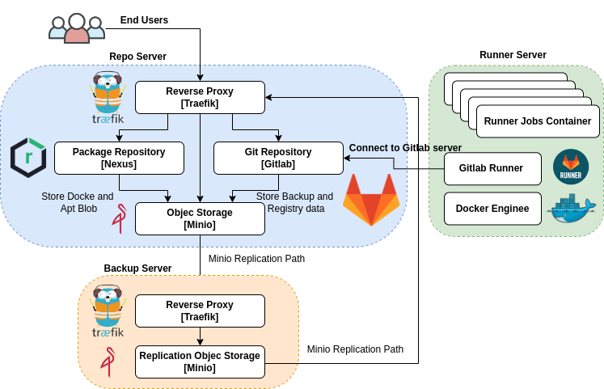

# Install and Config Runner Server

## Runner Server Design

The diagram below illustrates the relationship between these service on Runner server:


### Prerequisites and resource management:

**1. Hardening OS**

**2. Install docker and docker-compose-plugin**
  To install the latest stable versions of Docker CLI, Docker Engine, and their dependencies:
```bash
#download the script
curl -fsSL https://get.docker.com -o install-docker.sh

#verify the script's content
cat install-docker.sh

#run the script either as root, or using sudo to perform the installation.
sudo sh install-docker.sh
```
**3. Create external networks:**
```bash
docker network create -o com.docker.network.bridge.name=web_net web_net
docker network create -o com.docker.network.bridge.name=app_net app_net
```

**Resource management**
Your Runner server needs to have 2GB or more of available RAM and 2Core or more available CPU to run all jobs from gitlab ci/cd.

## [Gitlab ci architecture](https://docs.gitlab.com/ee/development/cicd/#ci-architecture-overview)

The following is a simplified diagram of the CI architecture. Some details are left out to focus on the main components.


### Run compose file for start GitLab Runner service:
Check and run compose file:
```bash
# syntax check compose file
docker compose config

# pull all images on compose service
docker compose pull

# run all services on compose file
docker compose up -d

# check runner log
docker compose logs -f
```

### Registering runners:

Runner registration is the process that links the runner with one or more GitLab instances. You must register the runner so that it can pick up jobs from the GitLab instance.

```bash
# runner registration with single command.
gitlab-runner register \
  --non-interactive \
  --url "https://git.mecan.ir/" \
  --token "$RUNNER_TOKEN" \
  --executor "docker" \
  --docker-image alpine:latest \
  --description "docker-runner"
```

## Gitlab runner configuration:
To change the behavior of GitLab Runner and individual registered runners, modify the config.toml file.

You can find the config.toml file in:

- /etc/gitlab-runner/ on *nix systems when GitLab Runner is executed as root. This directory is also the path for service configuration.
- ~/.gitlab-runner/ on *nix systems when GitLab Runner is executed as non-root.
- ./ on other systems.

GitLab Runner does not require a restart when you change most options. This includes parameters in the [[runners]] section and most parameters in the global section, except for listen_address. If a runner was already registered, you don’t need to register it again.

GitLab Runner checks for configuration modifications every 3 seconds and reloads if necessary. GitLab Runner also reloads the configuration in response to the SIGHUP signal.

**The global section:** These settings are global. They apply to all runners.
Important config this section.
```bash
concurrent = 4
log_level = "warning"
check_interval = 3
```
**The [session_server] section:** The [session_server] section lets users interact with jobs, for example, in the interactive web terminal. The [session_server] section should be specified at the root level, not per runner. It should be defined outside the [[runners]] section.
**The [[runners]] section:** Each [[runners]] section defines one runner.
**The [runners.docker] section:** The following settings define the Docker container parameters. Docker-in-Docker as a service, or any container runtime configured inside a job, does not inherit these parameters.
Important configs in this section.
```bash
[runners.docker]
  image = "ruby:2.7"
  dns = ["8.8.8.8"]
  privileged = false
  volumes = ["/data", "/var/run/docker.sock:/var/run/docker.sock"]
  pull_policy = if-not-present
```

## GitLab Runner monitoring:
The metrics HTTP server can be configured in the following ways:
- with a listen_address global configuration option in config.toml file,
- with a --listen-address command line option for the run command,
- by configuring the metrics and service configuration options in values.yaml for runners using Helm Chart.
If you add the address to your config.toml file, to start the metrics HTTP server, you must restart the runner process.

In both cases the option accepts a string with the format [host]:<port>, where:

- host can be an IP address or a hostname,
- port is a valid TCP port or symbolic service name (like http). We recommend using port 9252 which is already allocated in Prometheus.

If the listen address does not contain a port, it will default to 9252.
Examples of addresses:
- "**:9252**" - will listen on all IPs of all interfaces on port 9252
- "**localhost:9252**" - will only listen on the loopback interface on port 9252
- "**[2001:db8::1]:http**" - will listen on IPv6 address [2001:db8::1] on the HTTP port 80
Remember that for listening on ports below 1024 - at least on Linux/Unix systems - you need to have root/administrator rights.

The HTTP server is opened on the selected host:port without any authorization. If you plan to bind the metrics server to a public interface then you should consider to use your firewall to limit access to this server or add an HTTP proxy which will add the authorization and access control layer.

**Sample prometheus configs:**
```bash
scrape_configs:
  - job_name: 'runner'
    metrics_path: '/metrics'
    static_configs:
      - targets: ['<Runner_Address>:9252']
```

**Grafana dashboard:** you can use `grafana-dashboard/GitlabRunnerMetrics.json` dashboard in your grafana instance.