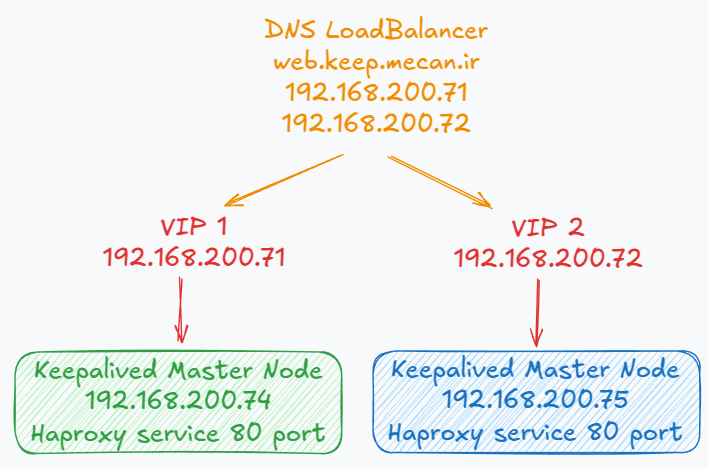
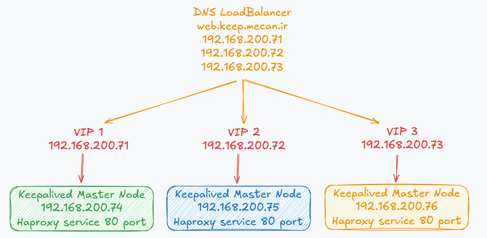

# Keepalived Total Scenario


## Table of Contents
<!-- TOC -->- [Keepalived Total Scenario](#keepalived-total-scenario)
- [Keepalived Total Scenario](#keepalived-total-scenario)
  - [Table of Contents](#table-of-contents)
  - [Install Keepalived and Haproxy on all nodes](#install-keepalived-and-haproxy-on-all-nodes)
  - [Iptable config on all nodes](#iptable-config-on-all-nodes)
  - [Keepalived Master/Backup Scenario on Server 1 and 2](#keepalived-masterbackup-scenario-on-server-1-and-2)
  - [Keepalived Master/Master Scenario on Server 1 and 2](#keepalived-mastermaster-scenario-on-server-1-and-2)
  - [Keepalived Master/Master/Master Scenario on Server 1,2 and 3](#keepalived-mastermastermaster-scenario-on-server-12-and-3)
  - [Other configuration](#other-configuration)
    - [Tracking a Network Interface:](#tracking-a-network-interface)
    - [Steps to Configure Keepalived with External Email Notification](#steps-to-configure-keepalived-with-external-email-notification)
    - [VRRP authentication:](#vrrp-authentication)
    - [Basic Keepalived Load Balancing Configuration](#basic-keepalived-load-balancing-configuration)
    - [keepalived logging](#keepalived-logging)
  - [🔗 Stay connected with DockerMe! 🚀](#-stay-connected-with-dockerme-)

## Install Keepalived and Haproxy on all nodes

**Install keepalived on all servers:**

```bash
# update and upgrade debian
apt update
apt upgrade -y

# check keepalived version and install
apt-cache policy keepalived
apt install keepalived

# enable and restart keepalived service
systemctl enable keepalived
systemctl restart keepalived
systemctl status keepalived
```

**Install and config Haproxy on all servers:**

```bash
# update and upgrade debian
apt update
apt upgrade -y

# check haproxy version and install
apt-cache policy haproxy
apt install haproxy

# enable and restart haproxy service
systemctl enable haproxy
systemctl restart haproxy
systemctl status haproxy

# create haproxy config
cat /etc/haproxy/haproxy.cfg
cat <<EOT >> /etc/haproxy/haproxy.cfg
listen Stats-Page
  bind *:8000
  mode http
  stats enable
  stats hide-version
  stats refresh 10s
  stats uri /
  stats show-legends
  stats show-node
  stats admin if LOCALHOST
  stats auth MeCan:MeCan-port-of-DockerMe
EOT
cat /etc/haproxy/haproxy.cfg

# check haproxy config file
haproxy -c -f /etc/haproxy/haproxy.cfg

# restart haproxy service
systemctl restart haproxy
systemctl status haproxy

echo "check haproxy status page"
netstat -ntlp | grep 8000
```

**Ensure killall is Installed** The killall command is part of the `psmisc` package. Check if it's installed:

```bash
# check killall command
which killall
```

**If it's missing, install it:**

```bash
# install psmisc on Ubuntu/Debian:
apt install psmisc -y
```

**Test Script Execution Outside Keepalived** Run the script manually:

```bash
/usr/bin/killall -0 haproxy && echo "Success" || echo "Failed"
```

[🔝 Back to Top](#table-of-contents)

## Iptable config on all nodes

**add these line on `rule.v4` all servers:**

```bash
# add iptables rules
-A INPUT -s 192.168.200.75/32 -p vrrp -j ACCEPT
-A INPUT -s 192.168.200.76/32 -p vrrp -j ACCEPT
-A INPUT -s 192.168.200.77/32 -p vrrp -j ACCEPT

# restart iptables service and apply rules
systemctl enable iptables
systemctl restart iptables
systemctl status iptables

# check iptables rules
iptables -nL | grep 112
```

## Keepalived Master/Backup Scenario on Server 1 and 2


**config keepalived on Master node:**

```bash
cat <<EOT > /etc/keepalived/keepalived.conf
global_defs {
   enable_script_security
   script_user root
}

vrrp_script check_haproxy {
    script "killall -0 haproxy"
    interval 2
    weight -20
    fall 3
    rise 2
   }

vrrp_instance SCENARIO-A {
   state MASTER
   interface ens192
   virtual_router_id 51
   priority 150
   advert_int 1

   unicast_src_ip 192.168.200.74    # Source Node IP
   unicast_peer {
       192.168.200.75               # Peer Node IP
   }

   virtual_ipaddress {
      192.168.200.71/32
   }

   track_script {
      check_haproxy
   }
}
EOT
cat /etc/keepalived/keepalived.conf

# check keepalived config file"
keepalived -t -l -f /etc/keepalived/keepalived.conf

# Enable and start keepalived service"
systemctl restart keepalived
systemctl status keepalived

echo "check vip"
ip -br -c a
```

**config keepalived on Backup node:**

```bash
cat <<EOT > /etc/keepalived/keepalived.conf
global_defs {
   enable_script_security
   script_user root
}

# Script used to check if HAProxy is running
vrrp_script check_haproxy {
    script "killall -0 haproxy"
    interval 2
    weight -20
    fall 3
    rise 2
   }

vrrp_instance SCENARIO-A {
    state BACKUP
    interface ens192
    virtual_router_id 51
    priority 140
    advert_int 1

    unicast_src_ip 192.168.200.75    # Source Node IP
    unicast_peer {
        192.168.200.74               # Peer Node IP
    }

    virtual_ipaddress {
       192.168.200.71/32
    }

    track_script {
       check_haproxy
    }
}
EOT

cat /etc/keepalived/keepalived.conf

# check keepalived config file"
keepalived -t -l -f /etc/keepalived/keepalived.conf

# Enable and start keepalived service"
systemctl restart keepalived
systemctl status keepalived

echo "check vip"
ip -br -c a
```

[🔝 Back to Top](#table-of-contents)

## Keepalived Master/Master Scenario on Server 1 and 2



**config keepalived on Master node1:**

```bash
cat <<EOT > /etc/keepalived/keepalived.conf
global_defs {
   enable_script_security
   script_user root
}

vrrp_script check_haproxy {
    script "killall -0 haproxy"
    interval 2
    weight -20
    fall 3
    rise 2
   }

vrrp_instance SCENARIO-B1 {
   state MASTER
   interface ens192
   virtual_router_id 51
   priority 150
   advert_int 1

   unicast_src_ip 192.168.200.74    # Master node IP
   unicast_peer {
       192.168.200.75               # Backup node IP
   }

   virtual_ipaddress {
      192.168.200.71/32
   }

   track_script {
      check_haproxy
   }
}

vrrp_instance SCENARIO-B2 {
   state BACKUP
   interface ens192
   virtual_router_id 52
   priority 140
   advert_int 1

   unicast_src_ip 192.168.200.74    # Master node IP
   unicast_peer {
       192.168.200.75               # Backup node IP
   }

   virtual_ipaddress {
      192.168.200.72/32
   }

   track_script {
      check_haproxy
   }
}
EOT
cat /etc/keepalived/keepalived.conf

# check keepalived config file"
keepalived -t -l -f /etc/keepalived/keepalived.conf

# Enable and start keepalived service"
systemctl restart keepalived
systemctl status keepalived

echo "check vip"
ip -br -c a
```

**config keepalived on Backup node:**

```bash
cat <<EOT > /etc/keepalived/keepalived.conf
global_defs {
   enable_script_security
   script_user root
}

# Script used to check if HAProxy is running
vrrp_script check_haproxy {
    script "killall -0 haproxy"
    interval 2
    weight -20
    fall 3
    rise 2
   }

vrrp_instance SCENARIO-B1 {
   state BACKUP
   interface ens192
   virtual_router_id 51
   priority 140
   advert_int 1

   unicast_src_ip 192.168.200.75    # Master node IP
   unicast_peer {
       192.168.200.74               # Backup node IP
   }

   virtual_ipaddress {
      192.168.200.71/32
   }

   track_script {
      check_haproxy
   }
}

vrrp_instance SCENARIO-B2 {
   state MASTER
   interface ens192
   virtual_router_id 52
   priority 150
   advert_int 1

   unicast_src_ip 192.168.200.75    # Master node IP
   unicast_peer {
       192.168.200.74               # Backup node IP
   }

   virtual_ipaddress {
      192.168.200.72/32
   }

   track_script {
      check_haproxy
   }
}
EOT

cat /etc/keepalived/keepalived.conf

# check keepalived config file"
keepalived -t -l -f /etc/keepalived/keepalived.conf

# Enable and start keepalived service"
systemctl restart keepalived
systemctl status keepalived

echo "check vip"
ip -br -c a
```

[🔝 Back to Top](#table-of-contents)

## Keepalived Master/Master/Master Scenario on Server 1,2 and 3



**config keepalived on node1:**

```bash
cat <<EOT > /etc/keepalived/keepalived.conf
global_defs {
   enable_script_security
   script_user root
}

vrrp_script check_haproxy {
    script "killall -0 haproxy"
    interval 2
    weight -40
    fall 3
    rise 2
   }

vrrp_instance SCENARIO-C1 {
   state MASTER
   interface ens192
   virtual_router_id 51
   priority 150
   advert_int 1

   unicast_src_ip 192.168.200.74    # Master node IP
   unicast_peer {
       192.168.200.75               # Backup node IP
       192.168.200.76               # Backup node IP
   }

   virtual_ipaddress {
      192.168.200.71/32
   }

   track_script {
      check_haproxy
   }
}

vrrp_instance SCENARIO-C2 {
   state BACKUP
   interface ens192
   virtual_router_id 52
   priority 140
   advert_int 1

   unicast_src_ip 192.168.200.74    # Master node IP
   unicast_peer {
       192.168.200.75               # Backup node IP
       192.168.200.76               # Backup node IP
   }

   virtual_ipaddress {
      192.168.200.72/32
   }

   track_script {
      check_haproxy
   }
}

vrrp_instance SCENARIO-C3 {
   state BACKUP
   interface ens192
   virtual_router_id 53
   priority 130
   advert_int 1

   unicast_src_ip 192.168.200.74    # Master node IP
   unicast_peer {
       192.168.200.75               # Backup node IP
       192.168.200.76               # Backup node IP
   }

   virtual_ipaddress {
      192.168.200.73/32
   }

   track_script {
      check_haproxy
   }
}

EOT
cat /etc/keepalived/keepalived.conf

# check keepalived config file"
keepalived -t -l -f /etc/keepalived/keepalived.conf

# Enable and start keepalived service"
systemctl restart keepalived
systemctl status keepalived

echo "check vip"
ip -br -c a
```

**config keepalived on node2:**

```bash

cat <<EOT > /etc/keepalived/keepalived.conf
global_defs {
   enable_script_security
   script_user root
}

vrrp_script check_haproxy {
    script "killall -0 haproxy"
    interval 2
    weight -40
    fall 3
    rise 2
   }

vrrp_instance SCENARIO-C1 {
   state BACKUP
   interface ens192
   virtual_router_id 51
   priority 130
   advert_int 1

   unicast_src_ip 192.168.200.75    # Master node IP
   unicast_peer {
       192.168.200.74               # Backup node IP
       192.168.200.76               # Backup node IP
   }

   virtual_ipaddress {
      192.168.200.71/32
   }

   track_script {
      check_haproxy
   }
}

vrrp_instance SCENARIO-C2 {
   state MASTER
   interface ens192
   virtual_router_id 52
   priority 150
   advert_int 1

   unicast_src_ip 192.168.200.75    # Master node IP
   unicast_peer {
       192.168.200.74               # Backup node IP
       192.168.200.76               # Backup node IP
   }

   virtual_ipaddress {
      192.168.200.72/32
   }

   track_script {
      check_haproxy
   }
}

vrrp_instance SCENARIO-C3 {
   state BACKUP
   interface ens192
   virtual_router_id 53
   priority 140
   advert_int 1

   unicast_src_ip 192.168.200.75    # Master node IP
   unicast_peer {
       192.168.200.74               # Backup node IP
       192.168.200.76               # Backup node IP
   }

   virtual_ipaddress {
      192.168.200.73/32
   }

   track_script {
      check_haproxy
   }
}

EOT
cat /etc/keepalived/keepalived.conf

# check keepalived config file"
keepalived -t -l -f /etc/keepalived/keepalived.conf

# Enable and start keepalived service"
systemctl restart keepalived
systemctl status keepalived

echo "check vip"
ip -br -c a
```

**config keepalived on node3:**

```bash

cat <<EOT > /etc/keepalived/keepalived.conf
global_defs {
   enable_script_security
   script_user root
}

vrrp_script check_haproxy {
    script "killall -0 haproxy"
    interval 2
    weight -40
    fall 3
    rise 2
   }

vrrp_instance SCENARIO-C1 {
   state BACKUP
   interface ens192
   virtual_router_id 51
   priority 140
   advert_int 1

   unicast_src_ip 192.168.200.76    # Master node IP
   unicast_peer {
       192.168.200.74               # Backup node IP
       192.168.200.75               # Backup node IP
   }

   virtual_ipaddress {
      192.168.200.71/32
   }

   track_script {
      check_haproxy
   }
}

vrrp_instance SCENARIO-C2 {
   state BACKUP
   interface ens192
   virtual_router_id 52
   priority 130
   advert_int 1

   unicast_src_ip 192.168.200.76    # Master node IP
   unicast_peer {
       192.168.200.74               # Backup node IP
       192.168.200.75               # Backup node IP
   }

   virtual_ipaddress {
      192.168.200.72/32
   }

   track_script {
      check_haproxy
   }
}

vrrp_instance SCENARIO-C3 {
   state MASTER
   interface ens192
   virtual_router_id 53
   priority 150
   advert_int 1

   unicast_src_ip 192.168.200.76    # Master node IP
   unicast_peer {
       192.168.200.74               # Backup node IP
       192.168.200.75               # Backup node IP
   }

   virtual_ipaddress {
      192.168.200.73/32
   }

   track_script {
      check_haproxy
   }
}

EOT
cat /etc/keepalived/keepalived.conf

# check keepalived config file"
keepalived -t -l -f /etc/keepalived/keepalived.conf

# Enable and start keepalived service"
systemctl restart keepalived
systemctl status keepalived

echo "check vip"
ip -br -c a
```

[🔝 Back to Top](#table-of-contents)

## Other configuration

### Tracking a Network Interface:

Example Configuration for Tracking a Network Interface (eth0)

```bash

    track_interface {
        eth0
    }
```

Multiple Interfaces: You can track multiple interfaces by listing them one by one:
```bash

    track_interface {
        eth0
        eth1
    }
```

[🔝 Back to Top](#table-of-contents)

### Steps to Configure Keepalived with External Email Notification

**1. Create the Email Sending Script**
First, you need to create an external script that will handle sending emails. This script will use a tool like msmtp or mail to send the email notifications.

Create the script:

```bash
sudo vim /usr/local/bin/send_email.sh
```

Add the following content to the script. Make sure to replace your-email@gmail.com with your Gmail address and your-app-password (if using 2FA) with your generated app-specific password.

Example using msmtp:

```bash
#!/bin/bash

# Email settings
TO="your-email@gmail.com"
SUBJECT="Keepalived State Change Notification"
BODY="Keepalived state has changed."
FROM="your-email@gmail.com"
SMTP_SERVER="smtp.gmail.com"
SMTP_PORT="587"
SMTP_USER="your-email@gmail.com"
SMTP_PASS="your-app-password"

# Send email using msmtp
echo -e "Subject:${SUBJECT}\nFrom:${FROM}\nTo:${TO}\n\n${BODY}" | msmtp --tls=on --tls-starttls=on -a gmail "${TO}"
```

Make sure the script is executable:

```bash
sudo chmod +x /usr/local/bin/send_email.sh
```

**2. Install msmtp (or another MTA)**
You need an external mail transfer agent (MTA) like msmtp to send the email via Gmail's SMTP server.

To install msmtp, run:

```bash
sudo apt-get install msmtp  # For Debian/Ubuntu-based systems
```

After installing `msmtp`, you need to configure it. Create or modify the `/etc/msmtprc` file:

```bash
sudo vim /etc/msmtprc
```

Add the following configuration:

```bash
account gmail
host smtp.gmail.com
port 587
from your-email@gmail.com
auth on
user your-email@gmail.com
password your-app-password  # Use App Password if using 2FA
tls on
tls_starttls on
logfile /var/log/msmtp.log

account default : gmail
```

Set proper permissions for the configuration file:

```bash
sudo chmod 600 /etc/msmtprc
```

**3. Configure Keepalived to Use the Script**

In the `keepalived.conf` file, use the notify directive to call the email script when the state changes.

Example `keepalived.conf`:

```bash
vrrp_instance VI_1 {
    state MASTER
    interface eth0
    virtual_router_id 51
    priority 150  # Higher priority for MASTER node
    advert_int 1

    virtual_ipaddress {
        192.168.1.100/24  # Virtual IP
    }

    track_script {
        check_haproxy  # Optional: Track HAProxy service health
    }

    # Trigger external script on state change (e.g., Master/Backup switch)
    notify "/usr/local/bin/send_email.sh"
}
```

**4. Restart Keepalived**
After updating the keepalived.conf, restart Keepalived to apply the configuration changes:

```bash
sudo systemctl restart keepalived
```

**5. Testing**
To test the email notification:

  1. Manually failover Keepalived by stopping the master node or the service that Keepalived is monitoring (e.g., HAProxy or a specific network interface).
  2. You should receive an email notification at the address specified in the `send_email.sh` script.

[🔝 Back to Top](#table-of-contents)

### VRRP authentication:
To configure VRRP authentication in Keepalived, you use the auth keyword within your vrrp_instance section. Authentication helps to prevent unauthorized devices from participating in VRRP elections by requiring a password.

There are two types of VRRP authentication that you can configure:

  1. Simple Authentication (plain text)
  2. MD5 Authentication (hashed password)

**Example Configuration:**
**1. Simple Authentication (Plain Text Password)**
This method is less secure and is typically used in smaller environments where security concerns are minimal.

```bash
vrrp_instance VI_1 {
    state MASTER
    interface eth0
    virtual_router_id 51
    priority 150  # Higher priority for MASTER node
    advert_int 1

    virtual_ipaddress {
        192.168.1.100/24  # Virtual IP
    }

    # Simple Authentication (plain password)
    authentication {
        auth_type PASS
        auth_pass 1111
    }

    track_script {
        check_haproxy
    }

    notify "/usr/local/bin/send_email.sh"  # Optional: Email on state change
}
```

**2. MD5 Authentication (Hashed Password)**
MD5 authentication is more secure than plain text because it hashes the password.

```bash
vrrp_instance VI_1 {
    state MASTER
    interface eth0
    virtual_router_id 51
    priority 150  # Higher priority for MASTER node
    advert_int 1

    virtual_ipaddress {
        192.168.1.100/24  # Virtual IP
    }

    # MD5 Authentication (hashed password)
    auth {
        md5 mypassword  # Use a shared password (hashed)
    }

    track_script {
        check_haproxy
    }

    notify "/usr/local/bin/send_email.sh"  # Optional: Email on state change
}
```

In the auth section:
  - pass specifies a plain text password.
  - md5 specifies an MD5 hashed password.

[🔝 Back to Top](#table-of-contents)

### Basic Keepalived Load Balancing Configuration
Here’s a step-by-step guide to configure Keepalived with IPVS for load balancing:

**Basic Keepalived Configuration for Load Balancing**
The configuration file for Keepalived is usually located at /etc/keepalived/keepalived.conf. Below is a simple example of how to configure load balancing with multiple backend servers.

**Example keepalived.conf**

```bash
vrrp_instance VI_1 {
    state MASTER
    interface eth0
    virtual_router_id 51
    priority 150
    advert_int 1
    virtual_ipaddress {
        192.168.1.100/24   # Virtual IP address used for load balancing
    }

    # Load balancing using IPVS
    virtual_server 192.168.1.100 80 {
        delay_loop 6
        lb_algo rr           # Round Robin Load Balancing algorithm
        lb_kind DR           # Direct Routing (used with IPVS)
        protocol TCP

        # Define backend servers
        real_server 192.168.1.101 80 {
            weight 1
            TCP_CHECK {
                connect_timeout 10
                nb_get_retry 3
                delay_before_retry 3
            }
        }

        real_server 192.168.1.102 80 {
            weight 1
            TCP_CHECK {
                connect_timeout 10
                nb_get_retry 3
                delay_before_retry 3
            }
        }

        real_server 192.168.1.103 80 {
            weight 1
            TCP_CHECK {
                connect_timeout 10
                nb_get_retry 3
                delay_before_retry 3
            }
        }
    }
}
```

**Key Configuration Parameters:**
  - **virtual_server:** Defines the virtual IP address and port (in this case, 192.168.1.100:80) that will be used for load balancing.
  - **real_server:** Lists the backend servers that will handle the traffic. For each server, you can define the IP address, port, weight, and health check parameters.
  - **lb_algo:** The load balancing algorithm to use. Common options are:
    - **rr** for Round Robin.
    - **wrr** for Weighted Round Robin.
    - **lc** for Least Connections.
    - **sh** for Source Hash (sticky session-based load balancing).
  - **lb_kind:** Specifies the load balancing method. Common options are:
    - **DR** for Direct Routing (used with IPVS).
    - **NAT** for Network Address Translation.
  - **protocol:** The protocol being used (e.g., TCP, UDP).
  - **weight:** Used to specify the server's weight in the load balancing scheme. A higher weight gives a server more traffic.

**Health Check Configuration:**
Keepalived performs health checks on the backend servers to ensure traffic is only sent to healthy servers. In the example above, we use a TCP_CHECK to check if the web server is reachable on port 80.

Parameters:
  - **connect_timeout**: Time to wait for a connection to the server.
  - **nb_get_retry**: Number of retries to check the server.
  - **delay_before_retry**: Time to wait before retrying a failed server.

[🔝 Back to Top](#table-of-contents)

### keepalived logging
To configure Keepalived logging with systemd's journald (which is the default logging system for many modern Linux distributions), you don’t need to do much in terms of configuration since systemd automatically collects logs from services managed by it. However, you can still ensure that Keepalived is logging properly by configuring it to output logs to journald and by ensuring that the service is using the correct logging facilities.

**Enabling Keepalived to Use Journald**
By default, Keepalived should send logs to journald when it is running as a systemd service, so you don't need to specify anything extra in the Keepalived configuration. However, you can use the log_syslog directive in the Keepalived configuration to tell it to send logs to syslog, which in turn will be captured by journald.

Ensure that your Keepalived configuration includes the following lines:

```bash
global_defs {
    log_syslog        # Logs will be forwarded to syslog
    log_console       # Logs will also go to console (optional)
    log_level info    # Set desired log level (debug, info, etc.)
}
```

This ensures that logs are forwarded to syslog, and systemd will capture them via journald.

**Check Keepalived Logs with journalctl**
Once Keepalived is running as a systemd service, you can check its logs using journalctl.

To view Keepalived logs, use:

```bash
sudo journalctl -u keepalived
```

This will display all logs for the Keepalived service.

To see only the most recent logs, you can use:

```bash
sudo journalctl -u keepalived -n 50
```
This shows the last 50 entries from the Keepalived service logs.

If you want to follow the logs in real time (similar to tail -f), use:

```bash
sudo journalctl -u keepalived -f
```
This will show new log entries as they appear in real time.

Filter Logs Based on Severity
You can filter logs based on the severity level (e.g., errors, warnings, info, debug). For example, to view only error logs:

```bash
sudo journalctl -u keepalived -p err
```
To filter logs by debug level:

```bash
sudo journalctl -u keepalived -p debug
```

Viewing Logs for a Specific Time Period
If you need to view logs for a specific time period, you can specify time filters with journalctl. For example, to view logs from the last 1 hour:

```bash
sudo journalctl -u keepalived --since "1 hour ago"
```

To view logs between specific dates and times, use:

```bash
sudo journalctl -u keepalived --since "2025-03-20 08:00:00" --until "2025-03-20 18:00:00"
```

[🔝 Back to Top](#table-of-contents)

## 🔗 Stay connected with DockerMe! 🚀

**Subscribe to our channels, leave a comment, and drop a like to support our content. Your engagement helps us create more valuable DevOps and cloud content!** 🙌

[](https://dockerme.ir/) [](https://www.linkedin.com/in/ahmad-rafiee/) [](https://t.me/dockerme) [](https://youtube.com/@dockerme) [](https://instagram.com/dockerme)

[🔝 Back to Top](#table-of-contents)