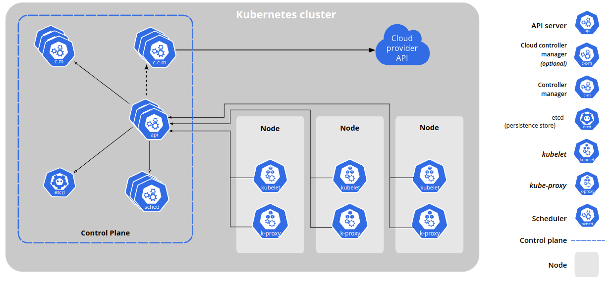

### [Kubectl installation, configuration, add-ons, and validator](kubectl)

- [kubectl command tips](kubectl/ReadMe.md)
- [kubectl sample commands](kubectl/kubectl-sample-command.md)

### [Kubernetes cluster setup](cluster-setup)

  - #### [Single-node Installation and configuration kubernetes cluster](cluster-setup/single-node)
    - [kind - kubernetes in docker](cluster-setup/kind/ReadMe.md)
    - [minikube - kubernetes for development](cluster-setup/minikube/ReadMe.md)
    - [k3d - k3s in docker](cluster-setup/k3d/ReadMe.md)

  - #### [Multi-node Installation, configuration, and upgrade kubernetes cluster](cluster-setup/multi-node)
    - ##### [Kubeadm:](https://kubernetes.io/docs/reference/setup-tools/kubeadm/)
        - [Setup and config kubernetes cluster with kubeadm](cluster-setup/kubeadm/ReadMe.md)
        - [Update multi-node kubernetes cluster](cluster-setup/kubeadm/kubeadm-multi-node-update.md)
        - [kubeadm sample config](cluster-setup/kubeadm/kubeadm-sample-config.yml)

    - ##### [Kubespray:](https://kubespray.io/)
        - [Setup, config and upgrade kubernetes cluster with kubespray](cluster-setup/kubespray/ReadMe.md)
        - [Setup kubernetes cluster offline](cluster-setup/kubespray/offline-installation.md)

    - ##### [Rancher Kubernetes Engine (RKE)](https://rke.docs.rancher.com/)
        - [Setup multiple kubernetes cluster with RKE](cluster-setup/rancher/ReadMe.md)

    - ##### [External Load Balancer (ELB)](cluster-setup/load-balancer/)
        - [Loadbalancer - Setup and config external load-balancer for kubernetes cluster](cluster-setup/load-balancer/ReadMe.md)

### [Kubernetes Add-ons](add-ons/ReadMe.md)
  - [Install helm](add-ons/ReadMe.md#install-helm)
  - [Deploy and config Ingress-nginx](add-ons/ReadMe.md#install-and-config-ingress-nginx)
  - [Deploy and config cert-manager](add-ons/ReadMe.md#install-and-config-cert-manager)
  - [Deploy and config kube prometheus stack](add-ons/ReadMe.md#install-and-config-kube-prometheus-stack)
  - [Deploy and config loki stack](add-ons/ReadMe.md#install-and-config-loki-stack)
  - [Deploy and config argo-cd](add-ons/ReadMe.md#install-and-config-argo-cd)
  - [Deploy VPA on kube](add-ons/ReadMe.md#install-vpa-on-kube)
  - [Deploy and config minio](add-ons/ReadMe.md#install-and-config-minio)
  - [Deploy and config velero](add-ons/ReadMe.md#install-and-config-velero)
  - [Deploy gatekeeper on Kubernetes](add-ons/ReadMe.md#run-gatekeeper-on-kubernetes)
  - [Deploy gatekeeper policy](add-ons/ReadMe.md#run-gatekeeper-policy)

### [Kubernetes Security](security/ReadMe.md)
  - [Kubernetes Audit Logs](security/ReadMe.md#kubernetes-audit-logs)
    - [Configuring Kubernetes Auditing](security/ReadMe.md#configuring-kubernetes-auditing)
  - [Kube-bench](security/ReadMe.md#kube-bench)
    - [Install kube-bench:](security/ReadMe.md#install-kube-bench)
    - [Running kube-bench:](security/ReadMe.md#running-kube-bench)
    - [Running Kube-bench In a Pod:](security/ReadMe.md#running-kube-bench-in-a-pod)
  - [Trivy](security/ReadMe.md#trivy)
    - [Installing Trivy and Enable shell completion](security/ReadMe.md#installing-trivy-and-enable-shell-completion)
    - [Kubernetes Scanning Tutorial](security/ReadMe.md#kubernetes-scanning-tutorial)
    - [Trivy Operator](security/ReadMe.md#trivy-operator)
  - [Kubernetes RBAC](security/ReadMe.md#kubernetes-rbac)
    - [Create read only user on namespace](security/ReadMe.md#create-read-only-user-on-namespace)
    - [Create read only user on cluster](security/ReadMe.md#create-read-only-user-on-cluster)
  - [Network policy](security/ReadMe.md#network-policy)
    - [Network policy sample](security/ReadMe.md#network-policy-sample)

### [Kubernetes Manifests](manifests)
  - [01.pod](manifests/01.pod)
  - [02.namespace](manifests/02.namespace)
  - [03.deployment](manifests/03.deployment)
  - [04.daemonset](manifests/04.daemonset)
  - [05.statefulset](manifests/05.statefulset)
  - [06.job](manifests/06.job)
  - [07.network](manifests/07.network)
  - [08.storage](manifests/08.storage)
  - [09.security](manifests/09.security)
  - [10.pod-to-node](manifests/10.pod-to-node)

### [Scenario](scenario)
  - [Kubernetes Auto Scaling](scenario/auto-scaling)
    - [Kubernetes Auto Scaling - HPA and VPA](scenario/auto-scaling/php-app)
    - [Kubernetes Auto Scaling - KEDA](scenario/auto-scaling/keda/ReadMe.md)
      - [Kubernetes Auto Scaling - KEDA: Redis](scenario/auto-scaling/keda/redis-scaleobject.yml)
      - [Kubernetes Auto Scaling - KEDA: RabbitMq](scenario/auto-scaling/keda/rabbitmq-scenario)
      - [Kubernetes Auto Scaling - KEDA: Http](scenario/auto-scaling/keda/http-scenario)
  - [Etcd labs](scenario/etcdlabs)
  - [Etcd backup](scenario/etcd-backup)
  - [Kubeapps Panel](scenario/kubeapps.md)
  - [Kubernetes Dashboard](scenario/kubernetes-dashboard.md)
  - [Kubernetes Demo Project](scenario/kubernetes-demo-project.md)
  - [Deploy Wordpress service on kubernetes](scenario/wordpress.md)

### [Sample Helm Repository](helm)
  - [Hello World! helm package](helm/hello-world)
  - [Voting app helm package](helm/voting-app)

## 🔗 Stay connected with DockerMe! 🚀

**Subscribe to our channels, leave a comment, and drop a like to support our content. Your engagement helps us create more valuable DevOps and cloud content!** 🙌

    
