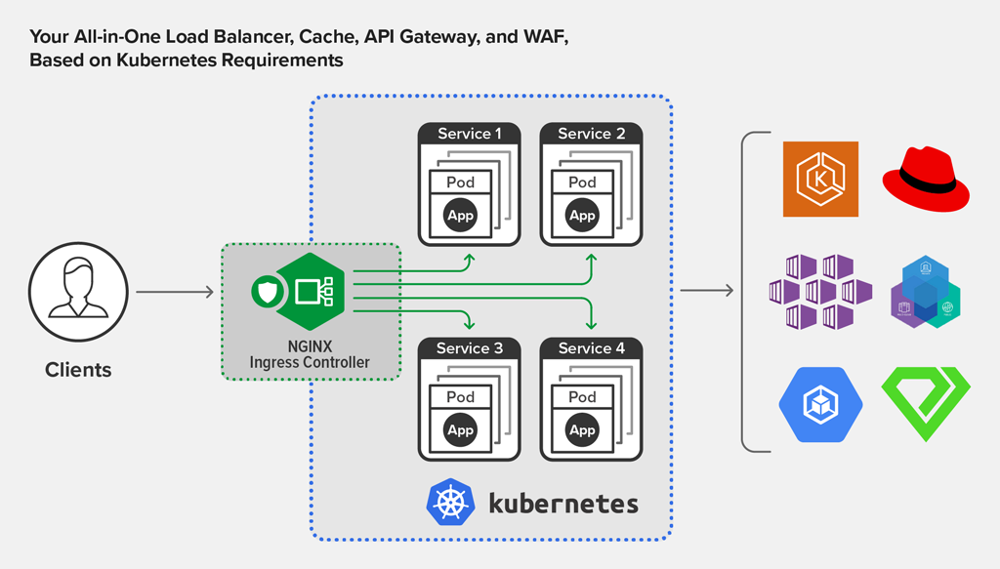
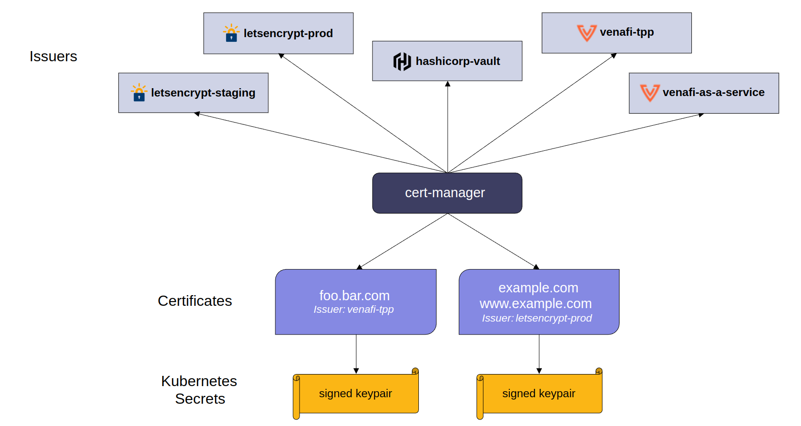
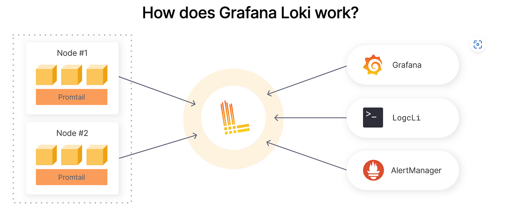
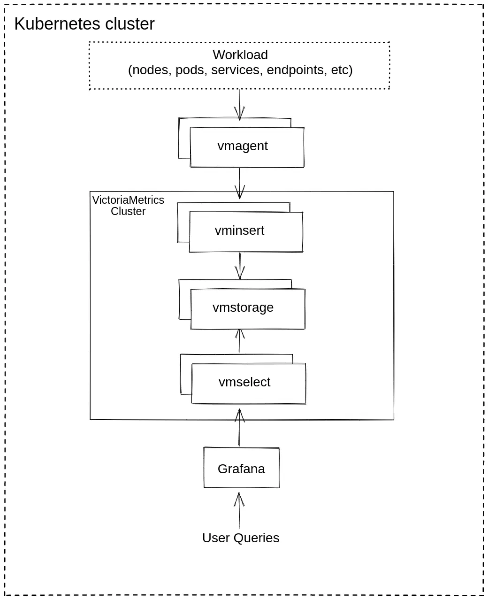
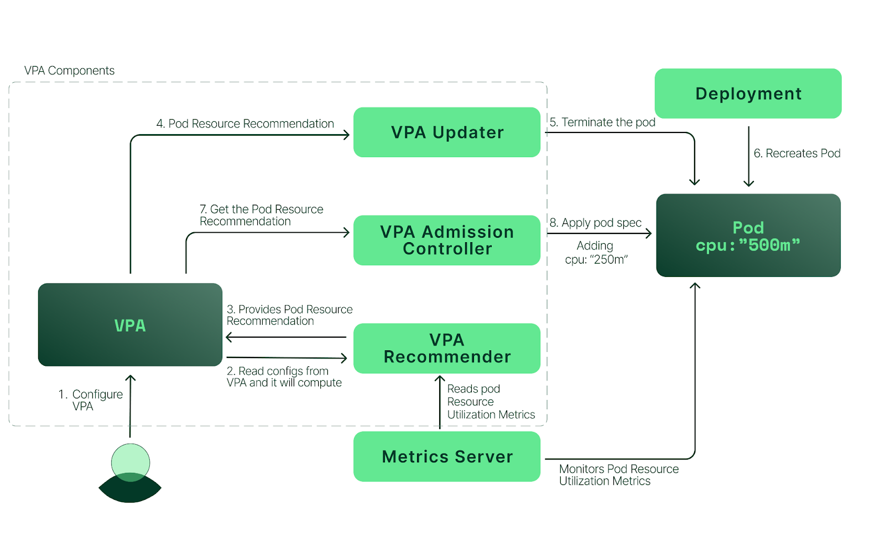
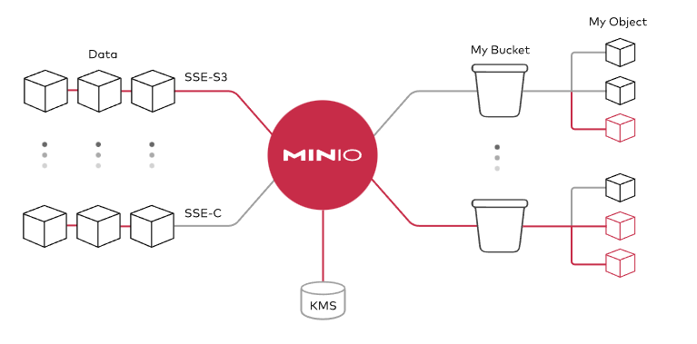
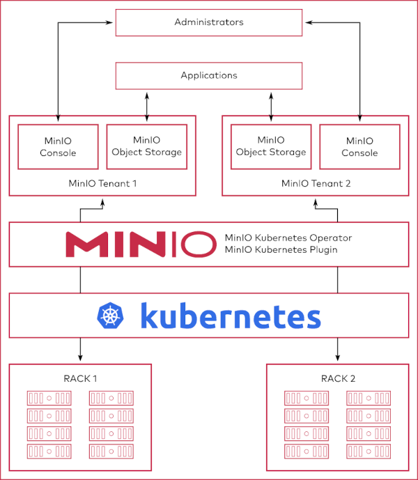

# Install and config kubernetes add-ons

- [Install and config kubernetes add-ons](#install-and-config-kubernetes-add-ons)
  - [Install helm:](#install-helm)
  - [Deploy and config Ingress-nginx](#deploy-and-config-ingress-nginx)
  - [Deploy and config cert-manager](#deploy-and-config-cert-manager)
  - [Deploy and config kube prometheus stack](#deploy-and-config-kube-prometheus-stack)
  - [Deploy and config loki stack](#deploy-and-config-loki-stack)
  - [Deploy and config VictoriaMetrics Cluster on kubernetes](#deploy-and-config-victoriametrics-cluster-on-kubernetes)
  - [Deploy and config argo-cd](#deploy-and-config-argo-cd)
  - [Deploy and config VPA on kube](#deploy-and-config-vpa-on-kube)
  - [Deploy and config minio](#deploy-and-config-minio)
  - [Deploy and config minio operator](#deploy-and-config-minio-operator)
  - [Deploy and config minio with operator](#deploy-and-config-minio-with-operator)
  - [Deploy and config velero](#deploy-and-config-velero)
  - [Deploy and config gatekeeper on Kubernetes](#deploy-and-config-gatekeeper-on-kubernetes)
  - [Deploy and config gatekeeper policy](#deploy-and-config-gatekeeper-policy)
  - [🔗 Stay connected with DockerMe! 🚀](#-stay-connected-with-dockerme-)

## Install helm:
Helm is a package manager for Kubernetes that allows developers and operators to more easily configure and deploy applications on Kubernetes clusters.

Helm packages are called charts, and they contain templates of resource definitions that deploy and configure given apps with minimal effort required from the user. With templating, you can manage the chart, its settings and behavior by passing in variable definitions without modifying the actual chart. Customized resource definitions, as well as modifications to already deployed definitions, Helm automatically manages. A deployed chart, with possible customizations, is called a release.

In this tutorial, you’ll set up Helm 3 and learn how to install, upgrade, roll back, and manage charts and releases. You’ll also learn to create and package your own charts, as well as set up chart repositories, which host charts that you can install right away.

```bash
curl https://raw.githubusercontent.com/helm/helm/main/scripts/get-helm-3 | bash
helm version
```

<p align="right"><a href="#table-of-contents">🔼 Back to Top</a></p>

## Deploy and config Ingress-nginx




Ingress-nginx is an Ingress controller for Kubernetes using NGINX as a reverse proxy and load balancer.

**Step1:** Check and change Values file:
```bash
vim ingress-nginx/helm.values.yaml
```

**Step2:** Add helm repository and update all repo
```bash
helm repo add ingress-nginx https://kubernetes.github.io/ingress-nginx
helm repo list
helm repo update
```

**Step3:** Deploy ingress nginx with helm
```bash
helm upgrade --install ingress-nginx ingress-nginx/ingress-nginx \
    --namespace ingress-nginx \
    -f ingress-nginx/helm.values.yaml \
    --create-namespace
```

**Step4:** Check resources on ingress nginx namespace
```bash
kubectl get all -n ingress-nginx
```

<p align="right"><a href="#table-of-contents">🔼 Back to Top</a></p>

## Deploy and config cert-manager



X.509 certificate management for Kubernetes and OpenShift

cert-manager is a powerful and extensible X.509 certificate controller for Kubernetes and OpenShift workloads. It will obtain certificates from a variety of Issuers, both popular public Issuers as well as private Issuers, and ensure the certificates are valid and up-to-date, and will attempt to renew certificates at a configured time before expiry.


**Step1:** Check and change Values file
```bash
vim cert-manager/helm.values.yaml
```

**Step2:** Add helm repository and update all repo
```bash
helm repo add jetstack https://charts.jetstack.io
helm repo list
helm repo update
```

**Step3:** Deploy cert manager with helm
```bash
helm upgrade --install cert-manager jetstack/cert-manager \
    --namespace cert-manager \
    -f cert-manager/helm.values.yaml \
    --create-namespace
```

**Step4:** Check resources on cert-manager namespace
```bash
kubectl get all -n cert-manager
```

**Step5:** Check and create cluster issuer
```bash
# Check cluster issuer manifest
vim cert-manager/clusterIssuer.yaml

# deploy cluster issuer
kubectl apply -f cert-manager/clusterIssuer.yaml

# check clusterIssuer
kubectl get clusterIssuer
```

<p align="right"><a href="#table-of-contents">🔼 Back to Top</a></p>

## Deploy and config kube prometheus stack


Prometheus is a very popular and comprehensive systems monitoring solution. It is a standalone open source project and maintained independently of any company. A big plus is the capability to monitor Kubernetes clusters as well, which tend to be pretty complex in nature. Prometheus eases the operational tasks that are required in setting up a monitoring stack.

The kube-prometheus-stack is meant for cluster monitoring, so it is pre-configured to collect metrics from all Kubernetes components. In addition to that it delivers a default set of dashboards and alerting rules. Many of the useful dashboards and alerts come from the kubernetes-mixin project.

The kube-prometheus-stack consists of three main components:

Prometheus Operator, for spinning up and managing Prometheus instances in your DOKS cluster.
Grafana, for visualizing metrics and plot data using stunning dashboards.
Alertmanager, for configuring various notifications (e.g. PagerDuty, Slack, email, etc) based on various alerts received from the Prometheus main server.

**Step1:** Check and change Values file
```bash
vim kube-prometheus-stack/helm.values.yaml
```

**Step2:** Add helm repository and update all repo
```bash
helm repo add prometheus-community https://prometheus-community.github.io/helm-charts
helm repo list
helm repo update
```

**Step3:** Deploy kube prometheus stack
```bash
helm upgrade --install prometheus-stack prometheus-community/kube-prometheus-stack \
    --namespace monitoring \
    -f kube-prometheus-stack/helm.values.yaml \
     --create-namespace
```

**Step4:** Check and deploy secret config
```bash
# Check manifest
vim kube-prometheus-stack/manifest.yaml

# Apply manifest
kubectl apply -f kube-prometheus-stack/manifest.yaml

# Check after deploy manifest
kubectl -n monitoring get secret
```

**Step5:** Check resources on monitoring namespace
```bash
# check resources on monitoring namespace
kubectl get all -n monitoring

# check secret
kubectl get secret -n monitoring

# check ingress
kubectl get ingress -n monitoring
```

<p align="right"><a href="#table-of-contents">🔼 Back to Top</a></p>

## Deploy and config loki stack



Loki Stack is an interesting alternative to Elastic Stack for collecting and aggregating logs on Kubernetes. Loki has been designed to be very cost-effective and easy to operate. Since it does not index the contents of the logs, the usage of such resources as disk space or RAM memory is lower than for Elasticsearch

**Step1:** Check and change Values file
```bash
vim loki-stack/helm.values.yaml
```

**Step2:** Add helm repository and update all repo
```bash
helm repo add grafana https://grafana.github.io/helm-charts
helm repo list
helm repo update
```

**Step3:** Deploy loki logging
```bash
helm upgrade --install loki grafana/loki-stack \
    --namespace loki-stack \
    -f loki-stack/helm.values.yaml \
    --create-namespace
```

**Step4:** check resources on loki-stack namespace
```bash
kubectl get all -n loki-stack
```

**Add loki datastore on grafana**

<p align="right"><a href="#table-of-contents">🔼 Back to Top</a></p>


## Deploy and config VictoriaMetrics Cluster on kubernetes
**This guide covers:**
* The setup of a VictoriaMetrics cluster in Kubernetes via Helm charts
* How to scrape metrics from k8s components using service discovery
* How to visualize stored data
* How to store metrics in VictoriaMetrics tsdb




**Step1** VictoriaMetrics Helm repository

You need to add the VictoriaMetrics Helm repository to install VictoriaMetrics components. We’re going to use VictoriaMetrics Cluster . You can do this by running the following command:

```bash
# Add repository
helm repo add vm https://victoriametrics.github.io/helm-charts/

# Update Helm repository:
helm repo update vm

# To verify that everything is set up correctly you may run this command:
helm search repo vm/
```

**Step2** Grafana Helm repository

```bash
# Add the Grafana Helm repository.
helm repo add grafana https://grafana.github.io/helm-charts

# Update Helm repository
helm repo update grafana

# To verify that everything is set up correctly you may run this command:
helm search repo grafana/
```
See more information on Grafana [ArtifactHUB](https://artifacthub.io/packages/helm/grafana/grafana)

**Step3** Install VictoriaMetrics Cluster from the Helm chart

```bash
# Install VictoriaMetrics Cluster from the Helm chart
helm upgrade --install vm vm/victoria-metrics-cluster --namespace victoriametrics -f victoriametrics/vm.values.yaml --create-namespace
```

**Command Breakdown**
helm upgrade: This is the primary Helm command for updating a release. If a release with the given name already exists, it will perform an upgrade.

* **--install:** This crucial flag tells Helm that if a release with the specified name (vm in your case) doesn't exist, it should perform an installation instead of failing. This makes the command idempotent, meaning you can run it multiple times to ensure the chart is deployed and up-to-date.
* **vm:** This is the release name. It's a user-defined name that Helm uses to identify this particular deployment of the chart in your Kubernetes cluster. You'll use this name to manage the release (e.g., helm uninstall vm, helm status vm).
* **vm/victoria-metrics-cluster:** This is the chart reference. It specifies which Helm chart to install/upgrade.
* **vm/:** This typically refers to the repository alias where the chart is located. You would have previously added this repository using helm repo add vm https://victoriametrics.github.io/helm-charts/ (or similar).
* **victoria-metrics-cluster:** This is the name of the chart within that repository. This indicates you're deploying the clustered version of VictoriaMetrics.
* **--namespace victoriametrics:** This specifies the Kubernetes namespace where the Helm release will be deployed. All Kubernetes resources created by this Helm chart (Pods, Services, Deployments, etc.) will be placed in the victoriametrics namespace.
* **-f victoriametrics/vm.values.yaml:** This flag specifies a values file to use for customizing the chart's default configurations. Helm charts come with default settings, but you often need to override them (e.g., set resource limits, enable specific features, configure storage). This command tells Helm to read the overrides from the vm.values.yaml file located in the victoriametrics/ directory relative to where you're running the command.
* **--create-namespace:** This flag ensures that if the specified namespace (victoriametrics in this case) does not already exist in your Kubernetes cluster, Helm will create it automatically before proceeding with the installation or upgrade. If the namespace already exists, this flag has no effect.


**Step4** Install vmagent from the Helm chart 

```bash
# Install vmagent from the Helm chart 
helm upgrade --install vmagent vm/victoria-metrics-agent --namespace victoriametrics -f victoriametrics/vmagent.values.yml --create-namespace
```

**Step5** Install grafana from the Helm chart 

```bash
# Install grafana from the Helm chart 
helm upgrade --install grafana grafana/grafana --namespace victoriametrics -f victoriametrics/grafana.values.yml --create-namespace
```

Please see the output log in your terminal. Copy, paste and run these commands. The first one will show admin password for the Grafana admin. The second and the third will forward Grafana to `127.0.0.1:3000`:

```bash
kubectl get secret --namespace victoriametrics grafana -o jsonpath="{.data.admin-password}" | base64 --decode ; echo

export POD_NAME=$(kubectl get pods --namespace victoriametrics -l "app.kubernetes.io/name=grafana,app.kubernetes.io/instance=grafana" -o jsonpath="{.items[0].metadata.name}")

kubectl --namespace victoriametrics port-forward $POD_NAME 3000
```

**Documents:** https://docs.victoriametrics.com/guides/k8s-monitoring-via-vm-cluster/

<p align="right"><a href="#table-of-contents">🔼 Back to Top</a></p>

## Deploy and config argo-cd


Argo CD is a declarative, GitOps continuous delivery tool for Kubernetes.

Application definitions, configurations, and environments should be declarative and version controlled. Application deployment and lifecycle management should be automated, auditable, and easy to understand.

**Step1:** Check and change Values file
```bash
vim argocd/helm.values.yaml
```

**Step2:** Add helm repository and update all repo
```bash
helm repo add argo https://argoproj.github.io/argo-helm
helm repo list
helm repo update
```

**Step3:** Deploy Argo-cd
```bash
helm upgrade --install argo argo/argo-cd \
    --namespace argocd \
    -f argocd/helm.values.yaml \
    --create-namespace
```

**Step4:** Check resources on argocd namespace and get admin password
```bash
# check all resource
kubectl get all -n argocd
```

<p align="right"><a href="#table-of-contents">🔼 Back to Top</a></p>

## Deploy and config VPA on kube



The Kubernetes Vertical Pod Autoscaler automatically adjusts the CPU and memory reservations for your Pods to help "right size" your applications. This adjustment can improve cluster resource utilization and free up CPU and memory for other Pods.


**Step1:** Clone VPA repository
```bash
cd /tmp/ && git clone https://github.com/kubernetes/autoscaler.git
cd autoscaler/vertical-pod-autoscaler
```
**Step2:** Install VPA on kubernetes cluster
```bash
./hack/vpa-up.sh
```

**Step3:** Check vpa pods
```bash
kubectl -n kube-system get pod | grep vpa
```

<p align="right"><a href="#table-of-contents">🔼 Back to Top</a></p>

## Deploy and config minio



MinIO is a high-performance, S3 compatible object store. It is built for large scale AI/ML, data lake and database workloads. It is software-defined and runs on any cloud or on-premises infrastructure. MinIO is dual-licensed under open source GNU AGPL v3 and a commercial enterprise license.


**Step1:** Check and change Values file
```bash
vim minio/helm.values.yaml
```

**Step2:** Add helm repository and update all repo
```bash
helm repo add minio https://charts.min.io/
helm repo update minio
```

**Step3:** Deploy Minio
```bash
helm upgrade --install minio minio/minio \
    --namespace minio \
    -f minio/helm.values.yaml \
    --create-namespace
```

**Step4:** check ingress resource
```bash
# check ingress and secret
kubectl get ingress,secret -n minio
```

**Step5:** Check resources on minio namespace and get auth
```bash
# check resources on minio namespace
kubectl get all -n minio

# get access key and secret key
ACCESS_KEY=$(kubectl -n minio get secret minio -o jsonpath="{.data.rootUser}" | base64 --decode)
SECRET_KEY=$(kubectl -n minio get secret minio -o jsonpath="{.data.rootPassword}" | base64 --decode)
```

<p align="right"><a href="#table-of-contents">🔼 Back to Top</a></p>

## Deploy and config minio operator



**Step1:** Add the MinIO Operator Repo to Helm
MinIO maintains a Helm-compatible repository at https://operator.min.io. Add this repository to Helm:
```bash
helm repo add minio-operator https://operator.min.io
helm repo update minio-operator
```

**Step2:** You can validate the repo contents using helm search:
```bash
helm search repo minio-operator
```

The response should resemble the following:
```bash
NAME                            CHART VERSION   APP VERSION     DESCRIPTION
minio-operator/minio-operator   4.3.7           v4.3.7          A Helm chart for MinIO Operator
minio-operator/operator         6.0.1           v6.0.1          A Helm chart for MinIO Operator
minio-operator/tenant           6.0.1           v6.0.1          A Helm chart for MinIO Operator
```

**Note:** The `minio-operator/minio-operator` is a legacy chart and should not be installed under normal circumstances.

**Step3:** Install the Operator
Run the helm install command to install the Operator. The following command specifies and creates a dedicated namespace minio-operator for installation. MinIO strongly recommends using a dedicated namespace for the Operator.
```bash
helm upgrade --install operator minio-operator/operator \
  --namespace minio-operator \
  --create-namespace \
  -f minio-operator/values.operator.yml
```

**Step4:** Verify the Operator installation

Check the contents of the specified namespace (minio-operator) to ensure all pods and services have started successfully.
```bash
kubectl get all -n minio-operator
```

The response should resemble the following:
```bash
NAME                                  READY   STATUS    RESTARTS   AGE
pod/minio-operator-699f797b8b-th5bk   1/1     Running   0          25h
pod/minio-operator-699f797b8b-nkrn9   1/1     Running   0          25h

NAME               TYPE        CLUSTER-IP      EXTERNAL-IP   PORT(S)             AGE
service/operator   ClusterIP   10.43.44.204    <none>        4221/TCP            25h
service/sts        ClusterIP   10.43.70.4      <none>        4223/TCP            25h

NAME                             READY   UP-TO-DATE   AVAILABLE   AGE
deployment.apps/minio-operator   2/2     2            2           25h

NAME                                        DESIRED   CURRENT   READY   AGE
replicaset.apps/minio-operator-79f7bfc48    2         2         2       123m
```

You can now deploy a tenant using Helm Charts

<p align="right"><a href="#table-of-contents">🔼 Back to Top</a></p>

## Deploy and config minio with operator

**Step1:** Install the Minio Tenant
Run the helm install command to install the Tenant. The following command specifies and creates a dedicated namespace `minio-operator` for installation. MinIO strongly recommends using a dedicated namespace for the Tenant.
```bash
helm upgrade --install operator minio-operator/tenant \
  --namespace minio-operator \
  --create-namespace \
  -f minio-operator/values.tenant.yml
```

**Step2:** get access key and secret key
```bash
kubectl -n minio-operator get secret myminio-env-configuration -o jsonpath='{.data.config\.env}' | base64 --decode
```

<p align="right"><a href="#table-of-contents">🔼 Back to Top</a></p>

## Deploy and config velero

Velero is an open source tool to safely backup and restore, perform disaster recovery, and migrate Kubernetes cluster resources and persistent volumes.

**Step1:** Check and change Values file
```bash
vim  velero/helm.values.yaml
```

**Step2:** Add helm repository and update all repo
```bash
helm repo add vmware-tanzu https://vmware-tanzu.github.io/helm-charts/
helm repo list
helm repo update
```

**Step3:** Deploy velero
```bash
helm upgrade --install velero vmware-tanzu/velero \
    --namespace velero \
    -f velero/helm.values.yaml \
    --create-namespace
```

**Step4:** check all resource on velero ns
```bash
kubectl get all -n velero
```

## Deploy and config gatekeeper on Kubernetes


Gatekeeper is an admission controller that validates requests to create and update Pods on Kubernetes clusters, using the Open Policy Agent (OPA).

Using Gatekeeper allows administrators to define policies with a constraint, which is a set of conditions that permit or deny deployment behaviors in Kubernetes. You can then enforce these policies on a cluster using a ConstraintTemplate. This document provides examples for restricting the security capabilities of workloads to ensure enforce, test, and audit security policies using Gatekeeper.

**Step1:** Check and change Values file
```bash
vim  gatekeeper/helm.values.yaml
```

**Step2:** Add helm repository and update all repo
```bash
helm repo add gatekeeper https://open-policy-agent.github.io/gatekeeper/charts
helm repo list
helm repo update
```

**Step3:** Deploy gatekeeper
```bash
helm upgrade --install gatekeeper gatekeeper/gatekeeper \
    --namespace gatekeeper-system  \
    -f gatekeeper/helm.values.yaml \
    --create-namespace
```

**Step4:** check resources on gatekeeper-system namespace
```bash
kubectl get all -n gatekeeper-system
```

## Deploy and config gatekeeper policy
```bash
###############################
# url: https://open-policy-agent.github.io/gatekeeper-library/website/validation/host-filesystem/
# hostpath Template
kubectl apply -f https://raw.githubusercontent.com/open-policy-agent/gatekeeper-library/master/library/pod-security-policy/host-filesystem/template.yaml

# hostpath constraint example
kubectl apply -f https://raw.githubusercontent.com/open-policy-agent/gatekeeper-library/master/library/pod-security-policy/host-filesystem/samples/psp-host-filesystem/constraint.yaml

###############################
# url: https://open-policy-agent.github.io/gatekeeper-library/website/validation/host-network-ports
# Host Networking Ports
kubectl apply -f https://raw.githubusercontent.com/open-policy-agent/gatekeeper-library/master/library/pod-security-policy/host-network-ports/template.yaml

# host networking constraint example
kubectl apply -f https://raw.githubusercontent.com/open-policy-agent/gatekeeper-library/master/library/pod-security-policy/host-network-ports/samples/psp-host-network-ports/constraint.yaml

###############################
# URL: https://open-policy-agent.github.io/gatekeeper-library/website/validation/volumes
# Volume Types template
kubectl apply -f https://raw.githubusercontent.com/open-policy-agent/gatekeeper-library/master/library/pod-security-policy/volumes/template.yaml

# volume type constraint example
kubectl apply -f https://raw.githubusercontent.com/open-policy-agent/gatekeeper-library/master/library/pod-security-policy/volumes/samples/psp-volume-types/constraint.yaml

###############################
# URL: https://open-policy-agent.github.io/gatekeeper-library/website/validation/privileged-containers
# Privileged Container template
kubectl apply -f https://raw.githubusercontent.com/open-policy-agent/gatekeeper-library/master/library/pod-security-policy/privileged-containers/template.yaml

# Privileged Container constraint example
kubectl apply -f https://raw.githubusercontent.com/open-policy-agent/gatekeeper-library/master/library/pod-security-policy/privileged-containers/samples/psp-privileged-container/constraint.yaml

###############################
```


## 🔗 Stay connected with DockerMe! 🚀

**Subscribe to our channels, leave a comment, and drop a like to support our content. Your engagement helps us create more valuable DevOps and cloud content!** 🙌

[](https://dockerme.ir/) [](https://www.linkedin.com/in/ahmad-rafiee/) [](https://t.me/dockerme) [](https://youtube.com/@dockerme) [](https://instagram.com/dockerme)
