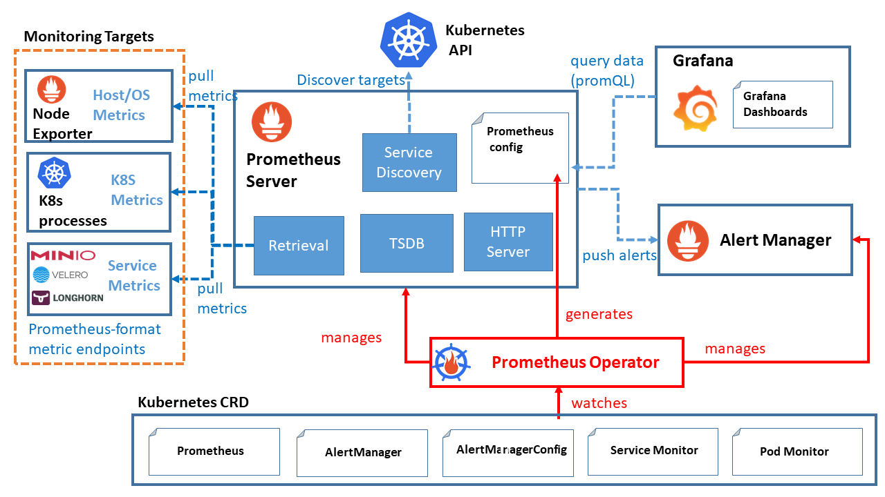

## Table of Contents:
- [Table of Contents:](#table-of-contents)
    - [Install helm:](#install-helm)
    - [Deploy and config Ingress-nginx](#deploy-and-config-ingress-nginx)
    - [Deploy and config cert-manager](#deploy-and-config-cert-manager)
    - [Deploy and config kube prometheus stack](#deploy-and-config-kube-prometheus-stack)
    - [Deploy and config loki stack](#deploy-and-config-loki-stack)
    - [Deploy and config argo-cd](#deploy-and-config-argo-cd)
    - [Deploy VPA on kube](#deploy-vpa-on-kube)
    - [Deploy and config minio](#deploy-and-config-minio)
    - [Deploy and config velero](#deploy-and-config-velero)
    - [Deploy gatekeeper on Kubernetes](#deploy-gatekeeper-on-kubernetes)
    - [Deploy gatekeeper policy](#deploy-gatekeeper-policy)

#### Install helm:

Helm is a package manager for Kubernetes that allows developers and operators to more easily configure and deploy applications on Kubernetes clusters.

Helm packages are called charts, and they contain templates of resource definitions that deploy and configure given apps with minimal effort required from the user. With templating, you can manage the chart, its settings and behavior by passing in variable definitions without modifying the actual chart. Customized resource definitions, as well as modifications to already deployed definitions, Helm automatically manages. A deployed chart, with possible customizations, is called a release.

In this tutorial, you’ll set up Helm 3 and learn how to install, upgrade, roll back, and manage charts and releases. You’ll also learn to create and package your own charts, as well as set up chart repositories, which host charts that you can install right away.

```bash
curl https://raw.githubusercontent.com/helm/helm/main/scripts/get-helm-3 | bash
helm version
```

<p align="right"><a href="#table-of-contents">🔼 Back to Top</a></p>

#### Deploy and config Ingress-nginx


Ingress-nginx is an Ingress controller for Kubernetes using NGINX as a reverse proxy and load balancer.

**Step1:** Check and change Values file:
```bash
vim ingress-nginx/helm.values.yaml
```

**Step2:** Add helm repository and update all repo
```bash
helm repo add ingress-nginx https://kubernetes.github.io/ingress-nginx
helm repo list
helm repo update
```

**Step3:** Deploy ingress nginx with helm
```bash
helm upgrade --install ingress-nginx ingress-nginx/ingress-nginx \
    --namespace ingress-nginx \
    -f ingress-nginx/helm.values.yaml \
    --create-namespace
```

**Step4:** Check resources on ingress nginx namespace
```bash
kubectl get all -n ingress-nginx
```

<p align="right"><a href="#table-of-contents">🔼 Back to Top</a></p>

#### Deploy and config cert-manager


X.509 certificate management for Kubernetes and OpenShift

cert-manager is a powerful and extensible X.509 certificate controller for Kubernetes and OpenShift workloads. It will obtain certificates from a variety of Issuers, both popular public Issuers as well as private Issuers, and ensure the certificates are valid and up-to-date, and will attempt to renew certificates at a configured time before expiry.


**Step1:** Check and change Values file
```bash
vim cert-manager/helm.values.yaml
```

**Step2:** Add helm repository and update all repo
```bash
helm repo add jetstack https://charts.jetstack.io
helm repo list
helm repo update
```

**Step3:** Deploy cert manager with helm
```bash
helm upgrade --install cert-manager jetstack/cert-manager \
    --namespace cert-manager \
    -f cert-manager/helm.values.yaml \
    --create-namespace
```

**Step4:** Check resources on cert-manager namespace
```bash
kubectl get all -n cert-manager
```

**Step5:** Check and create cluster issuer
```bash
# Check cluster issuer manifest
vim cert-manager/clusterIssuer.yaml

# deploy cluster issuer
kubectl apply -f cert-manager/clusterIssuer.yaml

# check clusterIssuer
kubectl get clusterIssuer
```

<p align="right"><a href="#table-of-contents">🔼 Back to Top</a></p>

#### Deploy and config kube prometheus stack



Prometheus is a very popular and comprehensive systems monitoring solution. It is a standalone open source project and maintained independently of any company. A big plus is the capability to monitor Kubernetes clusters as well, which tend to be pretty complex in nature. Prometheus eases the operational tasks that are required in setting up a monitoring stack.

The kube-prometheus-stack is meant for cluster monitoring, so it is pre-configured to collect metrics from all Kubernetes components. In addition to that it delivers a default set of dashboards and alerting rules. Many of the useful dashboards and alerts come from the kubernetes-mixin project.

The kube-prometheus-stack consists of three main components:

Prometheus Operator, for spinning up and managing Prometheus instances in your DOKS cluster.
Grafana, for visualizing metrics and plot data using stunning dashboards.
Alertmanager, for configuring various notifications (e.g. PagerDuty, Slack, email, etc) based on various alerts received from the Prometheus main server.

**Step1:** Check and change Values file
```bash
vim kube-prometheus-stack/helm.values.yaml
```

**Step2:** Add helm repository and update all repo
```bash
helm repo add prometheus-community https://prometheus-community.github.io/helm-charts
helm repo list
helm repo update
```

**Step3:** Deploy kube prometheus stack
```bash
helm upgrade --install prometheus-stack prometheus-community/kube-prometheus-stack \
    --namespace monitoring \
    -f kube-prometheus-stack/helm.values.yaml \
     --create-namespace
```

**Step4:** Check and deploy secret config
```bash
# Check manifest
vim kube-prometheus-stack/manifest.yaml

# Apply manifest
kubectl apply -f kube-prometheus-stack/manifest.yaml

# Check after deploy manifest
kubectl -n monitoring get secret
```

**Step5:** Check resources on monitoring namespace
```bash
# check resources on monitoring namespace
kubectl get all -n monitoring

# check secret
kubectl get secret -n monitoring

# check ingress
kubectl get ingress -n monitoring
```

<p align="right"><a href="#table-of-contents">🔼 Back to Top</a></p>

#### Deploy and config loki stack


Loki Stack is an interesting alternative to Elastic Stack for collecting and aggregating logs on Kubernetes. Loki has been designed to be very cost-effective and easy to operate. Since it does not index the contents of the logs, the usage of such resources as disk space or RAM memory is lower than for Elasticsearch

**Step1:** Check and change Values file
```bash
vim loki-stack/helm.values.yaml
```

**Step2:** Add helm repository and update all repo
```bash
helm repo add grafana https://grafana.github.io/helm-charts
helm repo list
helm repo update
```

**Step3:** Deploy loki logging
```bash
helm upgrade --install loki grafana/loki-stack \
    --namespace loki-stack \
    -f loki-stack/helm.values.yaml \
    --create-namespace
```

**Step4:** check resources on loki-stack namespace
```bash
kubectl get all -n loki-stack
```

**Add loki datastore on grafana**

<p align="right"><a href="#table-of-contents">🔼 Back to Top</a></p>

#### Deploy and config argo-cd


Argo CD is a declarative, GitOps continuous delivery tool for Kubernetes.

Application definitions, configurations, and environments should be declarative and version controlled. Application deployment and lifecycle management should be automated, auditable, and easy to understand.

**Step1:** Check and change Values file
```bash
vim argocd/helm.values.yaml
```

**Step2:** Add helm repository and update all repo
```bash
helm repo add argo https://argoproj.github.io/argo-helm
helm repo list
helm repo update
```

**Step3:** Deploy Argo-cd
```bash
helm upgrade --install argo argo/argo-cd \
    --namespace argocd \
    -f argocd/helm.values.yaml \
    --create-namespace
```

**Step4:** Check resources on argocd namespace and get admin password
```bash
# check all resource
kubectl get all -n argocd

# get admin password for argocd ui
kubectl -n argocd get secret argocd-initial-admin-secret -o jsonpath="{.data.password}" | base64 -d
```

<p align="right"><a href="#table-of-contents">🔼 Back to Top</a></p>

#### Deploy VPA on kube


The Kubernetes Vertical Pod Autoscaler automatically adjusts the CPU and memory reservations for your Pods to help "right size" your applications. This adjustment can improve cluster resource utilization and free up CPU and memory for other Pods.


**Step1:** Clone VPA repository
```bash
cd /tmp/ && git clone https://github.com/kubernetes/autoscaler.git
cd autoscaler/vertical-pod-autoscaler
```
**Step2:** Install VPA on kubernetes cluster
```bash
./hack/vpa-up.sh
```

**Step3:** Check vpa pods
```bash
kubectl -n kube-system get pod | grep vpa
```

<p align="right"><a href="#table-of-contents">🔼 Back to Top</a></p>

#### Deploy and config minio


MinIO is a high-performance, S3 compatible object store. It is built for large scale AI/ML, data lake and database workloads. It is software-defined and runs on any cloud or on-premises infrastructure. MinIO is dual-licensed under open source GNU AGPL v3 and a commercial enterprise license.


**Step1:** Check and change Values file
```bash
vim minio/helm.values.yaml
```

**Step2:** Add helm repository and update all repo
```bash
helm repo add minio https://charts.min.io/
helm repo list
helm repo update
```

**Step3:** Deploy Minio
```bash
helm upgrade --install minio minio/minio \
    --namespace minio \
    -f minio/helm.values.yaml \
    --create-namespace
```

**Step4:** check and deploy ingress resource
```bash
# deploy minio ingress and secret
kubectl apply -f minio/manifest.yaml

# check ingress and secret
kubectl get ingress,secret -n minio
```

**Step5:** Check resources on minio namespace and get auth
```bash
# check resources on minio namespace
kubectl get all -n minio

# get access key and secret key
ACCESS_KEY=$(kubectl -n minio get secret minio -o jsonpath="{.data.accesskey}" | base64 --decode)
SECRET_KEY=$(kubectl -n minio get secret minio -o jsonpath="{.data.secretkey}" | base64 --decode)
```

<p align="right"><a href="#table-of-contents">🔼 Back to Top</a></p>


#### Deploy and config velero

Velero is an open source tool to safely backup and restore, perform disaster recovery, and migrate Kubernetes cluster resources and persistent volumes.

**Step1:** Check and change Values file
```bash
vim  velero/helm.values.yaml
```

**Step2:** Add helm repository and update all repo
```bash
helm repo add vmware-tanzu https://vmware-tanzu.github.io/helm-charts/
helm repo list
helm repo update
```

**Step3:** Deploy velero
```bash
helm upgrade --install velero vmware-tanzu/velero \
    --namespace velero \
    -f velero/helm.values.yaml \
    --create-namespace
```

**Step4:** check all resource on velero ns
```bash
kubectl get all -n velero
```

#### Deploy gatekeeper on Kubernetes


Gatekeeper is an admission controller that validates requests to create and update Pods on Kubernetes clusters, using the Open Policy Agent (OPA).

Using Gatekeeper allows administrators to define policies with a constraint, which is a set of conditions that permit or deny deployment behaviors in Kubernetes. You can then enforce these policies on a cluster using a ConstraintTemplate. This document provides examples for restricting the security capabilities of workloads to ensure enforce, test, and audit security policies using Gatekeeper.

**Step1:** Check and change Values file
```bash
vim  gatekeeper/helm.values.yaml
```

**Step2:** Add helm repository and update all repo
```bash
helm repo add gatekeeper https://open-policy-agent.github.io/gatekeeper/charts
helm repo list
helm repo update
```

**Step3:** Deploy gatekeeper
```bash
helm upgrade --install gatekeeper gatekeeper/gatekeeper \
    --namespace gatekeeper-system  \
    -f gatekeeper/helm.values.yaml \
    --create-namespace
```

**Step4:** check resources on gatekeeper-system namespace
```bash
kubectl get all -n gatekeeper-system
```

#### Deploy gatekeeper policy
```bash
###############################
# url: https://open-policy-agent.github.io/gatekeeper-library/website/validation/host-filesystem/
# hostpath Template
kubectl apply -f https://raw.githubusercontent.com/open-policy-agent/gatekeeper-library/master/library/pod-security-policy/host-filesystem/template.yaml

# hostpath constraint example
kubectl apply -f https://raw.githubusercontent.com/open-policy-agent/gatekeeper-library/master/library/pod-security-policy/host-filesystem/samples/psp-host-filesystem/constraint.yaml

###############################
# url: https://open-policy-agent.github.io/gatekeeper-library/website/validation/host-network-ports
# Host Networking Ports
kubectl apply -f https://raw.githubusercontent.com/open-policy-agent/gatekeeper-library/master/library/pod-security-policy/host-network-ports/template.yaml

# host networking constraint example
kubectl apply -f https://raw.githubusercontent.com/open-policy-agent/gatekeeper-library/master/library/pod-security-policy/host-network-ports/samples/psp-host-network-ports/constraint.yaml

###############################
# URL: https://open-policy-agent.github.io/gatekeeper-library/website/validation/volumes
# Volume Types template
kubectl apply -f https://raw.githubusercontent.com/open-policy-agent/gatekeeper-library/master/library/pod-security-policy/volumes/template.yaml

# volume type constraint example
kubectl apply -f https://raw.githubusercontent.com/open-policy-agent/gatekeeper-library/master/library/pod-security-policy/volumes/samples/psp-volume-types/constraint.yaml

###############################
# URL: https://open-policy-agent.github.io/gatekeeper-library/website/validation/privileged-containers
# Privileged Container template
kubectl apply -f https://raw.githubusercontent.com/open-policy-agent/gatekeeper-library/master/library/pod-security-policy/privileged-containers/template.yaml

# Privileged Container constraint example
kubectl apply -f https://raw.githubusercontent.com/open-policy-agent/gatekeeper-library/master/library/pod-security-policy/privileged-containers/samples/psp-privileged-container/constraint.yaml

###############################
```
