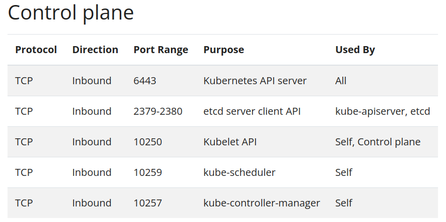
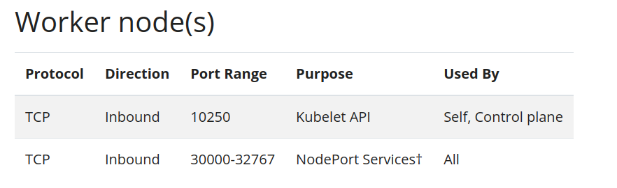

# Install kubernetes cluster with kubeadm

This document is for installing and configuring a Kubernetes cluster with kubeadm. This cluster uses CNI Calico and CRI Containerd.

#
## Step 0: Before you begin:
To follow this guide, you need:

- One or more machines running a deb/rpm-compatible Linux OS; for example: Ubuntu or CentOS.
- 2 GiB or more of RAM per machine--any less leaves little room for your apps.
- At least 2 CPUs on the machine that you use as a control-plane node.
- Full network connectivity among all machines in the cluster. You can use either a public or a private network.

You also need to use a version of kubeadm that can deploy the version of Kubernetes that you want to use in your new cluster.

Kubernetes' version and version skew support policy applies to kubeadm as well as to Kubernetes overall. Check that policy to learn about what versions of Kubernetes and kubeadm are supported. This page is written for Kubernetes v1.28.

The kubeadm tool's overall feature state is General Availability (GA). Some sub-features are still under active development. The implementation of creating the cluster may change slightly as the tool evolves, but the overall implementation should be pretty stable.

#
## Step 1: Install requirements tools and dependency On all Servers:

##### Update, install basic tools, OS hardening, and OS tuning with preparing ansible playbook.

##### Install requirements basic tools:

```bash
apt install -y wget git vim bash-completion curl htop net-tools dnsutils \
               atop sudo software-properties-common telnet axel jq iotop \
               ca-certificates curl gnupg lsb-release apt-transport-https gpg
```

##### Install and configure Containerd service:

Add Docker’s official GPG key:
```bash
sudo mkdir -p /etc/apt/keyrings && sudo chmod -R 0755 /etc/apt/keyrings
curl -fsSL "https://download.docker.com/linux/debian/gpg" | gpg --dearmor --yes -o /etc/apt/keyrings/docker.gpg
```

OR Download docker.gpg from `store.DockerMe.ir`
```bash
curl -fsSL "https://store.dockerme.ir/Software/docker.gpg" | gpg --dearmor --yes -o /etc/apt/keyrings/docker.gpg
```

**NOTE:** if your servers are in Iran too, you should do this with an HTTP proxy; otherwise, you will get a 403 error.
```bash
chmod a+r /etc/apt/keyrings/docker.gpg
```

Use the following command to set up the repository:
```bash
echo "deb [arch=amd64 signed-by=/etc/apt/keyrings/docker.gpg] https://download.docker.com/linux/debian bullseye stable" > /etc/apt/sources.list.d/docker.list
cat /etc/apt/sources.list.d/docker.list
```

If apt mirror repository, add this line instead. We are using mirror repository `repo.mecan.ir`
```bash
echo "deb [arch=amd64 signed-by=/etc/apt/keyrings/docker.gpg] https://repo.mecan.ir/repository/debian-docker bookworm stable" > /etc/apt/sources.list.d/docker.list
cat /etc/apt/sources.list.d/docker.list
```

Update cache repository and install containerd:
```bash
sudo apt-get update

# Install containerd service
sudo apt-get install containerd.io

# Start and enable Containerd service
sudo systemctl enable containerd
sudo systemctl restart containerd
sudo systemctl status containerd
```

Configure the containerd service to change the Cgroup driver:
```bash
sudo mkdir -p /etc/containerd
sudo containerd config default | sudo tee /etc/containerd/config.toml
sudo sed -i 's/SystemdCgroup = false/SystemdCgroup = true/g' /etc/containerd/config.toml
sudo cat /etc/containerd/config.toml | grep SystemdCgroup
```

Configure the containerd service to set the mirror registry:
If using Docker and other registry mirror, add these lines after registry.mirror section
- config path: `/etc/containerd/config.toml`
- after this pattern: `[plugins."io.containerd.grpc.v1.cri".registry.mirrors]`

```bash
        [plugins."io.containerd.grpc.v1.cri".registry.mirrors."docker.io"]
          endpoint = ["https://hub.mecan.ir"]
        [plugins."io.containerd.grpc.v1.cri".registry.mirrors."registry.k8s.io"]
          endpoint = ["https://k8s.mecan.ir"]
        [plugins."io.containerd.grpc.v1.cri".registry.mirrors."quay.io"]
          endpoint = ["https://quay.mecan.ir"]
        [plugins."io.containerd.grpc.v1.cri".registry.mirrors."mirror.gcr.io"]
          endpoint = ["https://gcr.mecan.ir"]
```


**Optional:** Create containerd systemd file and set proxy
```
# Check and create directory path
DIR_PATH=/etc/systemd/system/containerd.service.d
[ -d "${DIR_PATH}" ] || sudo mkdir "${DIR_PATH}"

# Create config file
cat <<EOF >${DIR_PATH}/http-proxy.conf
[Service]
Environment="HTTP_PROXY=http://asir.mecan.ir:8123"
Environment="HTTPS_PROXY=http://asir.mecan.ir:8123"
Environment="NO_PROXY=localhost,127.0.0.1,10.233.0.0/18,10.233.64.0/18,.mecan.ir"
EOF

# Check config file
cat ${DIR_PATH}/http-proxy.conf
```

After all configuration reload systemd file and restart containerd service:
```bash
sudo systemctl daemon-reload
sudo systemctl restart containerd
sudo systemctl status containerd
```

#
## Step2: Install and configuration kubernetes tools and requirements on all servers:

Add sysctl settings:
```bash
cat >>/etc/sysctl.d/kubernetes.conf<<EOF
net.bridge.bridge-nf-call-ip6tables = 1
net.bridge.bridge-nf-call-iptables = 1
EOF
sysctl --system >/dev/null 2>&1
```

Enable netfilter:
```bash
modprobe br_netfilter
```

Disable and turn off SWAP:
```bash
sed -i '/swap/d' /etc/fstab
swapoff -a
```
Update the apt package index and install packages needed to use the Kubernetes apt repository:
```bash
sudo apt-get update
# apt-transport-https may be a dummy package; if so, you can skip that package
sudo apt-get install -y apt-transport-https ca-certificates curl gpg
```

Download the Google Cloud public signing key:
```bash
# If the directory `/etc/apt/keyrings` does not exist, it should be created before the curl command, read the note below.
# sudo mkdir -p -m 755 /etc/apt/keyrings
curl -fsSL https://pkgs.k8s.io/core:/stable:/v1.30/deb/Release.key | sudo gpg --dearmor -o /etc/apt/keyrings/kubernetes-apt-keyring.gpg

# OR Download from Store.DockerMe.ir
curl -fsSL https://repo.mecan.ir/repository/apt-kube/v1.30/deb/Release.key | sudo gpg --dearmor -o /etc/apt/keyrings/kubernetes-apt-keyring.gpg
# Check gpg key
sudo ls -alh /etc/apt/keyrings/kubernetes-apt-keyring.gpg
```

Add the Kubernetes apt repository:
```bash
# This overwrites any existing configuration in /etc/apt/sources.list.d/kubernetes.list
echo 'deb [signed-by=/etc/apt/keyrings/kubernetes-apt-keyring.gpg] https://pkgs.k8s.io/core:/stable:/v1.30/deb/ /' | sudo tee /etc/apt/sources.list.d/kubernetes.list
cat /etc/apt/sources.list.d/kubernetes.list
apt-get update -y
```

If apt mirror repository, add this line instead. We are using mirror repository `repo.mecan.ir`
```bash
# for kubernetes 1.30
echo 'deb [signed-by=/etc/apt/keyrings/kubernetes-apt-keyring.gpg] https://repo.mecan.ir/repository/apt-kube/v1.30/deb/ /' | sudo tee /etc/apt/sources.list.d/kubernetes.list
cat /etc/apt/sources.list.d/kubernetes.list

apt-get update
```

Check and install Kubernetes kubeadm, kubelet and kubectl:
```bash
# check package version:
apt-cache policy kubelet kubectl kubeadm

# install kubernetes tools:
sudo apt-get install -y kubelet kubeadm kubectl

# check install versions:
kubelet --version
kubeadm version
kubectl version
```

Hold Kubernetes packages to pin their version:
```bash
sudo apt-mark hold kubelet kubeadm kubectl
```

Enable and start kubelet service:
```bash
systemctl enable kubelet
systemctl start kubelet
systemctl status kubelet
```

Create crictl config file for using containerd:
```
cat << EOF > /etc/crictl.yaml
runtime-endpoint: "unix:///run/containerd/containerd.sock"
timeout: 0
debug: false
EOF

# Check config file
cat /etc/crictl.yaml

# check crictl command and mirror containerd registry
crictl info
```

##### Create access on Kubernetes nodes for communication between all nodes:
**Ports and Protocols:**
When running Kubernetes in an environment with strict network boundaries, such as on-premises datacenter with physical network firewalls or Virtual Networks in Public Cloud, it is useful to be aware of the ports and protocols used by Kubernetes components.



Although etcd ports are included in control plane section, you can also host your own etcd cluster externally or on custom ports.



All default port numbers can be overridden. When custom ports are used those ports need to be open instead of defaults mentioned here.

One common example is API server port that is sometimes switched to 443. Alternatively, the default port is kept as is and API server is put behind a load balancer that listens on 443 and routes the requests to API server on the default port.

**NOTE:** The best approach is to access the cluster node IPs through iptables. For example run these command on all servers:
```bash
iptables -A INPUT -s ${master1_ip} -j ACCEPT -m comment --comment "The Trusted ${master1_name}"
iptables -A INPUT -s ${master2_ip} -j ACCEPT -m comment --comment "The Trusted ${master2_name}"
iptables -A INPUT -s ${master3_ip} -j ACCEPT -m comment --comment "The Trusted ${master3_name}"
iptables -A INPUT -s ${worker1_ip} -j ACCEPT -m comment --comment "The Trusted ${worker1_name}"
iptables -A INPUT -s ${worker2_ip} -j ACCEPT -m comment --comment "The Trusted ${worker2_name}"
```

**NOTE:** It is better to persist the iptables rule in the iptables config file. Default path `/etc/iptables/rules.v4`

#
## Step3: Set up load balancer configuration on HAProxy service

We are using `vip.kubeadm.mecan.ir` domain for api-server load balancer.
api-server port numbers 6443. we are using 3 api-server for load balancing (LB) and high availability (HA).

### [Load balancer doc](../load-balancer/ReadMe.md)

#
## Step4: Create kubeadm config and prepare the first master node. Only on node `master1`

##### Create the kubeadm config with specific options and Kubernetes version:

Please change all variables and set your node IPs and names. for example:
```bash
# set specific variables content
vip_ip=192.168.200.10
master1_ip=192.168.200.11
master2_ip=192.168.200.12
master3_ip=192.168.200.13
domain_name=mecan.ir
master1_name=master1
master2_name=master2
master3_name=master3
vip_api_name=vip.kubeadm
```

After all variables set run below command:

```bash
cat <<EOT >/opt/kubeadm_config.yml
apiVersion: kubeadm.k8s.io/v1beta3
bootstrapTokens:
- groups:
  - system:bootstrappers:kubeadm:default-node-token
  token: abcdef.0123456789abcdef
  ttl: 24h0m0s
  usages:
  - signing
  - authentication
kind: InitConfiguration
localAPIEndpoint:
  advertiseAddress: ${master1_ip}
  bindPort: 6443
nodeRegistration:
  criSocket: unix:///var/run/containerd/containerd.sock
  imagePullPolicy: IfNotPresent
  name: ${master1_name}
  taints:
  - effect: NoSchedule
    key: node-role.kubernetes.io/master
---
apiServer:
  timeoutForControlPlane: 4m0s
  extraArgs:
    authorization-mode: "Node,RBAC"
  certSANs:
    - "${vip_ip}"
    - "${master1_ip}"
    - "${master2_ip}"
    - "${master3_ip}"
    - "${master1_name}"
    - "${master2_name}"
    - "${master3_name}"
    - "${vip_api_name}"
    - "${vip_api_name}.${domain_name}"
    - "${master1_name}.${domain_name}"
    - "${master2_name}.${domain_name}"
    - "${master3_name}.${domain_name}"
apiVersion: kubeadm.k8s.io/v1beta3
certificatesDir: /etc/kubernetes/pki
clusterName: kubernetes
etcd:
  local:
    imageRepository: "quay.io/coreos"
    imageTag: "v3.5.9"
    dataDir: "/var/lib/etcd"
    serverCertSANs:
      - "${master1_ip}"
      - "${master2_ip}"
      - "${master3_ip}"
      - "${vip_ip}"
      - "${master1_name}"
      - "${master2_name}"
      - "${master3_name}"
      - "${vip_api_name}"
      - "${vip_api_name}.${domain_name}"
      - "${master1_name}.${domain_name}"
      - "${master2_name}.${domain_name}"
      - "${master3_name}.${domain_name}"
    peerCertSANs:
      - "${master1_ip}"
      - "${master2_ip}"
      - "${master3_ip}"
      - "${vip_ip}"
      - "${master1_name}"
      - "${master2_name}"
      - "${master3_name}"
      - "${vip_api_name}"
      - "${vip_api_name}.${domain_name}"
      - "${master1_name}.${domain_name}"
      - "${master2_name}.${domain_name}"
      - "${master3_name}.${domain_name}"
imageRepository: registry.k8s.io
kind: ClusterConfiguration
kubernetesVersion: 1.30.5
controlPlaneEndpoint: "${vip_api_name}.${domain_name}:6443"
networking:
  dnsDomain: cluster.local
  serviceSubnet: "10.233.0.0/18"
  podSubnet: "10.233.64.0/18"
---
apiVersion: kubelet.config.k8s.io/v1beta1
kind: KubeletConfiguration
cgroupDriver: systemd
EOT

# check kubeadm config file
cat /opt/kubeadm_config.yml
```

##### Before initializing the Kubernetes cluster, preparing the required container images:

This step is optional and only applies in case you wish kubeadm init and kubeadm join to not download the default container images which are hosted at `registry.k8s.io`.

Kubeadm has commands that can help you pre-pull the required images when creating a cluster without an internet connection on its nodes. See Running kubeadm without an internet connection for more details.

Kubeadm allows you to use a custom image repository for the required images. See Using custom images for more details.

Get images list:
```bash
kubeadm config images list --config /opt/kubeadm_config.yml
```

Pull all images:
```bash
kubeadm config images pull --config /opt/kubeadm_config.yml
```

##### Initialize the first Kubernetes master node with kubeadm config:

```bash
kubeadm init --config /opt/kubeadm_config.yml
```
kubeadm init first runs a series of prechecks to ensure that the machine is ready to run Kubernetes. These prechecks expose warnings and exit on errors. kubeadm init then downloads and installs the cluster control plane components. This may take several minutes. After it finishes you should see:

```bash
Your Kubernetes control-plane has initialized successfully!

To start using your cluster, you need to run the following as a regular user:

  mkdir -p $HOME/.kube
  sudo cp -i /etc/kubernetes/admin.conf $HOME/.kube/config
  sudo chown $(id -u):$(id -g) $HOME/.kube/config

You should now deploy a Pod network to the cluster.
Run "kubectl apply -f [podnetwork].yaml" with one of the options listed at:
  /docs/concepts/cluster-administration/addons/

You can now join any number of machines by running the following on each node
as root:

  kubeadm join <control-plane-host>:<control-plane-port> --token <token> --discovery-token-ca-cert-hash sha256:<hash>
```

##### After initializing master1 run these commands for create kubectl config file and check kubernetes ca certificate:

create kubectl config file:
```bash
mkdir -p $HOME/.kube
sudo cp -i /etc/kubernetes/admin.conf $HOME/.kube/config
sudo chown $(id -u):$(id -g) $HOME/.kube/config
```

kubectl bash completion:
```bash
# install bash-completion
apt-get install bash-completion

# enable kubectl autocompletion:
echo 'source <(kubectl completion bash)' >>~/.bashrc
kubectl completion bash >/etc/bash_completion.d/kubect

# if you have an alias for kubectl, you can extend shell completion to work with that alias:
echo 'alias k=kubectl' >>~/.bashrc
echo 'complete -F __start_kubectl k' >>~/.bashrc
```

##### Other kubectl tips:
- [kubectl tips](../../kubectl/ReadMe.md)
- [kubectl smaple commands](../../kubectl/kubectl-sample-command.md)

kubeadm bash completion:
```bash
# enable kubeadm autocompletion:
echo 'source <(kubeadm completion bash)' >>~/.bashrc
kubeadm completion bash > /etc/bash_completion.d/kubeadm
```

check kubernetes ca certificate:
```bash
kubeadm certs check-expiration
openssl x509 -text -noout -in /etc/kubernetes/pki/apiserver.crt
```

##### Then install Calico for kubernetes CNI with kubectl commands.

```bash
# install calico CNI:
kubectl create -f https://docs.tigera.io/calico/latest/manifests/calico.yaml

# check calico pods on kube-system namespace:
kubectl -n kube-system get pod | grep calico
```
##### After deploying the CNI setup on master1 is complete, then join other master nodes and worker nodes to the cluster


#
## Step5: Join other master and worker nodes to kubernetes cluster. on other master and worker nodes.

##### First, copy all certificates from master1 to other master nodes. [Only Master Node]
All certificate store to this path: `/etc/kubernetes/pki`
Sample command for copy all certificates over ssh:
```bash
# copy certificate directory to localhost:
scp -r adm-master1:/etc/kubernetes/pki .

# copy certificate directory to master2 and master3:
scp -r pki adm-master2:/etc/kubernetes/
scp -r pki adm-master3:/etc/kubernetes/
```

##### Second, create the join command:

```bash
# create join command:
kubeadm token create --print-join-command

# sample output:
kubeadm join 37.32.9.196:6443 --token  <token> --discovery-token-ca-cert-hash sha256:<hash>
```
This command is used to join a node to the cluster. If a master node is joining the cluster, run this command with the option `--control-plane`.

## Setting up the Kubernetes cluster is complete. Let's enjoy!
