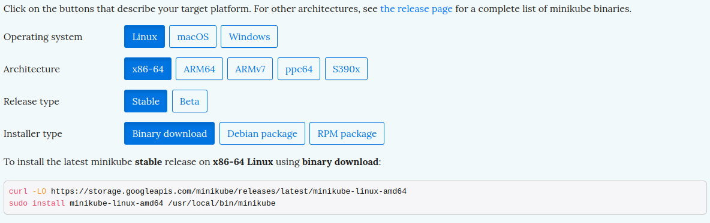

# [Minikube](https://minikube.sigs.k8s.io/docs/)

minikube quickly sets up a local Kubernetes cluster on macOS, Linux, and Windows. We proudly focus on helping application developers and new Kubernetes users.


#
#### Highlights:

- Supports the latest Kubernetes release (+6 previous minor versions)
- Cross-platform (Linux, macOS, Windows)
- Deploy as a VM, a container, or on bare-metal
- Multiple container runtimes (CRI-O, containerd, docker)
- Direct API endpoint for blazing fast image load and build
- Advanced features such as LoadBalancer, filesystem mounts, FeatureGates, and network policy
- Addons for easily installed Kubernetes applications
- Supports common CI environments

#
#### minikube start
minikube is local Kubernetes, focusing on making it easy to learn and develop for Kubernetes.
All you need is Docker (or similarly compatible) container or a Virtual Machine environment, and Kubernetes is a single command away: minikube start


#### What you’ll need
- 2 CPUs or more
- 2GB of free memory
- 20GB of free disk space
- Internet connection
- Container or virtual machine manager, such as: Docker, QEMU, Hyperkit, Hyper-V, KVM, Parallels, Podman, VirtualBox, or VMware Fusion/Workstation

#
#### 1. Installation


To install the latest minikube stable release on x86-64 Linux using binary download:
```bash
curl -LO https://storage.googleapis.com/minikube/releases/latest/minikube-linux-amd64
sudo install minikube-linux-amd64 /usr/local/bin/minikube
```

To install the latest minikube stable release on x86-64 Linux using Debian package:
```bash
curl -LO https://storage.googleapis.com/minikube/releases/latest/minikube_latest_amd64.deb
sudo dpkg -i minikube_latest_amd64.deb
```


#### 2. Start your cluster
From a terminal with administrator access (but not logged in as root), run:
```bash
minikube start
```
If minikube fails to start, see the drivers page for help setting up a compatible container or virtual-machine manager.


#### 3. Interact with your cluster

If you already have kubectl installed, you can now use it to access your shiny new cluster:
```bash
kubectl get po -A
```

Alternatively, minikube can download the appropriate version of kubectl and you should be able to use it like this:
```bash
minikube kubectl -- get po -A
```
You can also make your life easier by adding the following to your shell config:
```bash
alias kubectl="minikube kubectl --"
```
Initially, some services such as the storage-provisioner, may not yet be in a Running state. This is a normal condition during cluster bring-up, and will resolve itself momentarily. For additional insight into your cluster state, minikube bundles the Kubernetes Dashboard, allowing you to get easily acclimated to your new environment:
```bash
minikube dashboard
```

#### 4. Deploy applications

Create a sample deployment and expose it on port 8080:
```bash
kubectl create deployment hello-minikube --image=kicbase/echo-server:1.0
kubectl expose deployment hello-minikube --type=NodePort --port=8080
```

It may take a moment, but your deployment will soon show up when you run:
```bash
kubectl get services hello-minikube
```

The easiest way to access this service is to let minikube launch a web browser for you:
```bash
minikube service hello-minikube
```

Alternatively, use kubectl to forward the port:
```bash
kubectl port-forward service/hello-minikube 7080:8080
```
Tada! Your application is now available at http://localhost:7080/.

You should be able to see the request metadata in the application output. Try changing the path of the request and observe the changes. Similarly, you can do a POST request and observe the body show up in the output.

#
To access a LoadBalancer deployment, use the “minikube tunnel” command. Here is an example deployment:
```bash
kubectl create deployment balanced --image=kicbase/echo-server:1.0
kubectl expose deployment balanced --type=LoadBalancer --port=8080
```

In another window, start the tunnel to create a routable IP for the ‘balanced’ deployment:
```bash
minikube tunnel
```

To find the routable IP, run this command and examine the EXTERNAL-IP column:
```bash
kubectl get services balanced
```
Your deployment is now available at <EXTERNAL-IP>:8080

#
Enable ingress addon:
```bash
minikube addons enable ingress
```

The following example creates simple echo-server services and an Ingress object to route to these services.
```bash
kind: Pod
apiVersion: v1
metadata:
  name: foo-app
  labels:
    app: foo
spec:
  containers:
    - name: foo-app
      image: 'kicbase/echo-server:1.0'
---
kind: Service
apiVersion: v1
metadata:
  name: foo-service
spec:
  selector:
    app: foo
  ports:
    - port: 8080
---
kind: Pod
apiVersion: v1
metadata:
  name: bar-app
  labels:
    app: bar
spec:
  containers:
    - name: bar-app
      image: 'kicbase/echo-server:1.0'
---
kind: Service
apiVersion: v1
metadata:
  name: bar-service
spec:
  selector:
    app: bar
  ports:
    - port: 8080
---
apiVersion: networking.k8s.io/v1
kind: Ingress
metadata:
  name: example-ingress
spec:
  rules:
    - http:
        paths:
          - pathType: Prefix
            path: /foo
            backend:
              service:
                name: foo-service
                port:
                  number: 8080
          - pathType: Prefix
            path: /bar
            backend:
              service:
                name: bar-service
                port:
                  number: 8080
---
```
Apply the contents
```bash
kubectl apply -f https://storage.googleapis.com/minikube-site-examples/ingress-example.yaml
```

Wait for ingress address
```bash
kubectl get ingress
NAME              CLASS   HOSTS   ADDRESS          PORTS   AGE
example-ingress   nginx   *       <your_ip_here>   80      5m45s
```
Note for Docker Desktop Users:

To get ingress to work you’ll need to open a new terminal window and run minikube tunnel and in the following step use 127.0.0.1 in place of <ip_from_above>.

Now verify that the ingress works
```bash
$ curl <ip_from_above>/foo
Request served by foo-app
...

$ curl <ip_from_above>/bar
Request served by bar-app
...
```

#### 5. Manage your cluster
Pause Kubernetes without impacting deployed applications:
```bash
minikube pause
```

Unpause a paused instance:
```bash
minikube unpause
```

Halt the cluster:
```bash
minikube stop
```

Change the default memory limit (requires a restart):
```bash
minikube config set memory 9001
```

Browse the catalog of easily installed Kubernetes services:
```bash
minikube addons list
```

Create a second cluster running an older Kubernetes release:
```bash
minikube start -p aged --kubernetes-version=v1.16.1
```

Delete all of the minikube clusters:
```bash
minikube delete --all
```

#
#### [Addons](https://minikube.sigs.k8s.io/docs/handbook/addons/)
Details on maintained minikube addons
minikube has a built-in list of applications and services that may be easily deployed, such as Istio or Ingress. To list the available addons for your version of minikube:
```bash
minikube addons list
```

#
#### Selecting a Kubernetes version
By default, minikube installs the latest stable version of Kubernetes that was available at the time of the minikube release. You may select a different Kubernetes release by using the --kubernetes-version flag, for example:

```bash
minikube start --kubernetes-version=v1.11.10
```

minikube follows the Kubernetes Version and Version Skew Support Policy, so we guarantee support for the latest build for the last 3 minor Kubernetes releases. When practical, minikube aims to support older releases as well so that users can emulate legacy environments.

#
#### Modifying Kubernetes defaults
The kubeadm bootstrapper can be configured by the --extra-config flag on the minikube start command. It takes a string of the form component.key=value where component is one of the strings

- kubeadm
- kubelet
- apiserver
- controller-manager
- scheduler

and key=value is a flag=value pair for the component being configured. For example,

```bash
minikube start --extra-config=apiserver.v=10 --extra-config=kubelet.max-pods=100
```

For instance, to allow Kubernetes to launch on an unsupported Docker release:

```bash
minikube start --extra-config=kubeadm.ignore-preflight-errors=SystemVerification
```

#
#### Runtime configuration
The default container runtime in minikube varies. You can select one explicitly by using:

```bash
minikube start --container-runtime=docker
```

Options available are:

- containerd
- cri-o
- docker

See https://kubernetes.io/docs/setup/production-environment/container-runtimes/

#
#### Environment variables
minikube supports passing environment variables instead of flags for every value listed in minikube config. This is done by passing an environment variable with the prefix MINIKUBE_.

For example the `minikube start --iso-url="$ISO_URL"` flag can also be set by setting the MINIKUBE_ISO_URL="$ISO_URL" environment variable.

#
#### Dashboard
minikube has integrated support for the Kubernetes Dashboard UI.

Overview:

The Dashboard is a web-based Kubernetes user interface. You can use it to:

- deploy containerized applications to a Kubernetes cluster
- troubleshoot your containerized application
- manage the cluster resources
- get an overview of applications running on your cluster
- creating or modifying individual Kubernetes resources (such as Deployments, Jobs, DaemonSets, etc)

For example, you can scale a Deployment, initiate a rolling update, restart a pod or deploy new applications using a deploy wizard.

Basic usage:
To access the dashboard:

```bash
minikube dashboard
```

This will enable the dashboard add-on, and open the proxy in the default web browser.

It’s worth noting that web browsers generally do not run properly as the root user, so if you are in an environment where you are running as root, see the URL-only option.

To stop the proxy (leaves the dashboard running), abort the started process (`Ctrl+C`).

Getting just the dashboard URL:
If you don’t want to open a web browser, the dashboard command can also simply emit a URL:

```bash
minikube dashboard --url
```

#
#### Pushing images:
comparing 8 ways to push your image into a minikube cluster.
Glossary:

- **Pull** means downloading a container image directly from a remote registry.
- **Push** means uploading a container image directly to a remote registry.
- **Load** takes an image that is available as an archive, and makes it available in the cluster.
- **Save** saves an image into an archive.
- **Build** takes a “build context” (directory) and creates a new image in the cluster from it.
- **Tag** means assigning a name and tag.

##### Push images using ‘cache’ command.
From your host, you can push a Docker image directly to minikube. This image will be cached and automatically pulled into all future minikube clusters created on the machine

```bash
minikube cache add alpine:latest
```

The add command will store the requested image to `$MINIKUBE_HOME/cache/images`, and load it into the minikube cluster’s container runtime environment automatically.

minikube refreshes the cache images on each start. However to reload all the cached images on demand, run this command :

```bash
minikube cache reload
```

To display images you have added to the cache:

```bash
minikube cache list
```

This listing will not include the images minikube’s built-in system images.
```bash
minikube cache delete <image name>
```

#
#### Proxies and VPNs
How to use minikube with a VPN or HTTP/HTTPS Proxy
minikube requires access to the internet via HTTP, HTTPS, and DNS protocols.

##### Proxy:
If a HTTP proxy is required to access the internet, you may need to pass the proxy connection information to both minikube and Docker using environment variables:

- **HTTP_PROXY** - The URL to your HTTP proxy
- **HTTPS_PROXY** - The URL to your HTTPS proxy
- **NO_PROXY** - A comma-separated list of hosts which should not go through the proxy.

The NO_PROXY variable here is important: Without setting it, minikube may not be able to access resources within the VM. minikube uses four default IP ranges, which should not go through the proxy:

- **192.168.59.0/24**: Used by the minikube VM. Configurable for some hypervisors via --host-only-cidr
- **192.168.39.0/24**: Used by the minikube kvm2 driver.
- **192.168.49.0/24**: Used by the minikube docker driver’s first cluster.
- **10.96.0.0/12**: Used by service cluster IP’s. Configurable via --service-cluster-ip-range

One important note: If NO_PROXY is required by non-Kubernetes applications, such as Firefox or Chrome, you may want to specifically add the minikube IP to the comma-separated list, as they may not understand IP ranges (#3827).

##### Example Usage:

```bash
export HTTP_PROXY=http://<proxy hostname:port>
export HTTPS_PROXY=https://<proxy hostname:port>
export NO_PROXY=localhost,127.0.0.1,10.96.0.0/12,192.168.59.0/24,192.168.49.0/24,192.168.39.0/24

minikube start
```

To make the exported variables permanent, consider adding the declarations to ~/.bashrc or wherever your user-set environment variables are stored.

#
#### Enabling Calico on a minikube cluster
It is possible to replace the CNI on a running minikube cluster, but it is significantly easier to simply append the `--cni calico` flag to the minikube start command when following the instructions on the Get Started! page to build the minikube cluster with Calico installed from the outset.

