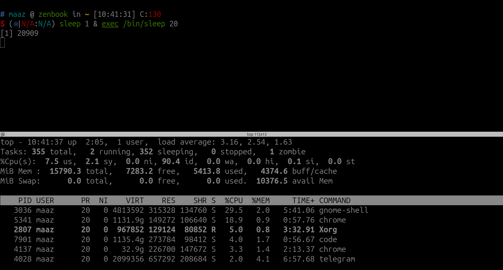

# Table of Contents:
- [Table of Contents:](#table-of-contents)
- [Environment Setup:](#environment-setup)
  - [Installing Vagran on Ubuntu/Debian](#installing-vagran-on-ubuntudebian)
    - [Add the HashiCorp GPG key.](#add-the-hashicorp-gpg-key)
    - [Add the official HashiCorp Linux repository.](#add-the-official-hashicorp-linux-repository)
    - [Update and install.](#update-and-install)
  - [Installing Packer on Ubuntu/Debian](#installing-packer-on-ubuntudebian)
    - [Add the HashiCorp GPG key.](#add-the-hashicorp-gpg-key-1)
    - [Add the official HashiCorp Linux repository.](#add-the-official-hashicorp-linux-repository-1)
    - [Update and install.](#update-and-install-1)
  - [Add public box in vagrant](#add-public-box-in-vagrant)
    - [Using Public Boxes](#using-public-boxes)
    - [Adding a bento box to Vagrant](#adding-a-bento-box-to-vagrant)
    - [Using a bento box in a Vagrantfile](#using-a-bento-box-in-a-vagrantfile)
  - [Building Boxes](#building-boxes)
    - [Requirements: install packer, vagrant and virtualbox](#requirements-install-packer-vagrant-and-virtualbox)
    - [clone bento project](#clone-bento-project)
    - [To build an Ubuntu 24.04 box for only the VirtualBox provider](#to-build-an-ubuntu-2404-box-for-only-the-virtualbox-provider)
- [Processes](#processes)
  - [Viewing Processes](#viewing-processes)
  - [Running Processes in the Background](#running-processes-in-the-background)
  - [Bringing Processes to the Foreground](#bringing-processes-to-the-foreground)
  - [Controlling Background and Foreground Processes](#controlling-background-and-foreground-processes)
  - [Daemons in Linux](#daemons-in-linux)
  - [Managing Daemons with systemd](#managing-daemons-with-systemd)
  - [Creating a Custom Daemon](#creating-a-custom-daemon)
  - [Process States](#process-states)
  - [Create Zombie Process](#create-zombie-process)
  - [Number of Threads for a Process](#number-of-threads-for-a-process)
- [apt](#apt)
- [SSH](#ssh)
- [Iptabels](#iptabels)
  - [Iptables scenario 1:](#iptables-scenario-1)
  - [Iptables scenario 2:](#iptables-scenario-2)
  - [SSH port knocking setup using `knockd` and `iptables`](#ssh-port-knocking-setup-using-knockd-and-iptables)

# Environment Setup:

## Installing Vagran on Ubuntu/Debian
### Add the HashiCorp GPG key.
```bash
wget -O- https://apt.releases.hashicorp.com/gpg | sudo gpg --dearmor -o /usr/share/keyrings/hashicorp-archive-keyring.gpg
```
### Add the official HashiCorp Linux repository.
```bash
echo "deb [signed-by=/usr/share/keyrings/hashicorp-archive-keyring.gpg] https://apt.releases.hashicorp.com $(lsb_release -cs) main" | sudo tee /etc/apt/sources.list.d/hashicorp.list
```
### Update and install.
```bash
sudo apt update && sudo apt install vagrant
```
## Installing Packer on Ubuntu/Debian
### Add the HashiCorp GPG key.
```bash
curl -fsSL https://apt.releases.hashicorp.com/gpg | sudo apt-key add -
```
### Add the official HashiCorp Linux repository.
```bash
sudo apt-add-repository "deb [arch=amd64] https://apt.releases.hashicorp.com $(lsb_release -cs) main"
```
### Update and install.
```bash
sudo apt-get update && sudo apt-get install packer
```

## Add public box in vagrant
### Using Public Boxes
### Adding a bento box to Vagrant
```bash
vagrant box add --provider virtualbox bento/ubuntu-24.04
vagrant box add --provider virtualbox bento/debian-12
```
### Using a bento box in a Vagrantfile
```bash
Vagrant.configure("2") do |config|
  config.vm.box = "bento/ubuntu-24.04"
end
```

```bash
Vagrant.configure("2") do |config|
  config.vm.box = "bento/debian-12"
end
```

## Building Boxes
### Requirements: install packer, vagrant and virtualbox

### clone bento project
```bash
git clone https://github.com/chef/bento.git
```
### To build an Ubuntu 24.04 box for only the VirtualBox provider
```bash
cd packer_templates/ubuntu
packer build -only=virtualbox-iso ubuntu-24.04-amd64.json
```

<p align="right"><a href="#table-of-contents">🔼 Back to Top</a></p>

# Processes

## Viewing Processes

The `ps` command is used to display information about active processes.

```bash
ps aux
```
- a - Show processes for all users.
- u - Display the process's user/owner.
- x - Show processes not attached to a terminal.


The `top` command provides a dynamic, real-time view of running processes.

```bash
top
```
Use q to quit the top command.

## Running Processes in the Background
To start a process in the background, append the `&` symbol to the command.

```bash
xeyes &
```
## Bringing Processes to the Foreground
To bring a background process to the foreground, use the `fg` command followed by the job number.

List the background jobs:
```bash
jobs
```

Bring a specific job to the foreground:
```bash
fg %1
```
Replace %1 with the appropriate job number.

## Controlling Background and Foreground Processes
Suspending a Foreground Process

To suspend a foreground process, press `Ctrl+Z`. This will stop the process and move it to the background.

```bash
xeyes
# Press Ctrl+Z to suspend
```
Resuming a Suspended Process

```bash
#To resume a suspended process in the foreground, use:
fg
#To resume a suspended process in the background, use:
bg
```
<p align="right"><a href="#table-of-contents">🔼 Back to Top</a></p>

## Daemons in Linux
This section covers the concept of daemons in Linux, how to manage them, and some practical scenarios. Daemons are background processes that start at boot time and continue to run until the system is shut down.

**Some common daemons in Linux include:**

- sshd: Secure Shell Daemon for managing SSH connections.
- httpd or apache2: Apache HTTP Server Daemon for serving web pages.
- crond: Cron Daemon for managing scheduled tasks.
- mysqld: MySQL Daemon for managing MySQL databases.

## Managing Daemons with systemd

systemd is a system and service manager for Linux, used to start, stop, and manage daemons. Here are some basic systemd commands:

**Starting a Daemon**

To start a daemon, use the systemctl start command:

```bash
sudo systemctl start crond
```
**Stopping a Daemon**

To stop a daemon, use the systemctl stop command:

```bash
sudo systemctl stop crond
```
**Checking the Status of a Daemon**

To check the status of a daemon, use the systemctl status command:

```bash
sudo systemctl status crond
```
**Enabling a Daemon to Start at Boot**

To enable a daemon to start at boot, use the systemctl enable command:

```bash
sudo systemctl enable crond
```
**Disabling a Daemon from Starting at Boot**

To disable a daemon from starting at boot, use the systemctl disable command:

```bash
sudo systemctl disable crond
```

## Creating a Custom Daemon
To create a custom daemon, you need to create a systemd service unit file. Here is an example of creating a simple custom daemon.

**Create a Shell Script**

Create a simple shell script that you want to run as a daemon. For example, create a script that writes the date to a file every minute:

```bash
#!/bin/bash
while true; do
    echo "MeCan Custom Service log at $(date)" >> /var/log/custom_daemon.log
    sleep 10
done
```
Save this script as /usr/local/bin/MeCan.sh and make it executable:

```bash
sudo chmod +x /usr/local/bin/MeCan.sh
```

**Create a Systemd Service File**

Create a systemd service file for your custom daemon. Save this file as /etc/systemd/system/MeCan.service:

```bash
[Unit]
Description=Custom Daemon

[Service]
ExecStart=/usr/local/bin/MeCan.sh
Restart=always

[Install]
WantedBy=multi-user.target
```

**Start and Enable the Custom Daemon**

Reload the systemd manager configuration, start the custom daemon, and enable it to start at boot:

```bash
sudo systemctl daemon-reload
sudo systemctl start MeCan
sudo systemctl enable MeCan
```
<p align="right"><a href="#table-of-contents">🔼 Back to Top</a></p>

## Process States
The STAT column in the output of commands like ps and top provides detailed information about the state of each process. Here's a breakdown of the state codes:

- **S**: The process is in a sleeping state, waiting for an event to complete.
- **R**: The process is currently running or is runnable (on the run queue).
- **D**: The process is in an uninterruptible sleep (usually waiting for I/O).
- **T**: The process has been stopped by a job control signal or is being traced.
- **Z**: The process is a zombie; it has terminated but has not been reaped by its parent.
- **X**: The process is dead (should never be seen).
- **I**: The process is idle (kernel thread only).

**Additional Characters**

In addition to the basic state codes, the STAT column can include additional characters that provide more information about the process:

- **s**: The process is a session leader.
- **l**: The process is multi-threaded (using CLONE_THREAD, like NPTL pthreads do).
- **<**: The process has a high priority (not nice to other users).
- **N**: The process has a low priority (nice to other users).
- **L**: The process has pages locked into memory (for real-time and custom IO).
- **+**: The process is in the foreground process group.

**Examples**   
Let's break down the STAT column for each of the processes you provided:

> systemd+ 737 0.0 0.0 91044 7680 ? Ssl 10:16 0:00 /usr/lib/systemd/systemd-timesyncd    
> S: The process is in a sleeping state.     
> s: The process is a session leader.    
> l: The process is multi-threaded.    
This means the systemd-timesyncd process is sleeping, is the leader of its session, and is multi-threaded.

> root 953 0.0 0.0 18176 8880 ? S<s 10:16 0:00 /usr/lib/systemd/systemd-logind   
> S: The process is in a sleeping state.   
> <: The process has a high priority.   
> s: The process is a session leader.   

<p align="right"><a href="#table-of-contents">🔼 Back to Top</a></p>

## Create Zombie Process
To make a zombie process:
```bash
sleep 1 & exec /bin/sleep 20
```

This replace the shell which run sleep 1 with /bin/sleep 10 that won't know the sleep 1 process terminated, so creating a zombie for 10 seconds.    
Actually, you can make zombie processes disappear, but by killing its parent, not zombie processes themselves.

## Number of Threads for a Process

```bash
ps -o nlwp <pid>
```
Where nlwp stands for Number of Light Weight Processes (threads). Thus ps aliases nlwp to thcount, which means that

```bash
ps -o thcount <pid>
```
To get the sum of all threads running in the system:
```bash
ps -eo nlwp | tail -n +2 | awk '{ num_threads += $1 } END { print num_threads }'
```

# apt

# SSH
`Step1:` sample
```bash
sudo sshfs -o allow_other,default_permissions sammy@your_other_server:~/ /mnt/droplet
```


# Iptabels

## Iptables scenario 1:

Assume you have a server with the following requirements:

  - Allow SSH (port 22) only from a specific IP address (e.g., 192.168.56.1).
  - Allow HTTP (port 80) and HTTPS (port 443) traffic from any IP address.
  - Block all other incoming traffic.
  - Log any dropped packets for troubleshooting.


Steps
  - Flushing existing rules: Clear all existing rules to start with a clean slate.
  - Setting default policies: Define default policies to drop incoming and forwarding traffic.
  - Allowing specific traffic: Add rules to allow specific traffic as per the requirements.
  - Logging dropped packets: Add rules to log dropped packets.

Flushing Existing Rules
```bash
# Flush all existing rules
sudo iptables -F
sudo iptables -t nat -F
sudo iptables -t mangle -F

# Delete all user-defined chains
sudo iptables -X
sudo iptables -t nat -X
sudo iptables -t mangle -X
```

Setting Default Policies
```bash
# Set default policies to drop incoming and forward traffic, but allow outgoing traffic
sudo iptables -P INPUT DROP
sudo iptables -P FORWARD DROP
sudo iptables -P OUTPUT ACCEPT
```

Allowing Specific Traffic
```bash
# Allow loopback interface traffic (localhost)
sudo iptables -A INPUT -i lo -j ACCEPT

# Allow established and related incoming connections
sudo iptables -A INPUT -m conntrack --ctstate ESTABLISHED,RELATED -j ACCEPT

# Allow incoming SSH from a specific IP
sudo iptables -A INPUT -p tcp -s 192.168.56.1 --dport 22 -j ACCEPT

# Allow incoming HTTP (port 80) traffic
sudo iptables -A INPUT -p tcp --dport 80 -j ACCEPT

# Allow incoming HTTPS (port 443) traffic
sudo iptables -A INPUT -p tcp --dport 443 -j ACCEPT
```

Logging Dropped Packets
```bash
# Log dropped packets
sudo iptables -A INPUT -m limit --limit 5/min -j LOG --log-prefix "iptables INPUT drop: " --log-level 4
```

Install rsyslog service
```bash
sudo apt update
sudo apt install -y rsyslog
sudo tail -f /var/log/syslog
```

## Iptables scenario 2:

Sure! Let's dive into a more advanced iptables scenario. This will cover multiple aspects, including NAT (Network Address Translation), port forwarding, rate limiting, and stateful packet inspection.

**Scenario:** Assume you have a Linux server acting as a router/firewall for a small network. The server has two network interfaces:

  - eth0 connected to the internet.
  - eth1 connected to the internal network (e.g., 192.168.1.0/24).

**Requirements:**

  - Enable NAT to allow internal network devices to access the internet.
  - Set up port forwarding to direct HTTP traffic from the internet to an internal web server (192.168.56.101).
  - Implement rate limiting for SSH connections to mitigate brute-force attacks.
  - Allow established and related connections, but block new incoming connections except for specific services.

**Steps:**
  - Enable IP forwarding.
  - Set up NAT for internet access.
  - Configure port forwarding.
  - Implement rate limiting for SSH.
  - Allow specific incoming services and block others.

**Commands:**
1. Enable IP Forwarding

Edit the /etc/sysctl.conf file to enable IP forwarding:

```bash
sudo echo "net.ipv4.ip_forward = 1" >> /etc/sysctl.conf
sudo sysctl -p
```

Alternatively, enable it temporarily:

```bash
sudo sysctl -w net.ipv4.ip_forward=1
```

2. Set Up NAT for Internet Access
```bash
# Enable NAT for outbound traffic on eth0
sudo iptables -t nat -A POSTROUTING -o eth0 -j MASQUERADE
```

3. Configure Port Forwarding

```bash
# Forward incoming HTTP traffic on eth0 to internal web server 192.168.1.10
sudo iptables -t nat -A PREROUTING -i eth0 -p tcp --dport 80 -j DNAT --to-destination 192.168.1.10:80

# Allow forwarded traffic to be routed correctly
sudo iptables -A FORWARD -p tcp -d 192.168.1.10 --dport 80 -m state --state NEW,ESTABLISHED,RELATED -j ACCEPT
```

4. Implement Rate Limiting for SSH

```bash
# Limit SSH connections to 3 per minute with a burst of 3
sudo iptables -A INPUT -p tcp --dport 22 -m state --state NEW -m recent --set
sudo iptables -A INPUT -p tcp --dport 22 -m state --state NEW -m recent --update --seconds 60 --hitcount 3 -j DROP
```

5. Allow Specific Incoming Services and Block Others

```bash
# Allow loopback interface traffic (localhost)
sudo iptables -A INPUT -i lo -j ACCEPT

# Allow established and related incoming connections
sudo iptables -A INPUT -m conntrack --ctstate ESTABLISHED,RELATED -j ACCEPT

# Allow SSH from a specific IP range
sudo iptables -A INPUT -p tcp -s 192.168.1.0/24 --dport 22 -j ACCEPT

# Allow HTTP/HTTPS from anywhere
sudo iptables -A INPUT -p tcp --dport 80 -j ACCEPT
sudo iptables -A INPUT -p tcp --dport 443 -j ACCEPT

# Drop all other incoming traffic
sudo iptables -A INPUT -j DROP
```


## [SSH port knocking setup using `knockd` and `iptables`](SSH-port-knocking.md)

# 🔗 Links
[](https://dockerme.ir/)
[](https://www.linkedin.com/in/ahmad-rafiee/)
[](https://t.me/dockerme)
[](https://youtube.com/@dockerme)
[](https://instagram.com/dockerme)