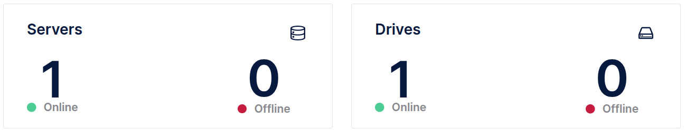

# MinIO Deployment Scenarios

This project showcases **four distinct ways** to deploy MinIO, each with its own use case, scalability, and storage setup.

- [MinIO Deployment Scenarios](#minio-deployment-scenarios)
  - [1. Standalone (Single-Node, Single-Drive) - Docker](#1-standalone-single-node-single-drive---docker)
  - [2. Standalone (Single-Node, Multi-Drive) - Docker](#2-standalone-single-node-multi-drive---docker)
  - [3. Distributed (Multi-Node, Single-Drive) - Docker](#3-distributed-multi-node-single-drive---docker)
  - [4. Distributed (Multi-Node, Multi-Drive) - Docker](#4-distributed-multi-node-multi-drive---docker)
  - [5. Standalone (Single-Node, Single-Drive) - Kubernetes](#5-standalone-single-node-single-drive---kubernetes)


## 1. Standalone (Single-Node, Single-Drive) - Docker

For local development or testing.


```bash
cd docker/SingleNodeSingleDrive

# check compose syntax
docker compose config

# up and running minio service
docker compose up -d

# check minio container
docker compose ps
```

[Ref](https://min.io/docs/minio/linux/operations/install-deploy-manage/deploy-minio-single-node-single-drive.html)

## 2. Standalone (Single-Node, Multi-Drive) - Docker

Multiple disks on one node.


```bash
cd docker/SingleNodeMutiDrive

# check compose syntax
docker compose config

# up and running minio service
docker compose up -d

# check minio container
docker compose ps
```

[Ref](https://min.io/docs/minio/linux/operations/install-deploy-manage/deploy-minio-single-node-multi-drive.html)

## 3. Distributed (Multi-Node, Single-Drive) - Docker

Production-grade distributed mode. Single disks on Multi node.


```bash
cd docker/MultiNodeSingleDrive

# check compose syntax
docker compose config

# up and running minio service
docker compose up -d

# check minio container
docker compose ps
```


## 4. Distributed (Multi-Node, Multi-Drive) - Docker

Production-grade distributed mode. Multi disks on Multi node.


```bash
cd docker/MultiNodeSingleDrive

# check compose syntax
docker compose config

# up and running minio service
docker compose up -d

# check minio container
docker compose ps
```
[Ref](https://min.io/docs/minio/linux/operations/install-deploy-manage/deploy-minio-distributed.html)

## 5. Standalone (Single-Node, Single-Drive) - Kubernetes

standalone minio on kubernetes.



```bash
cd kubernetes/SingleNodeSingleDrive

# check valuse file
cat values.yml

# add minio repository
helm repo add minio https://charts.min.io/

# update minio repo
helm repo update minio

# You can validate the repo contents using helm search:
helm search repo minio

# install minio service
helm upgrade --install minio minio/minio \
  --namespace minio \
  -f kubernetes/SingleNodeSingleDrive/values.yml \
  --create-namespace
```

**🔍 Breakdown of the command:**
  - **helm upgrade --install**	Installs the release if it doesn't exist, or upgrades it if it does.
  - **minio**	The release name (you can choose any name).
  - **minio/minio**	The chart name from the MinIO Helm repo.
  - **--namespace minio**	Deploys MinIO into a Kubernetes namespace named minio.
  - **-f kubernetes/SingleNodeSingleDrive/values.yml**	Loads custom configuration from the specified values.yml file.
  - **--create-namespace**	Automatically creates the minio namespace if it doesn’t exist.