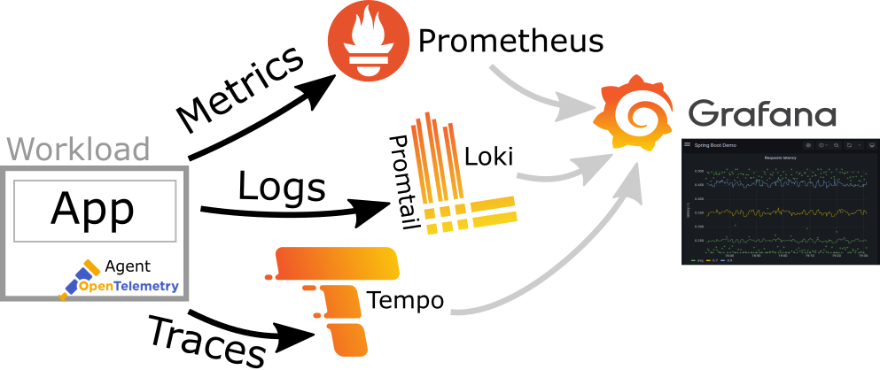

# Observability Stack on docker

This Docker project sets up a powerful observability stack using industry-standard tools for **monitoring, logging, and tracing**. It leverages Docker Compose profiles for flexible deployment, allowing you to bring up only the components you need.



## Table of Contents

- [Observability Stack on docker](#observability-stack-on-docker)
  - [Table of Contents](#table-of-contents)
  - [Overview](#overview)
  - [Prerequisites](#prerequisites)
  - [Environment Variables](#environment-variables)
  - [Getting Started](#getting-started)
    - [Understanding Profiles](#understanding-profiles)
    - [Running Specific Profiles](#running-specific-profiles)
    - [Running the Full Stack](#running-the-full-stack)
    - [Stopping the Stack](#stopping-the-stack)
  - [Core Components \& What They Do](#core-components--what-they-do)
    - [Traefik](#traefik)
    - [Prometheus](#prometheus)
    - [Grafana](#grafana)
    - [Alertmanager](#alertmanager)
    - [Pushgateway](#pushgateway)
    - [cAdvisor, Node Exporter, Blackbox Exporter](#cadvisor-node-exporter-blackbox-exporter)
    - [Loki \& Promtail](#loki--promtail)
    - [Tempo \& k6-tracing](#tempo--k6-tracing)
    - [Memcached](#memcached)
  - [Accessing the Dashboards](#accessing-the-dashboards)
  - [Troubleshooting](#troubleshooting)
  - [Good References:](#good-references)
  - [Stay connected with DockerMe! 🚀](#stay-connected-with-dockerme-)

---

## Overview

This project provides a robust, self-hosted observability solution. It's designed to collect and visualize:

* **Metrics:** Using Prometheus for time-series data.
* **Logs:** Using Loki for log aggregation.
* **Traces:** Using Tempo for distributed tracing.
* **Dashboards & Alerts:** Centralized in Grafana and Alertmanager.
* **Traffic Routing:** Handled by Traefik.

---

## Prerequisites

Before you begin, ensure you have the following installed:

* **Docker:** [Install Docker Engine](https://docs.docker.com/engine/install/)
* **Docker Compose:** [Install Docker Compose](https://docs.docker.com/compose/install/) (comes with Docker Desktop)
* **.env file:** Modify `.env` file in the root directory of this project and change in the required environment variables.

---

## Environment Variables

Change `.env` file in the project's root directory and populate it with these variables. Make sure to replace the placeholder values.

```bash
# Server Name
HOSTNAME=observability

# set restart policy
RESTART_POLICY=on-failure

# Domain address
DOMAIN_ADDRESS=monlog.mecan.ir
TRAEFIK_SUB=web
PROMETHEUS_SUB=metrics
GRAFANA_SUB=grafana
ALERTMANAGER_SUB=alerts
PUSHGATEWAY_SUB=pushgw
LOKI_SUB=loki

# tag image
TRAEFIK_TAG=v3.4.1
PROMETHEUS_TAG=v3.4.1
GRFANA_TAG=12.0.2
ALERTMANAGER_TAG=v0.28.1
PUSHGATEWAY_TAG=v1.11.1
CADVISOR_TAG=latest
NODE_EXPORTER_TAG=v1.9.1
BLACKBOX_TAG=v0.26.0
LOKI_TAG=main-6aa6cc1
PROMTAIL_TAG=main-6aa6cc1
TEMPO_SUB=main-7227c90
K6_TARCING_TAG=v0.0.7
MEMCACHED_TAG=1.6.38

# Grafana Auth
GRAFANA_USERNAME=MeCan
GRAFANA_PASSWORD=hNA6iQxwNcgZse2vZm4iLHhothC77Jsdfwe
GRAFANA_INSTALL_PLUGINS=grafana-clock-panel,grafana-simple-json-datasource,grafana-piechart-panel

# ACME variables
ACME_EMAIL=cert@mecan.ir

#  web auth information.
#  how to generate password:
#  echo hNA6iQxwNcgZse2vZm4iLHhothC77J | htpasswd -s -n -i MeCan
WEB_AUTH_USER=MeCan
WEB_AUTH_PASS="{SHA}RyyBVKw1Qps/b/s6upvUKhGqfRA="
```

**Note on `WEB_AUTH_PASS`:** Traefik expects a SHA1 or BCrypt hash for basic authentication. You can generate one using a tool like htpasswd or online generators. 

**Example for create `WEB_AUTH_PASS` with command**: 
```bash
echo $(htpasswd -nb MeCan hNA6iQxwNcgZse2vZm4iLHhothC77J) | sed -e 's/\$/\$\$/g'
# OR
echo hNA6iQxwNcgZse2vZm4iLHhothC77J | htpasswd -s -n -i MeCan
```
---

## Getting Started
This stack uses Docker Compose's profiles feature. This allows you to selectively run groups of services, optimizing resource usage and simplifying development.

### Understanding Profiles
Each service in `compose.yml` has one or more profiles defined. When you run docker compose up, you specify which profiles to activate. Services without a profiles key are always enabled.

Here are the profiles defined in this `compose.yml`:

  - `observability`: Core services for a functional observability stack (Traefik, Prometheus, Grafana, Alertmanager, Pushgateway, cAdvisor, Blackbox Exporter, Node Exporter, Loki, Promtail, Tempo). This profile acts as an umbrella for many services.
  - `web`: Includes Traefik (for reverse proxy and ingress management).
  - `monitoring`: Specific to metric collection (Prometheus, Grafana, Alertmanager, Pushgateway, cAdvisor, Blackbox Exporter, Node Exporter).
  - `logging`: Specific to log collection (Grafana, Loki, Promtail).
  - `visualizations`: Primarily for Grafana.
  - `alerting`: For Alertmanager.
  - `tracing`: Core tracing components (Tempo, Memcached, k6-tracing).
  - `tracing-load`: Specifically for the k6 tracing load generator.

### Running Specific Profiles
To start only a subset of services, use the `--profile` flag:

```Bash
docker compose --profile <profile_name> up -d
```

You can specify multiple profiles to activate more services:

```Bash
docker compose --profile <profile_name_1> --profile <profile_name_2> up -d
```

**Examples:** Start just the core monitoring stack (Prometheus, Grafana, Alertmanager, Exporters):

```Bash
docker compose --profile monitoring up -d
```

Start just the logging stack (Loki, Promtail, Grafana):

```Bash
docker compose --profile logging up -d
```

Start just the tracing stack (Tempo, Memcached, k6-tracing):

```Bash
docker compose --profile tracing up -d
```

### Running the Full Stack
To bring up all services defined in the `compose.yml`, including Traefik for external access:

```Bash
docker compose --profile web --profile observability up -d
```

Explanation: The `observability` profile activates most components. Adding web ensures Traefik is also started, providing external routing to your dashboards.

### Stopping the Stack
To stop and remove all containers, networks, and volumes (use with caution, as this removes data):

```Bash
docker compose down -v
```

To stop only the running containers without removing volumes:

```Bash
docker compose down
```

---

## Core Components & What They Do
This section explains the role of each service in your observability stack.

### Traefik
Traefik acts as a modern Edge Router (reverse proxy and load balancer). It integrates directly with Docker, automatically discovering your services and routing external HTTP/HTTPS requests to them based on labels defined in docker-compose.yml.

  - **Provides:** Ingress for Grafana, Prometheus, Loki, Alertmanager, Pushgateway.
  - **Features:** Automated HTTPS with Let's Encrypt (ACME), basic authentication for dashboards.

### Prometheus
Prometheus is a powerful monitoring system that collects metrics from configured targets at given intervals, evaluates rule expressions, displays the results, and can trigger alerts.

  - **Provides:** Time-series metric storage and querying (PromQL).
  - **Collects from:** Node Exporter, cAdvisor, Blackbox Exporter, Pushgateway, Traefik, Grafana, Tempo (via remote write for service graphs).

### Grafana
Grafana is an open-source visualization and analytics platform. It allows you to query, visualize, alert on, and understand your metrics, logs, and traces, regardless of where they are stored.

  - **Provides:** Interactive dashboards for Prometheus metrics, Loki logs, and Tempo traces.
  - **Integrates with:** Prometheus (for metrics), Loki (for logs), Tempo (for traces).

### Alertmanager
Alertmanager handles alerts sent by client applications like Prometheus. It dedupes, groups, and routes them to the correct receiver integration (e.g., email, Slack).

  - **Provides:** Centralized alert management and notification.
  - **Integrates with:** Prometheus (as the alert source).

### Pushgateway
Pushgateway is an intermediary service that allows ephemeral and batch jobs to push their metrics to Prometheus. Prometheus then scrapes Pushgateway.

  - **Provides:** A way for short-lived services or scripts to expose metrics.
### cAdvisor, Node Exporter, Blackbox Exporter
These are exporters that expose system and service-level metrics in a Prometheus-compatible format.

  - **cAdvisor:** Collects and exports resource usage and performance metrics from Docker containers.
  - **Node Exporter:** Collects and exports hardware and OS metrics from the host machine (CPU, memory, disk I/O, network stats).
  - **Blackbox Exporter:** Allows you to probe endpoints over various protocols (HTTP, HTTPS, DNS, TCP, ICMP) and exports metrics about their availability and response time. Useful for uptime monitoring.

### Loki & Promtail
Loki is a logging system designed for storing and querying logs. It's built similarly to Prometheus, focusing on indexing metadata (labels) rather than full log content for efficiency. Promtail is its agent.

  - **Loki Provides:** Centralized log storage and a query language (LogQL).
  - **Promtail Provides:** Agent that scrapes logs from local filesystems (e.g., /var/log and Docker container logs) and sends them to Loki.

### Tempo & k6-tracing
Tempo is a distributed tracing backend that stores traces at scale, making them accessible for debugging and performance analysis. It integrates seamlessly with Grafana for visualization. k6-tracing is used here for generating test trace data.

  - **Tempo Provides:** Backend storage and querying for traces (OpenTelemetry, Jaeger, Zipkin, etc.). It also generates service graph metrics sent to Prometheus.
  - **k6-tracing Provides:** A load testing tool capable of generating trace data to simulate application traffic and test Tempo's ingestion.

### Memcached
Memcached is a distributed memory caching system. In this stack, it's typically used by Tempo (and potentially Loki) as a caching layer to improve query performance by storing frequently accessed data in memory.

---

## Accessing the Dashboards
Once the services are running, you can access the various dashboards via Traefik. Ensure you have configured your DOMAIN_ADDRESS and respective subdomains in the .env file, and that your DNS points these subdomains to your Docker host's IP address.

  - **Traefik Dashboard:** http://traefik.<YOUR_DOMAIN_ADDRESS> (protected by basic auth)
  - **Prometheus:** http://prometheus.<YOUR_DOMAIN_ADDRESS>
  - **Grafana:** http://grafana.<YOUR_DOMAIN_ADDRESS>
    - **Default Credentials:** admin / admin-password (from your .env file)
  - **Alertmanager:** http://alert.<YOUR_DOMAIN_ADDRESS>
  - **Pushgateway:** http://push.<YOUR_DOMAIN_ADDRESS>

---

## Troubleshooting
  - Connection Refused or Unimplemented Service errors:
    - Ensure all containers are Up using `docker ps`.
    - Check container logs (`docker logs <container_name>`) for startup errors.
    - Verify port mappings and network connectivity between services in docker-compose.yml.
    - **Crucially:** Ensure your client applications (e.g., `k6-tracing`) are pointing to the correct internal service name and port for Tempo. For OTLP gRPC, this is usually `tempo:9200` as configured in your `tempo.yaml` `server.grpc_listen_port`. `k6-tracing`'s ENDPOINT environment variable needs to reflect this.
  - Datasource prometheus was not found in Grafana:
    - Go to Grafana -> Connections -> Data sources.
    - Confirm a Prometheus data source named prometheus exists.
    - Verify its URL is `http://prometheus:9090` (assuming Prometheus service name is prometheus).
    - Click "Save & test" to confirm connectivity.
  - `Permission Denied` errors for volumes:
    - Ensure the host directories mapped to container volumes (e.g., ./prometheus, ./loki, ./tempo, ./grafana) have the correct permissions for the user running the Docker containers. You might need to sudo chown -R <user>:<group> <directory> or chmod -R 777 <directory> (use 777 with caution for temporary debugging only).
  - ACME (Let's Encrypt) issues for Traefik:
    - Check Traefik logs for ACME-related errors.
    - Ensure your ACME_EMAIL is valid.
    - Verify your `DOMAIN_ADDRESS` and subdomains are correctly configured in DNS and point to the host running Traefik.

---

## Good References:
  - [Tempo service good document](https://grafana.com/docs/tempo/latest/getting-started/docker-example/)
  - [Tempo service good repository](https://github.com/grafana/tempo/tree/main/example/docker-compose/local)

## Stay connected with DockerMe! 🚀

**Subscribe to our channels, leave a comment, and drop a like to support our content. Your engagement helps us create more valuable DevOps and cloud content!** 🙌

[](https://dockerme.ir/) [](https://www.linkedin.com/in/ahmad-rafiee/) [](https://t.me/dockerme) [](https://youtube.com/@dockerme) [](https://instagram.com/dockerme)
