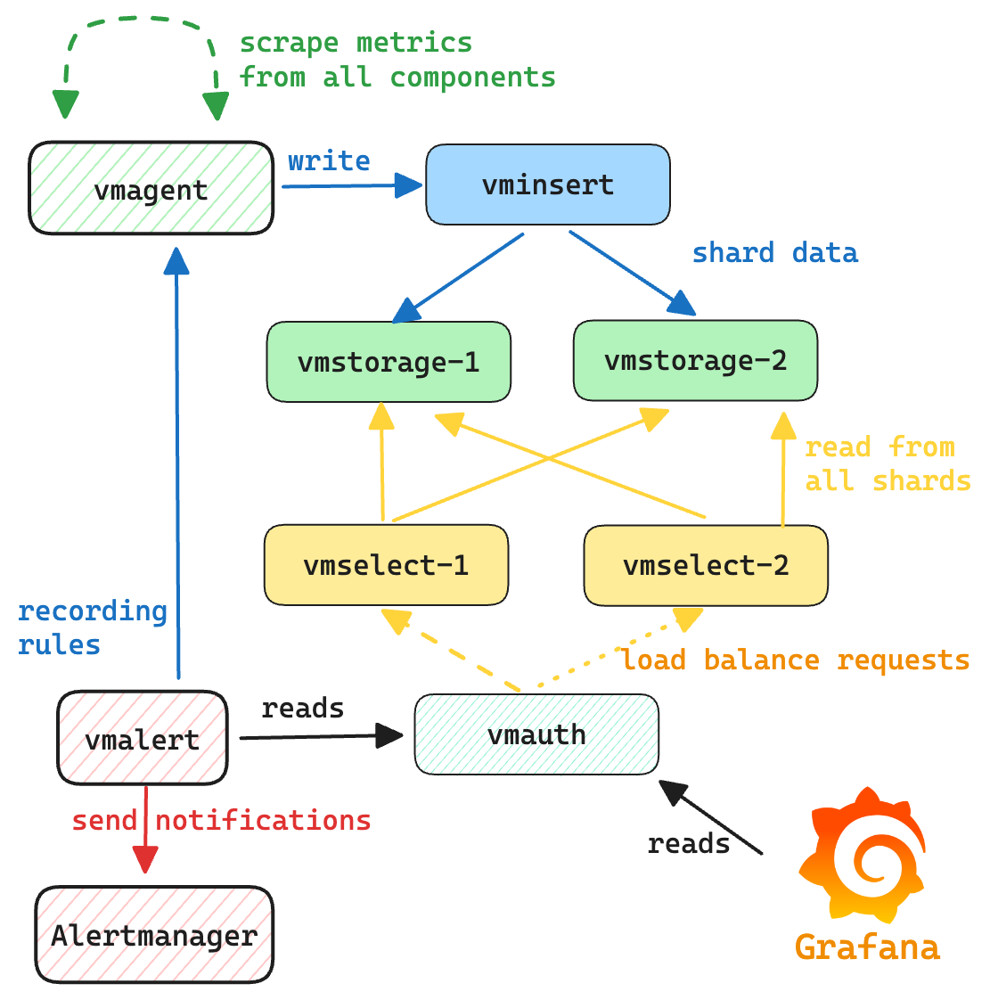

## VictoriaMetrics single server

# Single-Node VictoriaMetrics Observability Stack

This Docker Compose project sets up a robust, single-node observability stack using VictoriaMetrics components. It provides comprehensive monitoring capabilities for your infrastructure and applications, including metrics collection, visualization, and alerting, all exposed securely via Traefik.

## Table of Contents
- [Single-Node VictoriaMetrics Observability Stack](#single-node-victoriametrics-observability-stack)
  - [Table of Contents](#table-of-contents)
  - [Design](#design)
  - [Overview](#overview)
  - [Key Components](#key-components)
  - [Prerequisites](#prerequisites)
  - [Environment Variables (.env)](#environment-variables-env)
  - [Setup and Installation](#setup-and-installation)
    - [Project Structure](#project-structure)
    - [Configuration Files](#configuration-files)
    - [Running the Stack](#running-the-stack)
    - [Stopping the Stack](#stopping-the-stack)
  - [Accessing the Dashboards](#accessing-the-dashboards)
  - [Information](#information)
    - [vmagent](#vmagent)
    - [Grafana](#grafana)
    - [vmalert](#vmalert)
    - [alertmanager](#alertmanager)
  - [Reference](#reference)
  - [Stay connected with DockerMe! 🚀](#stay-connected-with-dockerme-)

## Design




## Overview

This project provides a complete monitoring solution based on the VictoriaMetrics ecosystem, running entirely on a single Docker host. It collects system and container metrics, allows for custom service monitoring, visualizes all data in Grafana, and provides a powerful alerting system. Traefik acts as the reverse proxy for secure external access.

**Key Features:**

* **Metrics Collection:** Efficiently collects metrics from various sources.
* **Data Storage:** High-performance, scalable time-series database.
* **Visualization:** Interactive dashboards for all collected data.
* **Alerting:** Flexible rule-based alerting with notification routing.
* **Secure Access:** All web UIs exposed via Traefik with HTTPS (Let's Encrypt) and optional basic authentication.

## Key Components

* **Traefik**: A modern Edge Router (reverse proxy and load balancer) that automatically discovers services and handles HTTPS (via Let's Encrypt) and request routing.
* **VictoriaMetrics (VM)**: The core, fast, cost-effective, and scalable open-source time-series database. It's a drop-in replacement for Prometheus.
* **VMAgent**: A lightweight agent that scrapes metrics from targets (compatible with Prometheus's scraping configuration) and efficiently remote-writes them to VictoriaMetrics.
* **VMAlert**: An alerting solution for VictoriaMetrics. It evaluates alerting rules and sends alerts to Alertmanager.
* **Grafana**: An open-source platform for data visualization, monitoring, and analysis. It integrates with VictoriaMetrics to display dashboards.
* **Alertmanager**: Handles alerts sent by VMAlert, deduplicating, grouping, and routing them to the correct receiver integrations.
* **Node Exporter**: Exporter for hardware and OS metrics exposed by Unix kernels (CPU, memory, disk I/O, network stats, etc.).
* **cAdvisor**: Container Advisor that provides container users with an understanding of the resource usage and performance characteristics of their running containers.
* **Blackbox Exporter**: Allows for probing of endpoints over various protocols (HTTP, HTTPS, DNS, TCP, ICMP) and exports metrics about their availability and response time. Useful for uptime checks.

## Prerequisites

Before deploying this stack, ensure your system meets the following requirements:

* **Docker Engine:** [Install Docker Engine](https://docs.docker.com/engine/install/)
* **Docker Compose:** [Install Docker Compose](https://docs.docker.com/compose/install/) (usually comes with Docker Desktop or separate installation)
* **DNS Configuration:** Your `DOMAIN_ADDRESS` and all subdomains (e.g., `web.<DOMAIN>`, `vm.<DOMAIN>`) must be configured in your DNS provider to point to the public IP address of the server where Docker is running. This is crucial for Traefik's HTTPS and routing.
* **Open Ports:** Ensure ports `80` and `443` are open on your server's firewall and accessible from the internet for Traefik to handle HTTP/HTTPS and Let's Encrypt challenges.


## Environment Variables (.env)

Create a `.env` file in the root directory of your project (where `compose.yml` is located). Populate it with the following variables, replacing the placeholder values with your specific details.

```bash
# Server Name
HOSTNAME=observability

# set restart policy
RESTART_POLICY=on-failure

# Domain address
DOMAIN_ADDRESS=monlog.mecan.ir
TRAEFIK_SUB=web
VMAUTH_SUB=vm
GRAFANA_SUB=grafana
ALERTMANAGER_SUB=alerts
VMAGENT_SUB=agent
VMALERTS_SUB=vmalerts

# image tags
TRAEFIK_TAG=v3.4.1
VMAGENT_TAG=v1.120.0
GRAFANA_TAG=12.0.2
VMALERT_TAG=v1.120.0
ALERTMANAGER_TAG=v0.28.0
CADVISOR_TAG=latest
NODE_EXPORTER_TAG=v1.9.1
BLACKBOX_TAG=v0.26.0
VMSTORAGE_TAG=v1.120.0-cluster
VMINSERT_TAG=v1.120.0-cluster
VMSELECT_TAG=v1.120.0-cluster
VMAUTH_TAG=v1.120.0

# Grafana Auth
GRAFANA_USERNAME=MeCan
GRAFANA_PASSWORD=hNA6iQxwNcgZse2vZm4iLHhothC77Jsdfwe
GRAFANA_INSTALL_PLUGINS=grafana-clock-panel,grafana-simple-json-datasource,grafana-piechart-panel

# vmauth authentication
VMAUTH_USERNAME=MeCan
VMAUTH_PASSWORD=hNA6iQxwNcgZse2vZ

# ACME variables
ACME_EMAIL=cert@mecan.ir

#  web auth information.
#  how to generate password:
#  echo hNA6iQxwNcgZse2vZm4iLHhothC77J | htpasswd -s -n -i MeCan
WEB_AUTH_USER=MeCan
WEB_AUTH_PASS="{SHA}RyyBVKw1Qps/b/s6upvUKhGqfRA="
```

## Setup and Installation

### Project Structure
Ensure your project directory has the following structure. Create any missing directories and placeholder files.
```bash
├── alertmanager
│   └── alertmanager.yml
├── blackbox
│   └── blackbox-exporter.yml
├── compose.yml
├── grafana
│   ├── dashboards
│   │   ├── BlackboxPingTest.json
│   │   ├── dashboard.yml
│   │   ├── DockerContainerMonitor.json
│   │   ├── GrafanaMetrics.json
│   │   ├── NodeExporterFull.json
│   │   ├── Traefik2Dashboard.json
│   │   ├── victoriametrics-cluster.json
│   │   ├── vmagent.json
│   │   ├── vmalert.json
│   │   └── vmauth.json
│   └── datasources
│       └── datasource.yml
├── ReadMe.md
├── vmagent
│   └── prometheus.yml
├── vmalert
│   ├── alerts-health.yml
│   ├── alerts-vmagent.yml
│   ├── alerts-vmalert.yml
│   └── alerts.yml
└── vmauth
    └── auth.yml
```

### Configuration Files
Populate the placeholder configuration files as follows:

`vmagent/prometheus.yml`
This file defines what targets VMAgent will scrape.

```YAML
global:
  scrape_interval: 10s

scrape_configs:
- job_name: vmagent
  static_configs:
  - targets:
    - vmagent:8429

- job_name: vmalert
  static_configs:
  - targets:
    - vmalert:8880
    
- job_name: victoriametrics
  static_configs:
  - targets:
    - victoriametrics:8428

- job_name: 'grafana'
  scrape_interval: 30s
  metrics_path: '/metrics'
  static_configs:
    - targets: ['grafana:3000']

- job_name: 'alertmanager'
  scrape_interval: 30s
  metrics_path: '/metrics'
  static_configs:
    - targets: ['alertmanager:9093']

- job_name: 'cadvisor'
  static_configs:
    - targets: ['cadvisor:8080']

- job_name: 'node-exporter'
  static_configs:
    - targets: ['node-exporter:9100']

- job_name: 'blackbox_exporter'
  static_configs:
    - targets: ['blackbox-exporter:9115']

- job_name: 'blackbox-ping'
  scrape_interval: 30s
  metrics_path: /probe
  params:
    module: [icmp_ipv4]
  static_configs:
    - targets:
        - 8.8.8.8
        - google.com
        - node-exporter
        - blackbox-exporter
        - cadvisor
        - alertmanager
        - grafana
  relabel_configs:
    - source_labels: [__address__]
      target_label: __param_target
    - source_labels: [__param_target]
      target_label: instance
    - target_label: __address__
      replacement: blackbox-exporter:9115

- job_name: 'traefik'
  metrics_path: '/metrics'
  static_configs:
    - targets: ['traefik:8082']
```

`grafana/provisioning/datasources/datasource.yml`
This file automatically provisions VictoriaMetrics as a data source in Grafana.

```YAML
apiVersion: 1

datasources:
- name: Prometheus
  type: prometheus
  access: proxy
  url: http://vmauth:8427/select/0/prometheus
  orgId: 1
  basicAuth: true
  basicAuthUser: "${VMAUTH_USERNAME}"
  secureJsonData:
    basicAuthPassword: "${VMAUTH_PASSWORD}"
  isDefault: true
  editable: true
  jsonData:
    prometheusType: Prometheus
    prometheusVersion: 2.24.0
    httpMethod: GET
```

`vmalert/*.yml`
Create all rules file in `vmalert` directory
```bash
vmalert
├── alerts-health.yml
├── alerts-vmagent.yml
├── alerts-vmalert.yml
└── alerts.yml
```

`vmauth/auth.yml`
This is the critical authentication and routing configuration for vmauth. It uses the env_var function to read credentials from environment variables.
```YAML
# balance load among vmselects
# see https://docs.victoriametrics.com/victoriametrics/vmauth/#load-balancing
users:
  - username: "MeCan"
    password: "hNA6iQxwNcgZse2vZ"
    url_map:
    - src_paths:
      - "/select/.*"
      - "/admin/.*"
      url_prefix:
      - http://vmselect-1:8481
      - http://vmselect-2:8481
    - src_paths:
      - "/insert/.*"
      url_prefix:
      - http://vminsert-1:8480
      - http://vminsert-2:8480
```

`alertmanager/alertmanager.yml`
Create an empty alertmanager.yml file for now. You'll configure notification receivers here later.

```YAML
# Example Alertmanager config (uncomment and customize later)
# global:
#   resolve_timeout: 5m
#
# route:
#   group_by: ['alertname']
#   group_wait: 30s
#   group_interval: 5m
#   repeat_interval: 1h
#   receiver: 'web.hook'
#
# receivers:
#   - name: 'web.hook'
#     webhook_configs:
#       - url: '[http://example.com/webhook](http://example.com/webhook)' # Replace with your actual webhook URL (e.g., Slack, PagerDuty)
#
# inhibit_rules:
#   - source_match:
#       severity: 'critical'
#     target_match:
#       severity: 'warning'
#     equal: ['alertname', 'dev', 'instance']
```

`blackbox/blackbox-exporter.yml`
Create blackbox-exporter.yml file for now. This will define what targets Blackbox Exporter probes.

```YAML
modules:
  icmp_ipv4:
    prober: icmp
    timeout: 15s
    icmp:
      preferred_ip_protocol: "ip4"
```

### Running the Stack
Navigate to the root directory of your project (where `compose.yml` and .env are located).

Ensure External Networks Exist: Your `compose.yml` uses external networks web_net and app_net. If these don't exist, you'll need to create them first:

```Bash

docker network create web_net
docker network create app_net
```

To spin-up environment with VictoriaMetrics single server run the following command:

```Bash
# pull all service image
docker compose pull

# run all service
docker compose up -d 
```

This command will read your `compose.yml` and `.env` file, download the necessary Docker images, create volumes, and start all services.


### Stopping the Stack
To stop and remove all containers, networks, and persistent volumes (this will delete all collected metrics, logs, and trace data!):

```Bash
docker compose down -v
```
To stop only the running containers without removing volumes (data will persist):

```Bash
docker compose down
```

## Accessing the Dashboards
Once all services are running and your DNS records are correctly configured, you can access the various UIs via Traefik. Replace <YOUR_DOMAIN_ADDRESS> with the value from your `.env` file.

* **Traefik Dashboard:** http://web.<YOUR_DOMAIN_ADDRESS> (protected by WEB_AUTH_USER/WEB_AUTH_PASS)
* **VMAgent UI:** http://agent.<YOUR_DOMAIN_ADDRESS>:8429/metrics (or http://agent.<YOUR_DOMAIN_ADDRESS>) - Provides VMAgent's own metrics.
* **Grafana:** http://vfana.<YOUR_DOMAIN_ADDRESS>
* **Default Credentials:** admin / admin-password (from your .env file)
* **VMAlert UI:** http://vmalerts.<YOUR_DOMAIN_ADDRESS>
* **Alertmanager UI:** http://alerts.<YOUR_DOMAIN_ADDRESS} (protected by WEB_AUTH_USER/WEB_AUTH_PASS)


## Information
VictoriaMetrics cluster environment consists of vminsert, vmstorage and vmselect components. vminsert exposes port :8480 for ingestion. Access to vmselect for reads goes through vmauth on port :8427, and the rest of components are available only inside the environment.

The communication scheme between components is the following:
* [vmagent](#vmagent) sends scraped metrics to `vminsert`;
* `vminsert` shards and forwards data to `vmstorage`;
* `vmselect`s are connected to `vmstorage` for querying data;
* [vmauth](#vmauth) balances incoming read requests among `vmselect`s;
* [grafana](#grafana) is configured with datasource pointing to `vmauth`;
* [vmalert](#vmalert) is configured to query `vmselect`s via `vmauth` and send alerts state
  and recording rules to `vmagent`;
* [alertmanager](#alertmanager) is configured to receive notifications from `vmalert`.


To access Grafana use link [https://grafana.monlog.mecan.ir](https://grafana.monlog.mecan.ir).

To access [vmui](https://docs.victoriametrics.com/victoriametrics/single-server-victoriametrics/#vmui)
use link [https://vm.monlog.mecan.ir/vmui](https://vm.monlog.mecan.ir/vmui).

To access `vmalert` use link [https://vm.monlog.mecan.ir/vmalert](https://vm.monlog.mecan.ir/vmalert/).

To shutdown environment run:
```
docker compose down
```

### vmagent

vmagent is used for scraping and pushing time series to VictoriaMetrics instance. 
It accepts Prometheus-compatible configuration with listed targets for scraping:
* [scraping VictoriaMetrics single-node](https://github.com/VictoriaMetrics/VictoriaMetrics/blob/master/deployment/docker/prometheus-vm-single.yml) services;
* [scraping VictoriaMetrics cluster](https://github.com/VictoriaMetrics/VictoriaMetrics/blob/master/deployment/docker/prometheus-vm-cluster.yml) services;
* [scraping VictoriaLogs single-node](https://github.com/VictoriaMetrics/VictoriaMetrics/blob/master/deployment/docker/prometheus-vl-single.yml) services;
* [scraping VictoriaLogs cluster](https://github.com/VictoriaMetrics/VictoriaMetrics/blob/master/deployment/docker/prometheus-vl-cluster.yml) services;

Web interface link is [https://agent.monlog.mecan.ir/](https://agent.monlog.mecan.ir/).


### Grafana

Web interface link [https://grafana.monlog.mecan.ir](https://grafana.monlog.mecan.ir).

Grafana credentials on `.env` file:
* login: `GRAFANA_USERNAME`
* password: `GRAFANA_PASSWORD`

Grafana is provisioned with default dashboards and datasources.

### vmalert

vmalert evaluates various [alerting rules](https://github.com/VictoriaMetrics/VictoriaMetrics/blob/master/deployment/docker/rules).
It is connected with AlertManager for firing alerts, and with VictoriaMetrics or VictoriaLogs for executing queries and storing alert's state.

Web interface link [https://vmalerts.monlog.mecan.ir/](https://vmalerts.monlog.mecan.ir/).

### alertmanager

AlertManager accepts notifications from `vmalert` and fires alerts.
All notifications are blackholed according to [alertmanager.yml](https://github.com/VictoriaMetrics/VictoriaMetrics/blob/master/deployment/docker/alertmanager.yml) config.

Web interface link [https://alerts.monlog.mecan.ir/](https://alerts.monlog.mecan.ir/).

## Reference
[VictoriaMetrics Good Repository](https://github.com/VictoriaMetrics/VictoriaMetrics/tree/master/deployment/docker)

## Stay connected with DockerMe! 🚀

**Subscribe to our channels, leave a comment, and drop a like to support our content. Your engagement helps us create more valuable DevOps and cloud content!** 🙌

[](https://dockerme.ir/) [](https://www.linkedin.com/in/ahmad-rafiee/) [](https://t.me/dockerme) [](https://youtube.com/@dockerme) [](https://instagram.com/dockerme)
