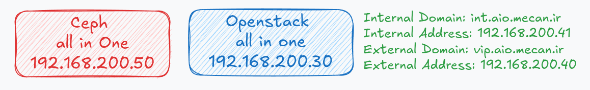

# Install single-node Openstack cluster
To install a single-node OpenStack environment based on Debian using Kolla-Ansible with ceph backend, you can follow these steps:



### Table of Content
- [Install single-node Openstack cluster](#install-single-node-openstack-cluster)
    - [Table of Content](#table-of-content)
    - [Create and preparing openstack and ceph node](#create-and-preparing-openstack-and-ceph-node)
      - [Node Specifications:](#node-specifications)
      - [Preparing steps:](#preparing-steps)
    - [Setup ceph all in one and config for openstack pool and keyring](#setup-ceph-all-in-one-and-config-for-openstack-pool-and-keyring)
      - [Install ceph all in one](#install-ceph-all-in-one)
      - [Configure ceph for openstack backend](#configure-ceph-for-openstack-backend)
    - [Set up the kolla environment](#set-up-the-kolla-environment)
      - [Install dependencies on only ansible host](#install-dependencies-on-only-ansible-host)
      - [Install Kolla-ansible](#install-kolla-ansible)
      - [Install Ansible Galaxy requirements](#install-ansible-galaxy-requirements)
      - [Generate Kolla passwords](#generate-kolla-passwords)
    - [Configure the Deployment:](#configure-the-deployment)
      - [Ceph create cofiguration file for openstack](#ceph-create-cofiguration-file-for-openstack)
    - [Run kolla-ansible project and create openstack service](#run-kolla-ansible-project-and-create-openstack-service)
      - [install openstack client](#install-openstack-client)
      - [Integration ceph-rgw with openstack keystone](#integration-ceph-rgw-with-openstack-keystone)
  - [🔗 Stay connected with DockerMe! 🚀](#-stay-connected-with-dockerme-)

### Create and preparing openstack and ceph node

#### Node Specifications:
Create a Ceph Node with the Following Specifications:
  - **CPU:** 4 Cores
  - **RAM:** 8 GB
  - **Disk Size:** 50 GB
  - **OSD Configuration:** Add 3 additional disks for the OSD (Object Storage Daemon) service.

Create a OpenStack Node with the Following Specifications:
  - **CPU:** 8 Cores
  - **RAM:** 16 GB
  - **Disk Size:** 100 GB
  - **External Network:** Add 1 additional Network for external configuration.


#### Preparing steps:
After Creating the Node, Execute the Following Commands to Prepare for the Installation and Configuration of Services:

```bash
# update and upgrade os
apt update
apt upgrade -y

# install docker daemon
curl -sSL https://get.docker.com/ | sh
sudo usermod -aG docker $USER
```

Log out and log back in for the group changes to take effect.

[🔝 Back to Top](#table-of-content)

### Setup ceph all in one and config for openstack pool and keyring

#### Install ceph all in one

for install and config all in one ceph with cephadm follow [this](../../../ceph/cluster-setup/single-node/cephadm/ReadMe.md) link

#### Configure ceph for openstack backend

Creating Ceph pools and keyrings for OpenStack services

```bash
# check ceph osd pool list
ceph osd pool ls

# create ceph pools
ceph osd pool create volumes
ceph osd pool create backups
ceph osd pool create images
ceph osd pool create vms

# enable rbd application for openstack pools
ceph osd pool application enable volumes rbd
ceph osd pool application enable backups rbd
ceph osd pool application enable images rbd
ceph osd pool application enable vms rbd

# check ceph osd pool list
ceph osd pool ls detail
```

Creating Ceph keyrings for OpenStack
```bash
# create ceph keyring for openstack usage
ceph auth get-or-create client.cinder mon 'allow r' osd 'allow class-read object_prefix rbd_children, allow rwx pool=volumes, allow rwx pool=vms, allow rx pool=images' > /etc/ceph/ceph.client.cinder.keyring
ceph auth get-or-create client.cinder-backup mon 'allow r' osd 'allow class-read object_prefix rbd_children, allow rwx pool=backups' > /etc/ceph/ceph.client.cinder-backup.keyring
ceph auth get-or-create client.glance mon 'allow r' osd 'allow class-read object_prefix rbd_children, allow rwx pool=images' > /etc/ceph/ceph.client.glance.keyring

# check ceph keyrings
ls /etc/ceph/
```

copy `ceph.conf` and all service keyring to `aio-cloud` host

[🔝 Back to Top](#table-of-content)

### Set up the kolla environment

#### Install dependencies on only ansible host

```bash
sudo apt update
sudo apt install -y git python3-dev libffi-dev gcc libssl-dev libdbus-glib-1-dev
```

 Install dependencies for the virtual environment

```bash
# Install the virtual environment dependencies
sudo apt install -y python3-venv

# Create a virtual environment and activate it:
python3 -m venv /opt/venv
source /opt/venv/bin/activate

# Ensure the latest version of pip is installed:
pip install -U pip
```

#### Install Kolla-ansible

```bash
# Install kolla-ansible and its dependencies using pip.
pip install kolla-ansible==19.3.0

# Create the /etc/kolla directory.
sudo mkdir -p /etc/kolla
sudo chown $USER:$USER /etc/kolla

# Copy globals.yml and passwords.yml to /etc/kolla directory.
cp -r /opt/venv/share/kolla-ansible/etc_examples/kolla/* /etc/kolla

# Copy all-in-one inventory file to the current directory.
cp /opt/venv/share/kolla-ansible/ansible/inventory/all-in-one .
cp /opt/venv/share/kolla-ansible/ansible/inventory/multinode .
```

#### Install Ansible Galaxy requirements

```bash
# set http proxy for install Ansible Galaxy dependencies:
export HTTP_PROXY=http://192.168.200.1:8123
export HTTPS_PROXY=http://192.168.200.1:8123

#Install Ansible Galaxy dependencies:
kolla-ansible install-deps

# disable http proxy
unset HTTP_PROXY
unset HTTPS_PROXY
```

#### Generate Kolla passwords

Passwords used in our deployment are stored in `/etc/kolla/passwords.yml` file. All passwords are blank in this file and have to be filled either manually or by running random password generator:
```bash
# generate kolla ansible password
kolla-genpwd
# all password generate and store in /etc/kolla/passwords.yml
```
[🔝 Back to Top](#table-of-content)

### Configure the Deployment:
Edit the `/etc/kolla/globals.yml` file:
- Set kolla_internal_vip_address to the IP address of your server.
- Set network_interface to the network interface name.
- Set docker_registry to the registry location (e.g., docker.io).
- Set openstack_release to the desired OpenStack release (e.g., victoria).
- Customize other settings as needed.

Edit `/etc/kolla/passwords.yml` and configure all services.

copy all config on `globals.yml` to `/etc/kolla`

#### Ceph create cofiguration file for openstack

copy ceph directory from ceph all in one to clode server

```bash
scp -r aio-ceph:/etc/ceph /etc/
```

**Note** Remove the tab from the ceph.conf file to avoid parsing configuration issues. This commonly occurs in ceph.conf or a related INI-style config file used by OpenStack.

```bash
# kolla integrade with ceph run these commands
### https://docs.openstack.org/kolla-ansible/latest/reference/storage/external-ceph-guide.html
# create service directory
mkdir -p /etc/kolla/config/glance/
mkdir -p /etc/kolla/config/cinder/cinder-volume
mkdir -p /etc/kolla/config/cinder/cinder-backup
mkdir -p /etc/kolla/config/nova

# enshre ceph config and keyring to /etc/ceph/ copy from mon1 node
ls /etc/ceph/

# cp ceph.conf to these directory
cp /etc/ceph/ceph.conf /etc/kolla/config/glance/
cp /etc/ceph/ceph.conf /etc/kolla/config/cinder/
cp /etc/ceph/ceph.conf /etc/kolla/config/nova/

# cp ceph.keyring on these directory
cp /etc/ceph/ceph.client.glance.keyring /etc/kolla/config/glance/
cp /etc/ceph/ceph.client.cinder.keyring /etc/kolla/config/cinder/cinder-backup/
cp /etc/ceph/ceph.client.cinder.keyring /etc/kolla/config/cinder/cinder-volume/
cp /etc/ceph/ceph.client.cinder-backup.keyring /etc/kolla/config/cinder/cinder-backup/
cp /etc/ceph/ceph.client.cinder.keyring /etc/kolla/config/nova/

# check all configuration files
tree /etc/kolla/config
```

### Run kolla-ansible project and create openstack service

```bash
# bootstraping server with this command
kolla-ansible bootstrap-servers -i all-in-one

# create all certificates with this commands
kolla-ansible certificates -i all-in-one

# run prechecks task
kolla-ansible prechecks -i all-in-one

# pull all images
kolla-ansible pull -i all-in-one

# deploy kolla ansible project
kolla-ansible deploy -i all-in-one

# run all post deploy tasks
kolla-ansible post-deploy -i all-in-one
```

#### install openstack client
```bash
# install openstack client
pip3 install python-openstackclient
apt install qemu-utils python3-openstackclient
```

#### Integration ceph-rgw with openstack keystone
After Installing OpenStack, Run the Following Commands to Integrate the Ceph Rados Gateway (RGW) Service with OpenStack Keystone:

find `ceph_rgw` user on `/etc/kolla/passwords.yml` and replace on these variable and run all command on `aio-ceph` node:

```bash
# set rgw configuration and redeploy it
CLIENT=$(ceph auth ls | grep client.rgw | grep client)
RGW_PASSWORD=O3wsgmc76Kq6fsa9sJl0D20JqQ0MrL9g6ZCJTmeJ
KEYSTONE_URL=http://int.aio.mecan.ir:5000

# set keystone config for rgw service
ceph config set "$CLIENT" rgw_keystone_api_version 3
ceph config set "$CLIENT" rgw_keystone_url "${KEYSTONE_URL}"
ceph config set "$CLIENT" rgw_keystone_accepted_admin_roles "admin, ResellerAdmin"
ceph config set "$CLIENT" rgw_keystone_accepted_roles "_member_, member, admin, ResellerAdmin"
ceph config set "$CLIENT" rgw_keystone_implicit_tenants true
ceph config set "$CLIENT" rgw_keystone_admin_user ceph_rgw
ceph config set "$CLIENT" rgw_keystone_admin_password ${RGW_PASSWORD}
ceph config set "$CLIENT" rgw_keystone_admin_project service
ceph config set "$CLIENT" rgw_keystone_admin_domain default
ceph config set "$CLIENT" rgw_keystone_verify_ssl true
ceph config set "$CLIENT" rgw_content_length_compat true
ceph config set "$CLIENT" rgw_enable_apis "s3, swift, swift_auth, admin"
ceph config set "$CLIENT" rgw_s3_auth_use_keystone true
ceph config set "$CLIENT" rgw_enforce_swift_acls true
ceph config set "$CLIENT" rgw_swift_account_in_url true
ceph config set "$CLIENT" rgw_swift_versioning_enabled true
ceph config set "$CLIENT" rgw_verify_ssl true

# redeploy rgw service
ceph orch redeploy $(ceph auth ls | grep client.rgw | cut -d "." -f 2-3)

```

[🔝 Back to Top](#table-of-content)

## 🔗 Stay connected with DockerMe! 🚀

**Subscribe to our channels, leave a comment, and drop a like to support our content. Your engagement helps us create more valuable DevOps and cloud content!** 🙌

[](https://dockerme.ir/) [](https://youtube.com/@dockerme) [](https://www.linkedin.com/in/ahmad-rafiee/) [](https://t.me/dockerme) [](https://instagram.com/dockerme)

[🔝 Back to Top](#table-of-content)