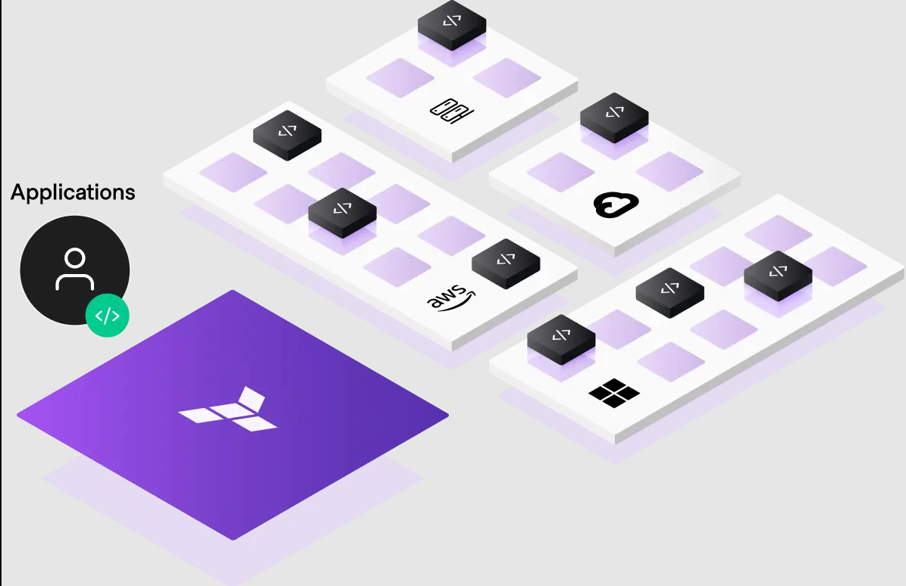
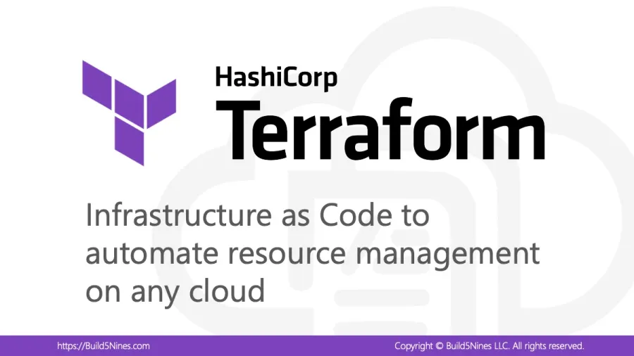
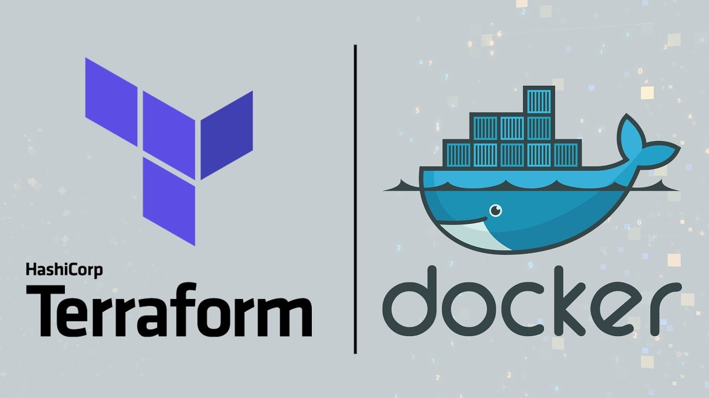
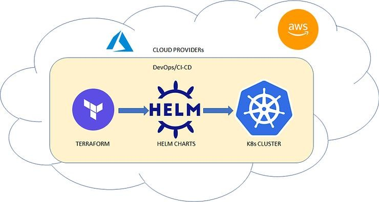
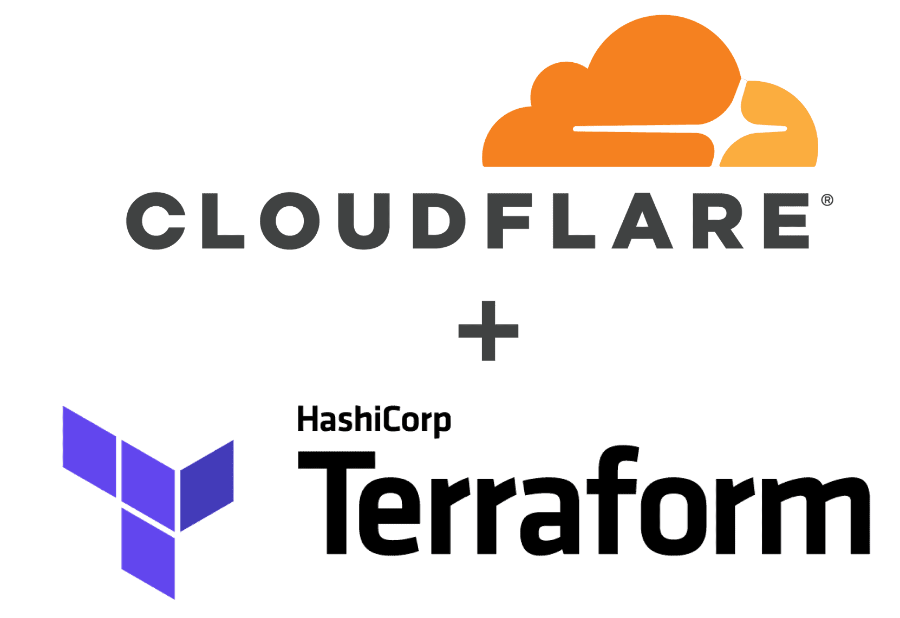
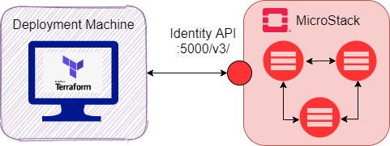

# Terraform Total Scenario


## Table of Contents
- [Terraform Total Scenario](#terraform-total-scenario)
  - [Table of Contents](#table-of-contents)
  - [Install Terraform](#install-terraform)
  - [Docker scenario: sample web container](#docker-scenario-sample-web-container)
  - [Docker scenario: deploy wordpress service](#docker-scenario-deploy-wordpress-service)
  - [Docker scenario: Build image with Dockerfile and deploy it](#docker-scenario-build-image-with-dockerfile-and-deploy-it)
  - [Minio scenario: create bucket, user, policy, attachment policy and create object on bucket](#minio-scenario-create-bucket-user-policy-attachment-policy-and-create-object-on-bucket)
  - [Kubernetes scenario: create namespace with terraform on kubernetes](#kubernetes-scenario-create-namespace-with-terraform-on-kubernetes)
  - [Kubernetes scenario: Create deployment with terraform on kubernetes](#kubernetes-scenario-create-deployment-with-terraform-on-kubernetes)
  - [Kubernetes scenario: Deploy Kubernetes add-ons using Terraform with Helm charts](#kubernetes-scenario-deploy-kubernetes-add-ons-using-terraform-with-helm-charts)
  - [Kubernetes scenario: Deploy Wordpress service with host-path storage with Terraform](#kubernetes-scenario-deploy-wordpress-service-with-host-path-storage-with-terraform)
  - [Cloudflare scenario: Create dns records with Terraform (A | CNAME | TXT)](#cloudflare-scenario-create-dns-records-with-terraform-a--cname--txt)
  - [Openstack scenario: Create flavor with terraform](#openstack-scenario-create-flavor-with-terraform)
  - [Openstack scenario: Create key-pair with terraform](#openstack-scenario-create-key-pair-with-terraform)
  - [Openstack scenario: upload image with terraform](#openstack-scenario-upload-image-with-terraform)
  - [Openstack scenario: create instance with terraform](#openstack-scenario-create-instance-with-terraform)
  - [Terraform Project: Kubernetes Backup Automation with Velero \& MinIO](#terraform-project-kubernetes-backup-automation-with-velero--minio)
  - [Steps to Create a Graph with Terraform](#steps-to-create-a-graph-with-terraform)
  - [Good link](#good-link)
  - [🔗 Stay connected with DockerMe! 🚀](#-stay-connected-with-dockerme-)



## Install Terraform

**Update Your System**
First, update your package list and install any available upgrades:

```bash
sudo apt update
sudo apt upgrade -y
```

**Install Required Dependencies**
While Terraform is a standalone binary, it's good practice to have curl or wget installed:

```bash
sudo apt install -y curl unzip
```

**Download Terraform**
Visit the Terraform downloads page to get the latest version's URL, or you can use the command line to download it directly. Replace VERSION with the desired Terraform version (e.g., 1.5.0):

```bash
# get latest version on https://releases.hashicorp.com/terraform/
# wget https://releases.hashicorp.com/terraform/VERSION/terraform_VERSION_linux_amd64.zip
# For example:
wget https://releases.hashicorp.com/terraform/1.11.2/terraform_1.11.2_linux_amd64.zip
```

**Unzip the Downloaded File:**
Unzip the downloaded ZIP file:

```bash
unzip terraform_1.11.2_linux_amd64.zip
```

**Move the Binary to a Directory in Your PATH**
Move the Terraform binary to /usr/local/bin so that you can execute it from anywhere in the terminal:

```bash
sudo mv terraform /usr/local/bin/
```

**Verify the Installation**
You can verify that Terraform was installed correctly by checking its version:

```bash
terraform version
```

**Clean Up**
You can delete the ZIP file after installation to save space:

```bash
rm terraform_VERSION_linux_amd64.zip
```

[🔝 Back to Top](#table-of-contents)




## Docker scenario: sample web container

Change `main.tf` and variables.tf on `docker-provider/nginx-sample` directory

```bash
cat docker-provider/nginx-sample/main.tf
provider "docker" {
  host = "unix:///var/run/docker.sock"
}

resource "docker_container" "MeCan" {
  name     = var.container_name
  image    = var.container_image
  hostname = var.container_hostname
  ports {
    internal = 80
    external = 8000
  }
}

cat docker-provider/nginx-sample/variables.tf
variable "container_image" {
  type        = string
  default     = "nginx:alpine"
  description = "Docker image for container"
}
variable "container_name" {
  type        = string
  default     = "nginx-mecan"
  description = "Container Name"
}
variable "container_hostname" {
  type        = string
  default     = "MeCan"
  description = "Container hostname"
}
```

**Initialize Terraform**
Before creating resources, you need to initialize Terraform, which will install the necessary provider plugins.

```bash
cd docker-provider/nginx-sample
terraform init
```

**Plan the Deployment**
You can run the plan command to see the actions Terraform will take without actually applying them:

```bash
terraform plan
```

**Apply the Configuration**
To create the container, run:

```bash
terraform apply
```

Terraform will prompt you to confirm the action. Type yes to proceed.

**Verify the Container**
You can verify that your Docker container is running by using the following command:

```bash
docker ps
```
You should see the `nginx-mecan` container listed.

**Cleanup**
When you're done and want to remove the resources created by Terraform, you can run:

```bash
terraform destroy
```
Again, Terraform will prompt you to confirm that you want to delete these resources. Type yes to proceed.

[🔝 Back to Top](#table-of-contents)

## Docker scenario: deploy wordpress service

Change `main.tf` and `variables.tf` on `docker-provider/wordpress` directory

```bash
cat docker-provider/wordpress/main.tf
provider "docker" {
  host = "unix:///var/run/docker.sock"
}

resource "docker_network" "network" {
  name = var.network_name
}

resource "docker_volume" "db_volume" {
  name = var.db_volume
}

resource "docker_volume" "wp_volume" {
  name = var.wp_volume
}

resource "docker_container" "mysql" {
  image = var.db_image
  name  = var.db_container_name
  hostname = var.db_hostname
  env = [
    "MYSQL_ROOT_PASSWORD=var.db_rootpaas",
    "MYSQL_DATABASE=var.db_database",
    "MYSQL_USER=var.db_username",
    "MYSQL_PASSWORD=var.db_password"
  ]
  networks_advanced {
    name = docker_network.network.name
  }
  ports {
    internal = 3306
  }
  volumes {
    volume_name = docker_volume.db_volume.name
    container_path = var.db_mount_path
  }
}

resource "docker_container" "wordpress" {
  image = var.wp_image
  name  = var.wp_container_name
  hostname = var.wp_hostname

  env = [
    "WORDPRESS_DB_HOST=var.db_container_name:3306",
    "WORDPRESS_DB_USER=var.db_username",
    "WORDPRESS_DB_PASSWORD=var.db_password",
    "WORDPRESS_DB_NAME=var.db_database"
  ]

  networks_advanced {
    name = docker_network.network.name
  }

  ports {
    internal = 80
    external = 8080
  }
  volumes {
    volume_name = docker_volume.wp_volume.name
    container_path = var.wp_mount_path
  }
}

cat docker-provider/wordpress/variables.tf
variable "network_name" {
  type        = string
  default     = "app_net"
  description = "docker network name"
}

variable "db_image" {
  type        = string
  default     = "mysql:5.7"
  description = "Mysql container image"
}

variable "db_container_name" {
  type        = string
  default     = "db"
  description = "Mysql container name"
}

variable "db_hostname" {
  type        = string
  default     = "mysql"
  description = "Mysql container hostname"
}

variable "db_rootpaas" {
  type        = string
  default     = "sdfweweseweekjklada"
  description = "Mysql root password"
}

variable "db_database" {
  type        = string
  default     = "DockerMe"
  description = "Mysql wordpress database"
}

variable "db_username" {
  type        = string
  default     = "MeCan"
  description = "Mysql username"
}

variable "db_password" {
  type        = string
  default     = "sdfwewesdfsseweekjklada"
  description = "Mysql MeCan user password"
}

variable "db_volume" {
  type        = string
  default     = "db_data"
  description = "Mysql data volumes"
}

variable "db_mount_path" {
  type        = string
  default     = "/var/lib/mysql"
  description = "Mysql data path"
}

variable "wp_image" {
  type        = string
  default     = "wordpress:latest"
  description = "Wordpress image name"
}

variable "wp_container_name" {
  type        = string
  default     = "wordpress"
  description = "Wordpress container name"
}

variable "wp_hostname" {
  type        = string
  default     = "wordpress"
  description = "Wordpress container hostname"
}

variable "wp_volume" {
  type        = string
  default     = "wp_data"
  description = "Wordpress data volumes"
}

variable "wp_mount_path" {
  type        = string
  default     = "/var/www/html"
  description = "Wordpress data path"
}
```

**Initialize Terraform**
Before creating resources, you need to initialize Terraform, which will install the necessary provider plugins.

```bash
cd docker-provider/wordpress
terraform init
```

**Plan the Deployment**
You can run the plan command to see the actions Terraform will take without actually applying them:

```bash
terraform plan
```

**Apply the Configuration**
To create the container, run:

```bash
terraform apply
```

Terraform will prompt you to confirm the action. Type yes to proceed.

**Verify the Container**
You can verify that your Docker container is running by using the following command:

```bash
docker ps
docker volume ls
docker network ls
```

You should see the `wordpress` and `db` containers listed.
You should see the `db_data` and `wp_data` volumes listed.
You should see the `app_net` network listed.

**Cleanup**
When you're done and want to remove the resources created by Terraform, you can run:

```bash
terraform destroy
```

Again, Terraform will prompt you to confirm that you want to delete these resources. Type yes to proceed.

[🔝 Back to Top](#table-of-contents)

## Docker scenario: Build image with Dockerfile and deploy it

Change `main.tf` and `variables.tf` on `docker-provider/build-run-image` directory

```bash
cat docker-provider/build-run-image/main.tf
provider "docker" {
  host = "unix:///var/run/docker.sock"
}

# Create Docker Image from Dockerfile
resource "docker_image" "my_image" {
  name         = var.image_name
  build {
    context    = "${path.module}"
    dockerfile = "Dockerfile"
  }
}

# Create Nginx Container with the built image
resource "docker_container" "web" {
  image = docker_image.my_image.name
  name  = var.container_name
  ports {
    internal = 80
    external = 80
  }
}

cat docker-provider/build-run-image/variables.tf
variable "image_name" {
  description = "The name of the Docker image"
  type        = string
  default     = "mecan_sample_app"
}

variable "container_name" {
  description = "The name of the Docker container"
  type        = string
  default     = "mecan_container"
}
```

**Initialize Terraform**
Before creating resources, you need to initialize Terraform, which will install the necessary provider plugins.

```bash
cd docker-provider/build-run-image
terraform init
```

**Plan the Deployment**
You can run the plan command to see the actions Terraform will take without actually applying them:

```bash
terraform plan
```

**Apply the Configuration**
To create the container, run:

```bash
terraform apply
```

Terraform will prompt you to confirm the action. Type yes to proceed.

**Verify the Container**
You can verify that your Docker container is running by using the following command:

```bash
docker ps
docker image ls
```
You should see the `mecan_container` container listed.
You should see the `mecan_sample_app` image listed.

**Cleanup**
When you're done and want to remove the resources created by Terraform, you can run:

```bash
terraform destroy
```

Again, Terraform will prompt you to confirm that you want to delete these resources. Type yes to proceed.

[🔝 Back to Top](#table-of-contents)


## Minio scenario: create bucket, user, policy, attachment policy and create object on bucket

Change `providers.tf`, `main.tf` and `variables.tf` on `minio-provider` directory

```bash
cat minio-provider/providers.tf
terraform {
  required_providers {
    minio = {
      source = "aminueza/minio"
      version = "3.3.0"
    }
  }
}

provider "minio" {
  minio_server   = "object.mecan.ir"
  minio_region   = "us-east-1"
  minio_user     = "l1DB3cweccweweVJvp2ZHPl"
  minio_password = "akPEefwevwecHGd7SB5hvnKwxyZKJzQU"
  minio_ssl      = true
}

cat minio-provider/main.tf
resource "minio_s3_bucket" "my_bucket" {
  bucket = var.bucket_name
}

resource "minio_iam_user" "my_user" {
  name = var.user_name
  secret = var.user_password
}

resource "minio_iam_policy" "my_policy" {
  name = var.policy_name

  policy = <<EOF
{
  "Version": "2012-10-17",
  "Statement": [
    {
      "Effect": "Allow",
      "Action": [
        "s3:PutObject"
      ],
      "Resource": [
        "arn:aws:s3:::${var.bucket_name}/*",
        "arn:aws:s3:::${var.bucket_name}"
      ]
    }
  ]
}
EOF
}

resource "minio_iam_user_policy_attachment" "backup" {
  depends_on  = [minio_iam_user.my_user,minio_iam_policy.my_policy]
  user_name   = minio_iam_user.my_user.id
  policy_name = minio_iam_policy.my_policy.id
}

resource "minio_s3_object" "my_file" {
  depends_on  = [minio_s3_bucket.my_bucket]
  bucket_name = minio_s3_bucket.my_bucket.bucket
  object_name = "text.txt"
  content     = "for test"
}


cat docker-provider/minio-provider/variables.tf
variable "bucket_name" {
  description = "The name of the bucket to create"
  type        = string
  default     = "etcd-backup"
}

variable "user_name" {
  description = "The name of the user to create"
  type        = string
  default     = "etcd-backup-user"
}

variable "user_password" {
  description = "The password for the user"
  type        = string
  default     = "BbsdcsdeswevwecHGd7V"
}

variable "policy_name" {
  description = "The name of the policy to create"
  type        = string
  default     = "etcd-backup-policy"
}
```

**Initialize Terraform**
Before creating resources, you need to initialize Terraform, which will install the necessary provider plugins.

```bash
cd minio-provider
terraform init
```

**Plan the Deployment**
You can run the plan command to see the actions Terraform will take without actually applying them:

```bash
terraform plan
```

**Apply the Configuration**
To create the container, run:

```bash
terraform apply
```

Terraform will prompt you to confirm the action. Type yes to proceed.

**Cleanup**
When you're done and want to remove the resources created by Terraform, you can run:

```bash
terraform destroy
```

Again, Terraform will prompt you to confirm that you want to delete these resources. Type yes to proceed.

[🔝 Back to Top](#table-of-contents)



## Kubernetes scenario: create namespace with terraform on kubernetes

Change `providers.tf`, `main.tf` and `variables.tf` on `docker-provider/kubernetes-provider/namespace` directory

**Initialize Terraform**
Before creating resources, you need to initialize Terraform, which will install the necessary provider plugins.

```bash
cd kubernetes-provider/namespace
terraform init
```

**Plan the Deployment**
You can run the plan command to see the actions Terraform will take without actually applying them:

```bash
terraform plan
```

**Apply the Configuration**
To create the container, run:

```bash
terraform apply
```

Terraform will prompt you to confirm the action. Type yes to proceed.

**Cleanup**
When you're done and want to remove the resources created by Terraform, you can run:

```bash
terraform destroy
```

Again, Terraform will prompt you to confirm that you want to delete these resources. Type yes to proceed.

[🔝 Back to Top](#table-of-contents)

## Kubernetes scenario: Create deployment with terraform on kubernetes

Change `providers.tf`, `main.tf` and `variables.tf` on `kubernetes-provider/sample-deployment` directory

**Initialize Terraform**
Before creating resources, you need to initialize Terraform, which will install the necessary provider plugins.

```bash
cd kubernetes-provider/sample-deployment
terraform init
```

**Plan the Deployment**
You can run the plan command to see the actions Terraform will take without actually applying them:

```bash
terraform plan
```

**Apply the Configuration**
To create the container, run:

```bash
terraform apply
```

Terraform will prompt you to confirm the action. Type yes to proceed.

**Cleanup**
When you're done and want to remove the resources created by Terraform, you can run:

```bash
terraform destroy
```

Again, Terraform will prompt you to confirm that you want to delete these resources. Type yes to proceed.

[🔝 Back to Top](#table-of-contents)

## Kubernetes scenario: Deploy Kubernetes add-ons using Terraform with Helm charts

Review and Change all file in `kubernetes-provider/k8s-add-ons` directory

**Directory structures:**

  - all helm values store on `values` directory
  - all manifest store on `manifests` directory
  - the `ingress.tf` for deploy ingress-nginx helm chart
  - the `cert-manager.tf` for deploy cert-manager helm chart
  - the `argocd.tf` for deploy argocd helm chart
  - the `minio.tf` for deploy minio helm chart
  - the `velero.tf` for deploy velero helm chart
  - the `output.tf` for terraform custom output
  - the `providers.tf` define `helm` and `kubernetes` provider

```bash
├── argocd.tf
├── cert-manager.tf
├── ingress.tf
├── manifests
│   └── clusterIssuer.yaml
├── minio.tf
├── output.tf
├── providers.tf
├── values
│   ├── argocd-values.yaml
│   ├── cert-manager-values.yaml
│   ├── ingress-nginx-values.yaml
│   ├── minio-values.yaml
│   └── velero-values.yaml
└── velero.tf
```

**Initialize Terraform**
Before creating resources, you need to initialize Terraform, which will install the necessary provider plugins.

```bash
cd kubernetes-provider/k8s-add-ons
terraform init
```

**Plan the Deployment**
You can run the plan command to see the actions Terraform will take without actually applying them:

```bash
terraform plan
```

**Apply the Configuration**
To create the container, run:

```bash
terraform apply
```

Terraform will prompt you to confirm the action. Type yes to proceed.

**Cleanup**
When you're done and want to remove the resources created by Terraform, you can run:

```bash
terraform destroy
```

Again, Terraform will prompt you to confirm that you want to delete these resources. Type yes to proceed.

[🔝 Back to Top](#table-of-contents)

## Kubernetes scenario: Deploy Wordpress service with host-path storage with Terraform

Review and Change all file in `kubernetes-provider/wordpress` directory

**files definition:**

  - the `main.tf` for deploy wordpress and mysql deployment and service with host-path and ingress manifest
  - store all variables on `variables.tf` file
  - the `providers.tf` define `kubernetes` provider


**Initialize Terraform**
Before creating resources, you need to initialize Terraform, which will install the necessary provider plugins.

```bash
cd kubernetes-provider/wordpress
terraform init
```

**Plan the Deployment**
You can run the plan command to see the actions Terraform will take without actually applying them:

```bash
terraform plan
```

**Apply the Configuration**
To create the container, run:

```bash
terraform apply
```

Terraform will prompt you to confirm the action. Type yes to proceed.

**Cleanup**
When you're done and want to remove the resources created by Terraform, you can run:

```bash
terraform destroy
```

Again, Terraform will prompt you to confirm that you want to delete these resources. Type yes to proceed.

[🔝 Back to Top](#table-of-contents)



## Cloudflare scenario: Create dns records with Terraform (A | CNAME | TXT)

Review and Change all file in `cloudflare-provider` directory

**files definition:**

  - the `main.tf` for create all records
  - store all variables on `variables.tf` file
  - the `providers.tf` define `cloudflare/cloudflare` provider

This setup allows you to manage your DNS records (A, CNAME, and TXT) in Cloudflare using Terraform effectively. You can adjust the values in your variables file to customize the records for your domain.

**Initialize Terraform**
Before creating resources, you need to initialize Terraform, which will install the necessary provider plugins.

```bash
cd cloudflare-provider
terraform init
```

**Plan the Deployment**
You can run the plan command to see the actions Terraform will take without actually applying them:

```bash
terraform plan
```

**Apply the Configuration**
To create the container, run:

```bash
terraform apply
```

Terraform will prompt you to confirm the action. Type yes to proceed.

**Cleanup**
When you're done and want to remove the resources created by Terraform, you can run:

```bash
terraform destroy
```

Again, Terraform will prompt you to confirm that you want to delete these resources. Type yes to proceed.

[🔝 Back to Top](#table-of-contents)



## Openstack scenario: Create flavor with terraform

Review and Change all file in `openstack-provider/create-flavor` directory

**files definition:**

  - the `main.tf` for create all records
  - the `providers.tf` define `terraform-provider-openstack/openstack` provider

**Initialize Terraform**
Before creating resources, you need to initialize Terraform, which will install the necessary provider plugins.

```bash
cd openstack-provider/create-flavor
terraform init
```

**Plan the Deployment**
You can run the plan command to see the actions Terraform will take without actually applying them:

```bash
terraform plan
```

**Apply the Configuration**
To create the container, run:

```bash
terraform apply
```

Terraform will prompt you to confirm the action. Type yes to proceed.

**Cleanup**
When you're done and want to remove the resources created by Terraform, you can run:

```bash
terraform destroy
```

Again, Terraform will prompt you to confirm that you want to delete these resources. Type yes to proceed.

[🔝 Back to Top](#table-of-contents)

## Openstack scenario: Create key-pair with terraform

Review and Change all file in `openstack-provider/create-keypair` directory

**files definition:**

  - the `main.tf` for create all records
  - the `providers.tf` define `terraform-provider-openstack/openstack` provider

**Initialize Terraform**
Before creating resources, you need to initialize Terraform, which will install the necessary provider plugins.

```bash
cd openstack-provider/create-keypair
terraform init
```

**Plan the Deployment**
You can run the plan command to see the actions Terraform will take without actually applying them:

```bash
terraform plan
```

**Apply the Configuration**
To create the container, run:

```bash
terraform apply
```

Terraform will prompt you to confirm the action. Type yes to proceed.

**Cleanup**
When you're done and want to remove the resources created by Terraform, you can run:

```bash
terraform destroy
```

Again, Terraform will prompt you to confirm that you want to delete these resources. Type yes to proceed.

[🔝 Back to Top](#table-of-contents)

## Openstack scenario: upload image with terraform

Review and Change all file in `openstack-provider/upload-image` directory

**files definition:**

  - the `main.tf` for create all records
  - the `providers.tf` define `terraform-provider-openstack/openstack` provider
  - store all variables on `variables.tf` file

**Initialize Terraform**
Before creating resources, you need to initialize Terraform, which will install the necessary provider plugins.

```bash
cd openstack-provider/upload-image
terraform init
```

**Plan the Deployment**
You can run the plan command to see the actions Terraform will take without actually applying them:

```bash
terraform plan
```

**Apply the Configuration**
To create the container, run:

```bash
terraform apply
```

Terraform will prompt you to confirm the action. Type yes to proceed.

**Cleanup**
When you're done and want to remove the resources created by Terraform, you can run:

```bash
terraform destroy
```

Again, Terraform will prompt you to confirm that you want to delete these resources. Type yes to proceed.

[🔝 Back to Top](#table-of-contents)

## Openstack scenario: create instance with terraform

Review and Change all file in `openstack-provider/create-instance` directory

**files definition:**

  - the `main.tf` for create all records
  - the `providers.tf` define `terraform-provider-openstack/openstack` provider
  - store all variables on `variables.tf` file

**Initialize Terraform**
Before creating resources, you need to initialize Terraform, which will install the necessary provider plugins.

```bash
cd openstack-provider/create-instance
terraform init
```

**Plan the Deployment**
You can run the plan command to see the actions Terraform will take without actually applying them:

```bash
terraform plan
```

**Apply the Configuration**
To create the container, run:

```bash
terraform apply
```

Terraform will prompt you to confirm the action. Type yes to proceed.

**Cleanup**
When you're done and want to remove the resources created by Terraform, you can run:

```bash
terraform destroy
```

Again, Terraform will prompt you to confirm that you want to delete these resources. Type yes to proceed.

[🔝 Back to Top](#table-of-contents)

## Terraform Project: Kubernetes Backup Automation with Velero & MinIO

This Terraform project automates the following tasks:

- **DNS Record Management in Cloudflare**:
  Automatically creates a DNS record in your Cloudflare zone.

- **Kubernetes Namespace Creation**:
  Creates a dedicated namespace for the backup-related components.

- **MinIO Deployment via Helm**:
  Deploys MinIO on the Kubernetes cluster using a Helm chart and a custom `values.yaml` configuration.

- **Velero Preparation (MinIO Backend)**:
  Provisions required resources in MinIO for Velero, including:
  - S3 bucket creation
  - IAM user and access credentials
  - Associated access policy for Velero

- **Velero Deployment via Helm**:
  Installs Velero using Helm with a customized `values.yaml` configuration, pointing to the MinIO backend.

- **Ingress Resource Backup with Velero**:
  Configures Velero to back up Kubernetes Ingress resources.

- **Scheduled Backups with Velero**:
  Creates a scheduled backup job to periodically back up Ingress resources.

**Project Structure**

```bash
├── backup.tf
├── cloudflare.tf
├── minio-config.tf
├── minio-setup.tf
├── output.tf
├── providers.tf
├── values
│   ├── minio-values.yaml
│   └── velero-values.yaml
├── variables.tf
└── velero.tf
```

**Initialize Terraform**
Before creating resources, you need to initialize Terraform, which will install the necessary provider plugins.

```bash
cd total-project
terraform init
```

**Plan the Deployment**
You can run the plan command to see the actions Terraform will take without actually applying them:

```bash
terraform plan
```

**Apply the Configuration**
To create the container, run:

```bash
terraform apply
```

Terraform will prompt you to confirm the action. Type yes to proceed.

**Cleanup**
When you're done and want to remove the resources created by Terraform, you can run:

```bash
terraform destroy
```

Again, Terraform will prompt you to confirm that you want to delete these resources. Type yes to proceed.

[🔝 Back to Top](#table-of-contents)

## Steps to Create a Graph with Terraform

**Run Terraform:**
Now, you can run the following commands to initialize Terraform:

```bash
terraform init
terraform plan
```

**Generate the Graph:**
To generate the graph, use the following command:

```bash
terraform graph > graph.dot
```

This command creates a file named graph.dot that contains the graph of resources and their dependencies.

**Visualize the Graph:**
To view the graph visually, you can use tools like Graphviz. First, install Graphviz:

```bash
sudo apt-get install graphviz
```

Then, you can convert the graph to an image:

```bash
dot -Tpng graph.dot -o graph.png
```

**View the Graph:**
Now you can open the graph.png file to see the graph of your Terraform resources and their dependencies.

[🔝 Back to Top](#table-of-contents)

## Good link

[terraform registry](https://registry.terraform.io/)

[minio provider](https://registry.terraform.io/providers/aminueza/minio/3.3.0)

[minio github repository](https://github.dev/aminueza/terraform-provider-minio/)

[minio provider doc](https://www.linkedin.com/pulse/mastering-minio-using-terraform-manage-iam-users-s3-buckets-souza/)

[cloudflare provider](https://registry.terraform.io/providers/cloudflare/cloudflare/5.2.0)

[cloudflare provider github repository](https://github.com/cloudflare/terraform-provider-cloudflare)

[cloudflare provider](https://registry.terraform.io/providers/terraform-provider-openstack/openstack/latest)

[🔝 Back to Top](#table-of-contents)

## 🔗 Stay connected with DockerMe! 🚀

**Subscribe to our channels, leave a comment, and drop a like to support our content. Your engagement helps us create more valuable DevOps and cloud content!** 🙌

[](https://dockerme.ir/) [](https://www.linkedin.com/in/ahmad-rafiee/) [](https://t.me/dockerme) [](https://youtube.com/@dockerme) [](https://instagram.com/dockerme)

[🔝 Back to Top](#table-of-contents)