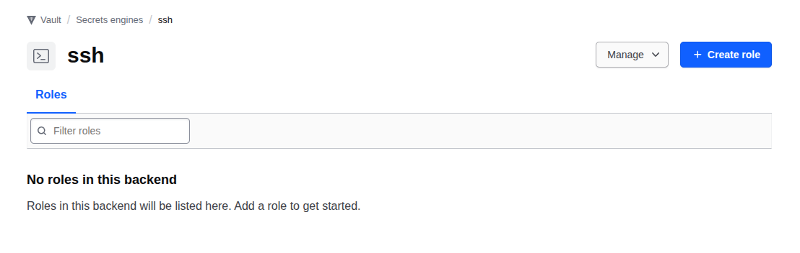

# Level 9 — SSH Secrets Engine (Certificate Authority)

### Requirements:
  - **Vault Service is Running** from level 0
  - **Vault Address:** `https://vault.lab.mecan.ir`
  - **Auth:** Root token `myroot` (dev mode only)
  - **Tools:** install `jq` command

---

## Overview

Vault can act as an SSH Certificate Authority. Instead of managing `authorized_keys` files across every server, servers trust Vault's CA public key. Users request a short-lived signed certificate from Vault and SSH with it. When it expires, they need a new one — no revocation lists needed.

```
Developer ─── public key ──> Vault SSH Engine ─── signed cert (TTL: 1h) ──> Developer
Developer ─── ssh -i key -i cert ─────────────────────────────────────────> SSH Server
SSH Server ── verify cert against Vault CA ───────────────────────────────> granted
[cert expires] ───────────────────────────────────────────────────────────> access revoked automatically
```

### Why this beats `authorized_keys`

| `authorized_keys`              | Vault SSH Certificates                    |
|--------------------------------|-------------------------------------------|
| Keys never expire              | Certs expire — short window if leaked     |
| Must update every server       | Servers only trust the CA (set once)      |
| No audit trail of usage        | Every signing request logged in Vault     |
| Rotation requires access to all servers | Just revoke Vault token             |
| Hard to grant temporary access | Issue a cert with exact TTL needed        |

---

## 9.1 Infrastructure: SSH Server Setup

Add an SSH server to `compose.yml`:

```yaml
ssh-server:
  build: ./ssh-server
  container_name: vault_ssh_server
  networks:
    - infra-network
  ports:
    - "2222:22"
  volumes:
    - ssh-ca-keys:/etc/ssh/ca
```

`level09-ssh-secrets-engine/Dockerfile`:

```dockerfile
FROM debian:bookworm-slim

RUN apt-get update && apt-get install -y --no-install-recommends openssh-server curl unzip sshpass && \
    rm -rf /var/lib/apt/lists/* && \
    mkdir -p /run/sshd /var/log && \
    useradd -m -s /bin/bash -p '*' developer && \
    useradd -m -s /bin/bash -p '*' admin && \
    useradd -m -s /bin/bash -p '*' ops

COPY vault-ssh-helper /usr/local/bin/vault-ssh-helper
RUN chmod +x /usr/local/bin/vault-ssh-helper

COPY sshd_config          /etc/ssh/sshd_config
COPY pam_sshd_otp         /etc/pam.d/sshd
COPY vault-ssh-helper.hcl /etc/vault-ssh-helper.d/config.hcl
COPY entrypoint.sh        /entrypoint.sh

RUN chmod +x /entrypoint.sh

EXPOSE 22 2223
CMD ["/entrypoint.sh"]
```

`-p '*'` sets the password field to `*` — account is unlocked but has no password.
This is required for SSH certificate auth to work even with `UsePAM no`.

`ssh-server/sshd_config`:

```
Port 22
Port 2223
PermitRootLogin no
UsePAM yes

# Default: cert auth only, no password
PasswordAuthentication no
PubkeyAuthentication yes
ChallengeResponseAuthentication no
KbdInteractiveAuthentication no

# Cert auth settings (port 22)
TrustedUserCAKeys /etc/ssh/trusted-user-ca-keys.pem
AuthorizedKeysFile /dev/null

# OTP auth on port 2223
Match LocalPort 2223
    PubkeyAuthentication no
    ChallengeResponseAuthentication yes
    KbdInteractiveAuthentication yes
    AuthenticationMethods keyboard-interactive
```

`AuthorizedKeysFile /dev/null` ensures that **only** Vault-signed certificates
can authenticate. Plain public keys, even correct ones, are rejected.

---

## 9.2 Enable SSH Secrets Engine

```bash
curl -X POST https://vault.lab.mecan.ir/v1/sys/mounts/ssh \
  -H "X-Vault-Token: myroot" \
  -H "Content-Type: application/json" \
  -d '{"type": "ssh"}'
```



---

## 9.3 Generate the CA Keypair

Vault generates an ED25519 keypair internally. The private key never leaves Vault.

```bash
curl -X POST https://vault.lab.mecan.ir/v1/ssh/config/ca \
  -H "X-Vault-Token: myroot" \
  -H "Content-Type: application/json" \
  -d '{"generate_signing_key": true, "key_type": "ed25519"}' | jq
```

Fetch the CA public key — this is what gets installed on every SSH server:

```bash
curl https://vault.lab.mecan.ir/v1/ssh/config/ca \
  -H "X-Vault-Token: myroot" | jq
```

Response:
```json
{
  "data": {
    "public_key": "ssh-ed25519 AAAAC3NzaC1lZDI1NTE5AAAAIPU/5BJNOVqPe12undLBTEHlVp..."
  }
}
```

Install the CA public key on every SSH server (done once per server):

```bash
CA_PUBKEY=$(curl -s https://vault.lab.mecan.ir/v1/ssh/config/ca \
  -H "X-Vault-Token: myroot" \
  | python3 -c "import sys,json; print(json.load(sys.stdin)['data']['public_key'])")

# For the Docker container:
echo "$CA_PUBKEY" | docker exec -i vault_ssh_server tee /etc/ssh/trusted-user-ca-keys.pem

# Reload sshd to pick up the new CA key
docker exec vault_ssh_server bash -c "kill -HUP \$(pgrep sshd)"
```

---

## 9.4 Create Roles

A **role** defines who can get what kind of certificate.

### Developer role — 1h TTL, limited extensions

```bash
curl -X POST https://vault.lab.mecan.ir/v1/ssh/roles/developer \
  -H "X-Vault-Token: myroot" \
  -H "Content-Type: application/json" \
  -d '{
    "key_type": "ca",
    "ttl": "1h",
    "max_ttl": "4h",
    "allowed_users": "developer",
    "allowed_extensions": "permit-pty",
    "default_extensions": {"permit-pty": ""},
    "allow_user_certificates": true
  }'
```

### Admin role — 30m TTL, agent forwarding allowed

```bash
curl -X POST https://vault.lab.mecan.ir/v1/ssh/roles/admin \
  -H "X-Vault-Token: myroot" \
  -H "Content-Type: application/json" \
  -d '{
    "key_type": "ca",
    "ttl": "30m",
    "max_ttl": "1h",
    "allowed_users": "admin",
    "allowed_extensions": "permit-pty,permit-agent-forwarding,permit-port-forwarding",
    "default_extensions": {"permit-pty": "", "permit-agent-forwarding": ""},
    "allow_user_certificates": true
  }'
```

Key role options:

| Option                | Effect                                                    |
|-----------------------|-----------------------------------------------------------|
| `ttl`                 | Default certificate lifetime                              |
| `max_ttl`             | Hard ceiling — user cannot request longer                 |
| `allowed_users`       | Which Unix usernames this cert can authenticate as        |
| `allowed_extensions`  | Which SSH extensions can be requested                     |
| `permit-pty`          | Required for interactive terminal sessions                |
| `permit-agent-forwarding` | Allows forwarding SSH agent to the remote host       |

---

## 9.5 Sign a Certificate (User Workflow)

The developer generates a keypair once (or uses an existing one) and requests
a certificate from Vault before each session.

```bash
# Generate keypair (one time)
ssh-keygen -t ed25519 -f ~/.ssh/id_vault -N ""

# Request a signed certificate from Vault
curl -X POST https://vault.lab.mecan.ir/v1/ssh/sign/developer \
  -H "X-Vault-Token: myroot" \
  -H "Content-Type: application/json" \
  --data-binary "{
    \"public_key\": \"$(cat ~/.ssh/id_vault.pub)\",
    \"valid_principals\": \"developer\",
    \"ttl\": \"1h\"
  }" \
  | python3 -c "
import sys, json
resp = json.load(sys.stdin)
if 'errors' in resp:
    print('ERROR:', resp['errors'])
    sys.exit(1)
cert = resp['data']['signed_key'].strip()
open('/tmp/id_vault-cert.pub', 'w').write(cert + '\n')
print('Certificate saved')
"

# Inspect the certificate
ssh-keygen -L -f /tmp/id_vault-cert.pub
```

Certificate inspection output:
```
/tmp/id_vault-cert.pub:
        Type: ssh-ed25519-cert-v01@openssh.com user certificate
        Signing CA: ED25519 SHA256:sMGcYpJ1UzM10L24xVawlCewOEomz1HDyPJjhFRBM3c
        Key ID: "vault-token-900b64e168e960e92268c2e55..."
        Serial: 2883039654739803732
        Valid: from 2026-05-31T18:27:03 to 2026-05-31T19:27:33
        Principals:
                developer
        Extensions:
                permit-pty
```

---

## 9.6 SSH with the Certificate

```bash
ssh -i ~/.ssh/id_vault \
    -o CertificateFile=/tmp/id_vault-cert.pub \
    developer@ssh-server
```

SSH automatically uses both files together:
- `id_vault` — proves you own the private key
- `id_vault-cert.pub` — proves Vault authorized you

---

## 9.7 Access Control Test Results

| Test                                         | Result  |
|----------------------------------------------|---------|
| Valid cert, correct principal → SSH works    | ✅      |
| Plain public key, no cert → denied           | ✅      |
| Admin cert trying to log in as developer     | ✅ denied |
| Admin cert logging in as admin               | ✅      |
| Cert with 1-minute TTL — works immediately   | ✅      |
| Same cert after expiry — denied              | ✅      |

---

## 9.8 Certificate Expiry

Certificates carry their expiry inside the signed data. The SSH server enforces
it without any call back to Vault. There is no revocation needed:

```
Valid: from 2026-05-31T18:32:48 to 2026-05-31T18:34:18  ← 1 minute TTL
```

After expiry:
```
developer@server: Permission denied (publickey)
```

To revoke access immediately (before TTL expires): revoke the Vault token that
was used to sign the certificate. Future signing requests fail.
Past certificates remain valid until their TTL — this is why short TTLs matter.

---

## 9.9 Vault Policy for Users

In production, developers get a Vault token scoped to sign only with their role:

```hcl
# policy: ssh-developer
path "ssh/sign/developer" {
  capabilities = ["create", "update"]
}
```

They cannot sign as `admin`. The separation is enforced by Vault policy,
not by the SSH server.

---

## API Reference

| Operation               | Method | Path                          |
|-------------------------|--------|-------------------------------|
| Enable SSH engine       | POST   | `/v1/sys/mounts/ssh`          |
| Generate CA keypair     | POST   | `/v1/ssh/config/ca`           |
| Read CA public key      | GET    | `/v1/ssh/config/ca`           |
| Create role             | POST   | `/v1/ssh/roles/<name>`        |
| Sign a public key       | POST   | `/v1/ssh/sign/<role>`         |
| List roles              | LIST   | `/v1/ssh/roles`               |
