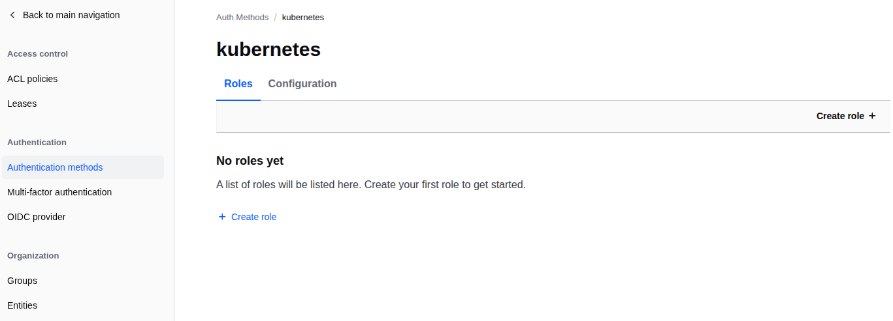
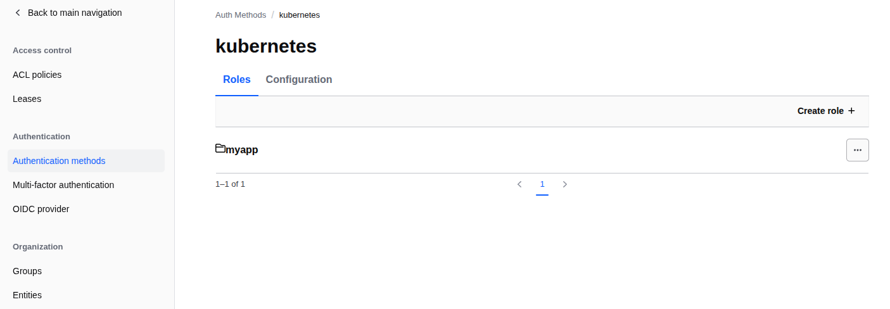

# Level 13 — Kubernetes Authentication

**Vault Address:** `https://vault.lab.mecan.ir`
**Auth:** Root token `myroot` (admin operations only)

---

## Overview

Kubernetes auth lets pods authenticate to Vault using their ServiceAccount JWT
token — no hardcoded credentials, no AppRole `secret_id` delivery problem.

```
Pod ──── SA JWT ──→ Vault ──── TokenReview ──→ k8s API Server
                      │            (is this token valid for this SA?)
                      ↓
                    policy-scoped Vault token ──→ Pod reads secrets
```

The pod's SA token is automatically mounted at
`/var/run/secrets/kubernetes.io/serviceaccount/token` — no configuration
needed on the pod side.

---

## 13.1 Infrastructure

### kind cluster

```bash
cat <<'EOF' > kind-vault-lab.yaml
kind: Cluster
apiVersion: kind.x-k8s.io/v1alpha4
name: vault-lab
nodes:
  - role: control-plane
  - role: worker
EOF

kind create cluster --config kind-vault-lab.yaml --image kindest/node:v1.29.2
```

### Network connectivity

Vault runs in Docker. The kind cluster also runs in Docker but on a separate
network. Two connections are needed:

```bash
# kind nodes must reach Vault
docker network connect app_net vault-lab-control-plane
docker network connect app_net vault-lab-worker

# Vault must reach the k8s API server at its kind-network IP
# (the TLS cert is issued for the kind network IP, not the vault network IP)
docker network connect kind hashicorp_vault
```

Find the k8s API IP that matches the TLS cert SAN:

```bash
# Check SANs on the k8s API cert
echo | openssl s_client -connect <control-plane-ip>:6443 2>/dev/null \
  | openssl x509 -noout -ext subjectAltName
# → IP Address:172.20.0.3  ← use this IP for kubernetes_host
```

---

## 13.2 Enable Kubernetes Auth

```bash
curl -X POST https://vault.lab.mecan.ir/v1/sys/auth/kubernetes \
  -H "X-Vault-Token: myroot" \
  -H "Content-Type: application/json" \
  -d '{"type": "kubernetes"}'
```


---

## 13.3 Create a Token Reviewer ServiceAccount

Vault needs a k8s ServiceAccount with permission to call `TokenReview` —
this is how it validates pod tokens.

```bash
kubectl create serviceaccount vault-auth -n default

kubectl create clusterrolebinding vault-auth-binding \
  --clusterrole=system:auth-delegator \
  --serviceaccount=default:vault-auth

# Create a long-lived token (k8s 1.24+)
kubectl apply -f - <<'EOF'
apiVersion: v1
kind: Secret
metadata:
  name: vault-auth-token
  namespace: default
  annotations:
    kubernetes.io/service-account.name: vault-auth
type: kubernetes.io/service-account-token
EOF

# create vault-auth-token
VAULT_SA_TOKEN=$(kubectl get secret vault-auth-token \
  -o jsonpath='{.data.token}' | base64 -d)

echo $VAULT_SA_TOKEN
```

---

## 13.4 Configure Vault Kubernetes Auth

```bash
K8S_CA_CERT=$(kubectl config view --raw \
  -o jsonpath='{.clusters[?(@.name=="kind-vault-lab")].cluster.certificate-authority-data}' \
  | base64 -d)

echo $K8S_CA_CERT

curl -X POST https://vault.lab.mecan.ir/v1/auth/kubernetes/config \
  -H "X-Vault-Token: myroot" \
  -H "Content-Type: application/json" \
  -d "$(jq -n \
    --arg host "https://172.20.0.2:6443" \
    --arg ca "$K8S_CA_CERT" \
    --arg token "$VAULT_SA_TOKEN" \
    '{kubernetes_host: $host, kubernetes_ca_cert: $ca, token_reviewer_jwt: $token}')"
```

**`kubernetes_host`** must use the IP address covered by the API server's TLS
certificate SAN — not a docker bridge IP added later.

---

## 13.5 Create Policy and Write Secrets

```bash
# Policy
curl -X PUT https://vault.lab.mecan.ir/v1/sys/policies/acl/pod-reader \
  -H "X-Vault-Token: myroot" \
  -H "Content-Type: application/json" \
  -d '{
    "policy": "path \"secret/data/myapp/*\" { capabilities = [\"read\",\"list\"] }\npath \"secret/data/k8s/*\" { capabilities = [\"read\",\"list\"] }"
  }'

# Secret for k8s workloads
curl -X POST https://vault.lab.mecan.ir/v1/secret/data/k8s/myapp \
  -H "X-Vault-Token: myroot" \
  -H "Content-Type: application/json" \
  -d '{"data": {"db_host": "postgres.svc.cluster.local", "db_pass": "k8s-secret-pass", "env": "production"}}' | jq
```

---

## 13.6 Create Vault Role

Maps a Kubernetes ServiceAccount to a Vault policy:

```bash
curl -X POST https://vault.lab.mecan.ir/v1/auth/kubernetes/role/myapp \
  -H "X-Vault-Token: myroot" \
  -H "Content-Type: application/json" \
  -d '{
    "bound_service_account_names": ["myapp-sa"],
    "bound_service_account_namespaces": ["default"],
    "policies": ["pod-reader"],
    "ttl": "1h",
    "audience": "https://kubernetes.default.svc.cluster.local"
  }'
```


`audience` must match the `aud` claim in the pod's projected SA token.
Check it with:

```bash
kubectl exec <pod> -- cat /var/run/secrets/kubernetes.io/serviceaccount/token \
  | python3 -c "
import sys, base64, json
t = sys.stdin.read().strip()
p = t.split('.')[1]; p += '=' * (4 - len(p) % 4)
print('aud:', json.loads(base64.b64decode(p))['aud'])
"
```

---

## 13.7 Deploy a Pod and Authenticate

```yaml
apiVersion: v1
kind: ServiceAccount
metadata:
  name: myapp-sa
---
apiVersion: v1
kind: Pod
metadata:
  name: vault-test
spec:
  serviceAccountName: myapp-sa
  containers:
  - name: app
    image: alpine:3.19
    command: ["sh", "-c", "sleep 3600"]
    env:
    - name: VAULT_ADDR
      value: "http://172.17.0.2:8200"   # Vault IP reachable from pod
```

Inside the pod, authenticate to Vault:

```bash
# Get a shell inside the pod first
kubectl exec -it vault-test -- sh
```

Then inside the pod shell:

```bash
export SA_JWT=$(kubectl exec -it vault-test -- cat /var/run/secrets/kubernetes.io/serviceaccount/token)

echo $SA_JWT

curl -X POST https://vault.lab.mecan.ir/v1/auth/kubernetes/login \
  -H "Content-Type: application/json" \
  -d "{\"role\": \"myapp\", \"jwt\": \"$SA_JWT\"}" | jq
```

Response:
```json
{
  "auth": {
    "client_token": "hvs.XXXX",
    "policies": ["default", "pod-reader"],
    "lease_duration": 3600
  }
}
```

---

## 13.8 Test Results

| Test | Result |
|------|--------|
| Pod authenticates with SA JWT | ✅ |
| Vault validates token via k8s TokenReview API | ✅ |
| Pod reads `secret/data/k8s/myapp` | ✅ |
| Pod reads `secret/data/myapp/database` | ✅ |
| Pod write attempt → permission denied | ✅ |

---

## How Vault Validates the Pod's Token

```
Pod sends JWT ──→ Vault kubernetes auth
                      │
                      └──→ POST /apis/authentication.k8s.io/v1/tokenreviews
                                (using vault-auth SA token as reviewer)
                                      │
                               k8s API responds:
                               authenticated: true
                               user: system:serviceaccount:default:myapp-sa
                                      │
                      Vault checks: does "myapp-sa" in "default"
                                    match role "myapp"?  YES
                                      │
                      Issues policy-scoped token with TTL=1h
```

---

## API Reference

| Operation                    | Method | Path                                       |
|------------------------------|--------|--------------------------------------------|
| Enable k8s auth              | POST   | `/v1/sys/auth/kubernetes`                  |
| Configure k8s auth           | POST   | `/v1/auth/kubernetes/config`               |
| Create role                  | POST   | `/v1/auth/kubernetes/role/<name>`          |
| Pod login                    | POST   | `/v1/auth/kubernetes/login`                |
