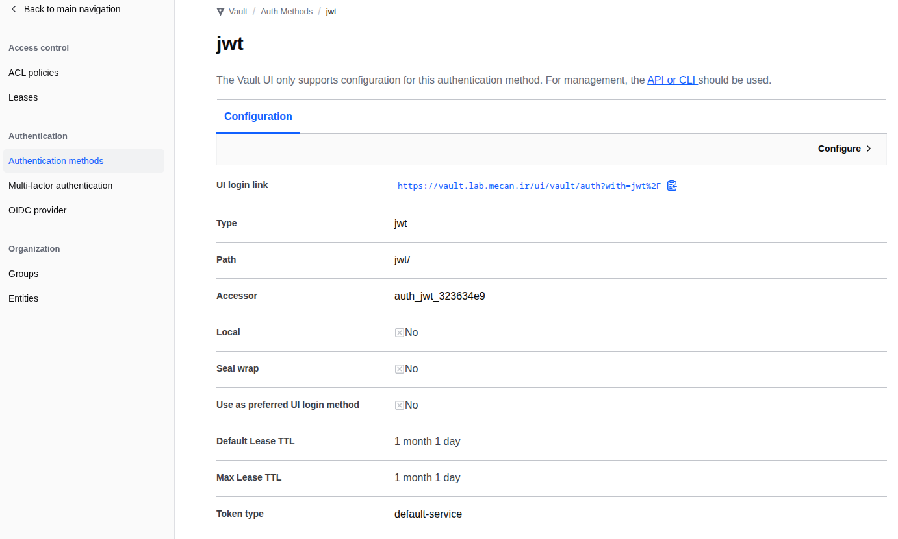

# Level 14 — Keycloak OIDC / JWT Authentication

### Requirements:
  - **Vault Service is Running** from level 0
  - **Vault Address:** `https://vault.lab.mecan.ir`
  - **Auth:** Root token `myroot` (dev mode only)
  - **Tools:** install `jq` command

---

## Overview

OIDC/JWT auth lets users authenticate to Vault using their existing identity
from an Identity Provider (Keycloak). No separate Vault credentials needed —
the user logs in with Keycloak and gets a Vault token scoped to their group.

```
User ──── username/password ──> Keycloak ──── JWT (with groups claim) ──> User
User ──── JWT ──────────────> Vault JWT auth ──── verify signature via JWKS ──>
                                               check groups claim ──> token + policy
```

Two auth methods are used together:
- **OIDC** — browser-based SSO flow (redirect to Keycloak login page)
- **JWT** — programmatic/API flow (exchange Keycloak token for Vault token)

---

## 14.1 Keycloak Setup

Add Keycloak to `compose.yml`:

```yaml
name: keycloak-oidc

networks:
  app_net:
    name: app_net
    external: true
  web_net:
    name: web_net
    external: true

volumes:
  keycloak_data:
    name: keycloak_data

services:
  keycloak:
    image: keycloak/keycloak:24.0
    container_name: vault_keycloak
    networks:
      - app_net
      - web_net
    ports:
      - "8080:8080"
    environment:
      KEYCLOAK_ADMIN: admin
      KEYCLOAK_ADMIN_PASSWORD: admin
      KC_HTTP_ENABLED: "true"
      KC_HOSTNAME_STRICT: "false"
    volumes:
      - keycloak_data:/opt/keycloak/data
    command: start-dev
```

```bash
cd level14-keycloak-oidc
docker compose up -d 
docker compose ps
```

### Get admin token

```bash
ADMIN_TOKEN=$(curl -s -X POST \
  "http://localhost:8080/realms/master/protocol/openid-connect/token" \
  -d "client_id=admin-cli&username=admin&password=admin&grant_type=password" \
  | python3 -c "import sys,json; print(json.load(sys.stdin)['access_token'])")
```

---

## 14.2 Create Realm and OIDC Client

### Create realm

```bash
curl -X POST http://localhost:8080/admin/realms \
  -H "Authorization: Bearer $ADMIN_TOKEN" \
  -H "Content-Type: application/json" \
  -d '{"realm": "vault-lab", "enabled": true, "sslRequired": "none"}'
```

### Create OIDC client for Vault

```bash
curl -X POST http://localhost:8080/admin/realms/vault-lab/clients \
  -H "Authorization: Bearer $ADMIN_TOKEN" \
  -H "Content-Type: application/json" \
  -d '{
    "clientId": "vault",
    "enabled": true,
    "protocol": "openid-connect",
    "publicClient": false,
    "standardFlowEnabled": true,
    "directAccessGrantsEnabled": true,
    "redirectUris": [
      "https://vault.lab.mecan.ir/ui/vault/auth/oidc/oidc/callback",
      "http://localhost:8250/oidc/callback"
    ],
    "secret": "vault-client-secret"
  }'
```

### Get client UUID

```bash
# Refresh token first — admin tokens expire after ~60s
ADMIN_TOKEN=$(curl -s -X POST \
  "http://localhost:8080/realms/master/protocol/openid-connect/token" \
  -d "client_id=admin-cli&username=admin&password=admin&grant_type=password" \
  | jq -r '.access_token')

echo $ADMIN_TOKEN

CLIENT_UUID=$(curl -s "http://localhost:8080/admin/realms/vault-lab/clients?clientId=vault" \
  -H "Authorization: Bearer $ADMIN_TOKEN" \
  | jq -r '.[0].id')

echo $CLIENT_UUID
```

### Add protocol mappers to the client

**Groups mapper** — adds `groups` claim to JWT:
```bash
curl -X POST "http://localhost:8080/admin/realms/vault-lab/clients/$CLIENT_UUID/protocol-mappers/models" \
  -H "Authorization: Bearer $ADMIN_TOKEN" \
  -H "Content-Type: application/json" \
  -d '{
    "name": "groups",
    "protocol": "openid-connect",
    "protocolMapper": "oidc-group-membership-mapper",
    "consentRequired": false,
    "config": {
      "claim.name": "groups",
      "full.path": "false",
      "id.token.claim": "true",
      "access.token.claim": "true",
      "userinfo.token.claim": "true"
    }
  }'
```

**Audience mapper** — adds `vault` to `aud` claim (required for Vault validation):
```bash
curl -X POST "http://localhost:8080/admin/realms/vault-lab/clients/$CLIENT_UUID/protocol-mappers/models" \
  -H "Authorization: Bearer $ADMIN_TOKEN" \
  -H "Content-Type: application/json" \
  -d '{
    "name": "vault-audience",
    "protocol": "openid-connect",
    "protocolMapper": "oidc-audience-mapper",
    "consentRequired": false,
    "config": {
      "included.client.audience": "vault",
      "id.token.claim": "false",
      "access.token.claim": "true"
    }
  }'
```

---

## 14.3 Create Groups and Users

```bash
ADMIN_TOKEN=$(curl -s -X POST \
  "http://localhost:8080/realms/master/protocol/openid-connect/token" \
  -d "client_id=admin-cli&username=admin&password=admin&grant_type=password" \
  | jq -r '.access_token')

# Create groups
curl -X POST http://localhost:8080/admin/realms/vault-lab/groups \
  -H "Authorization: Bearer $ADMIN_TOKEN" \
  -H "Content-Type: application/json" \
  -d '{"name":"developers"}'

curl -X POST http://localhost:8080/admin/realms/vault-lab/groups \
  -H "Authorization: Bearer $ADMIN_TOKEN" \
  -H "Content-Type: application/json" \
  -d '{"name":"ops"}'

# Create users
curl -X POST http://localhost:8080/admin/realms/vault-lab/users \
  -H "Authorization: Bearer $ADMIN_TOKEN" \
  -H "Content-Type: application/json" \
  -d '{
    "username": "alice",
    "firstName": "Alice",
    "lastName": "Lab",
    "email": "alice@lab.mecan.ir",
    "enabled": true,
    "requiredActions": []
  }'
```

Get IDs, set password, and assign users to groups:
```bash
ALICE_ID=$(curl -s "http://localhost:8080/admin/realms/vault-lab/users?username=alice" \
  -H "Authorization: Bearer $ADMIN_TOKEN" \
  | jq -r '.[0].id')

DEV_GID=$(curl -s "http://localhost:8080/admin/realms/vault-lab/groups?search=developers" \
  -H "Authorization: Bearer $ADMIN_TOKEN" \
  | jq -r '.[0].id')

echo "ALICE_ID: $ALICE_ID"
echo "DEV_GID:  $DEV_GID"

# Set password separately — credentials in user creation are ignored by Keycloak
curl -X PUT "http://localhost:8080/admin/realms/vault-lab/users/$ALICE_ID/reset-password" \
  -H "Authorization: Bearer $ADMIN_TOKEN" \
  -H "Content-Type: application/json" \
  -d '{"type":"password","value":"alice123","temporary":false}'

curl -X PUT "http://localhost:8080/admin/realms/vault-lab/users/$ALICE_ID/groups/$DEV_GID" \
  -H "Authorization: Bearer $ADMIN_TOKEN"
```

---

## 14.4 Configure Vault JWT Auth

```bash
# Enable JWT auth
curl -X POST https://vault.lab.mecan.ir/v1/sys/auth/jwt \
  -H "X-Vault-Token: myroot" \
  -d '{"type": "jwt"}'



# Configure — point to Keycloak JWKS for token signature verification
# KC_IP = Keycloak IP on app_net (shared with Vault). Find with:
# docker inspect vault_keycloak --format '{{(index .NetworkSettings.Networks "app_net").IPAddress}}'
KC_IP="172.18.0.3"
curl -X POST https://vault.lab.mecan.ir/v1/auth/jwt/config \
  -H "X-Vault-Token: myroot" \
  -H "Content-Type: application/json" \
  -d "{
    \"oidc_discovery_url\": \"http://$KC_IP:8080/realms/vault-lab\",
    \"bound_issuer\": \"http://localhost:8080/realms/vault-lab\",
    \"default_role\": \"developer\"
  }"
```

**`bound_issuer`** must match the `iss` claim in the token.
**`oidc_discovery_url`** uses the internal IP so Vault can reach Keycloak's JWKS endpoint.

---

## 14.5 Create Vault JWT Roles

Each role maps a Keycloak group to a Vault policy:

```bash
# developers group → pod-reader policy
curl -X POST https://vault.lab.mecan.ir/v1/auth/jwt/role/developer \
  -H "X-Vault-Token: myroot" \
  -d '{
    "role_type": "jwt",
    "bound_audiences": ["vault"],
    "user_claim": "sub",
    "groups_claim": "groups",
    "bound_claims": {"groups": ["developers"]},
    "token_policies": ["pod-reader"],
    "token_ttl": "1h"
  }'

# ops group → myapp-readonly policy
curl -X POST https://vault.lab.mecan.ir/v1/auth/jwt/role/ops \
  -H "X-Vault-Token: myroot" \
  -d '{
    "role_type": "jwt",
    "bound_audiences": ["vault"],
    "user_claim": "sub",
    "groups_claim": "groups",
    "bound_claims": {"groups": ["ops"]},
    "token_policies": ["myapp-readonly"],
    "token_ttl": "30m"
  }'
```

---

## 14.6 Login Flow (Programmatic / API)

```bash
# Step 1: Get JWT from Keycloak (user authenticates to Keycloak)
ADMIN_TOKEN=$(curl -s -X POST \
  "http://localhost:8080/realms/master/protocol/openid-connect/token" \
  -d "client_id=admin-cli&username=admin&password=admin&grant_type=password" \
  | jq -r '.access_token')

ALICE_JWT=$(curl -s -X POST \
  "http://localhost:8080/realms/vault-lab/protocol/openid-connect/token" \
  -d "client_id=vault&client_secret=vault-client-secret&username=alice&password=alice123&grant_type=password&scope=openid" \
  | jq -r '.access_token')

echo $ALICE_JWT

# Step 2: Exchange Keycloak JWT for Vault token
curl -X POST https://vault.lab.mecan.ir/v1/auth/jwt/login \
  -d "{\"role\": \"developer\", \"jwt\": \"$ALICE_JWT\"}" | jq
```

Response:
```json
{
  "auth": {
    "client_token": "hvs.XXXX",
    "policies": ["default", "pod-reader"],
    "lease_duration": 3600
  }
}
```

---

## 14.7 Test Results

| Test | Result |
|------|--------|
| Alice (developers) logs in with developer role | ✅ — policies: pod-reader |
| Bob (ops) tries developer role → denied (wrong group) | ✅ |
| Bob (ops) logs in with ops role | ✅ — policies: myapp-readonly |
| Alice reads secret with Vault token | ✅ |
| `aud` claim must include `vault` (fixed with audience mapper) | ✅ |
| Groups claim flows from Keycloak group membership | ✅ |

---

## 14.8 JWT Claims in the Token

A Keycloak token after proper mapper setup:

```json
{
  "iss": "http://localhost:8080/realms/vault-lab",
  "aud": ["vault", "account"],
  "sub": "2581a37a-c175-47ec-859e-75c70c...",
  "email": "alice@lab.mecan.ir",
  "groups": ["developers"]
}
```

Vault validates:
1. **Signature** — verified against Keycloak's JWKS endpoint
2. **`iss`** — matches `bound_issuer` in config
3. **`aud`** — contains `vault` (matches `bound_audiences` in role)
4. **`groups`** — contains `developers` (matches `bound_claims` in role)

---

## API Reference

| Operation               | Method | Path                           |
|-------------------------|--------|--------------------------------|
| Enable JWT auth         | POST   | `/v1/sys/auth/jwt`             |
| Configure JWT           | POST   | `/v1/auth/jwt/config`          |
| Create JWT role         | POST   | `/v1/auth/jwt/role/<name>`     |
| Login with JWT          | POST   | `/v1/auth/jwt/login`           |
| Enable OIDC auth        | POST   | `/v1/sys/auth/oidc`            |
| Configure OIDC          | POST   | `/v1/auth/oidc/config`         |
| Create OIDC role        | POST   | `/v1/auth/oidc/role/<name>`    |
| Get OIDC auth URL       | POST   | `/v1/auth/oidc/auth_url`       |
