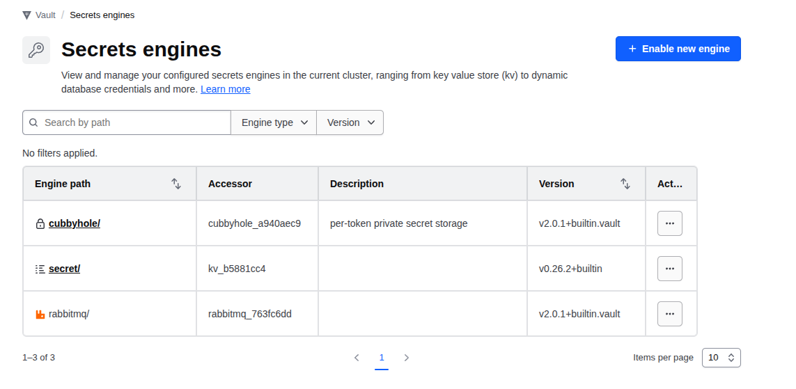

# Level 16 — Dynamic Secrets: RabbitMQ & Redis

### Requirements:
  - **Vault Service is Running** from level 15
  - **Vault Address:** `https://vault.lab.mecan.ir`
  - **Auth:** Root token `your-root-token-here` (dev mode only)
  - **Tools:** install `jq` command

---

## Overview

Like PostgreSQL (Level 7), Vault can generate short-lived credentials for
message brokers and caches. Services never hold long-lived passwords — each
instance gets a unique credential that expires automatically.

---

## Part A — RabbitMQ

### Scenario

A publisher service and a consumer service need to connect to RabbitMQ.
Instead of sharing one static password, each service gets its own credential
scoped to what it actually needs: publisher gets write access, consumer gets
read-only on the same vhost.

---

## A.1 Infrastructure

Add to `compose.yml`:

```yaml
rabbitmq:
  image: rabbitmq:3.13-management
  container_name: vault_rabbitmq
  networks:
    - infra-network
  ports:
    - "5672:5672"
    - "15672:15672"
  environment:
    RABBITMQ_DEFAULT_USER: vaultadmin
    RABBITMQ_DEFAULT_PASS: vaultadmin-pass
  volumes:
    - rabbitmq-data:/var/lib/rabbitmq
  healthcheck:
    test: ["CMD", "rabbitmq-diagnostics", "ping"]
    interval: 10s
    timeout: 5s
    retries: 15
```

```bash
cd docs/level16-rabbitmq-redis-dynamic-secrets
docker compose up -d 
docker compose ps 
```

---

## A.2 Enable and Configure

```bash
RABBITMQ_IP="172.18.0.6"

# Enable the RabbitMQ secrets engine
curl -X POST https://vault.lab.mecan.ir/v1/sys/mounts/rabbitmq \
  -H "X-Vault-Token: your-root-token-here" \
  -d '{"type": "rabbitmq"}'



# Connect Vault to RabbitMQ management API using admin credentials
curl -X POST https://vault.lab.mecan.ir/v1/rabbitmq/config/connection \
  -H "X-Vault-Token: your-root-token-here" \
  -d "{
    \"connection_uri\": \"http://$RABBITMQ_IP:15672\",
    \"username\": \"vaultadmin\",
    \"password\": \"vaultadmin-pass\"
  }"

# Set default lease TTL
curl -X POST https://vault.lab.mecan.ir/v1/rabbitmq/config/lease \
  -H "X-Vault-Token: your-root-token-here" \
  -d '{"ttl": "1h", "max_ttl": "4h"}'
```

---

## A.3 Create a vhost in RabbitMQ

```bash
curl -su vaultadmin:vaultadmin-pass \
  -X PUT http://localhost:15672/api/vhosts/myapp-vhost
```

---

## A.4 Create Roles

A **role** defines which vhosts and permissions the generated user will have.
Permissions follow RabbitMQ's `configure/write/read` model using regex patterns.

### Consumer role — read-only

```bash
curl -X POST https://vault.lab.mecan.ir/v1/rabbitmq/roles/consumer \
  -H "X-Vault-Token: your-root-token-here" \
  -d '{
    "vhosts": "{\"myapp-vhost\": {\"configure\": \"\", \"write\": \"\", \"read\": \".*\"}}",
    "tags": "monitoring"
  }'
```

### Publisher role — full access

```bash
curl -X POST https://vault.lab.mecan.ir/v1/rabbitmq/roles/publisher \
  -H "X-Vault-Token: your-root-token-here" \
  -d '{
    "vhosts": "{\"myapp-vhost\": {\"configure\": \".*\", \"write\": \".*\", \"read\": \".*\"}}",
    "tags": ""
  }'
```

---

## A.5 Generate Credentials

```bash
curl https://vault.lab.mecan.ir/v1/rabbitmq/creds/consumer \
  -H "X-Vault-Token: your-root-token-here" | jq
```

Response:
```json
{
  "lease_id": "rabbitmq/creds/consumer/EBKBgcFuQVU0Nr5...",
  "lease_duration": 3600,
  "data": {
    "username": "token-7b2dc98e-b515-846f-69f7-73d96035c8cb",
    "password": "7Gx9vvgIP4V60H7YXhOi..."
  }
}
```

Vault creates this user directly in RabbitMQ via the management API.
Tags and vhost permissions are applied immediately.

---

## A.6 Test Results

| Test | Result |
|------|--------|
| Consumer user created in RabbitMQ with `monitoring` tag | ✅ |
| Publisher user created with full vhost access | ✅ |
| Consumer authenticates to management API | ✅ |
| Revoke lease → user deleted from RabbitMQ | ✅ |
| Revoked user auth returns `401 Unauthorized` | ✅ |

---

---

## Part B — Redis

### Scenario

A caching layer uses Redis. The application needs read/write access, but a
reporting service should only be able to read keys — never write. Vault issues
short-lived credentials using Redis ACL rules.

---

## B.1 Infrastructure

```yaml
redis:
  image: redis:7.2
  container_name: vault_redis
  networks:
    - infra-network
  ports:
    - "6379:6379"
  command: redis-server --requirepass vaultadmin-pass --loglevel warning
  volumes:
    - redis-data:/data
```

---

## B.2 Enable Database Secrets Engine

If the database engine is not already mounted (e.g. from Part A or Level 7), enable it first:

```bash
curl -X POST https://vault.lab.mecan.ir/v1/sys/mounts/database \
  -H "X-Vault-Token: your-root-token-here" \
  -d '{"type": "database"}'
```

To verify existing mounts:

```bash
curl https://vault.lab.mecan.ir/v1/sys/mounts \
  -H "X-Vault-Token: your-root-token-here" | jq 'keys'
```

---

## B.3 Configure Redis Connection

Redis uses the same database secrets engine as PostgreSQL (Level 7).

```bash
REDIS_IP="172.18.0.5"

curl -X POST https://vault.lab.mecan.ir/v1/database/config/redis \
  -H "X-Vault-Token: your-root-token-here" \
  -d "{
    \"plugin_name\": \"redis-database-plugin\",
    \"host\": \"$REDIS_IP\",
    \"port\": 6379,
    \"username\": \"default\",
    \"password\": \"vaultadmin-pass\",
    \"tls\": false,
    \"allowed_roles\": [\"redis-app\", \"redis-readonly\"]
  }"
```

---

## B.4 Create Roles

`creation_statements` defines Redis ACL rules for the generated user.
Format: `["key-pattern", "channel-pattern", "+@category -@category"]`

### Full access role

```bash
curl -X POST https://vault.lab.mecan.ir/v1/database/roles/redis-app \
  -H "X-Vault-Token: your-root-token-here" \
  -d '{
    "db_name": "redis",
    "creation_statements": "[\"~*\", \"&*\", \"+@all\"]",
    "default_ttl": "1h",
    "max_ttl": "4h"
  }'
```

### Read-only role

```bash
curl -X POST https://vault.lab.mecan.ir/v1/database/roles/redis-readonly \
  -H "X-Vault-Token: your-root-token-here" \
  -d '{
    "db_name": "redis",
    "creation_statements": "[\"~*\", \"&*\", \"+@read\"]",
    "default_ttl": "30m",
    "max_ttl": "1h"
  }'
```

Redis ACL permission sets:

| Statement    | Meaning                             |
|--------------|-------------------------------------|
| `~*`         | Access all keys                     |
| `&*`         | Access all pub/sub channels         |
| `+@all`      | All commands allowed                |
| `+@read`     | Only read commands (GET, MGET, etc) |
| `-@write`    | Block write commands                |

---

## B.5 Generate Credentials

```bash
curl https://vault.lab.mecan.ir/v1/database/creds/redis-app \
  -H "X-Vault-Token: your-root-token-here" | jq
```

Response:
```json
{
  "lease_id": "database/creds/redis-app/wwmnE4vZa1i6Ze8H59xRn6Gk",
  "lease_duration": 3600,
  "data": {
    "username": "V_TOKEN_REDIS-APP_BF7YQ48GSMDIN0SZUSU5_1780247908",
    "password": "w1AfOQeLQRLASuxUW-wt"
  }
}
```

Verify in Redis:
```bash
docker exec -it vault_redis redis-cli -a vaultadmin-pass ACL LIST
# → user V_TOKEN_REDIS-APP_... on ~* &* +@all
# → user V_TOKEN_REDIS-READONLY_... on ~* &* +@read
```

---

## B.6 Test Results

| Test | Result |
|------|--------|
| App user created in Redis with `+@all` ACL | ✅ |
| Readonly user created with `+@read` ACL | ✅ |
| App user: `SET` succeeds | ✅ |
| App user: `GET` succeeds | ✅ |
| Readonly user: `GET` succeeds | ✅ |
| Readonly user: `SET` → `NOPERM` error | ✅ |
| Revoke lease → user deleted from Redis | ✅ |
| Revoked user auth → `WRONGPASS` | ✅ |

---

## Comparison: RabbitMQ vs Redis vs PostgreSQL Dynamic Secrets

| Property         | PostgreSQL          | RabbitMQ               | Redis                  |
|------------------|---------------------|------------------------|------------------------|
| Engine           | `database`          | `rabbitmq`             | `database`             |
| Credential type  | DB role + password  | User + vhost perms     | User + ACL rules       |
| Revocation       | DROP ROLE           | DELETE /api/users/:name| ACL DELUSER            |
| Permissions      | SQL GRANT           | vhost configure/write/read | ACL categories     |
| TTL enforcement  | `VALID UNTIL` on role | Vault lease + delete | Vault lease + ACL delete |

---

## API Reference — RabbitMQ

| Operation             | Method | Path                                     |
|-----------------------|--------|------------------------------------------|
| Enable engine         | POST   | `/v1/sys/mounts/rabbitmq`                |
| Configure connection  | POST   | `/v1/rabbitmq/config/connection`         |
| Set lease TTL         | POST   | `/v1/rabbitmq/config/lease`              |
| Create role           | POST   | `/v1/rabbitmq/roles/<name>`              |
| Generate credentials  | GET    | `/v1/rabbitmq/creds/<role>`              |

## API Reference — Redis

| Operation             | Method | Path                                     |
|-----------------------|--------|------------------------------------------|
| Enable engine         | POST   | `/v1/sys/mounts/database`                |
| Configure Redis       | POST   | `/v1/database/config/redis`              |
| Create role           | POST   | `/v1/database/roles/<name>`              |
| Generate credentials  | GET    | `/v1/database/creds/<role>`              |
| Revoke lease          | PUT    | `/v1/sys/leases/revoke`                  |
